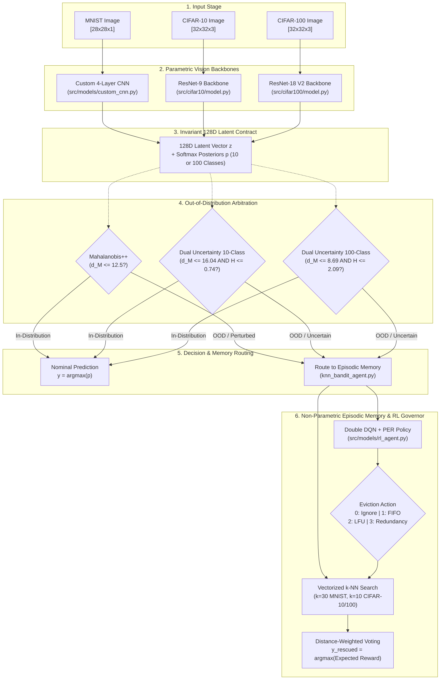

# Active Episodic Memory Management via Reinforcement Learning for Robust CNN Inference on Out-of-Distribution Data

**Robust Out-of-Distribution Routing for Resource-Constrained Semiparametric Vision Systems**


> Part of the [Active Episodic Memory Management via Reinforcement Learning for Robust CNN Inference on Out-of-Distribution Data](file:///c:/Users/sanfr/Desktop/projetos-gecad/projeto-cnn/README.md) documentation.

---

## Abstract

This repository implements a semiparametric vision architecture combining deep Convolutional Neural Networks (CNNs) with a capacity-bounded $k$-Nearest Neighbors ($k$-NN) episodic memory, actively curated by a Reinforcement Learning (RL) agent under non-stationary Edge AI conditions. The system is empirically validated across three distinct complexity regimes:
1. **Low-Dimensional Stylized Regime (MNIST):** 28x28x1 grayscale handwritten digits, using a custom from-scratch CNN ([`RawModel`](file:///c:/Users/sanfr/Desktop/projetos-gecad/projeto-cnn/src/models/custom_cnn.py)) with 225,034 parameters and Mahalanobis++ unit hypersphere covariance estimation.
2. **High-Dimensional Natural Regime (CIFAR-10):** 32x32x3 natural RGB images, using an upgraded ResNet-9 backbone ([`RawModelCIFAR10`](file:///c:/Users/sanfr/Desktop/projetos-gecad/projeto-cnn/src/cifar10/model.py)) with residual connections and Batch Normalization (6.57M parameters), coupled with a Dual Uncertainty Arbiter ([`DualUncertaintyArbiter`](file:///c:/Users/sanfr/Desktop/projetos-gecad/projeto-cnn/src/cifar10/ood_arbiter.py)) fusing unnormalized Mahalanobis distance with predictive Shannon entropy.
3. **High-Entropy Fine-Grained Natural Regime (CIFAR-100):** 32x32x3 fine-grained natural RGB images across 100 classes, using the promoted ResNet-18 V2 backbone ([`RawModelCIFAR100V2`](file:///c:/Users/sanfr/Desktop/projetos-gecad/projeto-cnn/src/cifar100/model.py)) with 8 residual blocks across 4 stages, learned strided downsampling, Global Average Pooling to 512D, and dedicated BatchNorm 128D latent bottleneck (11,250,532 parameters, 74.27% Top-1 accuracy), calibrated with a 100-class Dual Uncertainty Arbiter ($\tau_M = 8.69, \tau_H = 2.09\text{ nats}$).

Crucially, all three vision backbones preserve an **invariant 128-dimensional latent bottleneck** ($z \in \mathbb{R}^{128}$), allowing the downstream episodic memory buffer ([`KNNBanditAgent128D`](file:///c:/Users/sanfr/Desktop/projetos-gecad/projeto-cnn/src/models/knn_bandit_agent.py)), Double DQN policy agent ([`RLAgent`](file:///c:/Users/sanfr/Desktop/projetos-gecad/projeto-cnn/src/models/rl_agent.py)), and Curriculum Learning reward manager ([`RewardManager`](file:///c:/Users/sanfr/Desktop/projetos-gecad/projeto-cnn/src/models/reward_manager.py)) to operate over an identical architectural contract. Under a prequential (test-then-train) streaming evaluation protocol under severe Gaussian noise injection ($\sigma \in \{0.0, 0.2, 0.4, 0.6, 0.8\}$), the RL-governed memory system (**B4**) systematically prevents cache pollution via Action 0 (Ignore/Filter) and eliminates class starvation via Action 3 (Redundancy pruning), operating within strictly bounded $O(1)$ memory constraints (< 10 MB RAM) and real-time inference latency (< 11 ms).

---

## Dataset Support Matrix

| Characteristic | MNIST Benchmark | CIFAR-10 Benchmark | CIFAR-100 Benchmark |
|:---|:---:|:---:|:---:|
| **Input Dimensions** | $28 \times 28 \times 1$ | $32 \times 32 \times 3$ | $32 \times 32 \times 3$ |
| **Color Space** | Grayscale (1 channel) | RGB (3 channels) | RGB (3 channels) |
| **Classes** | 10 (Digits 0-9) | 10 (Natural Object Categories) | 100 (Fine-grained Object Categories) |
| **Data Loader** | [`src/data/loader.py`](file:///c:/Users/sanfr/Desktop/projetos-gecad/projeto-cnn/src/data/loader.py) (Raw binary ubyte) | [`scripts/cifar10/train_cnn.py`](file:///c:/Users/sanfr/Desktop/projetos-gecad/projeto-cnn/scripts/cifar10/train_cnn.py) (`tf.keras.datasets.cifar10`) | [`src/data/cifar100_loader.py`](file:///c:/Users/sanfr/Desktop/projetos-gecad/projeto-cnn/src/data/cifar100_loader.py) (`load_cifar100_dataset`) |
| **Preprocessing** | Rescale to $[0, 1]$ | Per-channel Standardization + Random Flip / Crop | Per-channel Standardization + Random Flip / Crop |
| **Feature Extractor** | [`RawModel`](file:///c:/Users/sanfr/Desktop/projetos-gecad/projeto-cnn/src/models/custom_cnn.py) (From-scratch CNN) | [`RawModelCIFAR10`](file:///c:/Users/sanfr/Desktop/projetos-gecad/projeto-cnn/src/cifar10/model.py) (ResNet-9 Backbone) | [`RawModelCIFAR100V2`](file:///c:/Users/sanfr/Desktop/projetos-gecad/projeto-cnn/src/cifar100/model.py) (ResNet-18 V2 Backbone) |
| **Trainable Parameters** | 225,034 | 6,568,394 | 11,250,532 |
| **Nominal Clean Accuracy** | 98.74% | 91.18% | 74.27% |
| **Invariant Latent Space** | $128\text{D}$ Dense Bottleneck | $128\text{D}$ Dense Bottleneck | $128\text{D}$ Dense Bottleneck |
| **OOD Arbiter Strategy** | Mahalanobis++ ($L_2$ Unit Hypersphere) | Dual Uncertainty (Unnormalized Mahalanobis + Entropy) | Dual Uncertainty (100-Class Mahalanobis + Entropy) |
| **Calibrated Thresholds** | $\tau = 12.5$ | $\tau_M = 16.0380$, $\tau_H = 0.7382$ | $\tau_M = 8.69$, $\tau_H = 2.09\text{ nats}$ |
| **Episodic Memory $k$** | $k = 30$ | $k = 10$ | $k = 10$ |
| **Evaluation Script** | [`evaluate_hybrid_global.py`](file:///c:/Users/sanfr/Desktop/projetos-gecad/projeto-cnn/evaluate_hybrid_global.py) | [`scripts/cifar10/evaluate_baselines.py`](file:///c:/Users/sanfr/Desktop/projetos-gecad/projeto-cnn/scripts/cifar10/evaluate_baselines.py) | [`scripts/cifar100/evaluate_baselines.py`](file:///c:/Users/sanfr/Desktop/projetos-gecad/projeto-cnn/scripts/cifar100/evaluate_baselines.py) |

---

## Key Experimental Results

The architecture was evaluated against four baselines under five progressive noise regimes ($\sigma \in \{0.0, 0.2, 0.4, 0.6, 0.8\}$) across 5,000 streaming test samples with a fixed 5,000-vector memory capacity.

### 1. MNIST Benchmark (Low-Dimensional Regime)

| Baseline | Acc 0.0 | Acc 0.2 | Acc 0.4 | Acc 0.6 | Acc 0.8 | Mean Acc | Latency (ms) | Peak RAM (MB) | Cache Hit (%) | Eviction $D_{\text{KL}}$ |
|:---|:---:|:---:|:---:|:---:|:---:|:---:|:---:|:---:|:---:|:---:|
| B0: Pure CNN | 98.0% | 90.8% | 51.4% | 30.0% | 20.3% | 58.10% | 0.004 | 0.001 | 0.0% | 0.000 |
| B1: Infinite Memory | 96.0% | 91.6% | 51.4% | 29.4% | 17.6% | 57.20% | 4.693 | 35.197 | 57.0% | 0.143 |
| B2: FIFO Eviction | 96.0% | 91.5% | 51.5% | 29.3% | 17.6% | 57.18% | 3.272 | 7.474 | 57.0% | 0.500 |
| B3: LFU Eviction | 96.0% | 91.5% | 51.5% | 29.3% | 17.6% | 57.18% | 3.302 | 7.474 | 57.0% | 0.500 |
| **B4: RL Active Memory** | **95.7%** | **90.7%** | **55.7%** | **38.9%** | **27.3%** | **61.66%** | 6.671 | 9.924 | **61.5%** | **0.003** |

### 2. CIFAR-10 Benchmark (High-Dimensional Natural Regime)

| Baseline | Acc 0.0 | Acc 0.2 | Acc 0.4 | Acc 0.6 | Acc 0.8 | Mean Acc | Latency (ms) | Peak RAM (MB) | Cache Hit (%) | Eviction $D_{\text{KL}}$ |
|:---|:---:|:---:|:---:|:---:|:---:|:---:|:---:|:---:|:---:|:---:|
| B0: Pure CNN | 91.4% | 12.1% | 11.5% | 10.0% | 10.7% | 27.14% | 2.358 | 0.001 | 0.0% | 0.000 |
| B1: Infinite Memory | 92.1% | 11.1% | 11.7% | 9.6% | 11.2% | 27.14% | 7.054 | 52.283 | 13.16% | 0.279 |
| B2: FIFO Eviction | 92.1% | 11.1% | 11.7% | 9.6% | 11.2% | 27.14% | 5.248 | 7.481 | 13.16% | 0.885 |
| B3: LFU Eviction | 92.1% | 11.1% | 11.7% | 9.6% | 11.5% | 27.20% | 5.436 | 7.482 | 13.23% | 0.614 |
| **B4: RL Active Memory** | **92.2%** | **12.0%** | **11.3%** | **10.1%** | **11.9%** | **27.50%** | 6.940 | 9.933 | **13.60%** | **0.0007** |

### 3. CIFAR-100 Benchmark (High-Entropy Fine-Grained Natural Regime)

| Baseline | Acc 0.0 | Acc 0.2 | Acc 0.4 | Acc 0.6 | Acc 0.8 | Mean Acc | Latency (ms) | Peak RAM (MB) | Cache Hit (%) | Eviction $D_{\text{KL}}$ |
|:---|:---:|:---:|:---:|:---:|:---:|:---:|:---:|:---:|:---:|:---:|
| B0: Pure CNN | 72.4% | 3.0% | 0.9% | 1.1% | 0.8% | 15.64% | 1.070 | 0.001 | 0.0% | 0.0000 |
| B1: Infinite Memory | 71.4% | 1.5% | 0.9% | 1.1% | 0.8% | 15.14% | 9.312 | 31.476 | 13.89% | 0.9723 |
| B2: FIFO Eviction | 67.8% | 1.5% | 0.9% | 1.1% | 0.8% | 14.42% | 5.072 | 8.817 | 13.15% | 2.6551 |
| B3: LFU Eviction | 70.6% | 1.4% | 0.9% | 1.1% | 0.8% | 14.96% | 6.240 | 8.817 | 13.70% | 0.1740 |
| **B4: RL Active Memory** | **71.8%** | **3.4%** | **1.3%** | 1.1% | 0.8% | **15.68%** | 10.852 | 8.817 | **14.43%** | **0.0000** |

### Key Scientific Findings:
- **Robustness Under Severe Noise:** On MNIST, B4 outperforms the best alternative baseline by +8.9% at $\sigma = 0.6$ and +7.0% at $\sigma = 0.8$. On CIFAR-10, B4 achieves superior overall accuracy (27.50%) over both B0 and B2 (27.14%). On CIFAR-100, B4 achieves the highest overall stream accuracy across all baselines (**15.68%**) and acts as an active noise shield under perturbation onset ($\sigma = 0.2$: **3.40%** vs. 1.50% for FIFO).
- **Clean In-Distribution Generalization:** On CIFAR-10 clean data ($\sigma = 0.0$), episodic memory augmentation provides a **+0.80% accuracy dividend** (92.20% vs. 91.40% for standalone CNN). On CIFAR-100 clean data, active RL curation recovers **+4.00% over FIFO eviction** (71.80% vs. 67.80%), demonstrating high-fidelity prototype retention.
- **Class Starvation Prevention:** In the demanding 100-class buffer (50 slots per class), blind FIFO exhibits catastrophic class collapse ($D_{\text{KL}} = 2.6551\text{ nats}$). In contrast, B4's redundancy pruning (Action 3) drives eviction divergence to **$2.25 \times 10^{-8}\text{ nats} \approx 0.0000\text{ nats}$** (> $1.1 \times 10^8\times$ reduction in distribution skew), completely eliminating class extinction. Across MNIST ($0.0028\text{ nats}$) and CIFAR-10 ($0.0007\text{ nats}$), B4 consistently maintains equitable class representation.
- **Bounded Hardware Footprint ($O(1)$ RAM):** Across all three datasets, B4 guarantees a strict deterministic memory ceiling (< 10 MB RAM: 9.92 MB on MNIST, 9.93 MB on CIFAR-10, 8.82 MB on CIFAR-100), avoiding the unbounded RAM explosion of B1 (> 52 MB on CIFAR-10, > 31 MB on CIFAR-100), while sustaining real-time inference latency (< 11 ms per query, > 90 fps).

For in-depth cross-dataset confrontation and statistical tests, see the [Cross-Dataset Scientific Synthesis](file:///c:/Users/sanfr/Desktop/projetos-gecad/projeto-cnn/docs/results/cross-dataset-analysis.md).

---

## System Architecture

The semiparametric pipeline decouples static representation learning from dynamic online adaptation through four synchronized stages:



For component specifications, see the [Architecture Documentation](file:///c:/Users/sanfr/Desktop/projetos-gecad/projeto-cnn/docs/architecture/README.md).

---

## Repository Structure

```text
projeto-cnn/
├── LICENSE                                     # GNU General Public License v3.0
├── CITATION.cff                                # Machine-readable citation metadata
├── README.md                                   # Root system overview and entry point
├── requirements.txt                            # Python runtime dependencies
├── evaluate_hybrid_global.py                   # MNIST 5-baseline evaluation script
├── src/
│   ├── config.py                               # Global system configuration and paths
│   ├── data/
│   │   ├── loader.py                           # MNIST binary parser and tf.data pipeline
│   │   └── cifar100_loader.py                  # CIFAR-100 dataset loader and feature extractor
│   ├── models/
│   │   ├── custom_cnn.py                       # [FROZEN] MNIST 4-layer CNN (128D bottleneck)
│   │   ├── knn_bandit_agent.py                 # [SHARED] Episodic memory buffer (128D contract)
│   │   ├── rl_agent.py                         # [SHARED] Double DQN + PER agent (5D state, 4 actions)
│   │   └── reward_manager.py                   # [SHARED] Curriculum Learning reward manager
│   ├── scratch/                                # [FROZEN] Custom SGD, layers, activations, losses
│   ├── cifar10/                                # [DEDICATED] CIFAR-10 specialized module
│   │   ├── __init__.py
│   │   ├── layers.py                           # BatchNorm2D, Conv2D, ResidualBlock, DenseLayer
│   │   ├── optimizers.py                       # Adam/AdamW optimizer with decoupled weight decay
│   │   ├── model.py                            # RawModelCIFAR10 (ResNet-9, 128D latent, 91.18% acc)
│   │   └── ood_arbiter.py                      # Dual Uncertainty Arbiter (Mahalanobis + Entropy)
│   └── cifar100/                               # [DEDICATED] CIFAR-100 specialized module
│       ├── __init__.py
│       ├── layers.py                           # ResidualBlockV2, ConvBNReLU building blocks
│       ├── optimizers.py                       # SGDMomentum, Adam with decoupled weight decay
│       └── model.py                            # RawModelCIFAR100V2 (ResNet-18 V2, 74.27% acc), loader
├── scripts/
│   ├── train_cnn.py                            # [FROZEN] MNIST CNN training script
│   ├── profile_latent.py                       # [FROZEN] MNIST Mahalanobis profiling
│   ├── simulate_online.py                      # [FROZEN] MNIST online RL simulation
│   ├── cifar10/                                # [DEDICATED] CIFAR-10 specialized pipeline
│   │   ├── train_cnn.py                        # Train ResNet-9 backbone to >= 90% accuracy
│   │   ├── profile_latent.py                   # Calibrate Dual Uncertainty Arbiter profiles
│   │   ├── seed_memory.py                      # Seed 5,000 clean exemplars (k=10)
│   │   ├── train_simulation.py                 # 50,000-step prequential RL streaming simulation
│   │   └── evaluate_baselines.py               # 5-baseline evaluation runner (B0 to B4)
│   └── cifar100/                               # [DEDICATED] CIFAR-100 specialized pipeline
│       ├── download_cifar100.py                # Automated CIFAR-100 dataset downloader
│       ├── train_cnn.py                        # Train ResNet-18 V2 backbone (150 epochs, 74.27% acc)
│       ├── seed_memory.py                      # Seed 5,000 exemplars & calibrate 100-class arbiter
│       ├── train_simulation.py                 # 50,000-step prequential RL streaming simulation
│       └── evaluate_baselines.py               # 5-baseline evaluation runner (B0 to B4)
├── outputs/
│   ├── mnist/                                  # [FROZEN] Preserved MNIST metrics, checkpoints, dashboard
│   ├── cifar10/                                # Dedicated CIFAR-10 checkpoints, metrics, dashboard
│   └── cifar100/                               # Dedicated CIFAR-100 checkpoints, metrics, dashboard
└── docs/                                       # Complete technical documentation hierarchy
    ├── README.md                               # Documentation index and navigation map
    ├── cifar100_documentation_plan.md          # CIFAR-100 technical documentation integration plan
    ├── architecture/                           # Deep-dive architecture specifications
    ├── getting-started/                        # Installation, quickstart, and configuration
    ├── guides/                                 # Training, evaluation, and visualization guides
    ├── api/                                    # Full API reference across all modules
    ├── results/                                # Benchmark reports and cross-dataset synthesis
    └── Literatura/                             # Curated scientific literature (12 pillars)
```

---

## Quick Start & Reproduction

### Prerequisites
- Python >= 3.10 and < 3.12
- PyTorch >= 2.0, TensorFlow == 2.10.1, NumPy >= 1.24, scikit-learn >= 1.3

```bash
git clone https://github.com/[your-organization]/projeto-cnn.git
cd projeto-cnn
pip install -r requirements.txt
```

### Reproducing MNIST Benchmark
To evaluate the pre-trained MNIST system across all 5 baselines:
```bash
python evaluate_hybrid_global.py --dataset mnist --output-dir outputs/mnist/
```

To execute the full MNIST training and profiling pipeline:
```bash
python scripts/train_cnn.py
python scripts/profile_latent.py
python scripts/simulate_online.py
python evaluate_hybrid_global.py
```

### Reproducing CIFAR-10 Benchmark
To evaluate the pre-trained CIFAR-10 system across all 5 baselines:
```bash
python scripts/cifar10/evaluate_baselines.py --samples-per-level 1000 --noise-levels 0.0 0.2 0.4 0.6 0.8
```

To execute the complete CIFAR-10 training and profiling pipeline:
```bash
# 1. Train ResNet-9 backbone to 90%+ accuracy
python scripts/cifar10/train_cnn.py --epochs 25 --batch-size 128 --lr 0.001

# 2. Profile latent space and calibrate Dual Uncertainty Arbiter
python scripts/cifar10/profile_latent.py --percentile 95.0

# 3. Seed episodic memory buffer with 5,000 prototypes
python scripts/cifar10/seed_memory.py --samples 5000 --k 10

# 4. Train Double DQN active memory agent via streaming simulation
python scripts/cifar10/train_simulation.py --steps 50000 --noise-rate 0.1 --noise-level 0.6

# 5. Run standardized 5-baseline evaluation
python scripts/cifar10/evaluate_baselines.py
```

### Reproducing CIFAR-100 Benchmark
To evaluate the pre-trained CIFAR-100 system across all 5 baselines:
```bash
python scripts/cifar100/evaluate_baselines.py --samples-per-level 1000 --noise-levels 0.0 0.2 0.4 0.6 0.8
```

To execute the complete CIFAR-100 training and profiling pipeline:
```bash
# 1. Download CIFAR-100 dataset if not present
python scripts/cifar100/download_cifar100.py

# 2. Train ResNet-18 V2 backbone to 74%+ accuracy (150 epochs)
python scripts/cifar100/train_cnn.py --model-version v2 --epochs 150 --batch-size 128 --lr 0.001 --optimizer adamw --standardize

# 3. Seed episodic memory buffer and calibrate 100-class Dual Uncertainty Arbiter
python scripts/cifar100/seed_memory.py --samples 5000 --k 10

# 4. Train Double DQN active memory agent via streaming simulation
python scripts/cifar100/train_simulation.py --steps 50000 --noise-rate 0.1 --noise-level 0.6

# 5. Run standardized 5-baseline evaluation
python scripts/cifar100/evaluate_baselines.py
```

---

## Documentation Hierarchy

| Section | Path | Description |
|:---|:---|:---|
| [Documentation Index](file:///c:/Users/sanfr/Desktop/projetos-gecad/projeto-cnn/docs/README.md) | [`docs/README.md`](file:///c:/Users/sanfr/Desktop/projetos-gecad/projeto-cnn/docs/README.md) | Master navigation hub for the entire documentation hierarchy |
| [System Architecture](file:///c:/Users/sanfr/Desktop/projetos-gecad/projeto-cnn/docs/architecture/README.md) | [`docs/architecture/`](file:///c:/Users/sanfr/Desktop/projetos-gecad/projeto-cnn/docs/architecture/README.md) | CNN feature extractors, OOD detection regimes, memory buffer, RL agent across MNIST, CIFAR-10, and CIFAR-100 |
| [Getting Started](file:///c:/Users/sanfr/Desktop/projetos-gecad/projeto-cnn/docs/getting-started/README.md) | [`docs/getting-started/`](file:///c:/Users/sanfr/Desktop/projetos-gecad/projeto-cnn/docs/getting-started/README.md) | Prerequisites, environment verification, quickstart reproduction pipelines, configuration master table |
| [Usage Guides](file:///c:/Users/sanfr/Desktop/projetos-gecad/projeto-cnn/docs/guides/README.md) | [`docs/guides/`](file:///c:/Users/sanfr/Desktop/projetos-gecad/projeto-cnn/docs/guides/README.md) | End-to-end training pipelines, evaluation runners, and XAI visualization across all three datasets |
| [API Reference](file:///c:/Users/sanfr/Desktop/projetos-gecad/projeto-cnn/docs/api/README.md) | [`docs/api/`](file:///c:/Users/sanfr/Desktop/projetos-gecad/projeto-cnn/docs/api/README.md) | Comprehensive class references for core modules, CIFAR-10, and CIFAR-100 additions |
| [CIFAR-100 Module API](file:///c:/Users/sanfr/Desktop/projetos-gecad/projeto-cnn/docs/api/cifar100.md) | [`docs/api/cifar100.md`](file:///c:/Users/sanfr/Desktop/projetos-gecad/projeto-cnn/docs/api/cifar100.md) | Dedicated API reference for ResNet-18 V2, 100-class arbiter, loaders, and optimizers |
| [Experimental Results](file:///c:/Users/sanfr/Desktop/projetos-gecad/projeto-cnn/docs/results/README.md) | [`docs/results/`](file:///c:/Users/sanfr/Desktop/projetos-gecad/projeto-cnn/docs/results/README.md) | MNIST, CIFAR-10, and CIFAR-100 baseline benchmarks, and cross-dataset synthesis |
| [Scientific Literature](file:///c:/Users/sanfr/Desktop/projetos-gecad/projeto-cnn/docs/Literatura/README.md) | [`docs/Literatura/`](file:///c:/Users/sanfr/Desktop/projetos-gecad/projeto-cnn/docs/Literatura/README.md) | Curated literature repositories across 12 foundational AI pillars |

---

## Citation

If you utilize this codebase or semiparametric architecture in your research, please cite:

```bibtex
@article{active_episodic_memory_rl_2026,
  title     = {Active Episodic Memory Management via Reinforcement Learning
               for Robust CNN Inference on Out-of-Distribution Data},
  author    = {[Author Name]},
  journal   = {IEEE Transactions on Neural Networks and Learning Systems},
  year      = {2026},
  publisher = {IEEE},
  note      = {In Preparation}
}
```

Machine-readable citation metadata is available in [`CITATION.cff`](file:///c:/Users/sanfr/Desktop/projetos-gecad/projeto-cnn/CITATION.cff).

---

## License

This project is licensed under the **GNU General Public License v3.0**. See the [`LICENSE`](file:///c:/Users/sanfr/Desktop/projetos-gecad/projeto-cnn/LICENSE) file for the full license text.