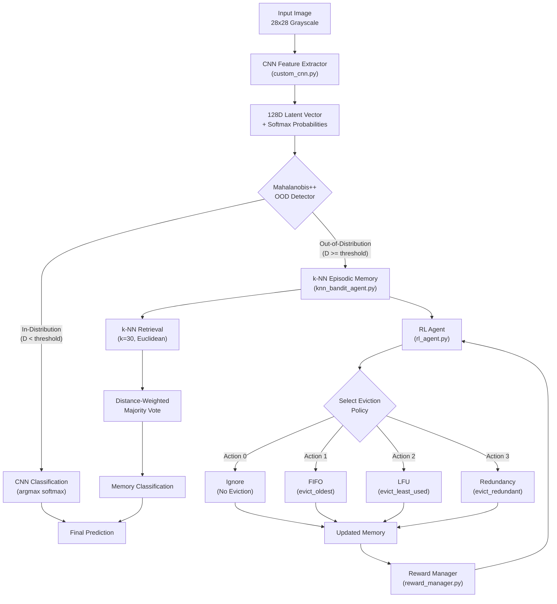

# Trustworthy Edge AI: RL-Driven Active Episodic Memory Management

**Robust Out-of-Distribution Routing for Resource-Constrained Semiparametric Vision Systems**


> Part of the [Trustworthy Edge AI: RL-Driven Active Memory Management] documentation.

---

## Abstract

This repository implements a semiparametric vision system that combines a custom-built Convolutional Neural Network (CNN) with a capacity-bounded k-Nearest Neighbors (k-NN) episodic memory, governed by a Reinforcement Learning (RL) agent for active memory curation under non-stationary Edge AI conditions. The CNN extracts 128-dimensional latent representations from raw MNIST images using from-scratch TensorFlow primitives (Conv2D, Dense, MaxPool2D via `tf.Module`). An enhanced Mahalanobis++ detector -- incorporating L2-normalized features and Ledoit-Wolf shrinkage covariance estimation -- routes Out-of-Distribution (OOD) inputs to the episodic memory for k-NN retrieval, while in-distribution samples are classified directly by the CNN. A Double DQN agent with Prioritized Experience Replay (PER) learns to actively curate the memory buffer by selecting among four eviction policies (Ignore, FIFO, LFU, Redundancy) based on a 5-dimensional state representation capturing Mahalanobis distance, local entropy, minimum k-NN distance, prediction error, and RAM occupancy. A Curriculum Learning reward manager transitions from geometric coverage proxies to empirical accuracy evaluation over a sliding validation buffer. Under a prequential (test-then-train) evaluation protocol with progressive Gaussian noise injection simulating concept drift, the RL-driven approach (B4) outperforms blind eviction baselines by +4.5% mean accuracy under noise, while achieving 170x better distribution matching (KL divergence) and operating within strictly bounded memory constraints.

---

## Key Results

The system was evaluated against four baselines under five progressive noise levels ($\sigma \in \{0.0, 0.2, 0.4, 0.6, 0.8\}$) using a prequential protocol with 5,000-vector episodic memory capacity.

| Baseline | Accuracy 0.0 | Accuracy 0.2 | Accuracy 0.4 | Accuracy 0.6 | Accuracy 0.8 | Mean Accuracy | Latency (ms) | RAM Peak (MB) | Cache Hit (%) | KL Divergence |
|:---------|:-------------|:-------------|:-------------|:-------------|:-------------|:--------------|:-------------|:--------------|:--------------|:--------------|
| B0: CNN Only | 98.0% | 90.8% | 51.4% | 30.0% | 20.3% | 58.1% | 0.004 | 0.001 | 0.0% | 0.000 |
| B1: Infinite Memory | 96.0% | 91.6% | 51.4% | 29.4% | 17.6% | 57.2% | 4.693 | 35.197 | 57.0% | 0.143 |
| B2: FIFO Eviction | 96.0% | 91.5% | 51.5% | 29.3% | 17.6% | 57.2% | 3.272 | 7.474 | 57.0% | 0.500 |
| B3: LFU Eviction | 96.0% | 91.5% | 51.5% | 29.3% | 17.6% | 57.2% | 3.302 | 7.474 | 57.0% | 0.500 |
| **B4: RL Active Memory** | **95.7%** | **90.7%** | **55.7%** | **38.9%** | **27.3%** | **61.7%** | 6.671 | 9.924 | **61.5%** | **0.003** |

**Key findings:**

- **Robustness under severe noise.** B4 achieves 38.9% accuracy at $\sigma = 0.6$ and 27.3% at $\sigma = 0.8$, outperforming the next-best baseline (B0) by +8.9% and +7.0% respectively at these noise levels.
- **Distribution matching.** B4 attains an eviction KL divergence of 0.003 nats, representing a 170x improvement over blind eviction policies (B2/B3: 0.500 nats), demonstrating that RL-driven curation maintains a representative memory distribution.
- **Cache pollution prevention.** B4 achieves 61.5% cache hit rate compared to 57.0% for blind baselines, indicating that the RL agent successfully prevents noisy exemplars from degrading the memory buffer.
- **Bounded resource usage.** B4 operates within 9.92 MB RAM peak (vs. 35.20 MB for unbounded B1), satisfying Edge AI operational sustainability (LMOS) constraints while delivering superior accuracy.

---

## System Architecture

The system implements a four-stage semiparametric pipeline that routes incoming samples through a CNN feature extractor, an OOD routing gate, and optionally into an RL-curated episodic memory:

1. **CNN Feature Extraction.** A from-scratch CNN (Conv2D, MaxPool2D, Dense via `tf.Module`) compresses 28x28 grayscale images into 128-dimensional latent feature vectors and produces 10-class softmax probabilities.
2. **Mahalanobis++ OOD Routing.** L2-normalized latent vectors are evaluated against per-class Gaussian profiles fitted with Ledoit-Wolf shrinkage. Samples exceeding the 95th-percentile distance threshold are flagged as OOD and routed to the episodic memory.
3. **k-NN Episodic Memory Retrieval.** OOD samples query a capacity-bounded (5,000 vectors) pre-allocated NumPy buffer using vectorized Euclidean k-NN search (`np.argpartition`, k=30) for distance-weighted majority voting.
4. **RL Active Memory Management.** A Double DQN agent with PER observes a 5D state vector and selects among four eviction policies (Ignore, FIFO, LFU, Redundancy) to actively curate the memory buffer, guided by a Curriculum Learning reward that transitions from geometric coverage to empirical accuracy.



For a detailed breakdown of each component, see the [Architecture Documentation](docs/architecture/README.md).

---

## Repository Structure

```text
projeto-cnn/
├── LICENSE                                     # GNU General Public License v3.0
├── CITATION.cff                                # Machine-readable citation metadata
├── README.md                                   # This file: system overview and entry point
├── requirements.txt                            # Python dependencies
├── evaluate_hybrid_global.py                   # Phase 4: EAAI 5-baseline evaluation + metrics export
├── src/
│   ├── config.py                               # Centralized configuration (all hyperparameters)
│   ├── dashboard/                              # Flask web dashboard for monitoring
│   │   ├── app.py                              # Dashboard application entry point
│   │   ├── static/                             # CSS and JavaScript assets
│   │   └── templates/                          # Jinja2 HTML templates
│   ├── data/
│   │   └── loader.py                           # MNIST binary parser + tf.data pipeline
│   ├── models/
│   │   ├── custom_cnn.py                       # From-scratch CNN (Conv2D, Dense via tf.Module)
│   │   ├── knn_bandit_agent.py                 # Episodic memory: capacity-bounded k-NN buffer
│   │   ├── mlp_bandit_agent.py                 # Legacy MLP Q-Network agent
│   │   ├── reward_manager.py                   # Curriculum Learning reward orchestrator
│   │   └── rl_agent.py                         # Double DQN + PER agent for memory curation
│   └── scratch/
│       ├── activations.py                      # Raw ReLU, Softmax implementations
│       ├── layers.py                           # Raw Conv2D, Dense, MaxPool2D, Flatten
│       ├── losses.py                           # Categorical cross-entropy loss
│       └── optimizers.py                       # Custom SGD with assign_sub
├── training/
│   ├── __init__.py
│   └── train_rl_online_simulation.py           # Phase 3: Online RL simulation with Mahalanobis++
├── scripts/
│   ├── benchmark_l40s.py                       # GPU throughput profiling
│   ├── demo_inference.py                       # 6-image inference demonstration
│   ├── evaluate_global.py                      # Threshold sweep evaluation
│   ├── profile_latent.py                       # Mahalanobis profile computation
│   ├── run_benchmark.py                        # Full benchmark suite
│   ├── simulate_online.py                      # Online simulation runner
│   ├── train_cnn.py                            # CNN training script
│   └── train_rl.py                             # RL agent training script
├── tests/
│   ├── test_agent.py                           # Phase 1 episodic memory unit tests
│   ├── test_full_acceptance_phase3.py          # Phase 3 acceptance test (50k steps)
│   ├── test_memory_diag.py                     # Memory diagnostics tests
│   ├── test_phase2.py                          # Phase 2 RL agent unit tests
│   ├── test_phase3.py                          # Phase 3 online simulation tests
│   ├── test_phase4.py                          # Phase 4 evaluation tests
│   └── test_router.py                          # OOD routing tests
├── visualizations/
│   ├── make_decision_profiles.py               # CNN vs k-NN confidence profile comparison
│   ├── make_memory_rescue.py                   # Episodic memory rescue dashboard
│   ├── make_saliency.py                        # Gradient saliency maps
│   └── make_tsne.py                            # t-SNE latent space projection
├── outputs/                                    # Checkpoints, logs, metrics, figures
├── assets/                                     # Documentation images
├── papers/                                     # Reference PDFs
└── docs/                                       # Technical documentation
    ├── README.md                               # Documentation index and navigation map
    ├── architecture/                           # System architecture deep-dives
    ├── getting-started/                        # Installation, quickstart, configuration
    ├── guides/                                 # Training, evaluation, visualization guides
    ├── api/                                    # API reference for all public modules
    ├── results/                                # Experimental results and analysis
    └── Literatura/                             # Curated scientific literature (12 areas)
```

---

## Getting Started

### Prerequisites

- Python >= 3.10
- CUDA 12.6 (optional, for GPU acceleration)
- MNIST dataset in raw binary format

### Installation

```bash
git clone <repository-url>
cd projeto-cnn
pip install -r requirements.txt
```

### Dataset Setup

Place the MNIST raw binary files in the `data/MNIST/raw/` directory:

```text
data/MNIST/raw/
├── train-images-idx3-ubyte
├── train-labels-idx1-ubyte
├── t10k-images-idx3-ubyte
└── t10k-labels-idx1-ubyte
```

For detailed installation instructions, see [Getting Started](docs/getting-started/README.md).

---

## Reproduction Pipeline

Follow these steps in order to reproduce the full experimental results:

### Step 1: Train the CNN Feature Extractor

```bash
python scripts/train_cnn.py
```

Trains the from-scratch CNN on MNIST, producing the 128D latent space and a checkpoint in `outputs/checkpoints/`.

### Step 2: Profile the Latent Space

```bash
python scripts/profile_latent.py
```

Computes per-class Mahalanobis profiles (mean vectors and Ledoit-Wolf covariance matrices) and saves them to `outputs/mahalanobis_profiles.npz`.

### Step 3: Populate Episodic Memory

```bash
python scripts/train_rl.py
```

Populates the episodic memory buffer with training set exemplars and saves the memory bank to `outputs/knn_memory_bank_128d.npz`.

### Step 4: Train RL Agent (Online Simulation)

```bash
python scripts/simulate_online.py
```

Runs the 50,000-step prequential online simulation under concept drift, training the Double DQN agent. Produces the RL agent checkpoint (`outputs/checkpoints/rl_agent_phase3.pt`) and a simulation log CSV.

### Step 5: Evaluate (5-Baseline Comparison)

```bash
python evaluate_hybrid_global.py
```

Executes the full EAAI evaluation with five baselines (B0--B4), exporting metrics to `outputs/eaai_metrics.json` and `outputs/eaai_metrics.csv`, and generating a publication-quality visualization dashboard.

For a detailed walkthrough of each step, see the [Training Pipeline Guide](docs/guides/training-pipeline.md).

---

## Documentation

| Section | Path | Description |
|:--------|:-----|:------------|
| [Documentation Index](docs/README.md) | `docs/README.md` | Central navigation hub for all documentation |
| [System Architecture](docs/architecture/README.md) | `docs/architecture/` | Component deep-dives: CNN, OOD, memory, RL, rewards, data flow |
| [Getting Started](docs/getting-started/README.md) | `docs/getting-started/` | Installation, quickstart, and configuration reference |
| [Usage Guides](docs/guides/README.md) | `docs/guides/` | Training pipeline, evaluation, and visualization workflows |
| [API Reference](docs/api/README.md) | `docs/api/` | Detailed API documentation for all public modules |
| [Experimental Results](docs/results/README.md) | `docs/results/` | Baseline comparison analysis and metrics reference |
| [Scientific Literature](docs/Literatura/README.md) | `docs/Literatura/` | Curated literature across 12 research areas |

See the [Documentation Index](docs/README.md) for a recommended reading order and full navigation map.

---

## Citation

If you use this software in your research, please cite it as follows:

```bibtex
@software{trustworthy_edge_ai_2026,
  title     = {Trustworthy Edge AI: RL-Driven Active Episodic Memory Management
               for Robust Out-of-Distribution Routing},
  author    = {[Author Name]},
  year      = {2026},
  license   = {GPL-3.0},
  url       = {https://github.com/[username]/projeto-cnn},
  note      = {Submitted to Engineering Applications of Artificial Intelligence (EAAI)}
}
```

A machine-readable citation file is available at [CITATION.cff](CITATION.cff).

---

## License

This project is licensed under the **GNU General Public License v3.0**. See the [LICENSE](LICENSE) file for the full license text.

---

Licensed under the GNU General Public License v3.0. See [LICENSE](LICENSE) for details.