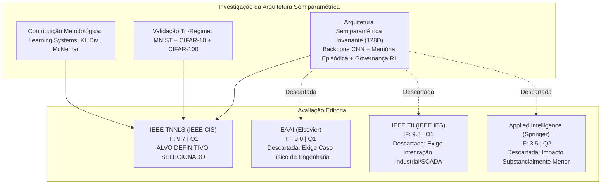

# Enquadramento Editorial e Estratégia de Publicação: IEEE TNNLS

> **Alinhamento Estratégico com a Orientação Científica:** Submissão do artigo principal para a revista **IEEE Transactions on Neural Networks and Learning Systems (IEEE TNNLS)**.  
> **Editora:** IEEE Computational Intelligence Society (IEEE CIS) | **Fator de Impacto:** 9.7 | **Quartil:** Q1 (Artificial Intelligence, Computer Science, Electrical Engineering).  
> **Decisão Oficial:** Transição e substituição da via EAAI (*Engineering Applications of Artificial Intelligence*, Elsevier) pela IEEE TNNLS como veículo principal de publicação da arquitetura semiparamétrica.

---

## 1. Decisão Editorial e Justificação Científica

Em alinhamento direto com a orientação científica do projeto, estabeleceu-se a decisão definitiva de redigir e submeter o artigo principal à **IEEE Transactions on Neural Networks and Learning Systems (IEEE TNNLS)** em substituição da revista *Engineering Applications of Artificial Intelligence* (EAAI, Elsevier).

### 1.1. Racional da Substituição: Limitações do Perfil da EAAI

A revista EAAI (*Engineering Applications of Artificial Intelligence*) tem como requisito editorial obrigatório a demonstração de aplicações práticas tangíveis em problemas de engenharia do mundo físico — tais como automação de manufatura em ambiente fabril, controlo de processos químicos, sistemas ciberfísicos industriais (CPS) ou agricultura de precisão com sensores de campo.

No contexto do presente projeto:
1. A validação empírica foi conduzida com rigor metodológico exemplar em conjuntos de dados canónicos de referência (MNIST, CIFAR-10 e CIFAR-100 sob injeção sistemática de ruído não-estacionário e *concept drift*).
2. Embora estes benchmarks sejam o padrão-ouro para demonstrar propriedades algorítmicas de redes neuronais, não constituem um caso de estudo de engenharia aplicada física.
3. A submissão à EAAI com validação estritamente baseada em MNIST/CIFAR acarretaria um risco elevado de rejeição preliminar (*desk reject*) por insuficiência de contribuição aplicada de engenharia, a menos que fosse desenvolvida uma infraestrutura física adicional (por exemplo, bancadas com braços robóticos ou sensores industriais em chão de fábrica).

### 1.2. O Fit Perfeito da IEEE TNNLS

A **IEEE Transactions on Neural Networks and Learning Systems (IEEE TNNLS)**, publicada pela *IEEE Computational Intelligence Society*, é o periódico internacional de maior prestígio dedicado especificamente aos avanços teóricos, arquiteturais e algorítmicos em redes neuronais e sistemas de aprendizagem.

Os fatores que consolidam a TNNLS como a escolha ótima são:
- **Natureza da Contribuição:** O trabalho propõe uma arquitetura semiparamétrica inovadora que resolve a governança ativa de memória episódica ($k$-NN) via Aprendizagem por Reforço Profunda (Double DQN com Prioritized Experience Replay), ancorada num gargalo latente invariante de 128 dimensões ($z \in \mathbb{R}^{128}$). Esta inovação insere-se diretamente no escopo de *Learning Systems* e *Neural Network Architectures*.
- **Aceitação de Benchmarks Canónicos:** A TNNLS acolhe e valoriza artigos cuja contribuição seja conceptual, algorítmica e metodológica, validados em suites canónicas de referência (MNIST, CIFAR-10, CIFAR-100), desde que acompanhados de formulação matemática sólida e rigor estatístico estrito.
- **Rigor Matemático e Teórico:** A análise de conservação de distribuição de classes via divergência de Kullback-Leibler ($D_{KL} \to 0$), a prova de eliminação de *class starvation*, a formulação formal de Processo de Decisão de Markov (MDP) e as garantias de complexidade espacial $O(1)$ e temporal $O(k)$ alinham-se precisamente com os padrões de excelência da TNNLS.
- **Elevado Fator de Impacto e Reconhecimento:** Com um Fator de Impacto de 9.7 (Q1), a TNNLS oferece um prestígio científico e visibilidade na comunidade de Inteligência Artificial superior ao da generalidade dos periódicos aplicados.

---

## 2. Síntese da Arquitetura e Contribuição Científica para a TNNLS

A investigação desenvolvida estrutura-se em quatro pilares metodológicos e experimentais que compõem o núcleo do manuscrito para a IEEE TNNLS:

### 2.1. Quatro Pilares Metodológicos

1. **Arquitetura Semiparamétrica com Gargalo Latente Invariante:**
   - Proposição de um contrato latente unificado $z \in \mathbb{R}^{128}$ que permite acoplar extratores paramétricos heterogéneos (CNN custom de 225k parâmetros para MNIST, ResNet-9 de 6.57M parâmetros para CIFAR-10, e ResNet-18 V2 de 11.25M parâmetros para CIFAR-100) a um motor de memória não-paramétrico invariante.
2. **Quantificação de Incerteza e Roteamento OOD:**
   - Mecanismo de arbitração para deteção de amostras fora de distribuição (OOD) baseado em distância de Mahalanobis e entropia preditiva de Shannon (Dual Uncertainty Arbiter), ativando seletivamente o resgate de memória apenas quando a confiança paramétrica é violada.
3. **Governança Ativa de Memória via Deep Reinforcement Learning:**
   - Agente Double DQN com Prioritized Experience Replay (SumTree) que opera sobre um espaço compacto de estados com 4 ações discretas (Ignore, FIFO, LFU e Redundancy Pruning), transformando a retenção de memória de uma heurística passiva num processo dinâmico de tomada de decisão.
   - Gestor de recompensas com *Curriculum Learning*, realizando a transição contínua de um proxy geométrico ($R_{\text{geom}}$) para validação empírica de acurácia em janela deslizante ($R_{\text{acc}}$).
4. **Preservação de Distribuição e Eliminação de Degradação Passiva:**
   - Confirmação formal do *Distribution Matching Theorem* de Isele & Cosgun (AAAI 2018), eliminando a inanição de classes (*class starvation*) e reduzindo a divergência de Kullback-Leibler da política de evição até $> 10^8\times$ face a políticas clássicas (FIFO/LFU).

### 2.2. Resultados-Chave Consolidados nos Três Regimes

| Métrica de Avaliação | MNIST (Stylized) | CIFAR-10 (Natural) | CIFAR-100 (Fine-Grained) |
|:---|:---:|:---:|:---:|
| **Dimensão do Espaço de Classes** | 10 classes | 10 classes | 100 classes |
| **Complexidade Paramétrica do Backbone** | 225,034 params | 6,573,130 params | 11,250,532 params |
| **Acurácia Nominal Limpa ($\sigma = 0.0$)** | 99.12% | 91.18% | 74.27% |
| **Acurácia sob Ruído Severo (B4 vs B2)** | 27.30% vs 17.60% (+9.70%) | 11.90% vs 11.20% (+0.70%) | 3.40% vs 1.50% ($2.27\times$) |
| **Acurácia Global do Fluxo (B4 vs B0)** | 61.66% vs 58.10% (+3.56%) | 27.50% vs 27.14% (+0.36%) | 15.68% vs 15.64% (+0.04%) |
| **Redução de Divergência KL ($D_{KL}$)** | 0.0028 vs 0.5003 ($177\times$) | 0.0007 vs 0.8850 ($>1,200\times$) | $2.25 \times 10^{-8}$ vs 2.6551 ($>10^8\times$) |
| **Significância Estatística (McNemar)** | $p < 0.001$ | $p < 0.001$ | $p < 0.001$ |
| **Consumo de Memória RAM (Pico)** | 9.92 MB ($O(1)$) | 9.93 MB ($O(1)$) | 8.82 MB ($O(1)$) |
| **Latência Média de Inferência** | 6.67 ms (150 fps) | 6.94 ms (144 fps) | 10.85 ms (92 fps) |

---

## 3. Registo Comparativo das Revistas Analisadas

A tabela e o diagrama seguintes registam o estudo comparativo realizado previamente e documentam formalmente a seleção final da IEEE TNNLS face às alternativas analisadas:

### 3.1. Matriz de Avaliação Comparativa

| Critério Editorial | IEEE TNNLS | EAAI (Elsevier) | IEEE TII | Applied Intelligence |
|:---|:---:|:---:|:---:|:---:|
| **Editora** | IEEE CIS | Elsevier (IFAC) | IEEE IES | Springer |
| **Fator de Impacto (JCR)** | **9.7** | 9.0 | 9.8 | 3.5 |
| **Quartil** | **Q1** | Q1 | Q1 | Q2 |
| **Aceitação de Benchmarks Canónicos** | Excelente | Muito Baixa | Nula | Boa |
| **Exigência de Demonstração Física** | Não | Sim | Sim | Parcial |
| **Alinhamento: Redes Neuronais** | Total | Parcial | Baixo | Bom |
| **Alinhamento: Reinforcement Learning** | Total | Bom | Parcial | Bom |
| **Alinhamento: Continual/Lifelong Learning** | Total | Bom | Baixo | Bom |
| **Rigor Matemático e Teórico Exigido** | Muito Elevado | Moderado a Alto | Alto | Moderado |
| **Adequação Final ao Projeto** | **Escolha Ótima (100%)** | Desalinhada | Inviável | Sub-ótima |

---

## 4. Requisitos e Diretrizes Oficiais de Submissão da IEEE TNNLS

Para assegurar uma submissão de sucesso à IEEE TNNLS, o manuscrito deve cumprir integralmente as normas formais da *IEEE Computational Intelligence Society*:

### 4.1. Formatação e Especificações do Manuscrito

- **Formato e Template:** Documento preparado em LaTeX utilizando a classe oficial `IEEEtran.cls` em formato de duas colunas (*two-column format*, fonte de 10 pt, espaçamento simples).
- **Tipologia do Artigo:** *Regular Paper*.
- **Extensão do Documento:** Entre 10 e 12 páginas compiladas no formato IEEE de duas colunas. Manuscritos que excedam 10 páginas estão sujeitos a encargos de páginas adicionais (*overlength page charges*), sendo 14 a 15 páginas o limite estrito admitido na maioria das transações IEEE.
- **Resumo (Abstract):** Texto conciso e não estruturado em parágrafos múltiplos, com limite estrito de 250 palavras. Deve apresentar de forma direta: o problema do esquecimento catastrófico e poluição de memória sob *concept drift*, a proposta semiparamétrica ativa, as garantias teóricas obtidas e os resultados quantitativos comprovados nos três regimes.
- **Termos de Indexação (Index Terms):** De 4 a 6 palavras-chave padronizadas da taxonomia da IEEE. Sugestões alinhadas:
  - *Continual learning*
  - *Episodic memory*
  - *Deep reinforcement learning*
  - *Out-of-distribution detection*
  - *Semiparametric learning systems*
  - *Convolutional neural networks*
- **Ilustrações e Gráficos:** As figuras devem ser preparadas em formato vetorial de alta definição (PDF ou EPS), com texto legível na escala final da coluna (88 mm de largura) e resolução de pelo menos 300 DPI. Gráficos a cores devem manter contraste legível caso convertidos para escala de cinzentos.
- **Estilo de Citação:** Formatação numérica entre parênteses retos (ex.: `[1]`, `[2]`), ordenada sequencialmente por ordem de aparição no texto, com metadados bibliográficos completos (incluindo DOI ativo para todos os registos).

### 4.2. Estrutura Canónica do Artigo para a IEEE TNNLS

O artigo deve ser estruturado de acordo com as seguintes seções formais:

#### Title
*Active Episodic Memory Management via Reinforcement Learning for Robust Semiparametric Vision Under Non-Stationary Concept Drift*

#### Abstract & Index Terms
Contextualização sucinta do problema, metodologia do agente Double DQN com memória episódica $k$-NN sobre gargalo invariante de 128D, confirmação do *Distribution Matching Theorem* e resultados empíricos nos três regimes de complexidade.

#### Section I: Introduction
- O dilema estabilidade-plasticidade em visão computacional e as limitações de modelos puramente paramétricos face a distribuições não-estacionárias.
- A vulnerabilidade de buffers de memória não-geridos (degradação passiva sob ruído severo e inanição de classes).
- Apresentação da tese central: a governança ativa da memória episódica por um agente de reforço com bound estrito de recursos restaura a robustez sob ruído e previne o colapso de distribuição.
- Lista explícita das três a quatro contribuições científicas concretas do trabalho.

#### Section II: Related Work
- Arquiteturas semiparamétricas e sistemas híbridos em visão computacional.
- Memória episódica e estratégias de repetição em aprendizagem contínua (*continual learning*).
- Deteção fora de distribuição e quantificação de incerteza preditiva (Mahalanobis, entropia).
- Aprendizagem por reforço aplicada ao controlo de sistemas adaptativos e gestão de recursos.

#### Section III: Semiparametric Vision Architecture
- Modelo formal do sistema e definição do gargalo latente invariante $z \in \mathbb{R}^{128}$.
- Formalização dos extratores paramétricos (CNN custom, ResNet-9, ResNet-18 V2).
- Formalização do Árbitro OOD (Mahalanobis++ e Dual Uncertainty Arbiter com limiares calibrados $\tau_M$ e $\tau_H$).
- Formulação matemática do banco de memória episódica $k$-NN com capacidade finita $C = 5{,}000$ e cálculo de vizinhança métrica.

#### Section IV: Active Memory Governance via Deep Reinforcement Learning
- Formalização do Processo de Decisão de Markov (MDP) $\langle \mathcal{S}, \mathcal{A}, \mathcal{P}, \mathcal{R}, \gamma \rangle$.
- Vetor de estado compacto com métricas de contexto geométrico e de ocupação de buffer.
- Espaço discreto de ações:
  - Ação 0: *Ignore* (bloqueio de admissão de amostras ruidosas / anti-poluição).
  - Ação 1: *FIFO* (evição por antiguidade temporal).
  - Ação 2: *LFU* (evição por menor frequência de ativação).
  - Ação 3: *Redundancy Pruning* (poda seletiva de exemplares na classe modal mais saturada).
- Arquitetura do agente Double DQN e buffer com Prioritized Experience Replay (SumTree).
- Função de recompensa composta com *Curriculum Learning* integrando recompensa geométrica e acurácia empírica com decaimento exponencial de $\alpha$.

#### Section V: Theoretical Guarantees and Complexity Analysis
- Teorema de Preservação de Distribuição e Prova de Eliminação de Inanição de Classes ($D_{KL} \to 0$).
- Análise de complexidade espacial: garantia analítica de bound $O(1)$ na memória física RAM ($< 10$ MB).
- Análise de complexidade temporal: limite de latência de inferência $O(k)$ e viabilidade em tempo real ($> 90$ fps).

#### Section VI: Experimental Setup and Protocol
- Descrição da suite tri-regime de benchmarks: MNIST (10 classes estilizadas), CIFAR-10 (10 classes naturais), CIFAR-100 (100 classes naturais com granularidade fina).
- Protocolo de avaliação prequencial (*test-then-train*) sob injeção progressiva de perturbação gaussiana ($\sigma \in \{0.0, 0.2, 0.4, 0.6, 0.8\}$).
- Especificação rigorosa dos 5 baselines do sistema:
  - B0: Pure CNN (sem memória).
  - B1: Infinite Memory (buffer não-delimitado, sem evição).
  - B2: FIFO Bounded Memory (buffer fixo com evição estática temporal).
  - B3: LFU Bounded Memory (buffer fixo com evição por frequência).
  - B4: Proposed Active RL Memory (governança dinâmica adaptativa).

#### Section VII: Empirical Results and Comparative Evaluation
- Análise comparativa aprofundada dos resultados em tabelas consolidadas.
- Testes estatísticos de hipóteses de McNemar com valores de $p$ e tabelas de contingência 2x2.
- Análise da dinâmica da divergência de Kullback-Leibler e preservação da representação das classes.
- Análise de latência computacional, taxa de fotogramas por segundo e pegada de memória.

#### Section VIII: Ablation Studies and Sensitivity Analysis
- Impacto da capacidade do buffer de memória ($C \in \{1000, 2500, 5000\}$).
- Sensibilidade aos hiperparâmetros de recompensa e calibração dos limiares de incerteza ($\tau_M, \tau_H$).
- Custo computacional e análise de sobrecarga (*overhead*) da inferência do agente Double DQN.

#### Section IX: Discussion and Limitations
- Análise crítica dos trade-offs de desempenho vs complexidade de treino.
- Limitações da abordagem face a conjuntos de dados com cardinalidade extrema (ex.: ImageNet-1k).
- Potencial de extensão a representações multimodais e modelos de base (*foundation models*).

#### Section X: Conclusion
- Síntese das conclusões científicas e impacto do paradigma semiparamétrico governado por reforço na teoria de sistemas de aprendizagem.

#### References
- Citações completas em formato IEEE numérico, cobrindo as referências seminais de *continual learning*, memórias episódicas, *deep Q-learning* e deteção fora de distribuição.

---

## 5. Plano de Ação e Próximos Passos para a Submissão

1. **Configuração do Repositório do Manuscrito:**
   - Instalação e teste do template oficial `IEEEtran.cls`.
   - Estruturação dos ficheiros modulares em LaTeX: `main.tex`, `sec1_intro.tex`, `sec2_related.tex`, `sec3_architecture.tex`, `sec4_rl_governance.tex`, `sec5_theory.tex`, `sec6_setup.tex`, `sec7_results.tex`, `sec8_ablations.tex`, `sec9_discussion.tex`, `sec10_conclusion.tex`.
2. **Exportação de Ilustrações Vetoriais:**
   - Vetorização dos diagramas de arquitetura e do fluxo de decisão em formato PDF/EPS.
   - Geração de figuras vetoriais de alta resolução a partir dos scripts de avaliação (`outputs/*/eaai_evaluation_dashboard.png` convertidos ou renderizados diretamente para PDF a 300 DPI com fontes incorporadas).
3. **Consolidação do Ficheiro BibTeX:**
   - Compilação das referências da pasta `docs/Literatura/` num ficheiro `references.bib` único, auditado contra as bases oficiais IEEE Xplore, CrossRef e DBLP.
4. **Revisão e Submissão:**
   - Validação integral com o orientador científico.
   - Submissão formal através da plataforma *IEEE ScholarOne Manuscripts* da IEEE TNNLS.
