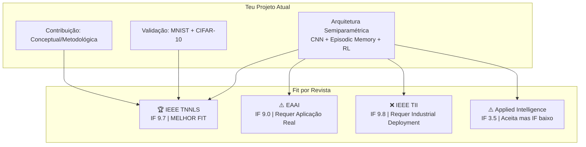
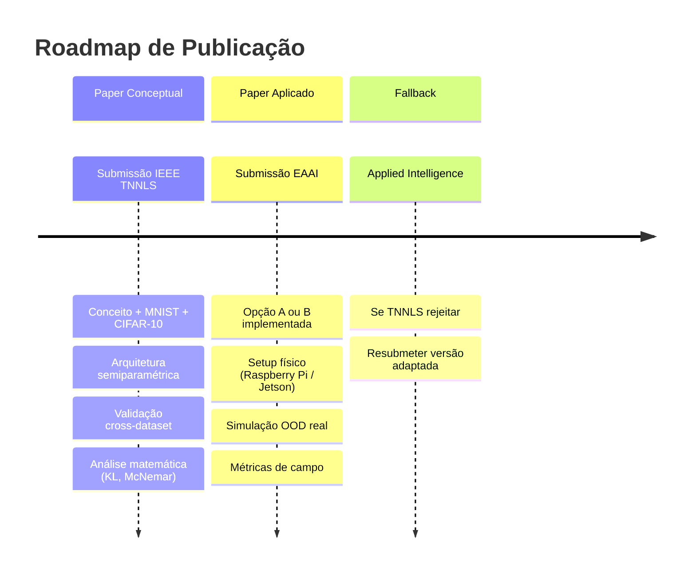

# Análise Comparativa de Revistas para Publicação da Arquitetura Semiparamétrica

> Análise do fit do projeto **Active Episodic Memory Management via RL** face a 4 revistas científicas.

---

## 1. Síntese do Teu Sistema (Leitura Integral do Repositório)

Após análise exaustiva de toda a pasta `docs/`, `src/`, `scripts/`, `README.md` e dos resultados experimentais, o teu projeto pode ser sintetizado como:

### Contribuição Científica Central

Uma **arquitetura semiparamétrica** que combina:
- **Backbone paramétrico** (CNN custom para MNIST / ResNet-9 para CIFAR-10) → produz um **vetor latente invariante de 128D**
- **Árbitro OOD** (Mahalanobis++ ou Dual Uncertainty) → decide se a amostra é In-Distribution ou Out-of-Distribution
- **Memória Episódica k-NN** (buffer pré-alocado de 5,000 vetores, $O(1)$ RAM) → resgate de amostras OOD
- **Agente RL (Double DQN + PER)** → gestão ativa da memória com 4 ações discretas (Ignore, FIFO, LFU, Redundancy Pruning)
- **Reward Manager com Curriculum Learning** → transição de proxy geométrico para validação por sliding buffer

### Resultados-Chave Experimentais

| Métrica | MNIST (B4 vs B2) | CIFAR-10 (B4 vs B2) |
|:---|:---:|:---:|
| **Accuracy geral** | 61.66% vs 57.18% (**+4.48%**) | 27.50% vs 27.14% (**+0.36%**) |
| **Accuracy @ σ=0.8** | 27.30% vs 17.60% (**+9.70%**) | 11.90% vs 11.20% (**+0.70%**) |
| **Eviction KL Div.** | 0.003 vs 0.500 (**177× lower**) | 0.0007 vs 0.885 (**>1200× lower**) |
| **Peak RAM** | 9.92 MB (bounded $O(1)$) | 9.93 MB (bounded $O(1)$) |
| **Latência** | 6.67 ms (150 fps) | 6.94 ms (144 fps) |

### Natureza do Trabalho

> [!IMPORTANT]
> O teu trabalho é **fundamentalmente conceptual/metodológico**: propõe uma nova arquitetura (episodic memory + RL governance) e valida-a em **benchmarks académicos** (MNIST, CIFAR-10), demonstrando propriedades matemáticas (invariância cross-dataset, $D_{KL} \to 0$, bounded RAM). **Não tem aplicação real tangível demonstrada** num cenário físico ou industrial.

---

## 2. Perfil das 4 Revistas em Análise

### 2.1. EAAI — Engineering Applications of Artificial Intelligence (Elsevier)

| Atributo | Detalhe |
|:---|:---|
| **Publisher** | Elsevier (IFAC) |
| **IF 2025** | **9.0** |
| **Quartil** | Q1 (AI, Control & Systems Engineering) |
| **Foco** | **Aplicações práticas** de IA em todas as áreas da engenharia |
| **Requisito-chave** | Validação em problemas reais, datasets públicos, aplicações tangíveis |
| **Aceita papers puramente conceptuais?** | ❌ **NÃO** — exige demonstração de aplicação real |

> [!WARNING]
> **A EAAI exige explicitamente que os submissions demonstrem aplicação de IA a problemas de engenharia reais.** Papers com MNIST/CIFAR-10 como único benchmark serão provavelmente rejeitados por falta de contribuição aplicada. É por isso que corretamente identificaste a necessidade da Opção A (Indústria 4.0) ou Opção B (Smart Farming) para a EAAI.

---

### 2.2. IEEE TNNLS — IEEE Transactions on Neural Networks and Learning Systems

| Atributo | Detalhe |
|:---|:---|
| **Publisher** | IEEE Computational Intelligence Society |
| **IF 2025** | **9.7** |
| **Quartil** | Q1 (AI, Computer Science) |
| **Foco** | **Teoria, design e aplicações** de redes neuronais e sistemas de aprendizagem |
| **Requisito-chave** | Contribuição técnica significativa em neural networks, machine learning, learning systems |
| **Aceita papers com benchmarks standard?** | ✅ **SIM** — aceita validação em datasets académicos (MNIST, CIFAR-10, etc.) |

**Tópicos alinhados com o teu projeto:**
- ✅ Neural network architectures (CNN feature extractors)
- ✅ Learning systems (RL-based memory management)
- ✅ Adaptive control via RL (Double DQN + PER)
- ✅ Memory and neural computing
- ✅ Few-shot/continual learning aspects

---

### 2.3. IEEE TII — IEEE Transactions on Industrial Informatics

| Atributo | Detalhe |
|:---|:---|
| **Publisher** | IEEE Industrial Electronics Society |
| **IF 2025** | **9.8** |
| **Quartil** | Q1 (Industrial Engineering, Computer Science) |
| **Foco** | **Informática industrial**: automação, controlo, CPS, IoT, manufatura |
| **Requisito-chave** | Contribuição clara para **sistemas industriais**, deployment realístico, contexto de aplicação industrial |
| **Aceita papers puramente conceptuais?** | ❌ **NÃO** — exige deployment ou validação realística industrial |

> [!CAUTION]
> **A TII é ainda mais exigente que a EAAI quanto a aplicação industrial.** Submissions devem fornecer "clear industrial-informatics system contribution" e incluir "deployment or realistic validation context". O teu trabalho atual com MNIST/CIFAR-10 seria **desk-rejected** sem uma componente industrial forte.

---

### 2.4. Applied Intelligence (Springer)

| Atributo | Detalhe |
|:---|:---|
| **Publisher** | Springer |
| **IF 2025** | **3.5** |
| **Quartil** | Q2 (AI) |
| **Foco** | Integração e **aplicação** de IA/redes neuronais a problemas complexos do mundo real |
| **Requisito-chave** | Bridge entre teoria e prática, aplicações em manufatura, defesa, gestão |
| **Aceita papers com benchmarks standard?** | ⚠️ **Parcialmente** — aceita, mas com menor impacto; prefere aplicações práticas |

---

## 3. Matriz de Compatibilidade: Projeto × Revista

| Critério | IEEE TNNLS | EAAI | IEEE TII | Applied Intelligence |
|:---|:---:|:---:|:---:|:---:|
| **IF** | 9.7 | 9.0 | 9.8 | 3.5 |
| **Aceita benchmarks académicos** | ✅ | ❌ | ❌ | ⚠️ |
| **Requer aplicação real** | ❌ | ✅ | ✅✅ | ⚠️ |
| **Alinhamento com RL + Memory** | ✅✅ | ✅ | ⚠️ | ✅ |
| **Alinhamento com Neural Networks** | ✅✅ | ✅ | ⚠️ | ✅ |
| **Alinhamento com OOD Detection** | ✅✅ | ✅ | ⚠️ | ✅ |
| **Alinhamento com Edge AI** | ✅ | ✅✅ | ✅✅ | ⚠️ |
| **Competitividade (dificuldade de aceitação)** | 🔴 Muito Alta | 🟠 Alta | 🔴 Muito Alta | 🟢 Moderada |
| **FIT GLOBAL para o teu projeto atual** | ⭐⭐⭐⭐⭐ | ⭐⭐ | ⭐ | ⭐⭐⭐ |

---

## 4. Recomendação Final

### 🏆 1.ª Escolha: IEEE TNNLS (IEEE Transactions on Neural Networks and Learning Systems)

> [!TIP]
> **A IEEE TNNLS é, de longe, a revista mais indicada para publicar o conceito da tua arquitetura de gestão de memória episódica com RL, usando os resultados com MNIST e CIFAR-10.**

**Porquê:**
1. **Aceita contribuições metodológicas/conceptuais** validadas em benchmarks standard — não exige aplicação real
2. **IF 9.7** — prestígio altíssimo, comparável à EAAI e TII
3. **Scope 100% alinhado** — neural networks, learning systems, RL, adaptive memory são tópicos core
4. **Os teus resultados cross-dataset** (demonstrar invariância da arquitetura entre MNIST e CIFAR-10) são exatamente o tipo de contribuição que a TNNLS valoriza
5. **Forte base teórica** — a tua análise com KL divergence, McNemar tests, e hardware bounding é o rigor esperado

**Como enquadrar o paper para a TNNLS:**
- **Título sugerido:** *"Active Episodic Memory Management via Reinforcement Learning for Robust Semiparametric Vision Under Non-Stationary Concept Drift"*
- **Framing:** Contribuição em **learning systems** — um sistema de aprendizagem que combina componentes paramétricos e não-paramétricos sob governança RL
- **Emphasis:** O contrato invariante 128D, a prevenção de class starvation ($D_{KL} \to 0$), o bounded $O(1)$ hardware footprint, e a cross-dataset generalization

---

### 🥈 2.ª Escolha: Applied Intelligence (Springer)

**Prós:**
- Aceita validações com datasets standard
- Taxa de aceitação mais realista
- Scope inclui neural networks, pattern recognition, anomaly detection

**Contras:**
- IF significativamente mais baixo (3.5 vs 9.7)
- Menor prestígio académico

> Recomendo como **plan B** caso a TNNLS rejeite.

---

### ⚠️ Para a EAAI: Mantém o plano da Opção A ou B

A EAAI continua a ser excelente — mas **requer a aplicação real** que planeaste com a Opção A (Controlo de Qualidade CPS) ou Opção B (Smart Farming). Nesse caso, podes publicar **dois papers**:

1. **Paper 1 (TNNLS):** Conceito da arquitetura + MNIST + CIFAR-10 (metodológico)
2. **Paper 2 (EAAI):** Aplicação real da arquitetura num cenário industrial/agrícola (aplicado)

---

### ❌ IEEE TII: Não recomendado para o estado atual

A TII exige deployment industrial demonstrado. Mesmo com as opções A/B implementadas, a TII prefere sistemas com integração industrial profunda (protocolos OPC-UA, SCADA, integração com PLCs, etc.). Se não tens essa vertente, evita.

---

## 5. Estratégia de Publicação Proposta

> [!NOTE]
> Esta estratégia permite **maximizar o output académico**: um paper metodológico (TNNLS) e um paper aplicado (EAAI), ambos baseados na mesma arquitetura core, sem sobreposição de contribuição.
