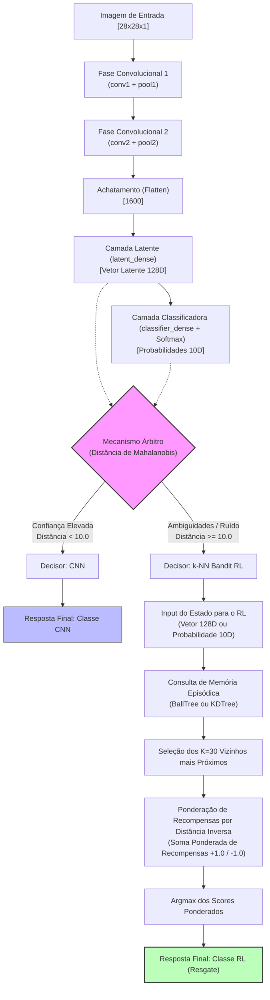

# Arquitetura Detalhada da CNN e Fluxo de Inferência Híbrido (CNN + k-NN Bandit RL)

Este documento descreve detalhadamente a arquitetura da Rede Neuronal Convolucional personalizada (`RawModel` definida em `src/models/custom_cnn.py`) e explica passo a passo como os dados fluem desde a imagem de entrada até à classificação final pelo sistema híbrido.

---

## 1. O Modelo de CNN: `RawModel`

A CNN do projeto foi desenvolvida a partir do zero (usando primitivas do TensorFlow em `src/scratch/layers.py` e `activations.py`) para servir dois propósitos essenciais:
1. **Classificação Direta:** Identificar dígitos em condições de imagem limpa.
2. **Extração de Características (Córtex Visual):** Traduzir a imagem espacial em representações latentes compactas de **128 Dimensões**, que servem de base para o sistema híbrido.

### Resumo de Camadas e Parâmetros

A rede é composta por **7 camadas estruturais** (2 convolucionais, 2 de pooling, 1 de achatamento/flatten e 2 densas/fully-connected) associadas a funções de ativação não-lineares.

A tabela seguinte detalha as dimensões dos tensores e a contagem de parâmetros aprendíveis em cada etapa:

| # | Camada / Operação | Tipo | Dimensão de Entrada | Dimensão de Saída | Detalhes Matemáticos | Parâmetros Aprendíveis (Pesos + Biases) |
|---|---|---|---|---|---|---|
| **0** | **Input Image** | Entrada | 28x28x1 | 28x28x1 | Imagem normalizada em tons de cinza | 0 |
| **1** | **`conv1`** | Convolucional 2D | 28x28x1 | 26x26x32 | 32 filtros de 3x3, stride=1, padding='VALID' | 3x3x1x32 (pesos) + 32 (biases) = **320** |
| **-** | *ReLU* | Ativação | 26x26x32 | 26x26x32 | max(0, x) | 0 |
| **2** | **`pool1`** | Max Pooling 2D | 26x26x32 | 13x13x32 | Janela 2x2, stride=2, padding='VALID' | 0 |
| **3** | **`conv2`** | Convolucional 2D | 13x13x32 | 11x11x64 | 64 filtros de 3x3, stride=1, padding='VALID' | 3x3x32x64 (pesos) + 64 (biases) = **18.496** |
| **-** | *ReLU* | Ativação | 11x11x64 | 11x11x64 | max(0, x) | 0 |
| **4** | **`pool2`** | Max Pooling 2D | 11x11x64 | 5x5x64 | Janela 2x2, stride=2, padding='VALID' | 0 |
| **5** | **`flatten`** | Achatamento | 5x5x64 | 1600 | Redimensionamento para vetor 1D | 0 |
| **6** | **`latent_dense`**| Densa (Latente) | 1600 | 128 | Camada Fully-Connected | 1600x128 (pesos) + 128 (biases) = **204.928** |
| **-** | *ReLU* | Ativação | 128 | 128 | Vetor Latente **128D** (x_latent) | 0 |
| **7** | **`classifier_dense`**| Densa (Saída) | 128 | 10 | Mapeamento para 10 classes | 128x10 (pesos) + 10 (biases) = **1.290** |
| **-** | *Softmax* | Ativação | 10 | 10 | Vetor de probabilidades p_CNN | 0 |

> [!NOTE]
> **Total de Parâmetros Aprendíveis da CNN:** **225.034 parâmetros** (pesos e biases). Esta escala compacta foi projetada de raiz para maximizar a velocidade de treino e inferência nas GPUs NVIDIA L40S do projeto, mantendo uma excelente capacidade de extração.

---

## 2. O que faz cada camada (Análise Fisiológica e Pedagógica)

Para compreender intuitivamente as quatro primeiras camadas estruturais da nossa CNN, imagine que ela funciona de forma semelhante ao **sistema visual humano**: começamos por detetar linhas básicas nas imagens de entrada, agrupamos essas linhas em formas geométricas maiores e resumimos a informação antes de tomar uma decisão consciente.

### 1. Camada `conv1` (Filtros Espaciais Primários)
* **O que é matematicamente:** Esta camada aplica **32 filtros independentes**, cada um com uma dimensão de 3x3 píxeis, varrendo a imagem de entrada (28x28x1).
* **O que faz na prática:** Como a imagem de entrada tem apenas 1 canal (escala de cinzas), cada um dos 32 filtros atua como uma pequena "lente de aumento" com pesos matemáticos específicos. À medida que varrem a imagem (com um salto/stride de 1 píxel), realizam multiplicações matemáticas (convoluções) para detetar traços visuais simples.
* **O papel visual:** Cada filtro especializa-se numa característica elementar: por exemplo, o Filtro 1 destaca linhas verticais, o Filtro 2 destaca linhas horizontais e o Filtro 3 destaca diagonais ou transições abruptas de luz/sombra.
* **Ativação ReLU:** Garante que apenas sinais com ativação positiva sejam propagados, introduzindo a não-linearidade necessária para que a rede aprenda formas curvas complexas nas camadas seguintes.
* **Resultado:** A imagem original 28x28 transforma-se num tensor de dimensão **26x26x32** (32 "imagens" ligeiramente mais pequenas, onde cada uma destaca um tipo de traço básico).

### 2. Camada `pool1` (Compressão e Invariância Espacial)
* **O que é matematicamente:** Uma operação de redução de resolução espacial sem parâmetros. Varre cada um dos 32 mapas anteriores com uma janela de 2x2 e um salto/stride de 2 píxeis.
* **O que faz na prática:** Em cada quadrado de 2x2 píxeis (4 píxeis no total), a camada simplesmente deita fora 3 píxeis e **escolhe apenas o maior valor (o máximo)**.
* **O papel visual:**
  - **Invariância:** Si o traço de um número estiver ligeiramente desviado 1 píxel para a esquerda ou para a direita, o valor máximo naquela janela de 2x2 continuará a ser o mesmo. Isto torna o modelo robusto a deslocamentos físicos.
  - **Simplificação:** Remove informação redundante (píxeis neutros ou sem ativação) e foca-se apenas onde os traços foram detetados com maior força.
* **Resultado:** O espaço físico é reduzido para metade: passa de 26x26x32 para **13x13x32**, poupando imensa memória computacional.

### 3. Camada `conv2` (Síntese Geométrica e Texturas)
* **O que é matematicamente:** Aplica **64 novos filtros** de 3x3 píxeis sobre o tensor de 13x13x32 vindo da etapa anterior.
* **O que faz na prática:** Esta camada é mais complexa porque cada um dos seus 64 filtros não olha apenas para 1 canal, mas sim para os **32 canais de traços básicos** em simultâneo.
* **O papel visual:** Em vez de procurar píxeis isolados, a `conv2` procura **combinações de traços** (montagem de peças). Ela junta os traços básicos que a `conv1` encontrou para detetar formas geométricas reais:
  - Si detetar um traço vertical e um horizontal que se cruzam na extremidade, ativa a forma de um **"canto de ângulo reto"** (útil para detetar o número 4 ou 7).
  - Si detetar várias curvas consecutivas, ativa a forma de um **"círculo/loop"** (essencial para detetar o 8, 9 ou 0).
* **Ativação ReLU:** Retém e destaca as formas geométricas mais representativas encontradas.
* **Resultado:** Produz uma representação ainda mais abstrata com dimensão **11x11x64** (64 mapas de formas geométricas).

### 4. Camada `pool2` (Compressão Secundária)
* **O que é matematicamente:** Aplica a mesma regra de selecionar o valor máximo numa janela de 2x2 com stride=2, mas agora sobre os 64 canais geométricos de 11x11.
* **O que faz na prática:** Comprime espacialmente a informação geométrica detetada na `conv2`. Em termos matemáticos de divisão inteira (`VALID` padding), a janela de 2x2 consegue saltar 5 vezes ao longo de um eixo de 11 píxeis.
* **O papel visual:** Filtra e consolida a presença das formas geométricas abstratas na imagem. O resultado é um mapa ultra-condensado de "peças visuais" presentes no dígito.
* **Resultado:** Reduz a dimensão de 11x11x64 para apenas **5x5x64**.

---

### Síntese do Fluxo Convolucional Primário

| Etapa | Operação Principal | Dimensão do Tensor | O que representa na nossa mente? |
|---|---|---|---|
| **Input** | Imagem original | 28x28x1 | A imagem física em bruto (píxeis). |
| **`conv1`** | Convolução 3D | 26x26x32 | *"Aqui há uma linha vertical, ali há uma diagonal."* |
| **`pool1`** | Redução Max | 13x13x32 | *"Estas são as coordenadas aproximadas onde as linhas estão mais nítidas."* |
| **`conv2`** | Convolução 3D | 11x11x64 | *"Juntando estas linhas, encontrei uma curva fechada no topo e uma reta por baixo (possível 9)."* |
| **`pool2`** | Redução Max | 5x5x64 | *"Confirmação final das formas geométricas encontradas e da sua distribuição."* |

---

### 5. Camada `flatten` (Interface Convolucional-Densa)
* **O que é matematicamente:** É uma camada de redimensionamento de dimensões que não altera os valores físicos dos dados, apenas a sua organização geométrica. Transforma um tensor 3D (altura x largura x canais) num vetor 1D linear (altura * largura * canais).
* **O que faz na prática:** Pega na matriz 3D resultante da `pool2` (tamanho 5x5x64) e "estica-a" numa única linha reta que contém todos os 5 * 5 * 64 = 1600 números, um atrás do outro.
* **Função no sistema:** As camadas convolucionais operam no espaço 2D, onde cada píxel conhece os seus vizinhos adjacentes. Contudo, as camadas Densas (Fully Connected) seguintes realizam multiplicações matriciais globais que esperam vetores simples de 1D. O `flatten` atua como um tradutor estrutural que conecta o mundo convolucional espacial com o mundo das decisões lineares globais.

### 6. Camada `latent_dense` (O Espaço Latente de 128D)
* **O que faz:** Combina linearmente as 1600 características espaciais numa representação altamente otimizada de apenas 128 dimensões.
* **Função no sistema:** Este é o **"cérebro concentrado"** da rede. Em vez de simplesmente classificar, a camada junta todos os indícios visuais (loops, retas, cantos) e resume-os num vetor compacto de 128 valores reais.
* **Ativação ReLU:** Dá a forma final ao **Vetor Latente 128D** (x_latent).
* **Papel Híbrido:** Se a imagem for considerada demasiado ruidosa, a imagem física é descartada e este vetor latente é enviado diretamente para a memória episódica do Agente k-NN Bandit para encontrar a resposta correta, atuando como o "estado cognitivo" do sistema.

### 7. Camada `classifier_dense` (O Classificador Logit)
* **O que é matematicamente:** Uma camada Fully Connected clássica que realiza a operação de multiplicação de pesos e soma de bias: `y = (x * W) + b`. Tem pesos com dimensão 128x10 e biases 10.
* **O que faz na prática:** Pega no Vetor Latente 128D e liga cada uma dessas 128 características abstratas a 10 neurónios de saída (um para cada algarismo de 0 a 9). Cada neurónio pondera a influência de todas as 128 características de acordo com os pesos que aprendeu durante o treino.
* **Função no sistema:** Traduz a representação conceitual do espaço latente (ex: "tem um círculo no topo") em 10 pontuações brutas não-normalizadas (chamadas de **logits**). Se a imagem contiver fortes indícios de ser um 8, o logit da classe 8 terá um valor massivo (ex: +14.2), enquanto as outras classes terão valores muito baixos ou negativos.

### 8. Ativação `softmax` (A Distribuição Probabilística)
* **O que é matematicamente:** É a função de ativação final do modelo. Para cada logit $x_i$, calcula `exp(x_i) / sum(exp(x_j))`. No nosso código (`src/scratch/activations.py`), inclui estabilidade numérica ao subtrair o valor máximo absoluto aos logits para evitar *overflows* (erros de infinito) na GPU.
* **O que faz na prática:** Converte as pontuações brutas (logits) da camada `classifier_dense` numa **distribuição de probabilidade**. Todos os valores da saída passam a estar limitados entre 0% e 100% (0.0 e 1.0) e a sua soma total é rigorosamente igual a 100% (1.0).
* **Função no sistema:** Permite exprimir **grau de confiança**. Em vez de tomar uma decisão cega de "tudo ou nada", a rede exprime: "Tenho 91% de certeza de que é um 3, mas há 9% de hipóteses de ser um 8". Este nível de probabilidade é lido pelo **Mecanismo Árbitro**: se a incerteza for demasiado alta, o sistema aciona imediatamente a triagem para o Agente k-NN.

---

## 4. Justificação Arquitetural das 128 Dimensões Latentes

A escolha de exatamente **128 dimensões** para a saída da camada `latent_dense` é uma das decisões de design mais estratégicas do nosso pipeline híbrido. Não é um número arbitrário, sendo sustentado por quatro fundamentos fundamentais da engenharia de Machine Learning:

### A. O Princípio do Gargalo de Informação (Information Bottleneck)
O input original tem 784 píxeis. Os mapas convolucionais pós-achatamento (`flatten`) entregam 1600 dimensões de características puramente espaciais. A saída final tem apenas 10 classes.
Fazer uma transição direta de 1600 para 10 classes causaria um salto dimensional excessivamente abrupto, impedindo a rede de construir conceitos abstratos robustos. 128 dimensões atuam como um **gargalo de compressão ótima** (fator de redução de 12.5x em relação às 1600 características originais). Esta restrição obriga a rede a esquecer detalhes de ruído pixelar de baixa relevância e a extrair apenas o "sumo semântico" da imagem (ex: simetria vertical, presença de loops fechados, comprimento de hastes).

### B. Combate à "Maldição da Dimensionalidade" no Agente k-NN RL
Este é o pilar mais crítico do sistema híbrido. Quando a CNN se depara com ruído, o controlo é passado para o Agente k-NN, que realiza uma pesquisa de vizinhos mais próximos (`NearestNeighbors`).
Em espaços hiper-dimensionais (ex: 1600D), a geometria euclidiana colapsa: as distâncias entre todos os pontos tendem a convergir (a diferença entre a distância ao vizinho mais próximo e ao mais distante torna-se quase zero). Isto chama-se a **"Maldição da Dimensionalidade"** e tornaria a pesquisa k-NN geometricamente insignificante e computacionalmente pesada (obrigando a varrimentos lineares lentos).
Com 128 dimensões, o vetor é denso e rico o suficiente para separar as classes em "ilhas latentes" geometricamente distinctas, mas compacto o suficiente para permitir que algoritmos de busca espacial ultra-rápidos (como `BallTree` ou `KDTree`) localizem os 30 vizinhos na RAM em escassos microssegundos na GPU NVIDIA L40S.

### C. O Equilíbrio entre Capacidade Representacional e Overfitting
- **Sub-dimensionamento (Underfitting):** Se o espaço latente fosse demasiado pequeno (ex: 2D ou 8D), a rede não teria largura de banda suficiente para codificar a variabilidade da escrita humana. Dígitos muito semelhantes (como 3, 5 e 8) iriam sobrepor-se no espaço geométrico, causando erros maciços de classificação.
- **Sobre-adaptamento (Overfitting):** Se o espaço fosse demasiado grande (ex: 512D ou 1024D), a rede teria demasiada liberdade matemática. Em vez de aprender conceitos gerais sobre dígitos, começaria a memorizar o ruído exato e as imperfeições específicas das imagens de treino.
- **Sweet Spot (128D):** Oferece o equilíbrio ideal. Fornece graus de liberdade suficientes para separar perfeitamente os dígitos em clusters compactos e lineares (como visto nos nossos gráficos de t-SNE) enquanto impede a memorização de ruído.

### D. Alinhamento de Hardware e Aceleração CUDA
Em termos puramente computacionais de baixo nível, as placas gráficas modernas (como a NVIDIA L40S baseada em arquitetura Ada Lovelace) processam dados em blocos alinhados de memória. 
A arquitetura CUDA e os núcleos especializados (Tensor Cores) são otimizados para realizar multiplicações de matrizes cujas dimensões sejam **múltiplos de 32, 64 ou 128**. Dimensionar a nossa camada latente para 128 dimensões permite que o hardware execute operações em paralelo com eficiência máxima (*memory coalescing* e uso total dos warps CUDA), traduzindo-se num ganho de desempenho massivo e em latência de inferência mínima.

---

## 5. O Fluxo de Dados do Sistema Híbrido

O sistema híbrido implementa uma lógica de triagem dinâmica. Quando o sistema recebe uma imagem, esta passa **obrigatoriamente pela CNN** até gerar o vetor latente e as probabilidades. A partir daí, o **Mecanismo Árbitro** toma uma decisão crítica de roteamento.

### Detalhe do Processamento Híbrido:

1. **A Triagem (Mecanismo Árbitro):**
   * O Árbitro calcula a **Distância de Mahalanobis** entre o vetor de características latentes obtido e os perfis conhecidos das imagens limpas de treino (calculados com base na média mu e na matriz de covariância inversa inv_sigma para cada dígito).
   * **Caminho Verde (CNN Direta):** Se o valor de distância for menor que o limiar seguro (`LIMIAR_MAHALANOBIS = 10.0`), a imagem é classificada como limpa. A resposta é dada diretamente pela probabilidade `np.argmax(p_CNN)`.
   * **Caminho de Salvamento (k-NN Bandit RL):** Se a distância for superior ou igual a `10.0`, significa que o vetor latente foi empurrado para uma "zona instável" (devido a ruído ou corrupção). O controlo é passado para o Agente k-NN.

2. **O Resgate por Vizinhos Próximos (RL Agent):**
   * O Agente k-NN não olha para os pixéis ruidosos da imagem. Ele pega no vetor gerado (ex: o vetor de probabilidades 10D ou o vetor latente 128D pré-processado por PCA para 48D).
   * Faz uma busca hiper-rápida usando estruturas indexadas (`BallTree` ou `KDTree`) na sua **Memória Episódica** (carregada em RAM) para identificar as $k=30$ experiências passadas com estados latentes geometricamente mais próximos.
   * **Votação Inteligente:** Cada vizinho traz consigo a ação tomada e o desfecho histórico (Recompensa +1.0 se acertou, -1.0 se falhou). O agente aplica uma ponderação inversamente proporcional à distância geométrica:
     `Peso = 1.0 / (Distância + 1e-8)`
   * O sistema soma os pesos multiplicados pelas recompensas para cada ação (dígitos 0-9). As recompensas negativas de erros do passado atuam como um "bloqueio" à classe incorreta que a CNN ia sugerir.
   * O dígito com maior pontuação acumulada é selecionado e devolvido como a resposta final do sistema, salvando previsões com ruído com extrema eficácia.
