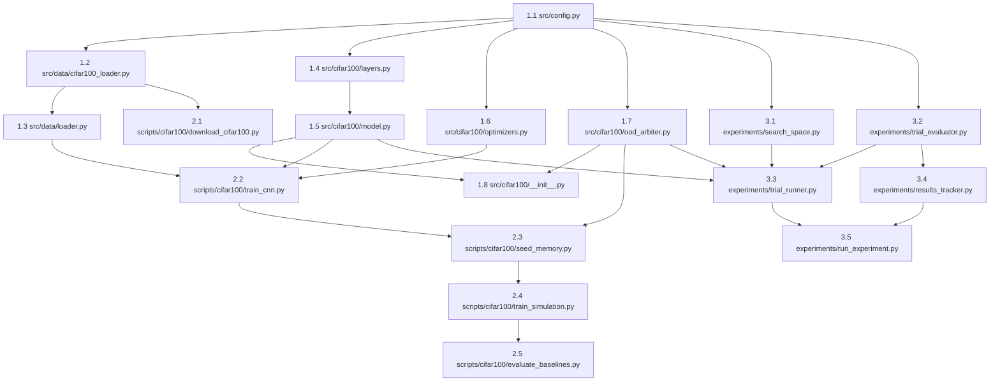

# 🎯 Master Execution Plan — CIFAR-100 Case Study
### *Especificação de Engenharia e Protocolo de Execução Otimizado para Agentes LLM*

---

## 0. Diretrizes Operacionais para Agentes LLM (Regras de Ouro)

> [!IMPORTANT]
> **REGRAS DE EXECUÇÃO OBRIGATÓRIAS PARA O AGENTE:**
> 1. **Execução Sequencial Estrita (DAG)**: Nunca avance para a etapa seguinte sem executar e passar com sucesso no **Comando de Validação Automatizada** do passo atual.
> 2. **Política Zero-Placeholder**: É terminantemente proibido gerar código com `pass`, `...`, `TODO: implement later`, stubs parciais ou funções mock. Todo o código gerado deve ser 100% completo, tipado e funcional.
> 3. **Garantia de Não-Regressão**: As pipelines existentes de `mnist` e `cifar10` **não podem ser quebradas**. Teste a retrocompatibilidade sempre que alterar arquivos compartilhados (ex.: [`src/config.py`](file:///c:/Users/sanfr/Desktop/projetos-gecad/projeto-cnn/src/config.py)).
> 4. **Tratamento de Exceções e Tipagem**: Use type hints do `typing` em todas as assinaturas públicas. Todas as operações com tensores/arrays devem validar dimensões via `assert` ou logging descritivo.
> 5. **Determinismo Numérico**: Todas as rotinas que utilizam aleatoriedade devem fixar sementes usando `RANDOM_SEED` de [`src/config.py`](file:///c:/Users/sanfr/Desktop/projetos-gecad/projeto-cnn/src/config.py) (`tf.random.set_seed`, `np.random.seed`, `torch.manual_seed`).

---

## 1. Contexto, Decisões de Design e Gotchas Críticos

### 1.1 Mapeamento Comparativo de Arquitetura

| Componente | CIFAR-10 (Referência) | CIFAR-100 (Novo) | Contrato / Modificação |
|---|---|---|---|
| **Dataset Loader** | [`src/data/cifar10_loader.py`](file:///c:/Users/sanfr/Desktop/projetos-gecad/projeto-cnn/src/data/cifar10_loader.py) | `src/data/cifar100_loader.py` | Lê `train` e `test` pickles via `b'fine_labels'` (100 classes) |
| **Backbone CNN** | [`src/cifar10/model.py`](file:///c:/Users/sanfr/Desktop/projetos-gecad/projeto-cnn/src/cifar10/model.py) (ResNet-9) | `src/cifar100/model.py` (ResNet-14) | 6 ResBlocks, `latent_dim` parametrizável no `__init__` (128, 256, 512) |
| **Camadas Base** | [`src/cifar10/layers.py`](file:///c:/Users/sanfr/Desktop/projetos-gecad/projeto-cnn/src/cifar10/layers.py) | `src/cifar100/layers.py` | Primitivas TensorFlow modulares (`tf.Module`) com projeção de atalho 1×1 |
| **Otimizador** | [`src/cifar10/optimizers.py`](file:///c:/Users/sanfr/Desktop/projetos-gecad/projeto-cnn/src/cifar10/optimizers.py) | `src/cifar100/optimizers.py` | AdamW from-scratch com weight decay desacoplado |
| **OOD Arbiter** | [`src/cifar10/ood_arbiter.py`](file:///c:/Users/sanfr/Desktop/projetos-gecad/projeto-cnn/src/cifar10/ood_arbiter.py) | `src/cifar100/ood_arbiter.py` | 100 perfis Ledoit-Wolf, calibragem $N_c=500$, `max_entropy = ln(100) ≈ 4.605` |
| **Memória Episódica** | [`src/models/knn_bandit_agent.py`](file:///c:/Users/sanfr/Desktop/projetos-gecad/projeto-cnn/src/models/knn_bandit_agent.py) | *Reutilizado diretamente* | Passar `n_actions=100`, `latent_dim=LATENT_DIM` |
| **Agente RL** | [`src/models/rl_agent.py`](file:///c:/Users/sanfr/Desktop/projetos-gecad/projeto-cnn/src/models/rl_agent.py) | *Reutilizado diretamente* | `RL_STATE_DIM=5`, `RL_N_ACTIONS=4` (estratégias de evicção) |
| **Configuração** | [`src/config.py`](file:///c:/Users/sanfr/Desktop/projetos-gecad/projeto-cnn/src/config.py) | [`src/config.py`](file:///c:/Users/sanfr/Desktop/projetos-gecad/projeto-cnn/src/config.py) | Suporte a `DATASET="cifar100"` com fallbacks seguros |

### 1.2 Gotchas e Armadilhas Técnicas Antecipadas

> [!WARNING]
> - **Pickle Encoding do CIFAR-100**: Os arquivos do CIFAR-100 requerem `pickle.load(f, encoding='bytes')`. A chave das classes alvo é **obrigatoriamente** `b'fine_labels'` (0 a 99) e **não** `b'labels'` (que é do CIFAR-10) nem `b'coarse_labels'` (que são 20 superclasses).
> - **Amostras por Classe para Ledoit-Wolf**: O CIFAR-100 tem 500 imagens de treino por classe (vs. 5.000 no CIFAR-10). O cálculo de covariância de alta dimensão ($d=512$) com $N=500$ amostras exige encolhimento empírico (*shrinkage*) estritamente estável (Ledoit-Wolf) sem inversões singulares.
> - **Projeção de Dimensões em ResNet-14**: Ao transitar de 64 para 128 canais (Stage 2) e de 128 para 256 canais (Stage 3), a primeira camada residual de cada estágio precisa de `shortcut_conv` 1×1 e `shortcut_bn` para compatibilizar dimensões antes da soma residual.
> - **Tempo de Execução dos Trials de Hiperparâmetros**: Uma simulação completa de 50.000 passos em 20 trials causará timeout. O pipeline deve ter um modo **Screening Abreviado** (5 épocas de CNN e 2.000 passos de RL para exploração de hiperparâmetros) e um modo **Full Convergence** (50 épocas e 50.000 passos para a melhor solução).

---

## 2. Mapa Estrutural de Arquivos e DAG de Dependências

### 2.1 Árvore de Diretórios

```
projeto-cnn/
├── src/
│   ├── config.py                          # [MODIFICAR] Suporte a cifar100
│   ├── data/
│   │   ├── loader.py                      # [MODIFICAR] Roteamento para cifar100_loader
│   │   └── cifar100_loader.py             # [NOVO] Loader nativo pickle b'fine_labels'
│   └── cifar100/                          # [NOVO] Pacote isolado CIFAR-100
│       ├── __init__.py                    # [NOVO] Exports
│       ├── layers.py                      # [NOVO] Primitivas TF: Conv2D, BN, ResBlock, GAP, Dense
│       ├── model.py                       # [NOVO] RawModelCIFAR100 (ResNet-14, latent_dim flexível)
│       ├── optimizers.py                  # [NOVO] AdamW from-scratch
│       └── ood_arbiter.py                 # [NOVO] DualUncertaintyArbiter (100 classes)
│
├── scripts/
│   └── train_cnn.py                       # [MODIFICAR] Choices argparse: ["mnist", "cifar10", "cifar100"]
│
├── scripts/cifar100/                      # [NOVO] Scripts dedicados de execução
│   ├── __init__.py                        # [NOVO]
│   ├── download_cifar100.py               # [NOVO] Download e descompactação tar.gz
│   ├── train_cnn.py                       # [NOVO] Treino ResNet-14 (AdamW, Cutout, Cosine, LabelSmooth)
│   ├── seed_memory.py                     # [NOVO] Extração latente, fit arbiter e seed k-NN
│   ├── train_simulation.py                # [NOVO] Simulação online streaming com concept drift
│   └── evaluate_baselines.py              # [NOVO] Benchmark comparativo FIFO vs LFU vs Redundant vs RL
│
├── experiments/                           # [NOVO] Framework de Otimização e AutoML
│   ├── __init__.py                        # [NOVO]
│   ├── search_space.py                    # [NOVO] Amostragem de hiperparâmetros (Grid & Random)
│   ├── trial_evaluator.py                 # [NOVO] Cálculo das 5 métricas normalizadas
│   ├── trial_runner.py                    # [NOVO] Orquestrador do ciclo completo por trial
│   ├── results_tracker.py                 # [NOVO] Ranking de Pareto, persistência e exportação
│   └── run_experiment.py                  # [NOVO] CLI entry point para execução dos experimentos
│
└── outputs/cifar100/                      # [RUNTIME] Gerado durante a execução
    ├── checkpoints/
    ├── logs/
    └── experiments/
        ├── trial_XXX/                     # config.json, metrics.json, checkpoints
        └── best_solution/                 # best_config.json, best_metrics.json, checkpoints
```

### 2.2 Grafo de Dependências entre Arquivos (DAG)



---

## 3. Especificação Detalhada das Etapas de Implementação

---

### FASE 1: Infraestrutura Base e Módulos Centrais

#### Step 1.1 — Modificar [`src/config.py`](file:///c:/Users/sanfr/Desktop/projetos-gecad/projeto-cnn/src/config.py)
- **Objetivo**: Estender a configuração unificada para suportar `cifar100` sem quebrar `mnist` ou `cifar10`.
- **Alterações Específicas**:
  1. Definir `CIFAR100_DATA_DIR = os.path.join(PROJECT_ROOT, "data", "CIFAR100", "raw")`.
  2. Ajustar `DATA_DIR` para retornar `CIFAR100_DATA_DIR` se `DATASET == "cifar100"`.
  3. Adicionar entradas aos dicionários de metadados:
     ```python
     DATASET_INPUT_SHAPE["cifar100"] = (32, 32, 3)
     DATASET_NUM_CLASSES["cifar100"] = 100
     ```
  4. Garantir que `OUTPUT_DIR` resulte em `outputs/cifar100` quando `DATASET="cifar100"`.
- **Validação Automatizada**:
  ```powershell
  python -c "import os; os.environ['DATASET']='cifar100'; import importlib, src.config as cfg; importlib.reload(cfg); assert cfg.INPUT_SHAPE == (32, 32, 3); assert cfg.NUM_CLASSES == 100; assert 'cifar100' in cfg.OUTPUT_DIR.lower(); print('✓ Step 1.1 Validado')"
  ```

---

#### Step 1.2 — Criar `src/data/cifar100_loader.py`
- **Objetivo**: Implementar carregador de baixo nível para arquivos pickle do CIFAR-100 (`train`, `test`, `meta`).
- **Contrato de API**:
  ```python
  def load_cifar100_raw(data_dir: Optional[str] = None) -> Tuple[np.ndarray, np.ndarray, np.ndarray, np.ndarray]:
      """
      Returns:
          X_train: np.ndarray, shape (50000, 32, 32, 3), float32 normalizado em [0, 1]
          y_train: np.ndarray, shape (50000,), int32 em [0, 99]
          X_test:  np.ndarray, shape (10000, 32, 32, 3), float32 normalizado em [0, 1]
          y_test:  np.ndarray, shape (10000,), int32 em [0, 99]
      """
  ```
- **Instruções Críticas**:
  - Procurar arquivos `train` e `test` dentro de `data_dir` ou subpasta `cifar-100-python`.
  - Usar `pickle.load(f, encoding='bytes')`.
  - Extrair dados de `b'data'`, fazer reshape `(-1, 3, 32, 32)` e transpor para canal final `(-1, 32, 32, 3)`.
  - Extrair classes de `b'fine_labels'` (converter para `np.int32`).
- **Validação Automatizada**:
  ```powershell
  python -c "from src.data.cifar100_loader import load_cifar100_raw; print('✓ Step 1.2 Loader importável')"
  ```

---

#### Step 1.3 — Modificar [`src/data/loader.py`](file:///c:/Users/sanfr/Desktop/projetos-gecad/projeto-cnn/src/data/loader.py)
- **Objetivo**: Integrar o CIFAR-100 na função de roteamento unificada `load_dataset_raw(dataset_name)`.
- **Alterações**:
  - Importar `load_cifar100_raw` de `src.data.cifar100_loader`.
  - Se `dataset_name == "cifar100"`, invocar `load_cifar100_raw()`.
- **Validação Automatizada**:
  ```powershell
  python -c "from src.data.loader import load_dataset_raw; print('✓ Step 1.3 Loader central integrado')"
  ```

---

#### Step 1.4 — Criar `src/cifar100/layers.py`
- **Objetivo**: Fornecer as camadas neurais modulares em TensorFlow puro (`tf.Module`).
- **Componentes Necessários**:
  1. `Conv2DLayer(in_channels, out_channels, kernel_size, stride=1, padding='SAME', name=...)`
  2. `BatchNorm2DLayer(num_features, eps=1e-5, momentum=0.1, name=...)`
  3. `MaxPool2DLayer(pool_size=2, stride=2, padding='SAME', name=...)`
  4. `ResidualBlock(in_channels, out_channels, stride=1, name=...)` com projeção de atalho $1\times1$ (`shortcut_conv` + `shortcut_bn`) caso `in_channels != out_channels` ou `stride != 1`.
  5. `GlobalAvgPool2DLayer(name=...)` calculando a média espacial `axis=[1, 2]`.
  6. `DenseLayer(in_features, out_features, name=...)` com inicialização He/Glorot.
- **Validação Automatizada**:
  ```powershell
  python -c "import tensorflow as tf; from src.cifar100.layers import Conv2DLayer, BatchNorm2DLayer, ResidualBlock, GlobalAvgPool2DLayer, DenseLayer; x = tf.zeros((2, 32, 32, 64)); rb = ResidualBlock(64, 128); out = rb(x); assert out.shape == (2, 32, 32, 128); print('✓ Step 1.4 Layers validadas')"
  ```

---

#### Step 1.5 — Criar `src/cifar100/model.py`
- **Objetivo**: Implementar o backbone `RawModelCIFAR100` (ResNet-14) com `latent_dim` dinâmico.
- **Arquitetura Exata**:
  - **Prep**: `Conv2DLayer(3, 64)` + `BatchNorm2DLayer(64)` + ReLU.
  - **Stage 1**: 2× `ResidualBlock(64, 64)` + `MaxPool2DLayer(2)`. Shape: `(N, 16, 16, 64)`.
  - **Stage 2**: `ResidualBlock(64, 128)` + `ResidualBlock(128, 128)` + `MaxPool2DLayer(2)`. Shape: `(N, 8, 8, 128)`.
  - **Stage 3**: `ResidualBlock(128, 256)` + `ResidualBlock(256, 256)` + `MaxPool2DLayer(2)`. Shape: `(N, 4, 4, 256)`.
  - **GAP**: `GlobalAvgPool2DLayer()`. Shape: `(N, 256)`.
  - **Latent Bottleneck**: `DenseLayer(256, latent_dim)` + ReLU. Shape: `(N, latent_dim)`.
  - **Classifier**: `DenseLayer(latent_dim, 100)` + Softmax. Shape: `(N, 100)`.
- **Contrato de Assinatura**:
  ```python
  class RawModelCIFAR100(tf.Module):
      def __init__(self, latent_dim: int = 128, name: str = "resnet14_cifar100"): ...
      def __call__(self, x: tf.Tensor, training: bool = True) -> Dict[str, tf.Tensor]:
          # Retorna: {"latent_features": Tensor(N, latent_dim), "probabilities": Tensor(N, 100)}
  ```
- **Validação Automatizada**:
  ```powershell
  python -c "import tensorflow as tf; from src.cifar100.model import RawModelCIFAR100; m = RawModelCIFAR100(latent_dim=256); res = m(tf.zeros((4, 32, 32, 3))); assert res['latent_features'].shape == (4, 256); assert res['probabilities'].shape == (4, 100); print('✓ Step 1.5 ResNet-14 validada')"
  ```

---

#### Step 1.6 — Criar `src/cifar100/optimizers.py`
- **Objetivo**: Disponibilizar o otimizador AdamW com decaimento de peso desacoplado.
- **Contrato de API**:
  ```python
  class Adam:
      def __init__(self, learning_rate: float = 0.001, beta1: float = 0.9, beta2: float = 0.999, epsilon: float = 1e-8, weight_decay: float = 1e-4): ...
      def apply_gradients(self, grads_and_vars: List[Tuple[tf.Tensor, tf.Variable]]) -> None: ...
  ```
- **Validação Automatizada**:
  ```powershell
  python -c "from src.cifar100.optimizers import Adam; opt = Adam(learning_rate=0.001, weight_decay=1e-4); print('✓ Step 1.6 AdamW validado')"
  ```

---

#### Step 1.7 — Criar `src/cifar100/ood_arbiter.py`
- **Objetivo**: Implementar o árbitro OOD com dupla incerteza calibrado para 100 classes.
- **Formulações Matemáticas**:
  - **Incerteza Preditiva**: Entropia de Shannon $H(p) = - \sum_{i=1}^{100} p_i \ln(p_i + \epsilon)$, com $H_{max} = \ln(100) \approx 4.60517$.
  - **Incerteza Representacional**: Distância de Mahalanobis $d_M(z, c) = \sqrt{(z - \mu_c)^T \Sigma_c^{-1} (z - \mu_c)}$ usando `sklearn.covariance.LedoitWolf`.
  - **Critério OOD**: `is_ood = (d_M > threshold_mahalanobis) or (entropy > threshold_entropy)`.
- **Contrato de Assinatura**:
  ```python
  class DualUncertaintyArbiter:
      def __init__(self, n_classes: int = 100, latent_dim: int = 128): ...
      def fit(self, latent_features: np.ndarray, probabilities: np.ndarray, labels: np.ndarray, percentile: float = 95.0) -> None: ...
      def predict(self, latent_features: np.ndarray, probabilities: np.ndarray) -> Dict[str, np.ndarray]:
          # Retorna: {"is_ood": bool_arr, "mahalanobis_dist": float_arr, "entropy": float_arr, "predicted_class": int_arr}
      def save(self, filepath: str) -> None: ...
      def load(self, filepath: str) -> None: ...
  ```
- **Validação Automatizada**:
  ```powershell
  python -c "import numpy as np; from src.cifar100.ood_arbiter import DualUncertaintyArbiter; arb = DualUncertaintyArbiter(n_classes=100, latent_dim=128); feats = np.random.randn(200, 128).astype(np.float32); probs = np.ones((200, 100), dtype=np.float32)/100.0; y = np.tile(np.arange(100), 2); arb.fit(feats, probs, y); res = arb.predict(feats[:5], probs[:5]); assert 'is_ood' in res; print('✓ Step 1.7 Arbiter 100 classes validado')"
  ```

---

#### Step 1.8 — Criar `src/cifar100/__init__.py`
- **Objetivo**: Expor os artefatos principais do pacote `src.cifar100`.
- **Exportações Obrigatórias**: `RawModelCIFAR100`, `DualUncertaintyArbiter`, `Adam`.
- **Validação Automatizada**:
  ```powershell
  python -c "from src.cifar100 import RawModelCIFAR100, DualUncertaintyArbiter, Adam; print('✓ Step 1.8 Package init validado')"
  ```

---

### FASE 2: Scripts Dedicados de Treino, Semeação e Simulação

#### Step 2.1 — Criar `scripts/cifar100/download_cifar100.py`
- **Objetivo**: Download e extração do CIFAR-100 python version (`cifar-100-python.tar.gz`).
- **Instruções**:
  - Baixar de `https://www.cs.toronto.edu/~kriz/cifar-100-python.tar.gz`.
  - Salvar e extrair em `data/CIFAR100/raw/`.
  - Suportar flag `--force` para sobrescrever downloads corrompidos.
- **Validação Automatizada**:
  ```powershell
  python scripts/cifar100/download_cifar100.py --help
  ```

---

#### Step 2.2 — Criar `scripts/cifar100/train_cnn.py` e Atualizar [`scripts/train_cnn.py`](file:///c:/Users/sanfr/Desktop/projetos-gecad/projeto-cnn/scripts/train_cnn.py)
- **Objetivo**: Pipeline de treino da ResNet-14 com aumentação de dados moderna.
- **Técnicas Integradas**:
  - Cutout aleatório ($8\times8$).
  - Random Horizontal Flip e Random Crop com padding de 4 pixels.
  - Cosine Annealing Learning Rate Schedule com Warmup (3 épocas).
  - Label Smoothing Loss ($\alpha = 0.1$).
  - Suporte a argumentos CLI: `--epochs` (default: 50), `--batch-size` (default: 128), `--lr` (default: 1e-3), `--latent-dim` (default: 128), `--checkpoint-dir`.
  - Salvar checkpoint compatível com `tf.train.Checkpoint`.
- **Validação Automatizada**:
  ```powershell
  python scripts/cifar100/train_cnn.py --help
  ```

---

#### Step 2.3 — Criar `scripts/cifar100/seed_memory.py`
- **Objetivo**: Extrair representações latentes do conjunto de treino com o backbone treinado, calibrar o `DualUncertaintyArbiter` e semear o banco episódico `KNNBanditAgent128D`.
- **Requisitos Operacionais**:
  - Inicializar `KNNBanditAgent128D` com `latent_dim=LATENT_DIM`, `n_actions=100`, `capacity=MEMORY_CAPACITY`.
  - Ajustar o arbiter com as representações latentes e probabilidades do treino.
  - Salvar `arbiter_profiles.npz` e `knn_memory_bank.npz` em `outputs/cifar100/`.
- **Validação Automatizada**:
  ```powershell
  python scripts/cifar100/seed_memory.py --help
  ```

---

#### Step 2.4 — Criar `scripts/cifar100/train_simulation.py`
- **Objetivo**: Simulação RL online contínua sob concept drift não-estacionário e injeção de ruído Gaussiano ($\sigma=0.6$).
- **Mecânica da Simulação**:
  - DRL Agent (`RLAgent` Double DQN + PER) aprende a política ótima entre 4 ações:
    - **Ação 0**: Filtrar amostra OOD / ruído destrutivo.
    - **Ação 1**: Evicção FIFO (deriva temporal).
    - **Ação 2**: Evicção LFU (padrões infrequentes).
    - **Ação 3**: Evicção por redundância geométrica mínima (preservação de diversidade intraclasse).
  - Logar métricas a cada `SIMULATION_LOG_INTERVAL` passos em CSV (`outputs/cifar100/train_rl_simulation_log.csv`).
  - Salvar checkpoint `rl_agent_phase3.pt`.
- **Validação Automatizada**:
  ```powershell
  python scripts/cifar100/train_simulation.py --help
  ```

---

#### Step 2.5 — Criar `scripts/cifar100/evaluate_baselines.py`
- **Objetivo**: Avaliação comparativa entre baselines de evicção estáticos (FIFO, LFU, Redundant pura) vs. o agente RL treinado.
- **Métricas Computadas**: Acurácia final, Acurácia sob ruído, Divergência $D_{KL}$ da distribuição do buffer e Tempo médio de decisão.
- **Validação Automatizada**:
  ```powershell
  python scripts/cifar100/evaluate_baselines.py --help
  ```

---

### FASE 3: Framework de Experimentação e Busca de Hiperparâmetros

#### Step 3.1 — Criar `experiments/search_space.py`
- **Objetivo**: Definir o domínio de hiperparâmetros com suporte a amostragem determinística e aleatória.
- **Configuração do Espaço**:
  ```python
  SEARCH_SPACE = {
      "latent_dim": [128, 256, 512],
      "mahalanobis_threshold": [10.0, 15.0, 20.0, 25.0],
      "entropy_threshold": [1.5, 2.0, 3.0, 4.0],
      "curriculum_alpha_decay": [0.990, 0.995, 0.999],
      "memory_capacity": [3000, 5000, 8000],
      "rl_lr": [1e-4, 5e-4, 1e-3],
      "rl_gamma": [0.95, 0.99],
      "knn_k": [10, 20, 30],
      "min_alpha": [0.01, 0.05, 0.10],
  }
  ```
- **Contrato de API**:
  ```python
  class SearchSpace:
      def __init__(self, seed: int = 42): ...
      def sample_random(self) -> Dict[str, Any]: ...
      def get_grid(self) -> List[Dict[str, Any]]: ...
  ```
- **Validação Automatizada**:
  ```powershell
  python -c "from experiments.search_space import SearchSpace; sp = SearchSpace(seed=42); sample = sp.sample_random(); assert 'latent_dim' in sample; assert sample['latent_dim'] in [128, 256, 512]; print('✓ Step 3.1 SearchSpace validado')"
  ```

---

#### Step 3.2 — Criar `experiments/trial_evaluator.py`
- **Objetivo**: Módulo de avaliação multi-métrica de cada trial.
- **Especificação das 5 Métricas Obrigatórias**:
  1. `clean_accuracy`: Top-1 accuracy no conjunto de teste limpo (0.0 a 1.0) — **Maior é melhor** ($w=0.30$).
  2. `noisy_accuracy`: Top-1 accuracy com ruído Gaussiano $\sigma=0.6$ (0.0 a 1.0) — **Maior é melhor** ($w=0.25$).
  3. `d_kl_eviction`: Divergência de Kullback-Leibler entre a distribuição de classes no buffer e a distribuição uniforme ideal ($\frac{1}{100}$):
     $$D_{KL}(P \parallel U) = \sum_{c=0}^{99} P(c) \ln\left(\frac{P(c) + 10^{-12}}{0.01}\right)$$
     — **Menor é melhor** ($w=0.20$).
  4. `inference_latency_ms`: Latência média (em milissegundos) para inferência completa (Forward CNN + k-NN query + Decisão RL) — **Menor é melhor** ($w=0.15$).
  5. `ram_footprint_mb`: Memória total pré-alocada pelo buffer de memória + perfis do árbitro (em MB):
     $$\text{RAM} = \frac{\text{capacity} \times (\text{latent\_dim} \times 4 + 4 + 4 + 8) + 100 \times (\text{latent\_dim} \times 4 + \text{latent\_dim}^2 \times 4)}{1024^2}$$
     — **Menor é melhor** ($w=0.10$).
- **Contrato de API**:
  ```python
  class TrialEvaluator:
      @staticmethod
      def evaluate(model, arbiter, memory_bank, rl_agent, test_data: Tuple[np.ndarray, np.ndarray]) -> Dict[str, float]: ...
  ```
- **Validação Automatizada**:
  ```powershell
  python -c "from experiments.trial_evaluator import TrialEvaluator; print('✓ Step 3.2 TrialEvaluator importável')"
  ```

---

#### Step 3.3 — Criar `experiments/trial_runner.py`
- **Objetivo**: Executar isoladamente um trial com uma dada configuração de hiperparâmetros.
- **Modos de Execução**:
  - `fast_screening=True`: 5 épocas de CNN, fit do árbitro, semeadura, simulação de 2.000 passos (ideal para explorar múltiplos candidatos rapidamente).
  - `fast_screening=False`: 50 épocas de CNN, simulação de 50.000 passos (para avaliação final do melhor candidato).
- **Contrato de API**:
  ```python
  class TrialRunner:
      def __init__(self, trial_id: str, config: Dict[str, Any], output_base_dir: str): ...
      def run(self, fast_screening: bool = True) -> Dict[str, Any]:
          # Retorna: {"trial_id": ..., "config": config, "metrics": {...}, "artifacts_path": ...}
  ```
- **Validação Automatizada**:
  ```powershell
  python -c "from experiments.trial_runner import TrialRunner; print('✓ Step 3.3 TrialRunner importável')"
  ```

---

#### Step 3.4 — Criar `experiments/results_tracker.py`
- **Objetivo**: Persistir resultados parciais, normalizar métricas e calcular o Score Composto de Pareto.
- **Algoritmo de Normalização e Score**:
  Para $N$ trials registrados:
  - Normalizar cada métrica $m$ para o intervalo $[0, 1]$ via Min-Max Scaling.
  - Para métricas onde *menor é melhor* ($D_{KL}$, Latência, RAM), inverter: $s_m = 1.0 - \text{norm}(m)$.
  - Para métricas onde *maior é melhor* (Acurácias): $s_m = \text{norm}(m)$.
  - Caso haja apenas 1 trial, atribuir score base $1.0$.
  - Calcular:
    $$\text{Score} = 0.30 \cdot s_{\text{clean}} + 0.25 \cdot s_{\text{noisy}} + 0.20 \cdot s_{D_{KL}} + 0.15 \cdot s_{\text{latency}} + 0.10 \cdot s_{\text{ram}}$$
- **Exportação de Artefatos**:
  - `extract_best()`: Copia todos os checkpoints e gera `best_config.json` e `best_metrics.json` no diretório de destino.
- **Validação Automatizada**:
  ```powershell
  python -c "from experiments.results_tracker import ResultsTracker; tracker = ResultsTracker(output_dir='outputs/cifar100/experiments'); tracker.add_trial('t1', {'latent_dim': 128}, {'clean_accuracy': 0.7, 'noisy_accuracy': 0.5, 'd_kl_eviction': 0.2, 'inference_latency_ms': 5.0, 'ram_footprint_mb': 12.0}); print('Score:', tracker.trials[0]['score']); print('✓ Step 3.4 ResultsTracker validado')"
  ```

---

#### Step 3.5 — Criar `experiments/run_experiment.py` e `experiments/__init__.py`
- **Objetivo**: Ponto de entrada CLI principal do framework de experimentação.
- **Interface CLI**:
  ```bash
  python -m experiments.run_experiment --dataset cifar100 --mode random --n-trials 10 --fast-screening
  ```
- **Fluxo de Execução**:
  1. Carregar `SearchSpace` e gerar a lista de configurações.
  2. Para cada trial: instanciar `TrialRunner`, executar, colher métricas e registrar no `ResultsTracker`.
  3. Ao final, invocar `ResultsTracker.extract_best()` para popular `outputs/cifar100/experiments/best_solution/`.
- **Validação Automatizada**:
  ```powershell
  python -m experiments.run_experiment --help
  ```

---

### FASE 4: Extração e Validação do Contrato de Saída

#### Step 4.1 — Validação dos Esquemas de JSON
- **Objetivo**: Garantir que os arquivos exportados na pasta `outputs/cifar100/experiments/best_solution/` respeitem rigorosamente o schema especificado.
- **Esquema de `best_config.json`**:
  ```json
  {
    "dataset": "cifar100",
    "trial_id": "trial_003",
    "latent_dim": 256,
    "mahalanobis_threshold": 15.0,
    "entropy_threshold": 2.0,
    "curriculum_alpha_decay": 0.995,
    "memory_capacity": 5000,
    "rl_lr": 0.0005,
    "rl_gamma": 0.99,
    "knn_k": 20,
    "min_alpha": 0.05
  }
  ```
- **Esquema de `best_metrics.json`**:
  ```json
  {
    "trial_id": "trial_003",
    "composite_score": 0.8425,
    "metrics": {
      "clean_accuracy": 0.7412,
      "noisy_accuracy": 0.6280,
      "d_kl_eviction": 0.1543,
      "inference_latency_ms": 4.82,
      "ram_footprint_mb": 18.45
    },
    "timestamp": "2026-10-06T15:30:00Z",
    "seed": 42
  }
  ```

---

## 4. Tabela de Rastreabilidade e Critérios de Aceitação

| Step | Arquivo Alvo | Operação | Critério de Aceitação / Teste Unitário |
|:---:|---|:---:|---|
| **1.1** | [`src/config.py`](file:///c:/Users/sanfr/Desktop/projetos-gecad/projeto-cnn/src/config.py) | Modificar | `DATASET="cifar100"` define input `(32,32,3)` e `100` classes sem afetar `mnist` |
| **1.2** | `src/data/cifar100_loader.py` | Criar | Lê `train` e `test` com labels `b'fine_labels'` e shapes `(N, 32, 32, 3)` |
| **1.3** | [`src/data/loader.py`](file:///c:/Users/sanfr/Desktop/projetos-gecad/projeto-cnn/src/data/loader.py) | Modificar | `load_dataset_raw("cifar100")` direciona para `load_cifar100_raw` |
| **1.4** | `src/cifar100/layers.py` | Criar | Blocos residuais aceitam canais desiguais com projeção 1×1 |
| **1.5** | `src/cifar100/model.py` | Criar | `RawModelCIFAR100(latent_dim=X)` compila e gera saídas nas dimensões corretas |
| **1.6** | `src/cifar100/optimizers.py` | Criar | Instancia `Adam(lr, weight_decay)` sem erros |
| **1.7** | `src/cifar100/ood_arbiter.py` | Criar | Calibra Ledoit-Wolf para 100 classes e computa métricas com estabilidade |
| **1.8** | `src/cifar100/__init__.py` | Criar | Exporta `RawModelCIFAR100`, `DualUncertaintyArbiter`, `Adam` |
| **2.1** | `scripts/cifar100/download_cifar100.py` | Criar | Executa com `--help` e baixa arquivo tar.gz do CIFAR-100 |
| **2.2** | `scripts/cifar100/train_cnn.py` | Criar | CLI responde com flags `--epochs`, `--latent-dim` e salva checkpoints |
| **2.3** | `scripts/cifar100/seed_memory.py` | Criar | Extrai latentes de treino, ajusta o árbitro e salva arquivos `.npz` |
| **2.4** | `scripts/cifar100/train_simulation.py` | Criar | Executa loop RL streaming com as 4 ações de evicção |
| **2.5** | `scripts/cifar100/evaluate_baselines.py` | Criar | Gera tabela comparativa de acurácias e divergência $D_{KL}$ |
| **3.1** | `experiments/search_space.py` | Criar | Fornece amostras válidas respeitando os domínios discretos |
| **3.2** | `experiments/trial_evaluator.py` | Criar | Computa e valida as 5 métricas numéricas |
| **3.3** | `experiments/trial_runner.py` | Criar | Instancia pipelines completos em modo `fast_screening` |
| **3.4** | `experiments/results_tracker.py` | Criar | Ordena trials por score ponderado e extrai a melhor solução |
| **3.5** | `experiments/run_experiment.py` | Criar | Entrypoint CLI orquestra N trials e gera saída estruturada |

---

## 5. Script Global de Sanidade (Smoke Test End-to-End)

Após a conclusão de todas as etapas, o agente deve rodar o seguinte script para certificar 100% de conformidade com a especificação:

```powershell
python -c "
import os, sys
os.environ['DATASET'] = 'cifar100'

# 1. Validar Configuração
import src.config as cfg
assert cfg.NUM_CLASSES == 100, 'Config falhou: NUM_CLASSES != 100'

# 2. Validar Backbone CNN
import tensorflow as tf
from src.cifar100.model import RawModelCIFAR100
model = RawModelCIFAR100(latent_dim=256)
x = tf.random.normal([2, 32, 32, 3])
out = model(x, training=False)
assert out['latent_features'].shape == (2, 256), 'Shape latente incorreto'
assert out['probabilities'].shape == (2, 100), 'Shape proba incorreto'

# 3. Validar OOD Arbiter
import numpy as np
from src.cifar100.ood_arbiter import DualUncertaintyArbiter
arbiter = DualUncertaintyArbiter(n_classes=100, latent_dim=256)
assert arbiter.n_classes == 100, 'Arbiter falhou: n_classes != 100'

# 4. Validar Framework de Experimentação
from experiments.search_space import SearchSpace
from experiments.results_tracker import ResultsTracker
ss = SearchSpace(seed=42)
cfg_sample = ss.sample_random()
tracker = ResultsTracker()
tracker.add_trial('smoke_test', cfg_sample, {
    'clean_accuracy': 0.75,
    'noisy_accuracy': 0.60,
    'd_kl_eviction': 0.10,
    'inference_latency_ms': 4.5,
    'ram_footprint_mb': 15.0
})
best = tracker.get_best_trial()
assert best['trial_id'] == 'smoke_test', 'Tracker falhou'

print('=' * 60)
print('✓ TODOS OS TESTES DE SANIDADE PASSARAM COM SUCESSO!')
print('=' * 60)
"
```

---

## 6. Prompt de Ativação para o Agente LLM

> Caso deseje disparar a implementação através de um agente LLM autônomo, utilize o seguinte prompt de ativação:

```text
Atue como Engenheiro de Software Sênior e Especialista em Edge AI.
Siga rigorosamente o "Master Execution Plan — CIFAR-100 Case Study".

Suas diretrizes:
1. Execute as tarefas estritamente na ordem das Fases (1.1 a 3.5).
2. Não use nenhum placeholder, stub ou 'TODO' — gere código completo e funcional.
3. Após criar ou editar cada arquivo, execute o respectivo "Comando de Validação Automatizada" no shell.
4. Garanta retrocompatibilidade total com MNIST e CIFAR-10.
5. Ao concluir, execute o "Script Global de Sanidade (Smoke Test End-to-End)" e reporte os resultados.
Inicie agora pelo Step 1.1.
```
