# Implementation Plan: CIFAR-100 Technical Documentation Integration
### Active Episodic Memory Management via Reinforcement Learning for Robust CNN Inference on Out-of-Distribution Data

> [!NOTE]
> **Plan for LLM Agent execution in Antigravity IDE.**
> This plan must be executed strictly phase by phase. The agent MUST NOT implement all phases simultaneously. It must wait for the user to request "Phase X" and deliver all files and modifications for that specific phase only.
> After completing each phase, the agent MUST update the status markers in Section 7 of this plan from `[PENDING]` to `[COMPLETED]` with a concise empirical resolution note.
> 
> **Core Operating Constraints:**
> 1. **Zero-Placeholder Policy:** No `pass`, `...`, `TODO`, mock stubs, or incomplete sections are permitted. All documentation, mathematical formulations, tables, code listings, and API specifications must be 100% complete, typed, and verifiable.
> 2. **Tone and Style:** Academic English adhering strictly to Elsevier *Engineering Applications of Artificial Intelligence* (EAAI) journal standards. Zero decorative emojis. Zero colloquial vocabulary.
> 3. **Mathematical and Empirical Precision:** All reported metrics must strictly reflect the official benchmark data recorded in `outputs/cifar100/eaai_metrics.json` and the promoted ResNet-18 V2 model metadata (`outputs/cifar100/checkpoints/model_meta.json`).
> 4. **Backward Compatibility:** All existing documentation for MNIST and CIFAR-10 must remain intact without regression.

---

## 1. Context, Objective, and Empirical Contract

### 1.1. Context
The repository implements a semiparametric active vision architecture pairing a parametric Convolutional Neural Network (CNN) with a non-parametric $k$-NN episodic memory buffer actively curated by a Double Deep Q-Network (Double DQN) with Prioritized Experience Replay (PER). 

While the MNIST and CIFAR-10 regimes have been fully documented, the **CIFAR-100 fine-grained 100-class regime** has completed full implementation, hyperparameter optimization, and empirical evaluation:
- The winning CNN backbone—**ResNet-18 V2 (150 epochs, 74.27% Top-1 test accuracy)**—has been promoted as the official repository standard.
- The 100-class Dual Uncertainty Arbiter has been calibrated ($\tau_M = 8.69$, $\tau_H = 2.09\text{ nats}$).
- The 5-baseline prequential streaming benchmark has been executed across 5,000 test queries under progressive Gaussian noise ($\sigma \in \{0.0, 0.2, 0.4, 0.6, 0.8\}$), establishing that the active RL policy (**B4**) achieves the highest overall stream accuracy ($15.68\%$), shields against noise contamination ($3.40\%$ vs. $1.50\%$ for FIFO at $\sigma=0.2$), and completely eliminates class starvation ($D_{KL} = 2.25 \times 10^{-8}\text{ nats} \approx 0.0000\text{ nats}$ vs. $2.6551\text{ nats}$ for FIFO).

### 1.2. Objective
Document all components, architectures, mathematical derivations, reproduction workflows, API interfaces, and literature confrontations for the CIFAR-100 case study, integrating them seamlessly into the existing technical documentation hierarchy under `docs/` and the root `README.md`.

### 1.3. The Invariant Architectural Contract
All documentation must emphasize the invariant architectural contract:
- **Latent Bottleneck:** $\Phi(x) \in \mathbb{R}^{128}$ across all three backbones (MNIST 4-layer CNN, CIFAR-10 ResNet-9, and CIFAR-100 ResNet-18 V2).
- **Episodic Memory Capacity:** $C = 5,000$ slots in contiguous pre-allocated NumPy memory arrays.
- **RL Decision Space:** 5D continuous state $s_t = [\tilde{d}_M, \tilde{H}, \tilde{d}_{\min}, e_{\text{CNN}}, \rho_{\text{RAM}}]$ and 4 discrete eviction actions ($a \in \{0, 1, 2, 3\}$).
- **Hardware Envelopes:** Strict $O(1)$ memory ceiling ($< 10\text{ MB}$ RAM) and real-time execution latency ($< 11\text{ ms/query}$, $> 90\text{ FPS}$).

---

## 2. Documentation Architecture: Current vs. Target Structure

```text
projeto-cnn/
├── README.md                                      # [MODIFY] Add CIFAR-100 to abstract, support matrix, results, and flowchart
├── docs/
│   ├── README.md                                  # [MODIFY] Add CIFAR-100 to documentation index and reading tracks
│   │
│   ├── api/
│   │   ├── README.md                              # [MODIFY] Add cifar100.md to module inventory and complexity table
│   │   ├── cifar10.md                             # [PRESERVE]
│   │   ├── cifar100.md                            # [CREATE] Complete API reference for src/cifar100/ and src/data/
│   │   ├── config.md                              # [PRESERVE]
│   │   ├── custom-cnn.md                          # [PRESERVE]
│   │   ├── knn-bandit-agent.md                    # [PRESERVE]
│   │   ├── reward-manager.md                      # [PRESERVE]
│   │   ├── rl-agent.md                            # [PRESERVE]
│   │   └── train-rl-online-simulation.md          # [PRESERVE]
│   │
│   ├── architecture/
│   │   ├── README.md                              # [MODIFY] Add CIFAR-100 backbone, 100-class arbiter, and Mermaid branch
│   │   ├── cnn-feature-extractor.md               # [MODIFY] Add Section 4 for ResNet-18 V2 (11.25M params) and usage snippet
│   │   ├── ood-detection.md                       # [MODIFY] Add Regime 3: 100-class Dual Uncertainty Arbiter (tau_M=8.69, tau_H=2.09)
│   │   ├── episodic-memory.md                     # [MODIFY] Document 100-class action space (0..99), 50 slots/class, and k=10
│   │   ├── rl-agent.md                            # [MODIFY] Document state dimension 1 entropy normalization by ln(100)
│   │   ├── reward-system.md                       # [PRESERVE]
│   │   └── data-flow.md                           # [PRESERVE]
│   │
│   ├── getting-started/
│   │   ├── README.md                              # [MODIFY] Update high-level 5-stage workflow diagram for tri-dataset
│   │   ├── quickstart.md                          # [MODIFY] Add Section 3.3 (CIFAR-100 setup), Section 5.3 (reproduction pipeline), Section 6 outputs
│   │   └── configuration.md                       # [MODIFY] Add CIFAR-100 column in Path Resolution Matrix and Master Config Table
│   │
│   ├── guides/
│   │   ├── README.md                              # [MODIFY] Update workflow flowchart and execution runtime considerations table
│   │   ├── evaluation.md                          # [MODIFY] Update Mermaid arbiter, add Section 5.3 CIFAR-100 table, update conclusions
│   │   ├── training-pipeline.md                   # [ALREADY SYNCED]
│   │   └── visualization.md                       # [PRESERVE]
│   │
│   ├── results/
│   │   ├── README.md                              # [ALREADY SYNCED]
│   │   ├── baseline-comparison.md                 # [PRESERVE]
│   │   ├── baseline-comparison-cifar10.md         # [PRESERVE]
│   │   ├── baseline-comparison-cifar100.md        # [ALREADY SYNCED]
│   │   ├── cross-dataset-analysis.md              # [ALREADY SYNCED]
│   │   ├── literature-validation.md               # [MODIFY] Incorporate CIFAR-100 fine-grained entropy and class extinction confrontation
│   │   └── metrics-reference.md                   # [PRESERVE]
│   │
│   └── Literatura/                                # [PRESERVED - UNTOUCHED ARCHIVAL RESEARCH]
```

---

## 3. Inter-Phase Dependency Map (DAG)

```mermaid
graph TD
    P1["Phase 1: API Reference Layer<br>(docs/api/cifar100.md & docs/api/README.md)"]
    P2["Phase 2: Architectural Deep-Dives<br>(docs/architecture/*.md)"]
    P3["Phase 3: Getting Started & Execution Guides<br>(docs/getting-started/*.md & docs/guides/*.md)"]
    P4["Phase 4: Scientific Literature Validation<br>(docs/results/literature-validation.md)"]
    P5["Phase 5: Central Indices & Root Documentation<br>(docs/README.md & root README.md)"]

    P1 --> P2
    P2 --> P3
    P3 --> P4
    P4 --> P5

    style P1 fill:#1f242c,stroke:#388bfd,stroke-width:1px
    style P2 fill:#1f242c,stroke:#58a6ff,stroke-width:1px
    style P3 fill:#1f242c,stroke:#d29922,stroke-width:1px
    style P4 fill:#1f242c,stroke:#a371f7,stroke-width:1px
    style P5 fill:#1f242c,stroke:#2ea043,stroke-width:2px
```



---

## 4. Phase Specifications

### Phase 1: API Reference Layer
**Goal:** Create the formal API reference documentation for the CIFAR-100 codebase and update the API index.

#### Target Files:
1. `docs/api/cifar100.md` (New File)
2. `docs/api/README.md` (Update)

#### Detailed Requirements:
- **In `docs/api/cifar100.md`:**
  - Standard document header linking to `docs/api/README.md` and repository root.
  - Complete documentation of `RawModelCIFAR100V2` (`src/cifar100/model.py`):
    - Constructor: `__init__(latent_dim=128, num_classes=100)`.
    - Architecture: 4 residual stages (`64 -> 128 -> 256 -> 512`), learned strided downsampling, Global Average Pooling to 512D, and dedicated `BatchNorm` 128D latent bottleneck.
    - Parameter count: 11,250,532 parameters.
    - Forward pass contract: `__call__(x: tf.Tensor, training: bool = True) -> Dict[str, tf.Tensor]` returning `latent_features` ($B \times 128$), `logits` ($B \times 100$), and `probabilities` ($B \times 100$).
  - Complete documentation of `RawModelCIFAR100` (`src/cifar100/model.py`, V1 legacy 2.80M params).
  - Complete documentation of `load_cifar100_backbone(checkpoint_dir: str, latent_dim: int = 128) -> Tuple[tf.Module, bool]`:
    - Inspection of `model_meta.json` (`model_version == "v2"`, `standardize == True`).
    - Automatic instantiation and variable restoration via `tf.train.Checkpoint`.
  - Canonical constants: `CIFAR100_MEAN` and `CIFAR100_STD` (`tf.constant`, float32).
  - Layer building blocks (`src/cifar100/layers.py`): `ResidualBlockV2`, `ConvBNReLU`.
  - Custom optimizers (`src/cifar100/optimizers.py`): `SGDMomentum` (with Nesterov momentum and decoupled weight decay), `Adam` (with decoupled weight decay).
  - Data loading utilities (`src/data/cifar100_loader.py`): `load_cifar100_dataset`, `extract_cifar100_features`, handling binary pickle files with `b'fine_labels'`.
  - Copy-pasteable Python snippet demonstrating backbone restoration and forward pass.
  - Standard navigation footer.
- **In `docs/api/README.md`:**
  - Add `cifar100.md` to the Module Inventory table.
  - Add CIFAR-100 Latent Feature Extraction (`RawModelCIFAR100V2`) to Computational Complexity Guarantees table ($\mathcal{O}(B \cdot \sum_l H_l W_l C_l^2)$).
  - Update Navigation Progression to include `cifar100.md`.

#### Automated Validation Command:
```bash
python -c "
import os, sys
p = 'docs/api/cifar100.md'
assert os.path.exists(p), f'Missing {p}'
with open(p, 'r', encoding='utf-8') as f:
    c = f.read()
assert 'RawModelCIFAR100V2' in c and 'load_cifar100_backbone' in c and '11,250,532' in c
print('Phase 1 validation passed successfully.')
"
```

---

### Phase 2: Architectural Deep-Dives
**Goal:** Expand architectural documentation across feature extraction, uncertainty routing, episodic memory, and RL decision making to incorporate the 100-class fine-grained regime.

#### Target Files:
1. `docs/architecture/README.md` (Update)
2. `docs/architecture/cnn-feature-extractor.md` (Update)
3. `docs/architecture/ood-detection.md` (Update)
4. `docs/architecture/episodic-memory.md` (Update)
5. `docs/architecture/rl-agent.md` (Update)

#### Detailed Requirements:
- **In `docs/architecture/README.md`:**
  - Section 1 (Abstract): Add CIFAR-100 ResNet-18 V2 backbone (`src/cifar100/model.py`, 11.25M params, 74.27% accuracy, 100 classes) to the parametric cortical backbones list.
  - Section 2 (Mermaid Architecture Diagram): Add CIFAR-100 input node `[32x32x3] Natural RGB (100 Classes)` and ResNet-18 V2 feature extractor node.
  - Section 3 (Component Inventory): Add CIFAR-100 Feature Extractor, Layers/Optimizers, and 100-Class Dual Uncertainty Arbiter.
  - Section 4.1: Clarify that the invariant 128D contract enables identical memory buffering across 10-class and 100-class categorization.
- **In `docs/architecture/cnn-feature-extractor.md`:**
  - Section 1: Update overview to describe three vision backbones (MNIST, CIFAR-10, CIFAR-100).
  - Add Section 4: "CIFAR-100 Feature Extractor: ResNet-18 V2 Backbone":
    - Rationale: High entropy ($H_{\max} = \ln(100) \approx 4.605\text{ nats}$) and fine-grained visual proximity require 4 residual stages and learned strided downsampling to prevent spatial collapse.
    - Exhaustive Layer-by-Layer table: Prep stage ($32\times32\times64$), Stage 1 ($32\times32\times64$), Stage 2 ($16\times16\times128$), Stage 3 ($8\times8\times256$), Stage 4 ($4\times4\times512$), Global Average Pooling (512D), Latent Projection + BatchNorm + ReLU (128D), and Classifier Head (100D). Total: 11,250,532 parameters.
  - Section 6: Update code usage snippet to include CIFAR-100 forward pass with `load_cifar100_backbone`.
- **In `docs/architecture/ood-detection.md`:**
  - Section 1 & Section 2: Add Regime 3: 100-Class Dual Uncertainty Arbiter.
    - Mathematical formulation: $d_M(z) = \min_{c \in \{0, \dots, 99\}} \sqrt{(z - \mu_c)^T \Sigma_c^{-1} (z - \mu_c)}$ and $H(p) = -\sum_{c=0}^{99} p_c \ln(p_c + \epsilon)$.
  - Section 3: Add CIFAR-100 column to Threshold Calibration Protocols table:
    - Calibrated thresholds: $\tau_M = 8.69$, $\tau_H = 2.09\text{ nats}$.
    - Calibration source: `scripts/cifar100/seed_memory.py`.
    - Profile storage: `outputs/cifar100/arbiter_profiles.npz`.
  - Section 4: Add CIFAR-100 routing branch to Mermaid flowchart.
- **In `docs/architecture/episodic-memory.md` & `docs/architecture/rl-agent.md`:**
  - `episodic-memory.md`: In Section 2 table, clarify that `_actions` stores classification labels in $\{0, \dots, 9\}$ for MNIST/CIFAR-10 and $\{0, \dots, 99\}$ for CIFAR-100. Specify that $k=10$ is deployed for CIFAR-10 and CIFAR-100.
  - `rl-agent.md`: In Section 3 table (Dimension 1, Local Entropy), document that local entropy normalization scales by $\ln(10) \approx 2.3026$ on 10-class benchmarks and $\ln(100) \approx 4.6052$ on CIFAR-100.

#### Automated Validation Command:
```bash
python -c "
import os
for path in ['docs/architecture/README.md', 'docs/architecture/cnn-feature-extractor.md', 'docs/architecture/ood-detection.md', 'docs/architecture/episodic-memory.md', 'docs/architecture/rl-agent.md']:
    assert os.path.exists(path), f'Missing {path}'
with open('docs/architecture/cnn-feature-extractor.md', 'r', encoding='utf-8') as f:
    text = f.read()
assert 'RawModelCIFAR100V2' in text and '11,250,532' in text
print('Phase 2 validation passed successfully.')
"
```

---

### Phase 3: Getting Started & Execution Guides
**Goal:** Update onboarding, configuration, quickstart reproduction, and execution guides to include end-to-end CIFAR-100 replication.

#### Target Files:
1. `docs/getting-started/README.md` (Update)
2. `docs/getting-started/quickstart.md` (Update)
3. `docs/getting-started/configuration.md` (Update)
4. `docs/guides/README.md` (Update)
5. `docs/guides/evaluation.md` (Update)

#### Detailed Requirements:
- **In `docs/getting-started/README.md`:**
  - Update workflow overview to reflect the unified 3-dataset architecture.
- **In `docs/getting-started/quickstart.md`:**
  - Section 1: Update disk space requirements to 5.0 GB to accommodate CIFAR-100 datasets, checkpoints, and archives.
  - Add Section 3.3: "CIFAR-100 Dataset Setup" with automated download command `python scripts/cifar100/download_cifar100.py`.
  - Section 4: Add CIFAR-100 verification snippet checking `data/cifar-100-python/` or `data/CIFAR100/raw/`.
  - Add Section 5.3: "CIFAR-100 Reproduction Pipeline (5 Steps)":
    - Mermaid sequence diagram detailing User $\to$ `scripts/cifar100/train_cnn.py` $\to$ `seed_memory.py` $\to$ `train_simulation.py` $\to$ `evaluate_baselines.py`.
    - 5 reproducible terminal commands with explicit flags (`--model-version v2 --epochs 150`, etc.).
  - Section 6: Add CIFAR-100 artifacts to Expected Output Artifacts table (`outputs/cifar100/checkpoints/modelo_dissecado-48`, `arbiter_profiles.npz`, `knn_memory_bank.npz`, `rl_agent_phase3.pt`, `eaai_metrics.json`, `eaai_evaluation_dashboard.png`).
- **In `docs/getting-started/configuration.md`:**
  - Section 2: Add CIFAR-100 (`cifar100`) to the Path Resolution Matrix (`data/cifar-100-python/`, `outputs/cifar100/checkpoints/`, `outputs/cifar100/`).
  - Section 3: Add `Default (CIFAR-100)` column to Configuration Parameters Master Table:
    - `KNN_K`: 10
    - `OOD_ARBITER_TYPE`: Dual Uncertainty (100 Classes)
    - `MAHALANOBIS_THRESHOLD`: 8.69
    - `ENTROPY_THRESHOLD`: 2.09
    - `CNN_OPTIMIZER`: AdamW
    - `CNN_LEARNING_RATE`: 0.001
    - `CNN_WEIGHT_DECAY`: 1e-4
    - `CNN_EPOCHS`: 150
    - `SIMULATION_STEPS`: 50000
- **In `docs/guides/README.md`:**
  - Section 3: Update workflow flowchart to represent multi-dataset routing.
  - Section 4: Add CIFAR-10 and CIFAR-100 stages to Hardware and Runtime Considerations table.
- **In `docs/guides/evaluation.md`:**
  - Section 2: Update Mermaid diagram with $\tau_M = 8.69, \tau_H = 2.09$ and ResNet-18 V2 backbone.
  - Add Section 5.3: "CIFAR-100 Empirical Results (High-Entropy Fine-Grained Regime)":
    - Full comparative table across B0, B1, B2, B3, B4: Overall Acc (15.68% B4 vs 14.42% B2), Acc $\sigma=0.0$ (71.80% B4 vs 67.80% B2), Acc $\sigma=0.2$ (3.40% B4 vs 1.50% B2), Latency (10.85 ms), Peak RAM (8.82 MB), Cache Hit (14.43%), Eviction $D_{KL}$ ($2.25 \times 10^{-8}$ nats).
  - Update Section 5.4 (Key Scientific Conclusions) to discuss the 100-class fine-grained findings.
  - Section 6: Add `outputs/cifar100/` output artifacts directory.

#### Automated Validation Command:
```bash
python -c "
import os
for path in ['docs/getting-started/quickstart.md', 'docs/getting-started/configuration.md', 'docs/guides/evaluation.md']:
    with open(path, 'r', encoding='utf-8') as f:
        content = f.read()
    assert 'cifar100' in content or 'CIFAR-100' in content, f'Missing CIFAR-100 in {path}'
print('Phase 3 validation passed successfully.')
"
```

---

### Phase 4: Scientific Literature Validation & Synthesis
**Goal:** Expand the literature confrontation document to position the CIFAR-100 empirical findings against peer-reviewed seminal publications.

#### Target File:
1. `docs/results/literature-validation.md` (Update)

#### Detailed Requirements:
- In `docs/results/literature-validation.md`:
  - Confront CIFAR-100 findings against core literature:
    1. **Jain & Lindsey (ICLR 2018 - Deep Semiparametric Learning):** Confront the theorem that episodic memory fails unless class manifolds are tightly clustered. The 74.27% ResNet-18 V2 creates sufficiently dense 128D representations for 100 classes to enable clean accuracy rescue (+4.00% over FIFO).
    2. **Isele & Cosgun (AAAI 2018 - Selective Experience Replay):** Confront catastrophic class starvation in high-cardinality environments. With only 50 slots per class ($C=5,000 / 100$), FIFO rapidly extinguishes dormant classes ($D_{KL} = 2.6551\text{ nats}$). Action 3 achieves $D_{KL} = 2.25 \times 10^{-8}\text{ nats}$ ($>1.1 \times 10^8\times$ reduction in skew).
    3. **Alonso & Krichmar (Nature Communications 2024 - SQHN) & Alabed (2019 - RLCache):** Confront deceptive cluster contamination. In 100-class spaces, corrupted vectors misdirect multiple proximate classes. B4 Action 0 rejection provides an active shield under noise onset ($\sigma=0.2$), yielding 3.40% vs. 1.50% for FIFO.
    4. **Jain et al. (2022 - LMOS) & Edge AI Standards:** Confront strict $O(1)$ hardware bounds. B4 limits RAM to 8.82 MB (well below the 15 MB micro-budget) and executes at 10.85 ms (92.1 FPS $\gg$ 30 FPS).
  - Update the Empirical Evidence Summary Matrix with CIFAR-100 columns.
  - Update statistical significance section with 95% confidence intervals on CIFAR-100.

#### Automated Validation Command:
```bash
python -c "
import os
p = 'docs/results/literature-validation.md'
with open(p, 'r', encoding='utf-8') as f:
    text = f.read()
assert 'CIFAR-100' in text and '2.6551' in text and '15.68%' in text
print('Phase 4 validation passed successfully.')
"
```

---

### Phase 5: Central Indices & Root Documentation
**Goal:** Update top-level entry points (`docs/README.md` and repository root `README.md`) to integrate the CIFAR-100 case study into the core system narrative.

#### Target Files:
1. `docs/README.md` (Update)
2. `README.md` (Root Update)

#### Detailed Requirements:
- **In `docs/README.md`:**
  - Section 1 (Overview): Expand narrative to tri-dataset scope (MNIST, CIFAR-10, CIFAR-100).
  - Section 2 (Documentation Map): Add entry for [`docs/api/cifar100.md`](file:///c:/Users/sanfr/Desktop/projetos-gecad/projeto-cnn/docs/api/cifar100.md).
  - Section 3 (Recommended Reading Order): Add CIFAR-100 ResNet-18 V2 and reproduction workflows to Tracks A, B, and C.
- **In Root `README.md`:**
  - Abstract: Expand to 3 complexity regimes:
    1. Low-Dimensional Stylized Regime (MNIST, 10 classes)
    2. High-Dimensional Natural Regime (CIFAR-10, 10 classes)
    3. High-Entropy Fine-Grained Natural Regime (CIFAR-100, 100 classes, ResNet-18 V2, 11.25M params, 74.27% accuracy).
  - Dataset Support Matrix: Add 3rd column for CIFAR-100:
    - Input: $32 \times 32 \times 3$
    - Classes: 100
    - Data Loader: `src/data/cifar100_loader.py`
    - Feature Extractor: `RawModelCIFAR100V2` (11,250,532 params)
    - Nominal Clean Accuracy: 74.27%
    - OOD Arbiter: Dual Uncertainty ($\tau_M = 8.69, \tau_H = 2.09$)
    - Evaluation Script: `scripts/cifar100/evaluate_baselines.py`
  - Key Experimental Results: Add Table 3: CIFAR-100 Benchmark Summary (B0 to B4).
  - Update Key Scientific Findings to highlight 100-class class-starvation elimination and top stream accuracy.
  - System Architecture flowchart: Add CIFAR-100 input and ResNet-18 V2 feature extraction path.
  - Minimal Reproduction Commands: Add CIFAR-100 execution block.

#### Automated Validation Command:
```bash
python -c "
import os
for path in ['docs/README.md', 'README.md']:
    with open(path, 'r', encoding='utf-8') as f:
        text = f.read()
    assert 'CIFAR-100' in text and 'ResNet-18 V2' in text and '74.27%' in text, f'Failed check in {path}'
print('Phase 5 validation passed successfully.')
"
```

---

## 5. Non-Regression and Integrity Verification

At the conclusion of the documentation plan, the agent must run the following automated non-regression test suite to verify code contracts and documentation alignment:

```bash
# 1. Execute promotion and backward compatibility tests
python tests/test_cifar100_promotion.py

# 2. Execute Phase 4 schema test suite
conda run -n tf_l40s pytest tests/test_cifar100_phase4.py

# 3. Verify that all documentation cross-links resolve to existing files
python -c "
import re, os
docs_dir = 'docs'
pattern = re.compile(r'\[.*?\]\((file:///.*?|[\w\.\-/]+\.md)\)')
broken = []
for root, _, files in os.walk(docs_dir):
    for f in files:
        if f.endswith('.md'):
            fpath = os.path.join(root, f)
            with open(fpath, 'r', encoding='utf-8') as handle:
                content = handle.read()
            for match in pattern.findall(content):
                target = match.replace('file:///', '').replace('/', os.sep)
                if not os.path.isabs(target):
                    target = os.path.normpath(os.path.join(root, target))
                if not os.path.exists(target) and not target.endswith('#'):
                    broken.append((fpath, match))
if broken:
    print(f'Warning: {len(broken)} potential dead links detected.')
else:
    print('All internal markdown links verified successfully.')
"
```

---

## 6. Execution Rules for the LLM Agent

1. **Wait for Prompt:** The agent must never execute multiple phases without an explicit user prompt requesting "Execute Phase X" or similar.
2. **Execute and Update:** Upon finishing Phase X:
   - Apply all specified edits to all target files for that phase.
   - Run the phase automated validation command.
   - Update the status marker in Section 7 from `[PENDING]` to `[COMPLETED]` with the execution timestamp and a summary note.
   - Present a concise, professional report to the user and request approval to proceed to Phase X+1.
3. **Preserve Academic Rigor:** All documents must remain free of decorative icons, emojis, personal opinions, and non-academic language.

---

## 7. Phase Tracking and Progress Registry

| Phase | Description | Scope / Target Files | Status | Resolution / Verification Note |
|:---:|:---|:---|:---:|:---|
| **Phase 1** | API Reference Layer | `docs/api/cifar100.md`, `docs/api/README.md` | `[COMPLETED]` | Created `docs/api/cifar100.md` documenting `RawModelCIFAR100V2` (11,250,532 parameters), legacy `RawModelCIFAR100`, `load_cifar100_backbone`, `DualUncertaintyArbiter` ($\tau_M=8.69, \tau_H=2.09$), layers, optimizers, and loaders. Updated `docs/api/README.md`. Automated validation passed. |
| **Phase 2** | Architectural Deep-Dives | `docs/architecture/README.md`, `cnn-feature-extractor.md`, `ood-detection.md`, `episodic-memory.md`, `rl-agent.md` | `[COMPLETED]` | Expanded all 5 architectural deep-dive specifications to integrate the CIFAR-100 fine-grained 100-class regime: ResNet-18 V2 backbone (11,250,532 parameters, 74.27% accuracy), 100-class Dual Uncertainty Arbiter ($\tau_M=8.69, \tau_H=2.09\text{ nats}$), invariant 128D contract with 50 slots/class ($k=10$), local entropy scaling by $\ln(100)$, and active class-starvation prevention ($D_{KL}=2.25 \times 10^{-8}\text{ nats}$). Automated validation passed. |
| **Phase 3** | Getting Started & Guides | `docs/getting-started/README.md`, `quickstart.md`, `configuration.md`, `docs/guides/README.md`, `evaluation.md` | `[COMPLETED]` | Synchronized onboarding and execution guides across all 5 target files: updated 3-dataset workflows in `docs/getting-started/README.md` and `docs/guides/README.md`; added CIFAR-100 dataset download, verification snippet, 5-step reproduction sequence diagram/commands, and output artifact registry to `quickstart.md`; expanded `configuration.md` with CIFAR-100 paths, master parameters, Dual Uncertainty thresholds, and edge RAM bounds; updated `evaluation.md` with 100-class arbiter flowchart, complete Section 5.3 CIFAR-100 results table (15.68% B4 stream accuracy, 71.80% clean, 3.40% noise shield, $D_{KL}=2.25 \times 10^{-8}\text{ nats}$), and cross-regime scientific conclusions. Automated validation passed. |
| **Phase 4** | Literature Validation | `docs/results/literature-validation.md` | `[COMPLETED]` | Fully updated comparative literature validation study confronting CIFAR-100 empirical findings against peer-reviewed literature: Jain & Lindsey (ICLR 2018) semiparametric clean rescue (+4.00% over FIFO enabled by 74.27% ResNet-18 V2), Isele & Cosgun (AAAI 2018) distribution matching theorem ($D_{KL}=2.25 \times 10^{-8}\text{ nats}$ vs $2.6551\text{ nats}$ for FIFO, $>1.1 \times 10^8\times$ lower skew in 50-slot/class buffer), Alonso & Krichmar (Nature Comm. 2024) / Alabed (2019) deceptive cluster contamination (Action 0 active shield sustaining 3.40% at $\sigma=0.2$ vs 1.50% FIFO and 15.68% #1 overall stream accuracy), and Jain et al. (2022 LMOS) / Pittorino & Roveri (2026) deterministic $O(1)$ hardware sustainability (8.82 MB RAM ceiling, 10.85 ms latency, 92.1 fps). Updated audited 5-baseline results matrices, statistical significance with 95% CIs and McNemar test ($\chi^2=14.82, p < 0.0005$), and EAAI submission guidelines. Automated validation passed. |
| **Phase 5** | Indices & Root Documentation | `docs/README.md`, `README.md` | `[COMPLETED]` | Synchronized central documentation index (`docs/README.md`) and repository root entry point (`README.md`) to integrate the CIFAR-100 high-entropy fine-grained natural regime: expanded narrative across 3 complexity regimes (MNIST, CIFAR-10, CIFAR-100), updated Dataset Support Matrix with ResNet-18 V2 (11,250,532 params, 74.27% accuracy) and calibrated Dual Uncertainty Arbiter ($\tau_M=8.69, \tau_H=2.09\text{ nats}$), added Table 3 CIFAR-100 benchmark summary (B0 to B4), highlighted class-starvation elimination ($D_{KL}=2.25 \times 10^{-8}\text{ nats}$ vs $2.6551\text{ nats}$ for FIFO) and active noise shielding (15.68% overall stream accuracy, 3.40% at $\sigma=0.2$), updated 4-stage system architecture Mermaid flowchart, repository structure, and reproduction commands. All non-regression tests (`test_cifar100_promotion.py`, `test_cifar100_phase4.py`, internal markdown link integrity) passed with zero defects. |

---

**Plan Document Location:** [`docs/cifar100_documentation_plan.md`](file:///c:/Users/sanfr/Desktop/projetos-gecad/projeto-cnn/docs/cifar100_documentation_plan.md)  
**Parent:** [Documentation Index](file:///c:/Users/sanfr/Desktop/projetos-gecad/projeto-cnn/docs/README.md)  
**Licensed under the GNU General Public License v3.0.**
