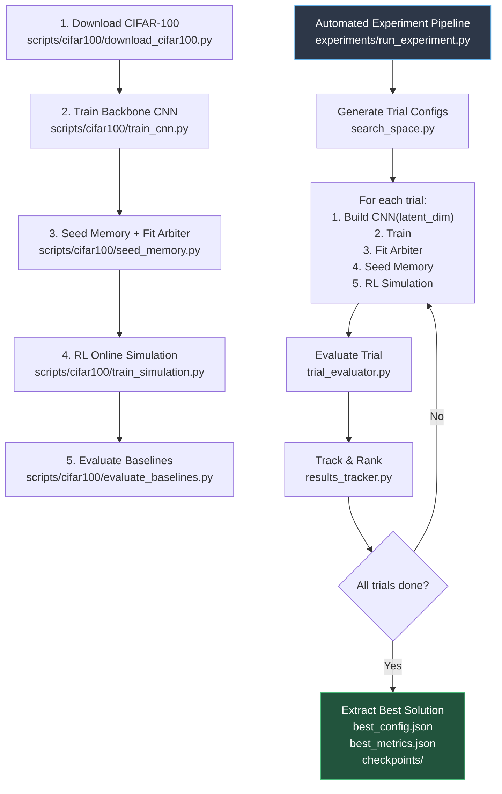

# 🎯 Plano de Implementação — CIFAR-100 Case Study

## 1. Contexto e Decisões Arquiteturais

### 1.1 Análise da Arquitetura Existente

O projeto segue um padrão modular por dataset:

| Componente | MNIST | CIFAR-10 |
|---|---|---|
| **Modelo CNN** | [`src/models/custom_cnn.py`](file:///c:/Users/sanfr/Desktop/projetos-gecad/projeto-cnn/src/models/custom_cnn.py) (`RawModel`) | [`src/cifar10/model.py`](file:///c:/Users/sanfr/Desktop/projetos-gecad/projeto-cnn/src/cifar10/model.py) (`RawModelCIFAR10`) |
| **Layers** | `src/scratch/layers.py` | [`src/cifar10/layers.py`](file:///c:/Users/sanfr/Desktop/projetos-gecad/projeto-cnn/src/cifar10/layers.py) (ResidualBlock, BN, GAP) |
| **Optimizer** | `src/scratch/optimizers.py` (SGD) | [`src/cifar10/optimizers.py`](file:///c:/Users/sanfr/Desktop/projetos-gecad/projeto-cnn/src/cifar10/optimizers.py) (AdamW) |
| **OOD Arbiter** | genérico | [`src/cifar10/ood_arbiter.py`](file:///c:/Users/sanfr/Desktop/projetos-gecad/projeto-cnn/src/cifar10/ood_arbiter.py) (`DualUncertaintyArbiter`) |
| **Data Loader** | `src/data/loader.py` | [`src/data/cifar10_loader.py`](file:///c:/Users/sanfr/Desktop/projetos-gecad/projeto-cnn/src/data/cifar10_loader.py) |
| **Config** | [`src/config.py`](file:///c:/Users/sanfr/Desktop/projetos-gecad/projeto-cnn/src/config.py) (unificado, env-driven) |
| **Treino CNN** | `scripts/train_cnn.py` | [`scripts/cifar10/train_cnn.py`](file:///c:/Users/sanfr/Desktop/projetos-gecad/projeto-cnn/scripts/cifar10/train_cnn.py) |
| **Simulação RL** | `training/train_rl_online_simulation.py` | [`scripts/cifar10/train_simulation.py`](file:///c:/Users/sanfr/Desktop/projetos-gecad/projeto-cnn/scripts/cifar10/train_simulation.py) |

**Módulos partilhados (dataset-agnostic):**
- [`src/models/rl_agent.py`](file:///c:/Users/sanfr/Desktop/projetos-gecad/projeto-cnn/src/models/rl_agent.py) — Double DQN + PER
- [`src/models/knn_bandit_agent.py`](file:///c:/Users/sanfr/Desktop/projetos-gecad/projeto-cnn/src/models/knn_bandit_agent.py) — Memória Episódica k-NN
- [`src/models/reward_manager.py`](file:///c:/Users/sanfr/Desktop/projetos-gecad/projeto-cnn/src/models/reward_manager.py) — Curriculum Learning Reward

### 1.2 Decisões de Design para CIFAR-100

| Decisão | Escolha | Justificação |
|---|---|---|
| **Backbone** | ResNet-14 (6 ResBlocks + GAP) | 100 classes exigem maior profundidade vs. ResNet-9 do CIFAR-10, mas GAP mantém footprint Edge-friendly |
| **Latent Dim** | Parametrizável (128, 256, 512) | O bottleneck de 128D que funciona para 10 classes pode ser insuficiente para 100; o pipeline de experimentação testará |
| **Módulo Isolado** | `src/cifar100/` | Padrão idêntico ao `src/cifar10/` para zero-regression |
| **Config** | Estender `src/config.py` com `DATASET="cifar100"` | Reutiliza o mecanismo env-driven existente |
| **OOD Arbiter** | 100 perfis Ledoit-Wolf + Entropia calibrada | `n_classes=100`, `max_entropy = ln(100) ≈ 4.605` |
| **Módulos partilhados** | Reutiliza `rl_agent.py`, `knn_bandit_agent.py`, `reward_manager.py` sem alteração | Já são parametrizados por `LATENT_DIM` e `n_actions` |

---

## 2. Estrutura de Ficheiros

### 2.1 Ficheiros a CRIAR (novos)

```
projeto-cnn/
├── src/
│   └── cifar100/                          # ← Módulo isolado CIFAR-100
│       ├── __init__.py                    # Package exports
│       ├── layers.py                      # Reutiliza/copia primitivas (Conv2D, BN, ResBlock, GAP, Dense)
│       ├── model.py                       # RawModelCIFAR100 — ResNet-14, latent_dim parametrizável
│       ├── optimizers.py                  # AdamW from-scratch (cópia de cifar10/optimizers.py)
│       └── ood_arbiter.py                 # DualUncertaintyArbiter (n_classes=100)
│
├── src/data/
│   └── cifar100_loader.py                 # Loader para CIFAR-100 pickle files
│
├── scripts/cifar100/                      # ← Scripts dedicados CIFAR-100
│   ├── __init__.py
│   ├── train_cnn.py                       # Treino backbone ResNet-14
│   ├── seed_memory.py                     # Semeação do buffer k-NN
│   ├── train_simulation.py                # Simulação RL online + concept drift
│   └── evaluate_baselines.py              # Avaliação comparativa (FIFO/LFU/Redundant vs RL)
│
├── scripts/cifar100/
│   └── download_cifar100.py               # Download helper
│
├── experiments/                           # ← Pipeline de experimentação (NOVO)
│   ├── __init__.py
│   ├── search_space.py                    # Definição do espaço de hiperparâmetros
│   ├── trial_runner.py                    # Orquestrador de trials (Grid/Random Search)
│   ├── trial_evaluator.py                 # Avaliação multi-métrica de cada trial
│   ├── results_tracker.py                 # Tracking, ranking, e persistência de resultados
│   └── run_experiment.py                  # Entry point CLI
│
└── outputs/cifar100/                      # ← Gerado em runtime
    ├── checkpoints/
    ├── logs/
    └── experiments/                       # ← Resultados de experimentação
        ├── trial_001/
        │   ├── config.json
        │   ├── metrics.json
        │   └── checkpoints/
        ├── trial_002/
        │   └── ...
        └── best_solution/
            ├── best_config.json           # Configuração final do melhor trade-off
            ├── best_metrics.json
            └── checkpoints/               # CNN + RL agent + memória + arbiter
```

### 2.2 Ficheiros a MODIFICAR (existentes)

| Ficheiro | Alteração |
|---|---|
| [`src/config.py`](file:///c:/Users/sanfr/Desktop/projetos-gecad/projeto-cnn/src/config.py) | Adicionar `DATASET="cifar100"` com paths, metadata (100 classes, 32×32×3), e hiperparâmetros CIFAR-100 |
| [`scripts/train_cnn.py`](file:///c:/Users/sanfr/Desktop/projetos-gecad/projeto-cnn/scripts/train_cnn.py) | Adicionar `choices=["mnist", "cifar10", "cifar100"]` ao argparse |

---

## 3. Plano de Implementação — Passo a Passo

### Fase 1: Infraestrutura Base
> **Objetivo**: Criar o módulo `src/cifar100/` com backbone, loader e configuração.

| Step | Ficheiro | Descrição |
|---|---|---|
| 1.1 | `src/config.py` | Adicionar `CIFAR100_DATA_DIR`, `DATASET_INPUT_SHAPE["cifar100"]=(32,32,3)`, `DATASET_NUM_CLASSES["cifar100"]=100`, paths condicionais |
| 1.2 | `src/data/cifar100_loader.py` | Loader que lê os pickle files do CIFAR-100 (`train`, `test`, `meta`), retorna `(N, 32, 32, 3)` + labels `[0..99]` |
| 1.3 | `src/cifar100/layers.py` | Copiar layers do CIFAR-10 (Conv2DLayer, BatchNorm2DLayer, ResidualBlock, GAP, DenseLayer) — já provados |
| 1.4 | `src/cifar100/model.py` | `RawModelCIFAR100(latent_dim=128)` — ResNet-14 com `latent_dim` como parâmetro do constructor |
| 1.5 | `src/cifar100/optimizers.py` | Copiar AdamW do CIFAR-10 (comprovado) |
| 1.6 | `src/cifar100/ood_arbiter.py` | `DualUncertaintyArbiter(n_classes=100, latent_dim=128)` — max entropy = ln(100) |
| 1.7 | `src/cifar100/__init__.py` | Package re-exports |

### Fase 2: Scripts de Treino e Pipeline
> **Objetivo**: Treinar, semear, e simular para CIFAR-100.

| Step | Ficheiro | Descrição |
|---|---|---|
| 2.1 | `scripts/cifar100/download_cifar100.py` | Helper de download do CIFAR-100 |
| 2.2 | `scripts/cifar100/train_cnn.py` | Treino ResNet-14 com AdamW + Cosine Annealing + Cutout + Label Smoothing. 50 epochs. |
| 2.3 | `scripts/cifar100/seed_memory.py` | Extrai features latentes, fit `DualUncertaintyArbiter`, semeia `KNNBanditAgent128D` |
| 2.4 | `scripts/cifar100/train_simulation.py` | Simulação RL streaming com concept drift, usando backbone treinado |
| 2.5 | `scripts/cifar100/evaluate_baselines.py` | Avaliação comparativa: FIFO vs LFU vs Redundant vs RL agent |

### Fase 3: Pipeline de Experimentação de Hiperparâmetros
> **Objetivo**: Automated search sobre dimensões estruturais e operacionais.

| Step | Ficheiro | Descrição |
|---|---|---|
| 3.1 | `experiments/search_space.py` | Define `SearchSpace` com ranges para: `latent_dim` [128, 256, 512], `mahalanobis_threshold` [10.0..30.0], `entropy_threshold` [1.5..4.0], `curriculum_alpha_decay` [0.99, 0.995, 0.999], `memory_capacity` [3000, 5000, 8000], `rl_lr` [1e-4, 5e-4, 1e-3], `rl_gamma` [0.95, 0.99], `knn_k` [10, 20, 30]. Suporta Grid e Random sampling. |
| 3.2 | `experiments/trial_runner.py` | `TrialRunner`: Para cada configuração: (a) instancia `RawModelCIFAR100(latent_dim=X)`, (b) treina CNN, (c) fit arbiter, (d) semeia memória, (e) executa simulação RL abreviada, (f) mede métricas. |
| 3.3 | `experiments/trial_evaluator.py` | `TrialEvaluator`: Calcula 5 métricas-chave por trial — (1) Acurácia limpa, (2) Acurácia sob ruído, (3) D_KL de evicção, (4) Latência média de inferência, (5) Footprint de RAM. |
| 3.4 | `experiments/results_tracker.py` | `ResultsTracker`: Acumula resultados, computa score ponderado (Pareto-aware), identifica melhor trial, guarda `best_config.json` + `best_metrics.json` + checkpoints. |
| 3.5 | `experiments/run_experiment.py` | CLI entry point: `python -m experiments.run_experiment --dataset cifar100 --mode random --n-trials 20` |

### Fase 4: Extração da Melhor Solução
> **Objetivo**: Selecionar, empacotar e persistir o melhor trade-off.

| Step | Componente | Descrição |
|---|---|---|
| 4.1 | `ResultsTracker.extract_best()` | Seleciona trial com melhor score composto, copia checkpoints para `outputs/cifar100/experiments/best_solution/` |
| 4.2 | `best_config.json` | JSON com toda a configuração reproduzível (latent_dim, thresholds, RL hyperparams, etc.) |
| 4.3 | `best_metrics.json` | JSON com as 5 métricas finais + metadata (timestamp, hardware, seed) |

---

## 4. Fluxo de Execução Completo



---

## 5. Arquitectura do Backbone — ResNet-14 para CIFAR-100

```
Input: (N, 32, 32, 3)
  │
  ├─ Prep Conv(3×3, 64) + BN + ReLU         → (N, 32, 32, 64)
  │
  ├─ Stage 1: ResBlock(64→64) × 2 + MaxPool  → (N, 16, 16, 64)
  │
  ├─ Stage 2: ResBlock(64→128) × 2 + MaxPool → (N, 8, 8, 128)
  │
  ├─ Stage 3: ResBlock(128→256) × 2 + MaxPool → (N, 4, 4, 256)
  │
  ├─ GlobalAvgPool                            → (N, 256)
  │
  ├─ Dense(256 → LATENT_DIM) + ReLU           → (N, LATENT_DIM)    ◄ Parametrizável
  │
  └─ Dense(LATENT_DIM → 100) + Softmax        → (N, 100)
```

> **Nota**: 6 ResBlocks (vs. 4 no CIFAR-10) proporcionam a profundidade extra necessária para discriminar 100 classes finas, mantendo ~1.5M params (Edge-compatible). O `latent_dim` é parametrizado no constructor para permitir experimentação automática.

---

## 6. Espaço de Hiperparâmetros para Experimentação

| Eixo | Valores | Impacto |
|---|---|---|
| **Latent Dim** | [128, 256, 512] | Capacidade representacional vs. RAM footprint |
| **Mahalanobis Threshold** | [10.0, 15.0, 20.0, 25.0] | Sensibilidade OOD (falsos positivos vs. misses) |
| **Entropy Threshold** | [1.5, 2.0, 3.0, 4.0] | Complementar ao Mahalanobis para incerteza preditiva |
| **Curriculum Alpha Decay** | [0.990, 0.995, 0.999] | Velocidade de transição geom→acc no reward |
| **Memory Capacity** | [3000, 5000, 8000] | Trade-off cobertura vs. latência k-NN |
| **RL Learning Rate** | [1e-4, 5e-4, 1e-3] | Estabilidade vs. velocidade de convergência |
| **RL Gamma** | [0.95, 0.99] | Horizonte temporal de recompensa |
| **k-NN K** | [10, 20, 30] | Suavidade da decisão vs. custo computacional |
| **Min Alpha** | [0.01, 0.05, 0.10] | Regularização geométrica residual |

---

## 7. Métricas de Avaliação por Trial

| # | Métrica | Fórmula/Medição | Peso no Score |
|---|---|---|---|
| 1 | **Clean Accuracy** | Acc no test set limpo (top-1, 100 classes) | 0.30 |
| 2 | **Noisy Accuracy** | Acc no test set com Gaussian noise (σ=0.6) | 0.25 |
| 3 | **D_KL Eviction** | KL divergence entre distribuição de classes no buffer vs. uniforme | 0.20 |
| 4 | **Inference Latency** | Tempo médio (ms) por sample: CNN forward + k-NN + RL decision | 0.15 |
| 5 | **RAM Footprint** | Memória total pré-alocada (bytes): buffer + arbiter profiles | 0.10 |

**Score Composto**: Normalizado por min-max scaling e ponderado:
```
score = Σ (weight_i × normalized_metric_i)
```
> D_KL, Latência e RAM são invertidos (menor é melhor).

---

## 8. Contrato de Saída

Ao finalizar o pipeline, a pasta `outputs/cifar100/experiments/best_solution/` conterá:

| Artefacto | Descrição |
|---|---|
| `best_config.json` | Configuração completa reproduzível (latent_dim, thresholds, RL params, etc.) |
| `best_metrics.json` | 5 métricas finais + score composto + metadata |
| `modelo_dissecado-*.index/data` | Checkpoint TensorFlow da CNN (ResNet-14) |
| `rl_agent.pt` | Checkpoint PyTorch do Double DQN |
| `arbiter_profiles.npz` | Perfis Ledoit-Wolf calibrados (100 classes) |
| `knn_memory_bank.npz` | Buffer episódico k-NN semeado |

---

## 9. Ordem de Geração de Código

Proponho gerar os ficheiros na seguinte ordem estrita (respeita dependências):

1. **`src/config.py`** — Extensão (CIFAR-100 metadata + paths)
2. **`src/data/cifar100_loader.py`** — Data loader
3. **`src/cifar100/layers.py`** — Primitivas (cópia comprovada)
4. **`src/cifar100/model.py`** — `RawModelCIFAR100` (ResNet-14, `latent_dim` param)
5. **`src/cifar100/optimizers.py`** — AdamW
6. **`src/cifar100/ood_arbiter.py`** — Arbiter 100 classes
7. **`src/cifar100/__init__.py`** — Package init
8. **`scripts/cifar100/download_cifar100.py`** — Download helper
9. **`scripts/cifar100/train_cnn.py`** — Pipeline de treino
10. **`scripts/cifar100/seed_memory.py`** — Semeação
11. **`scripts/cifar100/train_simulation.py`** — Simulação RL
12. **`scripts/cifar100/evaluate_baselines.py`** — Avaliação
13. **`experiments/search_space.py`** — Espaço de HP
14. **`experiments/trial_runner.py`** — Orquestrador
15. **`experiments/trial_evaluator.py`** — Avaliador multi-métrica
16. **`experiments/results_tracker.py`** — Tracking + best extraction
17. **`experiments/run_experiment.py`** — CLI entry point
18. **`experiments/__init__.py`** — Package init

> [!IMPORTANT]
> **Total: 18 ficheiros** (16 novos + 2 modificados). Todos serão entregues completos e compiláveis, sem placeholders.

---

## 10. Estimativa de Complexidade

| Fase | Ficheiros | Complexidade |
|---|---|---|
| Fase 1 — Infraestrutura | 7 | Média (adaptação do padrão CIFAR-10) |
| Fase 2 — Scripts de Treino | 5 | Alta (lógica de simulação + concept drift) |
| Fase 3 — Experimentação | 5 | Alta (orquestração + métricas + tracking) |
| Fase 4 — Extração | Integrada no `results_tracker.py` | Baixa |

