# CIFAR-100 Dedicated Module API Reference

> Part of the [Active Episodic Memory Management via Reinforcement Learning for Robust CNN Inference on Out-of-Distribution Data](file:///c:/Users/sanfr/Desktop/projetos-gecad/projeto-cnn/README.md) documentation.  
> Parent: [API Reference Index](file:///c:/Users/sanfr/Desktop/projetos-gecad/projeto-cnn/docs/api/README.md) | Up: [Documentation Index](file:///c:/Users/sanfr/Desktop/projetos-gecad/projeto-cnn/docs/README.md)

---

## 1. Module Overview

The `src/cifar100` and `src/data/cifar100_loader` packages provide specialized deep learning components, vision backbones, numerical optimizers, uncertainty arbiters, and data ingestion pipelines designed specifically for the high-entropy, fine-grained 100-class CIFAR-100 vision benchmark ($32 \times 32 \times 3$ natural color images, 100 fine labels).

### Core Design Contract
All models and pipelines in this module preserve the strict **invariant 128D latent bottleneck contract**:
- **Visual Input:** Tensor $x \in \mathbb{R}^{B \times 32 \times 32 \times 3}$ with values in $[0, 1]$ or channel-wise standardized.
- **Model Output Dictionary:**
  - `"latent_features"`: $z \in \mathbb{R}^{B \times 128}$ (penultimate bottleneck representations conditioned by Batch Normalization and ReLU non-linearity).
  - `"logits"`: $\ell \in \mathbb{R}^{B \times 100}$ (unnormalized class energy scores).
  - `"probabilities"`: $p \in \Delta^{99}$ (normalized 100-class Softmax posterior distribution, $\sum_{c=0}^{99} p_c = 1.0$).

### Canonical Normalization Constants
```python
CIFAR100_MEAN = tf.constant([0.50707516, 0.48654887, 0.44091784], dtype=tf.float32)
CIFAR100_STD  = tf.constant([0.26733429, 0.25643846, 0.27615047], dtype=tf.float32)
```
Standardization transformation:
$$x_{\text{std}} = \frac{x - \mu_{\text{CIFAR100}}}{\sigma_{\text{CIFAR100}}}$$

---

## 2. Promoted Backbone: `RawModelCIFAR100V2`

**Module:** [`src.cifar100.model`](file:///c:/Users/sanfr/Desktop/projetos-gecad/projeto-cnn/src/cifar100/model.py)  
**Inherits:** `tf.Module`  
**Official Repository Standard:** Promoted model checkpoint achieving **74.27% Top-1 test accuracy** at 150 epochs.

### 2.1. Architectural Specification
To resolve the catastrophic spatial information collapse caused by aggressive max-pooling on high-entropy 100-class representations, `RawModelCIFAR100V2` implements an upgraded 18-layer residual architecture structured across 4 hierarchical stages (8 residual blocks) featuring learned strided convolutions for downsampling and a dedicated Batch Normalization layer in the latent bottleneck:

```mermaid
graph TD
    IN["Input x: (B, 32, 32, 3)"] --> PREP["Prep: Conv3x3 (64) + BN + ReLU<br>(B, 32, 32, 64)"]
    PREP --> S1["Stage 1: 2x ResBlock (64, s=1)<br>(B, 32, 32, 64)"]
    S1 --> S2["Stage 2: ResBlock (128, s=2) + ResBlock (128, s=1)<br>(B, 16, 16, 128)"]
    S2 --> S3["Stage 3: ResBlock (256, s=2) + ResBlock (256, s=1)<br>(B, 8, 8, 256)"]
    S3 --> S4["Stage 4: ResBlock (512, s=2) + ResBlock (512, s=1)<br>(B, 4, 4, 512)"]
    S4 --> GAP["Global Average Pooling (GAP)<br>(B, 512)"]
    GAP --> BN_LAT["Dense (512 -> 128) + BN + ReLU<br>Latent Features: (B, 128)"]
    BN_LAT --> CLS["Dense (128 -> 100) + Softmax<br>Logits & Probabilities: (B, 100)"]

    style IN fill:#1f242c,stroke:#58a6ff,stroke-width:1px
    style S1 fill:#1f242c,stroke:#388bfd,stroke-width:1px
    style S2 fill:#1f242c,stroke:#388bfd,stroke-width:1px
    style S3 fill:#1f242c,stroke:#388bfd,stroke-width:1px
    style S4 fill:#1f242c,stroke:#388bfd,stroke-width:1px
    style BN_LAT fill:#1f242c,stroke:#2ea043,stroke-width:2px
    style CLS fill:#1f242c,stroke:#a371f7,stroke-width:1px
```



### 2.2. Parameter Inventory and Structural Breakdown
`RawModelCIFAR100V2` contains **11,250,532 parameters** across its convolutional and dense weight kernels, with 11,252,452 trainable variables and 11,262,308 total variables (accounting for moving batch normalization statistics):

| Stage / Layer Group | Sub-Layers & Operations | Kernel / Weight Dimension | Output Dimension | Parameter Count |
|:---|:---|:---|:---|:---|
| **Prep Stage** | `prep_conv`, `prep_bn`, ReLU | $3 \times 3 \times 3 \times 64$ | $(B, 32, 32, 64)$ | 1,856 |
| **Stage 1** (64 channels) | 2x `ResidualBlock` ($s=1$) | 4 convs: $3 \times 3 \times 64 \times 64$ | $(B, 32, 32, 64)$ | 147,968 |
| **Stage 2** (128 channels) | ResBlock 1 ($s=2$, shortcut $1 \times 1$) + ResBlock 2 ($s=1$) | Conv ($64 \to 128$), Conv ($128 \to 128$), Shortcut ($64 \to 128$), 2x Conv ($128 \to 128$) | $(B, 16, 16, 128)$ | 525,824 |
| **Stage 3** (256 channels) | ResBlock 1 ($s=2$, shortcut $1 \times 1$) + ResBlock 2 ($s=1$) | Conv ($128 \to 256$), Conv ($256 \to 256$), Shortcut ($128 \to 256$), 2x Conv ($256 \to 256$) | $(B, 8, 8, 256)$ | 2,100,224 |
| **Stage 4** (512 channels) | ResBlock 1 ($s=2$, shortcut $1 \times 1$) + ResBlock 2 ($s=1$) | Conv ($256 \to 512$), Conv ($512 \to 512$), Shortcut ($256 \to 512$), 2x Conv ($512 \to 512$) | $(B, 4, 4, 512)$ | 8,394,752 |
| **Global Pooling** | `gap` | Spatial reduce mean $[1, 2]$ | $(B, 512)$ | 0 |
| **Latent Bottleneck** | `latent_dense`, `latent_bn`, ReLU | Dense: $512 \times 128$, BN: 128 | $(B, 128)$ | 65,920 |
| **Classifier Head** | `classifier_dense` | Dense: $128 \times 100$ | $(B, 100)$ | 12,900 |
| **Total Model Scope** | **ResNet-18 V2 Backbone** | **4 Stages + Bottleneck + Head** | -- | **11,250,532** |

### 2.3. Constructor Signature
```python
RawModelCIFAR100V2(
    latent_dim: int = 128,
    num_classes: int = 100,
    name: str = "resnet18_cifar100_v2"
)
```

- **Parameters:**
  - `latent_dim` (`int`): Dimensionality of the penultimate latent bottleneck vector. Fixed to `128` by architectural contract.
  - `num_classes` (`int`): Cardinality of discrete target classes. Fixed to `100` for CIFAR-100 fine labels.
  - `name` (`str`): Base variable namespace prefix for TensorFlow module registration.

### 2.4. Public Method: `__call__`
```python
def __call__(self, x: tf.Tensor, training: bool = True) -> Dict[str, tf.Tensor]:
```

Executes the forward inference or training pass through the 4 residual stages and dual heads.

- **Parameters:**
  - `x` (`tf.Tensor` or `np.ndarray`): Input image tensor of shape `(batch_size, 32, 32, 3)`, dtype `float32`.
  - `training` (`bool`): Operational switch for Batch Normalization. If `True`, updates moving statistics via exponential momentum ($\mu=0.1$ PyTorch-style / decay=0.9). If `False`, utilizes frozen population statistics.
- **Returns:**
  - `Dict[str, tf.Tensor]` containing:
    - `"latent_features"`: `tf.Tensor` of shape `(batch_size, 128)` after penultimate Batch Normalization and ReLU non-linearity.
    - `"logits"`: `tf.Tensor` of shape `(batch_size, 100)` representing raw unnormalized class scores.
    - `"probabilities"`: `tf.Tensor` of shape `(batch_size, 100)` representing Softmax posterior distribution.

---

## 3. Legacy Backbone: `RawModelCIFAR100` (ResNet-14 V1)

**Module:** [`src.cifar100.model`](file:///c:/Users/sanfr/Desktop/projetos-gecad/projeto-cnn/src/cifar100/model.py)  
**Inherits:** `tf.Module`  
**Classification Baseline:** Legacy Phase 1 backbone (2.80M parameters, 63.85% Top-1 clean test accuracy).

### 3.1. Architectural Specification
`RawModelCIFAR100` implements a 3-stage residual network with 6 residual blocks (2 per stage) paired with $2 \times 2$ MaxPool layers for downsampling:
- Prep Layer: Conv ($3 \to 64$, $3 \times 3$) + BN + ReLU $\to (B, 32, 32, 64)$
- Stage 1: 2x ResBlock ($64 \to 64$) + MaxPool ($2 \times 2$) $\to (B, 16, 16, 64)$
- Stage 2: ResBlock ($64 \to 128$) + ResBlock ($128 \to 128$) + MaxPool ($2 \times 2$) $\to (B, 8, 8, 128)$
- Stage 3: ResBlock ($128 \to 256$) + ResBlock ($256 \to 256$) + MaxPool ($2 \times 2$) $\to (B, 4, 4, 256)$
- GAP: Global Average Pooling $\to (B, 256)$
- Latent Projection: Dense ($256 \to 128$) + ReLU $\to (B, 128)$
- Classifier Head: Dense ($128 \to 100$) + Softmax $\to (B, 100)$

### 3.2. Constructor Signature
```python
RawModelCIFAR100(
    latent_dim: int = 128,
    num_classes: int = 100,
    name: str = "resnet14_cifar100"
)
```

- **Total Parameter Count:** 2,827,620 parameters.
- **Contract:** Outputs identical dictionary structure (`latent_features`, `logits`, `probabilities`) ensuring full backward compatibility.

---

## 4. Automated Model Restoration: `load_cifar100_backbone`

**Module:** [`src.cifar100.model`](file:///c:/Users/sanfr/Desktop/projetos-gecad/projeto-cnn/src/cifar100/model.py)

### 4.1. Function Specification
```python
def load_cifar100_backbone(
    checkpoint_dir: str,
    latent_dim: int = 128
) -> Tuple[tf.Module, bool]:
```

Provides automated, introspective restoration of converged CIFAR-100 feature extractors from disk checkpoints, dynamically dispatching between `RawModelCIFAR100V2` and `RawModelCIFAR100`.

### 4.2. Operational Workflow
1. **Metadata Inspection:** Reads `model_meta.json` within `checkpoint_dir` to parse `model_version` (`"v1"` vs `"v2"`) and the `standardize` flag (`bool`).
2. **Dynamic Instantiation:**
   - If `model_version == "v2"`, instantiates `RawModelCIFAR100V2(latent_dim=latent_dim)`.
   - Otherwise, instantiates `RawModelCIFAR100(latent_dim=latent_dim)`.
3. **Variable Restoration:** Locates the latest serialized checkpoint via `tf.train.latest_checkpoint(checkpoint_dir)` and executes `tf.train.Checkpoint(model=model).restore(...).expect_partial()`.
4. **Returns:** `(model, standardize)` tuple indicating the operational module and whether input normalization must apply channel Z-score scaling.

---

## 5. Dual Uncertainty Arbiter: `DualUncertaintyArbiter`

**Module:** [`src.cifar100.ood_arbiter`](file:///c:/Users/sanfr/Desktop/projetos-gecad/projeto-cnn/src/cifar100/ood_arbiter.py)

### 5.1. Mathematical Formulation
The CIFAR-100 OOD arbiter executes dual-uncertainty verification combining geometric latent Mahalanobis distance with predictive Shannon entropy across 100 classes (Kaur et al., ICML 2021; Nguyen, 2026):

$$\text{Routing Decision: } \text{is\_ood}(x) = \left( d_M(\Phi(x)) > \tau_M \right) \lor \left( H(p(x)) > \tau_H \right)$$

Where:
- **Ledoit-Wolf Mahalanobis Distance:**
  $$d_M(z) = \min_{c \in \{0, \dots, 99\}} \sqrt{(z - \mu_c)^T \Sigma_c^{-1} (z - \mu_c)}$$
  with class centroids $\mu_c \in \mathbb{R}^{128}$ and regularized covariance $\Sigma_c$ fitted via Ledoit-Wolf empirical shrinkage.
- **Predictive Shannon Entropy:**
  $$H(p) = -\sum_{c=0}^{99} p_c \ln(p_c + \epsilon), \quad \text{where } H_{\max} = \ln(100) \approx 4.60517\text{ nats}$$

### 5.2. Calibrated Threshold Parameters
Calibrated empirically on 50,000 in-distribution training representations (`outputs/cifar100/arbiter_profiles.npz`):
- **Mahalanobis Threshold:** $\tau_M = 8.69$ (95th percentile of clean training representations).
- **Entropy Threshold:** $\tau_H = 2.09\text{ nats}$ (95th percentile of clean training posteriors).

### 5.3. Constructor and Methods
```python
DualUncertaintyArbiter(n_classes: int = 100, latent_dim: int = 128)
```

- `fit(latent_features: np.ndarray, probabilities: np.ndarray, labels: np.ndarray, percentile: float = 95.0) -> None`  
  Computes class centroids, Ledoit-Wolf precision matrices for all 100 classes, and calibrates $\tau_M, \tau_H$.
- `compute_mahalanobis_batch(latent_features: np.ndarray) -> np.ndarray`  
  Evaluates minimum Mahalanobis distance across all 100 class profiles for an input batch $(N, 128)$.
- `compute_entropy_batch(probabilities: np.ndarray) -> np.ndarray`  
  Computes Shannon entropy in nats for an input probability batch $(N, 100)$.
- `predict_batch(latent_features: np.ndarray, probabilities: np.ndarray) -> np.ndarray`  
  Returns a boolean mask of shape $(N,)$ where `True` flags Out-of-Distribution or high-uncertainty instances routed to episodic memory.
- `save(filepath: str) -> None` / `load(filepath: str) -> None`  
  Serializes and restores 100-class centroids, precision matrices, and thresholds in `.npz` format.

---

## 6. Layer Primitives and Residual Building Blocks

**Module:** [`src.cifar100.layers`](file:///c:/Users/sanfr/Desktop/projetos-gecad/projeto-cnn/src/cifar100/layers.py)

### 6.1. `ResidualBlock`
The foundational residual block utilized across all stages:
$$\mathcal{F}(x) = \text{BN}_2(\text{Conv}_{3\times3}(\text{ReLU}(\text{BN}_1(\text{Conv}_{3\times3}(x)))))$$
$$y = \text{ReLU}(\mathcal{F}(x) + \mathcal{H}(x))$$
Where the shortcut projection $\mathcal{H}(x)$ evaluates:
- $\mathcal{H}(x) = x$ (identity shortcut) when $C_{\text{in}} = C_{\text{out}}$ and $\text{stride} = 1$.
- $\mathcal{H}(x) = \text{BN}_{\text{sc}}(\text{Conv}_{1\times1}(x))$ (learned strided projection) when $C_{\text{in}} \ne C_{\text{out}}$ or $\text{stride} > 1$.

```python
ResidualBlock(
    in_channels: int,
    out_channels: int,
    stride: int = 1,
    name: Optional[str] = None
)
```

### 6.2. Elementary Building Blocks
- **`BatchNorm2DLayer`:** Custom 2D batch normalization maintaining running statistics via dual PyTorch/TensorFlow momentum conventions ($\mu=0.1$ rate $\to$ decay=0.9).
- **`Conv2DLayer`:** 2D convolution with He Normal parameter initialization ($W \sim \mathcal{N}(0, \sqrt{2/(k^2 C_{\text{in}})})$) and explicit zero bias.
- **`MaxPool2DLayer`:** 2D max-pooling with configurable window and stride (used in legacy V1).
- **`DenseLayer`:** Linear transformation with Glorot Uniform parameter initialization and zero bias.
- **`GlobalAvgPool2DLayer`:** Spatial average reduction computing mean across axes $[1, 2]$.

---

## 7. Numerical Optimizers with Decoupled Weight Decay

**Module:** [`src.cifar100.optimizers`](file:///c:/Users/sanfr/Desktop/projetos-gecad/projeto-cnn/src/cifar100/optimizers.py)

### 7.1. `Adam` (AdamW with Decoupled Weight Decay)
Implements AdamW (Loshchilov & Hutter, ICLR 2019) from scratch in pure TensorFlow:
$$m_t = \beta_1 m_{t-1} + (1 - \beta_1) g_t, \quad v_t = \beta_2 v_{t-1} + (1 - \beta_2) g_t^2$$
$$\hat{\eta}_t = \eta \cdot \frac{\sqrt{1 - \beta_2^t}}{1 - \beta_1^t}, \quad \Delta \theta_t = \hat{\eta}_t \frac{m_t}{\sqrt{v_t} + \epsilon}$$
$$\theta_t = \theta_{t-1} - \hat{\eta}_t \lambda \theta_{t-1} \cdot \mathbb{I}_{[\dim(\theta) > 1]} - \Delta \theta_t$$

```python
Adam(
    learning_rate: float = 0.001,
    beta1: float = 0.9,
    beta2: float = 0.999,
    epsilon: float = 1e-8,
    weight_decay: float = 1e-4
)
```
- **Decoupled Weight Decay:** Selectively applied only to weight tensors ($\dim > 1$). 1D biases and Batch Normalization parameters ($\gamma, \beta$) are strictly spared from regularization.
- **Dual Calling Convention:** Accepts both standard TensorFlow `grads_and_vars` tuples and positional `apply_gradients(variables, gradients)`.

### 7.2. `SGDMomentum`
Implements Stochastic Gradient Descent with Nesterov accelerated momentum and decoupled weight decay:
$$v_t = \mu v_{t-1} + g_t$$
$$\Delta \theta_t = \eta \cdot (\mu v_t + g_t) \quad (\text{if Nesterov else } \eta v_t)$$
$$\theta_t = \theta_{t-1} - \eta \lambda \theta_{t-1} \cdot \mathbb{I}_{[\dim(\theta) > 1]} - \Delta \theta_t$$

```python
SGDMomentum(
    learning_rate: float = 0.1,
    momentum: float = 0.9,
    nesterov: bool = True,
    weight_decay: float = 5e-4
)
```

---

## 8. Data Ingestion: `src.data.cifar100_loader`

**Module:** [`src.data.cifar100_loader`](file:///c:/Users/sanfr/Desktop/projetos-gecad/projeto-cnn/src/data/cifar100_loader.py)

### 8.1. Data Loading Functions
Provides ingestion of official binary Python pickle files (`train`, `test`, `meta`) handling binary byte encodings and fine label extraction:

#### `load_cifar100_raw`
```python
def load_cifar100_raw(
    data_dir: Optional[str] = None,
    kind: Optional[str] = None
) -> Union[Tuple[np.ndarray, np.ndarray, np.ndarray, np.ndarray], Tuple[np.ndarray, np.ndarray]]:
```
- **Data Unpickling:** Extracts `b'data'` (50,000 train / 10,000 test) and reshapes flat 3,072-byte rows:
  $$(N, 3072) \xrightarrow{\text{reshape}} (N, 3, 32, 32) \xrightarrow{\text{transpose}} (N, 32, 32, 3) \xrightarrow{\text{cast}} \text{float32 in } [0, 1]$$
- **Fine Label Extraction:** Extracts `b'fine_labels'` mapping directly to integer array of shape $(N,)$, dtype `int32` in $\{0, \dots, 99\}$.
- **Returns:**
  - If `kind is None`: `(X_train, y_train, X_test, y_test)`
  - If `kind == 'train'`: `(X_train, y_train)`
  - If `kind in ('test', 't10k')`: `(X_test, y_test)`

#### `load_cifar100_meta`
```python
def load_cifar100_meta(data_dir: Optional[str] = None) -> List[str]:
```
Parses `b'fine_label_names'` from the `meta` pickle file, returning a list of 100 UTF-8 decoded human-readable class names (e.g., `'apple'`, `'aquarium_fish'`, `'baby'`, etc.).

#### `create_cifar100_dataset`
```python
def create_cifar100_dataset(
    data_dir: Optional[str] = None,
    batch_size: int = CNN_BATCH_SIZE
) -> tf.data.Dataset:
```
Creates an asynchronous `tf.data.Dataset` pipeline with random shuffling ($10,000$ buffer), batching, and `prefetch(tf.data.AUTOTUNE)`.

---

## 9. Code Usage Example: End-to-End Pipeline

The following self-contained Python snippet demonstrates backbone restoration, forward pass evaluation, and uncertainty routing:

```python
import os
import numpy as np
import tensorflow as tf

from src.cifar100.model import (
    load_cifar100_backbone,
    RawModelCIFAR100V2,
    CIFAR100_MEAN,
    CIFAR100_STD,
)
from src.cifar100.ood_arbiter import DualUncertaintyArbiter

# 1. Restore Official ResNet-18 V2 Backbone
checkpoint_dir = "outputs/cifar100/checkpoints"
model, standardize = load_cifar100_backbone(checkpoint_dir)
print(f"Loaded Backbone: {model.__class__.__name__} | Standardize: {standardize}")

# 2. Prepare Sample Batch (B=4, 32x32x3)
raw_images = tf.random.uniform((4, 32, 32, 3), minval=0.0, maxval=1.0, dtype=tf.float32)
if standardize:
    input_tensor = (raw_images - CIFAR100_MEAN) / CIFAR100_STD
else:
    input_tensor = raw_images

# 3. Execute Forward Inference Pass
outputs = model(input_tensor, training=False)
z = outputs["latent_features"].numpy()    # Shape: (4, 128)
p = outputs["probabilities"].numpy()      # Shape: (4, 100)
logits = outputs["logits"].numpy()        # Shape: (4, 100)

print(f"Latent Shape: {z.shape} | Softmax Sums: {np.sum(p, axis=-1)}")

# 4. Query 100-Class Dual Uncertainty Arbiter
arbiter = DualUncertaintyArbiter(n_classes=100, latent_dim=128)
arbiter_path = "outputs/cifar100/arbiter_profiles.npz"

if os.path.exists(arbiter_path):
    arbiter.load(arbiter_path)
    is_ood = arbiter.predict_batch(z, p)
    d_M = arbiter.compute_mahalanobis_batch(z)
    entropy = arbiter.compute_entropy_batch(p)

    for i in range(len(is_ood)):
        print(f"Sample {i}: d_M={d_M[i]:.2f} (tau={arbiter.threshold_mahalanobis:.2f}), "
              f"H={entropy[i]:.2f} nats (tau={arbiter.threshold_entropy:.2f} nats) -> "
              f"Route: {'[Episodic Memory Buffer]' if is_ood[i] else '[Parametric CNN Backbone]'}")
else:
    print(f"Arbiter profile not found at {arbiter_path}. Run scripts/cifar100/seed_memory.py.")
```

---

## 10. Computational Complexity Guarantees

| Operation | Component | Complexity | Mechanism |
|:---|:---|:---|:---|
| Feature Extraction | `RawModelCIFAR100V2` | $\mathcal{O}(B \cdot \sum_l H_l W_l C_l^2)$ | 4-stage residual network (8 blocks, learned strided downsampling) + GAP + 128D BN bottleneck |
| Legacy Feature Extraction | `RawModelCIFAR100` | $\mathcal{O}(B \cdot \sum_l H_l W_l C_l^2)$ | 3-stage residual network (6 blocks, MaxPool) + GAP + 128D bottleneck |
| 100-Class Mahalanobis Distance | `DualUncertaintyArbiter` | $\mathcal{O}(N \cdot 100 \cdot D^2)$ | Batch quadratic form evaluation across 100 Ledoit-Wolf precision matrices ($D=128$) |
| Predictive Shannon Entropy | `DualUncertaintyArbiter` | $\mathcal{O}(N \cdot 100)$ | Vectorized Shannon sum across 100 Softmax posterior likelihoods |
| Dataset Batch Ingestion | `load_cifar100_raw` | $\mathcal{O}(N \cdot H \cdot W \cdot C)$ | Vectorized memory transpose and floating-point casting |

---

**Navigation:**
- Previous: [CIFAR-10 API Reference](file:///c:/Users/sanfr/Desktop/projetos-gecad/projeto-cnn/docs/api/cifar10.md)
- Up: [API Reference Index](file:///c:/Users/sanfr/Desktop/projetos-gecad/projeto-cnn/docs/api/README.md)
- Next: [Episodic Memory API Reference](file:///c:/Users/sanfr/Desktop/projetos-gecad/projeto-cnn/docs/api/knn-bandit-agent.md)

---

Licensed under the GNU General Public License v3.0. See [LICENSE](file:///c:/Users/sanfr/Desktop/projetos-gecad/projeto-cnn/LICENSE) for details.
