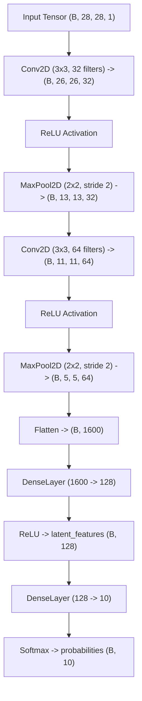

# Custom CNN Module API Reference

> Part of the [Trustworthy Edge AI: RL-Driven Active Memory Management](../../README.md) documentation.  
> Parent: [API Reference Index](README.md) | Up: [Documentation Index](../README.md)

---

## Module Overview

The `src.models.custom_cnn` module provides the deep feature extraction front-end for the semiparametric architecture. It implements `RawModel`, a Convolutional Neural Network built from scratch using primitive TensorFlow operations (`tf.Module`) and custom mathematical layers (`DenseLayer`, `Conv2DLayer`, `MaxPool2DLayer`). The network simultaneously serves as a high-confidence parametric classifier and produces 128-dimensional bottleneck latent embeddings that feed downstream components (Mahalanobis++ detector and k-NN episodic memory).

- **Source File:** `src/models/custom_cnn.py`
- **Import Statement:**
  ```python
  from src.models.custom_cnn import RawModel
  ```

---

## Class: `RawModel`

```python
class RawModel(tf.Module):
```

`RawModel` subclasses `tf.Module` to expose explicit weight management and state tracking without high-level Keras abstractions. It features two spatial convolutional blocks, a linear bottleneck layer yielding 128D latent vectors, and a 10-class linear classification head.

### Constructor

#### `__init__(name: str = "true_custom_cnn") -> None`

Initializes and binds the internal convolutional, pooling, dense, and flattening layers.

| Parameter | Type | Default | Description |
|:----------|:-----|:--------|:------------|
| `name` | `str` | `"true_custom_cnn"` | Scoping name prefix for underlying TensorFlow variables |

### Internal Layer Composition

The network encapsulates the following child layers:

| Layer Attribute | Class | Specification | Parameter Count |
|:----------------|:------|:--------------|:----------------|
| `self.conv1` | `Conv2DLayer` | $\text{in}=1, \text{out}=32, \text{kernel}=3\times3, \text{stride}=1, \text{padding}=\text{'VALID'}$ | $(3 \times 3 \times 1 \times 32) + 32 = 320$ |
| `self.pool1` | `MaxPool2DLayer` | $\text{pool\_size}=2\times2, \text{stride}=2, \text{padding}=\text{'VALID'}$ | $0$ (non-parametric) |
| `self.conv2` | `Conv2DLayer` | $\text{in}=32, \text{out}=64, \text{kernel}=3\times3, \text{stride}=1, \text{padding}=\text{'VALID'}$ | $(3 \times 3 \times 32 \times 64) + 64 = 18,496$ |
| `self.pool2` | `MaxPool2DLayer` | $\text{pool\_size}=2\times2, \text{stride}=2, \text{padding}=\text{'VALID'}$ | $0$ (non-parametric) |
| `self.flatten` | `tf.keras.layers.Flatten` | Flattens $5 \times 5 \times 64$ tensor into $1600$-dim vector | $0$ (non-parametric) |
| `self.latent_dense` | `DenseLayer` | $\text{in}=1600, \text{out}=128$, Glorot Uniform initialization | $(1600 \times 128) + 128 = 204,928$ |
| `self.classifier_dense` | `DenseLayer` | $\text{in}=128, \text{out}=10$, Glorot Uniform initialization | $(128 \times 10) + 10 = 1,290$ |
| **Total** | -- | -- | **225,034 parameters** ($\approx 900.1\text{ KB}$) |

---

## Public Methods

#### `__call__(x: tf.Tensor) -> Dict[str, tf.Tensor]`

Executes the full forward pass across all spatial and dense blocks, returning both the intermediate latent feature representations and the output class probability distribution.

| Parameter | Type | Default | Description |
|:----------|:-----|:--------|:------------|
| `x` | `tf.Tensor` | *required* | Input image tensor with values normalized to $[0.0, 1.0]$. Shape must be $(B, 28, 28, 1)$ or $(28, 28, 1)$. |

**Returns:** `Dict[str, tf.Tensor]` containing:
- `"latent_features"`: `tf.Tensor` of shape $(B, 128)$ with `dtype=tf.float32`. Activated by ReLU:
  $$\mathbf{z} = \text{ReLU}\left(\mathbf{W}_{\text{latent}} \mathbf{x}_{\text{flat}} + \mathbf{b}_{\text{latent}}\right)$$
- `"probabilities"`: `tf.Tensor` of shape $(B, 10)$ with `dtype=tf.float32`. Normalized via Softmax:
  $$\hat{\mathbf{y}}_i = \frac{\exp(\mathbf{z}_i)}{\sum_{j=1}^{10} \exp(\mathbf{z}_j)}$$

### Mathematical Forward Pass Flow



---

## Supporting Primitive Components

The model relies on primitives defined in `src.scratch`:

### `DenseLayer(tf.Module)` (`src/scratch/layers.py`)
- **Constructor:** `__init__(in_features: int, out_features: int, name=None)`
- **Weights:** Trainable `tf.Variable` `w` initialized via `tf.initializers.GlorotUniform()`.
- **Bias:** Trainable `tf.Variable` `b` initialized to zero vector.
- **Computation:** `tf.matmul(x, self.w) + self.b`

### `Conv2DLayer(tf.Module)` (`src/scratch/layers.py`)
- **Constructor:** `__init__(in_channels: int, out_channels: int, kernel_size: int = 3, stride: int = 1, padding: str = 'VALID', name=None)`
- **Weights:** Trainable `tf.Variable` `w` initialized via `tf.initializers.HeNormal()`.
- **Bias:** Trainable `tf.Variable` `b` initialized to zero vector.
- **Computation:** `tf.nn.conv2d(x, self.w, strides=[1, self.stride, self.stride, 1], padding=self.padding) + self.b`

### `MaxPool2DLayer(tf.Module)` (`src/scratch/layers.py`)
- **Constructor:** `__init__(pool_size: int = 2, stride: int = 2, padding: str = 'VALID', name=None)`
- **Computation:** `tf.nn.max_pool2d(x, ksize=[1, self.pool_size, self.pool_size, 1], strides=[1, self.stride, self.stride, 1], padding=self.padding)`

---

## Usage Example

```python
# example_custom_cnn.py
import tensorflow as tf
from src.models.custom_cnn import RawModel

# Instantiate model
cnn = RawModel(name="edge_cnn")

# Create a synthetic mini-batch of 4 MNIST images
dummy_input = tf.random.uniform(shape=(4, 28, 28, 1), minval=0.0, maxval=1.0, dtype=tf.float32)

# Execute forward pass
outputs = cnn(dummy_input)

latent_vectors = outputs["latent_features"]   # Shape: (4, 128)
class_probs = outputs["probabilities"]       # Shape: (4, 10)

print(f"Latent features shape: {latent_vectors.shape}")
print(f"Probabilities shape: {class_probs.shape}")
print(f"Predicted classes: {tf.argmax(class_probs, axis=1).numpy()}")
```

---

## Cross-References

- For the full layer-by-layer architectural derivation, see [CNN Feature Extractor Architecture](../architecture/cnn-feature-extractor.md).
- For details on how latent vectors are profiled, see [Out-of-Distribution Detection](../architecture/ood-detection.md).
- For the SGD training script and loss functions, see [Full Training Pipeline Guide](../guides/training-pipeline.md).

---

**Navigation:**
- Previous: [Configuration Module API Reference](config.md)
- Up: [API Reference Index](README.md)
- Next: [Episodic Memory Agent API Reference](knn-bandit-agent.md)

---
Licensed under the GNU General Public License v3.0. See [LICENSE](../../LICENSE) for details.
