# System Architecture

> Part of the [Active Episodic Memory Management via Reinforcement Learning for Robust CNN Inference on Out-of-Distribution Data](../../README.md) documentation.
> Parent: [Documentation Index](../README.md) | Up: [Root README](../../README.md)

---

## 1. Abstract and Architecture Philosophy

Modern edge vision systems operate under strict computational and thermodynamic constraints: microcontrollers and edge accelerators cannot perform full backpropagation passes or continual gradient fine-tuning without risking catastrophic forgetting, thermal throttling, or out-of-memory (OOM) faults. Conversely, relying solely on a fixed parametric Convolutional Neural Network (CNN) leaves edge systems vulnerable to out-of-distribution (OOD) shifts, physical sensor degradation, and non-stationary environment drift.

To resolve this dilemma, this repository implements a **semiparametric architecture** that decouples feature extraction from fast continual adaptation:
- **Parametric Cortex (CNN Feature Extractor):** A lightweight convolutional model trained offline on nominal data to produce compact, linearly separable **128-dimensional latent representations** ($z \in \mathbb{R}^{128}$).
- **Out-of-Distribution Arbiter (Mahalanobis++):** A geometric detector applying $L_2$ feature normalization and Ledoit-Wolf analytic covariance shrinkage to measure distance to nominal class manifolds in latent space.
- **Instance-Based Memory (Episodic Buffer):** A capacity-bounded buffer storing exemplar prototypes $(z, y, r)$ in contiguous, pre-allocated NumPy arrays, performing non-parametric $k$-Nearest Neighbors ($k$-NN) retrieval with inverse distance weighting.
- **Active Memory Governor (Double DQN + PER):** A reinforcement learning agent monitoring a 5D environmental state to select optimal eviction strategies (FIFO, LFU, or Redundancy pruning) when buffer capacity is reached, guided by a Curriculum Learning reward manager.

Under nominal conditions, low-latency parametric inference executes in $O(1)$ time. When environmental perturbation or OOD data pushes latent representations beyond calibrated thresholds, control transfers seamlessly to the episodic memory subsystem to rescue predictions.

---

## 2. High-Level Architecture Diagram

```mermaid
flowchart TD
    subgraph InputStage["1. Input Stage"]
        RAW["Raw Grayscale Image<br>[28x28x1]"]
    end

    subgraph ParametricStage["2. Parametric Feature Extractor (Custom CNN)"]
        CONV["Convolutional Layers<br>Conv2D + MaxPool2D"]
        FLAT["Flatten Layer<br>[1600D]"]
        LATENT["Latent Dense Bottleneck<br>[128D Latent Vector z]"]
        HEAD["Classification Dense + Softmax<br>[10D Probabilities p]"]
        
        RAW --> CONV --> FLAT --> LATENT --> HEAD
    end

    subgraph RoutingStage["3. Uncertainty & OOD Arbiter"]
        MAH["Mahalanobis++ Detector<br>L2 Norm + Ledoit-Wolf Shrinkage<br>d_M(z, c)"]
        THRESH{"Threshold Check<br>d_M <= tau (12.5)?"}
        
        LATENT -.-> MAH
        MAH --> THRESH
    end

    subgraph DecisionStage["4. Decision Routing"]
        CNN_OUT["Nominal Prediction<br>y_pred = argmax(p)"]
        THRESH -->|Yes: In-Distribution| CNN_OUT
        THRESH -->|No: Anomaly / Drift| MEM_ROUTER["Route to Episodic Memory"]
    end

    subgraph EpisodicStage["5. Non-Parametric Episodic Memory (KNNBanditAgent128D)"]
        SEARCH["Vectorized k-NN Search<br>Top-k Neighbors in Memory (k=30)"]
        VOTE["Inverse Distance Weighting<br>w_i = 1 / (d_i + epsilon)<br>Expected Class Return"]
        KNN_OUT["Rescued Prediction<br>y_pred = argmax(R_expected)"]
        
        MEM_ROUTER --> SEARCH --> VOTE --> KNN_OUT
    end

    subgraph ActiveManagement["6. Active Memory Management (Double DQN + PER)"]
        STATE_OBS["5D State Observation<br>[d_M, Entropy, min_kNN, Error, RAM]"]
        RL_NET["Double DQN Policy Network<br>MLP (64-64-4)"]
        ACTION{"Action Selector<br>0: Ignore<br>1: FIFO<br>2: LFU<br>3: Redundancy"}
        
        CURRICULUM["Reward Manager<br>Curriculum Learning<br>R = alpha*R_geom + (1-alpha)*R_acc"]
        
        SEARCH -.-> STATE_OBS
        LATENT -.-> STATE_OBS
        STATE_OBS --> RL_NET --> ACTION
        ACTION -->|Evict & Insert| SEARCH
        ACTION -.-> CURRICULUM -.->|TD-Error Update| RL_NET
    end

    style InputStage fill:#1f242c,stroke:#388bfd,stroke-width:1px
    style ParametricStage fill:#1f242c,stroke:#388bfd,stroke-width:1px
    style RoutingStage fill:#24292e,stroke:#d29922,stroke-width:1px
    style DecisionStage fill:#1f242c,stroke:#2ea043,stroke-width:1px
    style EpisodicStage fill:#1f242c,stroke:#a371f7,stroke-width:1px
    style ActiveManagement fill:#1f242c,stroke:#f85149,stroke-width:1px
```

---

## 3. Component Inventory

The following table summarizes all core architectural subsystems, their implementation modules, and their principal engineering innovations:

| Component | Source Module | Primary Responsibility | Key Architectural Innovation |
|:----------|:--------------|:-----------------------|:-----------------------------|
| **CNN Feature Extractor** | [`src/models/custom_cnn.py`](../../src/models/custom_cnn.py) | 128D compact latent feature extraction and baseline 10-class prediction | From-scratch TensorFlow primitives (`tf.Module`) without high-level Keras abstractions; deterministic memory footprint |
| **OOD Detector** | [`training/train_rl_online_simulation.py`](../../training/train_rl_online_simulation.py) | Latent space Out-of-Distribution evaluation and hybrid routing | Mahalanobis++ formulation with $L_2$ hypersphere projection and Ledoit-Wolf shrinkage covariance regularization |
| **Episodic Memory** | [`src/models/knn_bandit_agent.py`](../../src/models/knn_bandit_agent.py) | Non-parametric exemplar caching and $k$-NN bandit retrieval | Zero-heap-reallocation pre-allocated NumPy buffers with $O(1)$ cyclic eviction policies and vectorized search |
| **RL Agent** | [`src/models/rl_agent.py`](../../src/models/rl_agent.py) | Active memory curation under non-stationary concept drift | Double Deep Q-Network (Double DQN) with Prioritized Experience Replay (PER) using an array-based binary SumTree |
| **Reward Manager** | [`src/models/reward_manager.py`](../../src/models/reward_manager.py) | Curriculum reward computation for reinforcement learning | Exponential transition from instantaneous geometric proxy reward ($R_{\text{geom}}$) to sliding validation buffer accuracy ($R_{\text{acc}}$) |

---

## 4. Architectural Design Decisions

### 4.1. Why Semiparametric (CNN + $k$-NN)?
Pure parametric neural networks suffer from the **stability-plasticity dilemma**: updating model weights continually on streaming non-stationary edge data leads to catastrophic forgetting of previous knowledge, gradient drift, and non-deterministic behavior. Conversely, non-parametric nearest-neighbor classifiers cannot scale to raw pixel inputs due to high dimensionality and compute constraints.

The semiparametric design achieves the optimal Pareto compromise:
1. The parametric CNN processes spatial pixels into invariant representations.
2. The non-parametric episodic buffer caches localized prototype corrections without modifying network weights.
3. Edge deployment remains stable, deterministic, and verifiable.

### 4.2. Why Mahalanobis++ Over Softmax Confidence?
Standard neural networks output uncalibrated, overconfident softmax probabilities when presented with out-of-distribution or perturbed inputs. The softmax function normalizes raw logits across classes ($p_i = \exp(z_i) / \sum_j \exp(z_j)$), creating arbitrary high-confidence predictions in dead zones far outside the training distribution.

In contrast, **Mahalanobis++** evaluates the actual geometric density of the latent representation relative to class centroids:
$$d_M(z_{\text{norm}}, c) = \sqrt{(z_{\text{norm}} - \mu_c)^T \Sigma_c^{-1} (z_{\text{norm}} - \mu_c)}$$

By coupling $L_2$ feature normalization ($z_{\text{norm}} = z / \|z\|_2$) with Ledoit-Wolf shrinkage on the covariance matrix ($\Sigma_c$), Mahalanobis++ avoids numerical singularities in high dimensions ($D=128$) and detects subtle sensor drift that leaves softmax confidence blind.

### 4.3. Why Reinforcement Learning Over Heuristic Eviction?
Classical cache eviction policies (such as First-In-First-Out [FIFO] or Least-Frequently-Used [LFU]) are **representation-blind**:
- FIFO discards valuable early anchor prototypes regardless of utility.
- LFU penalizes newly inserted prototypes before they have had the chance to be queried.
- Pure geometric heuristics (e.g., minimum distance clustering) ignore class boundaries and task accuracy.

The Double DQN RL agent observes both environmental signals (OOD distance, entropy, error) and internal buffer geometry (minimum distance, occupancy). By selecting adaptively between `Ignore`, `FIFO`, `LFU`, and `Redundancy` eviction, the agent maintains an optimal, diverse prototype distribution across all classes under concept drift, achieving a **170x reduction in KL divergence** compared to blind FIFO eviction.

---

## 5. Architectural Deep-Dive Navigation

To explore the low-level mathematical formulations, code implementations, and execution pipelines of each component, refer to the following deep-dive guides:

- [CNN Feature Extractor](cnn-feature-extractor.md): Mathematical layers, parameter counts, He Normal initialization, and 128D bottleneck justification.
- [Out-of-Distribution Detection](ood-detection.md): Mahalanobis++ distance, $L_2$ hypersphere projection, Ledoit-Wolf covariance shrinkage, and calibration.
- [Episodic Memory Buffer](episodic-memory.md): Pre-allocated contiguous NumPy memory, vectorized $k$-NN retrieval, and mechanical eviction mechanics.
- [RL Active Memory Agent](rl-agent.md): Double DQN architecture, 5D state space, 4 discrete actions, SumTree binary structure, and PER beta annealing.
- [Curriculum Reward System](reward-system.md): Geometric density proxy, sliding circular validation buffer, and dynamic alpha decay.
- [End-to-End Data Flow](data-flow.md): Data stream lifecycle, prequential evaluation protocols, and non-stationary concept drift injection.

---

**Navigation:**
- Previous: [Documentation Index](../README.md)
- Up: [Documentation Index](../README.md)
- Next: [CNN Feature Extractor](cnn-feature-extractor.md)

---
Licensed under the GNU General Public License v3.0. See [LICENSE](../../LICENSE) for details.
