# System Architecture

> Part of the [Active Episodic Memory Management via Reinforcement Learning for Robust CNN Inference on Out-of-Distribution Data](file:///c:/Users/sanfr/Desktop/projetos-gecad/projeto-cnn/README.md) documentation.  
> Parent: [Documentation Index](file:///c:/Users/sanfr/Desktop/projetos-gecad/projeto-cnn/docs/README.md) | Up: [Root README](file:///c:/Users/sanfr/Desktop/projetos-gecad/projeto-cnn/README.md)

---

## 1. Abstract and Architecture Philosophy

Modern edge vision systems operate under severe computational, memory, and thermodynamic constraints: microcontrollers and edge accelerators cannot perform full backpropagation passes or continuous gradient fine-tuning without risking catastrophic forgetting, thermal throttling, or out-of-memory (OOM) faults. Conversely, relying exclusively on a static parametric Convolutional Neural Network (CNN) leaves edge systems vulnerable to out-of-distribution (OOD) shifts, physical sensor degradation, and non-stationary environment drift.

To resolve this challenge, this repository implements an **active semiparametric architecture** that decouples feature extraction from fast continual adaptation across three complexity tiers:
- **Parametric Cortical Backbones:**
  - **MNIST Backbone ([`src/models/custom_cnn.py`](file:///c:/Users/sanfr/Desktop/projetos-gecad/projeto-cnn/src/models/custom_cnn.py)):** Lightweight 4-layer convolutional network built from scratch using low-level TensorFlow primitives (`tf.Module`), with 225,034 parameters.
  - **CIFAR-10 Backbone ([`src/cifar10/model.py`](file:///c:/Users/sanfr/Desktop/projetos-gecad/projeto-cnn/src/cifar10/model.py)):** Upgraded ResNet-9 architecture with residual blocks, Batch Normalization, and Global Average Pooling (6,568,394 parameters), achieving 91.18% nominal clean test accuracy.
  - **CIFAR-100 Backbone ([`RawModelCIFAR100V2`](file:///c:/Users/sanfr/Desktop/projetos-gecad/projeto-cnn/src/cifar100/model.py)):** ResNet-18 V2 architecture with 4 residual stages, learned strided downsampling convolutions, Batch Normalization bottleneck, and 100-class classifier head (11,250,532 parameters), achieving 74.27% nominal clean test accuracy.
- **The Invariant 128D Latent Bottleneck Contract:**  
  All three backbones project heterogeneous visual inputs ($28 \times 28 \times 1$ grayscale or $32 \times 32 \times 3$ RGB) into an identical, linearly separable **128-dimensional latent vector** ($z \in \mathbb{R}^{128}$) and output class Softmax posterior probabilities ($p \in \Delta^9$ for MNIST and CIFAR-10, $p \in \Delta^{99}$ for CIFAR-100). This invariant contract enables complete decoupling between sensory representation and downstream memory governance across both 10-class and 100-class categorization tasks.
- **Uncertainty & Out-of-Distribution Arbiters:**
  - **MNIST Arbiter (Mahalanobis++):** Projects $z$ onto the unit hypersphere $\mathbb{S}^{127}$ and evaluates distance against class-conditional Ledoit-Wolf shrinkage covariance profiles ($\tau = 12.5$).
  - **CIFAR-10 Arbiter ([`DualUncertaintyArbiter`](file:///c:/Users/sanfr/Desktop/projetos-gecad/projeto-cnn/src/cifar10/ood_arbiter.py)):** Implements dual uncertainty fusion (Kaur et al., 2021; Nguyen, 2026), combining unnormalized Mahalanobis distance ($\tau_M = 16.0380$) with predictive Shannon entropy ($\tau_H = 0.7382\text{ nats}$).
  - **CIFAR-100 Arbiter ([`DualUncertaintyArbiter`](file:///c:/Users/sanfr/Desktop/projetos-gecad/projeto-cnn/src/cifar100/ood_arbiter.py)):** Implements 100-class dual uncertainty fusion, combining unnormalized class-conditional Mahalanobis distance ($\tau_M = 8.69$) with predictive Shannon entropy ($\tau_H = 2.09\text{ nats}$).
- **Instance-Based Memory (Episodic Buffer):** A capacity-bounded buffer storing exemplar prototypes $(z, y, r)$ in contiguous, pre-allocated NumPy arrays ($N=5,000$), executing non-parametric $k$-Nearest Neighbors ($k$-NN) retrieval with inverse distance weighting.
- **Active Memory Governor (Double DQN + PER):** A reinforcement learning agent monitoring a 5D state representation to select optimal cache actions (Action 0: Ignore/Filter, Action 1: FIFO, Action 2: LFU, Action 3: Redundancy pruning) when buffer capacity is reached, orchestrated by a Curriculum Learning reward manager.

---

## 2. High-Level Architecture Diagram

```mermaid
flowchart TD
    subgraph InputStage["1. Multi-Dataset Input Stage"]
        IN_M["MNIST Image<br>[28x28x1] Grayscale"]
        IN_C["CIFAR-10 Image<br>[32x32x3] Natural RGB (10 Classes)"]
        IN_C100["CIFAR-100 Image<br>[32x32x3] Natural RGB (100 Classes)"]
    end

    subgraph ParametricBackbones["2. Parametric Feature Extractors"]
        CNN_M["Custom 4-Layer CNN<br>(src/models/custom_cnn.py)<br>225k params | Scratch Primitives"]
        CNN_C["ResNet-9 Architecture<br>(src/cifar10/model.py)<br>6.57M params | Residuals + BatchNorm"]
        CNN_C100["ResNet-18 V2 Architecture<br>(src/cifar100/model.py)<br>11.25M params | 4 Stages + Strided Convs"]
        IN_M --> CNN_M
        IN_C --> CNN_C
        IN_C100 --> CNN_C100
    end

    subgraph LatentBottleneck["3. Invariant 128D Architectural Contract"]
        LATENT["128D Latent Representation z in R^128<br>+ Softmax Probabilities p in Delta^(C-1)"]
        CNN_M --> LATENT
        CNN_C --> LATENT
        CNN_C100 --> LATENT
    end

    subgraph UncertaintyRouting["4. Uncertainty & OOD Arbiters"]
        ARB_M["Mahalanobis++ Arbiter<br>Unit Hypersphere Projection<br>Ledoit-Wolf Shrinkage<br>d_M <= 12.5?"]
        ARB_C["Dual Uncertainty Arbiter (10 Classes)<br>(src/cifar10/ood_arbiter.py)<br>d_M <= 16.04 AND H_Shannon <= 0.74 nats?"]
        ARB_C100["Dual Uncertainty Arbiter (100 Classes)<br>(src/cifar100/ood_arbiter.py)<br>d_M <= 8.69 AND H_Shannon <= 2.09 nats?"]
        LATENT -.-> ARB_M
        LATENT -.-> ARB_C
        LATENT -.-> ARB_C100
    end

    subgraph DecisionGating["5. Execution & Routing Gate"]
        CNN_PRED["Parametric Output<br>y = argmax(p)<br>Ultra-low Latency (< 2.5 ms)"]
        MEM_ROUTE["Route to Episodic Memory<br>(knn_bandit_agent.py)"]
        ARB_M -->|In-Distribution| CNN_PRED
        ARB_M -->|OOD / Perturbation| MEM_ROUTE
        ARB_C -->|In-Distribution| CNN_PRED
        ARB_C -->|OOD / Uncertain| MEM_ROUTE
        ARB_C100 -->|In-Distribution| CNN_PRED
        ARB_C100 -->|OOD / Uncertain| MEM_ROUTE
    end

    subgraph EpisodicSubsystem["6. Episodic Memory (KNNBanditAgent128D)"]
        KNN_SEARCH["Vectorized k-NN Search<br>(k=30 MNIST, k=10 CIFAR-10 & CIFAR-100)<br>Contiguous Pre-allocated NumPy Buffer"]
        INV_VOTE["Inverse Distance Weighting<br>w_i = 1 / (d_i + eps)<br>Rescued Prediction: y = argmax(Reward)"]
        MEM_ROUTE --> KNN_SEARCH --> INV_VOTE
    end

    subgraph RLActiveManagement["7. Active Memory Management (Double DQN + PER)"]
        STATE_OBS["5D Environmental State Vector<br>[d_M, Normalized Entropy, min_kNN, Error, RAM]"]
        RL_NET["Double DQN Policy Network<br>MLP (5 -> 64 -> 64 -> 4)"]
        ACTION_SEL{"Discrete Action Selector<br>0: Ignore (Filter Outliers)<br>1: FIFO (Evict Oldest)<br>2: LFU (Evict Least Queried)<br>3: Redundancy (Evict Class Redundant)"}
        
        CURRICULUM["Reward Manager (Curriculum Learning)<br>R = alpha * R_geom + (1-alpha) * R_acc"]
        
        KNN_SEARCH -.-> STATE_OBS
        LATENT -.-> STATE_OBS
        STATE_OBS --> RL_NET --> ACTION_SEL
        ACTION_SEL -->|Active Eviction & Insert| KNN_SEARCH
        ACTION_SEL -.-> CURRICULUM -.->|TD-Error Priority Update| RL_NET
    end

    style InputStage fill:#1f242c,stroke:#388bfd,stroke-width:1px
    style ParametricBackbones fill:#1f242c,stroke:#388bfd,stroke-width:1px
    style LatentBottleneck fill:#1f242c,stroke:#58a6ff,stroke-width:2px
    style UncertaintyRouting fill:#24292e,stroke:#d29922,stroke-width:1px
    style DecisionGating fill:#1f242c,stroke:#2ea043,stroke-width:1px
    style EpisodicSubsystem fill:#1f242c,stroke:#a371f7,stroke-width:1px
    style RLActiveManagement fill:#1f242c,stroke:#f85149,stroke-width:1px
```

---

## 3. Component Inventory

The table below catalogs all primary architectural subsystems, their implementation locations, and their engineering contributions:

| Component | Source Module | Primary Responsibility | Key Architectural Innovation |
|:---|:---|:---|:---|
| **MNIST Feature Extractor** | [`src/models/custom_cnn.py`](file:///c:/Users/sanfr/Desktop/projetos-gecad/projeto-cnn/src/models/custom_cnn.py) | 128D compact latent extraction for 28x28 grayscale digits | Low-level TensorFlow primitives (`tf.Module`) without high-level Keras abstractions; deterministic memory footprint (225k params) |
| **CIFAR-10 Feature Extractor** | [`src/cifar10/model.py`](file:///c:/Users/sanfr/Desktop/projetos-gecad/projeto-cnn/src/cifar10/model.py) | 128D compact latent extraction for 32x32 natural RGB images | ResNet-9 architecture with residual shortcut connections, Batch Normalization, and GAP, achieving 91.18% nominal accuracy (6.57M params) |
| **CIFAR-10 Layers & Optimizer** | [`src/cifar10/layers.py`](file:///c:/Users/sanfr/Desktop/projetos-gecad/projeto-cnn/src/cifar10/layers.py), [`src/cifar10/optimizers.py`](file:///c:/Users/sanfr/Desktop/projetos-gecad/projeto-cnn/src/cifar10/optimizers.py) | Building blocks and optimization engine | Custom `ResidualBlock`, `BatchNorm2DLayer`, and from-scratch `Adam` optimizer supporting decoupled weight decay |
| **CIFAR-100 Feature Extractor** | [`src/cifar100/model.py`](file:///c:/Users/sanfr/Desktop/projetos-gecad/projeto-cnn/src/cifar100/model.py) | 128D compact latent extraction for 32x32 fine-grained 100-class images | ResNet-18 V2 architecture with 4 residual stages, learned strided downsampling, and BatchNorm bottleneck (11.25M params, 74.27% accuracy) |
| **CIFAR-100 Layers & Optimizers** | [`src/cifar100/layers.py`](file:///c:/Users/sanfr/Desktop/projetos-gecad/projeto-cnn/src/cifar100/layers.py), [`src/cifar100/optimizers.py`](file:///c:/Users/sanfr/Desktop/projetos-gecad/projeto-cnn/src/cifar100/optimizers.py) | Layer primitives and numerical optimization engines | Custom `ResidualBlockV2`, `ConvBNReLU`, and decoupled weight decay optimizers (`SGDMomentum`, `Adam`) |
| **MNIST OOD Detector** | [`training/train_rl_online_simulation.py`](file:///c:/Users/sanfr/Desktop/projetos-gecad/projeto-cnn/training/train_rl_online_simulation.py) | Latent space Out-of-Distribution evaluation and hybrid routing | Mahalanobis++ formulation with $L_2$ unit hypersphere projection and Ledoit-Wolf analytic covariance shrinkage ($\tau = 12.5$) |
| **CIFAR-10 Dual OOD Arbiter** | [`src/cifar10/ood_arbiter.py`](file:///c:/Users/sanfr/Desktop/projetos-gecad/projeto-cnn/src/cifar10/ood_arbiter.py) | Dual representational and predictive uncertainty gating | Unnormalized Mahalanobis distance combined with predictive Shannon entropy ($\tau_M = 16.0380, \tau_H = 0.7382\text{ nats}$) |
| **CIFAR-100 Dual OOD Arbiter** | [`src/cifar100/ood_arbiter.py`](file:///c:/Users/sanfr/Desktop/projetos-gecad/projeto-cnn/src/cifar100/ood_arbiter.py) | 100-class dual representational and predictive uncertainty gating | Unnormalized Mahalanobis distance combined with predictive Shannon entropy across 100 classes ($\tau_M = 8.69, \tau_H = 2.09\text{ nats}$) |
| **Episodic Memory Buffer** | [`src/models/knn_bandit_agent.py`](file:///c:/Users/sanfr/Desktop/projetos-gecad/projeto-cnn/src/models/knn_bandit_agent.py) | Non-parametric exemplar caching and $k$-NN bandit retrieval | Zero-heap-reallocation pre-allocated NumPy buffers ($N=5,000$), $O(1)$ cyclic eviction, and vectorized distance search |
| **RL Active Memory Agent** | [`src/models/rl_agent.py`](file:///c:/Users/sanfr/Desktop/projetos-gecad/projeto-cnn/src/models/rl_agent.py) | Active memory curation under non-stationary concept drift | Double DQN with Prioritized Experience Replay (PER) using an array-based binary SumTree |
| **Curriculum Reward Manager** | [`src/models/reward_manager.py`](file:///c:/Users/sanfr/Desktop/projetos-gecad/projeto-cnn/src/models/reward_manager.py) | Dynamic multi-objective reward scheduling | Exponential transition from geometric density proxy reward ($R_{\text{geom}}$) to sliding validation buffer accuracy ($R_{\text{acc}}$) |

---

## 4. Architectural Design Decisions

### 4.1. The Invariant 128D Latent Contract
A fundamental thesis of this architecture is that **the episodic memory and reinforcement learning governor must remain agnostic to input dimensionality and dataset complexity**. By enforcing an invariant 128-dimensional penultimate bottleneck layer:
- The same episodic memory data structures (`KNNBanditAgent128D`) operate identically on MNIST (784 pixels, 10 classes), CIFAR-10 (3,072 pixels, 10 classes), and CIFAR-100 (3,072 pixels, 100 classes).
- The invariant 128D contract enables identical memory buffering across 10-class and 100-class categorization tasks, adjusting prototype density from 500 exemplars/class ($C=5,000 / 10$) to 50 exemplars/class ($C=5,000 / 100$) without structural alteration.
- The RL agent state vector $s_t \in \mathbb{R}^5$ maintains identical semantic scaling across datasets.
- Memory consumption is strictly bounded to $O(1)$ hardware budgets ($5,000 \times 128 \times 4\text{ bytes} \approx 2.56\text{ MB}$ of raw feature buffer) regardless of input modality.

### 4.2. Why Dual Uncertainty Routing on Natural Images?
On stylized grayscale digits (MNIST), the background is uniformly zero and class manifolds are cleanly separated, allowing $L_2$-normalized Mahalanobis++ on the unit hypersphere to achieve clean discrimination.

However, natural color images (CIFAR-10 and CIFAR-100) exhibit high background entropy, rich textural variations, and complex lighting. On natural manifolds:
1. $L_2$ normalization suppresses informative feature scale variance across fine-grained textures.
2. A deep network can occasionally output confident softmax predictions on out-of-distribution inputs (aleatoric noise) or exhibit feature collapse.
3. Combining **representational discrepancy** (unnormalized Mahalanobis distance to class centroids) with **predictive uncertainty** (Shannon entropy of Softmax probabilities) provides provable coverage against both aleatoric noise and epistemic shift (Kaur et al., 2021; Nguyen, 2026):
$$\text{Reject if } D_M(z) > \tau_M \quad \lor \quad H(p) > \tau_H$$

### 4.3. Why Reinforcement Learning Over Heuristic Eviction?
Classical cache policies (such as First-In-First-Out [FIFO] or Least-Frequently-Used [LFU]) are representation-blind:
- **FIFO** unconditionally admits corrupted inputs, rapidly evicting clean anchor exemplars. On CIFAR-100, FIFO causes severe class starvation ($D_{KL} = 2.6551\text{ nats}$).
- **LFU** penalizes newly admitted prototypes before they can be queried, leading to cache starvation.
- **Action 0 (Ignore/Filter)** enables the RL agent to actively reject noisy outliers when sensor corruption degrades incoming representations, preventing cache pollution (rescuing accuracy to 3.40% vs. 1.50% at $\sigma=0.2$ on CIFAR-100).
- **Action 3 (Redundancy Pruning)** selectively evicts prototypes that are geometrically close to existing prototypes of the same semantic class, preserving optimal class balance ($D_{\text{KL}} = 2.25 \times 10^{-8}\text{ nats}$ on CIFAR-100 vs. $2.6551\text{ nats}$ for FIFO).

---

## 5. Architectural Deep-Dive Navigation

To explore mathematical formulations, source code implementations, and execution pipelines of individual subsystems:

- [CNN Feature Extractor](file:///c:/Users/sanfr/Desktop/projetos-gecad/projeto-cnn/docs/architecture/cnn-feature-extractor.md): Mathematical layers, parameter counts, He Normal initialization, ResNet-9, and ResNet-18 V2 architectures.
- [Out-of-Distribution Detection](file:///c:/Users/sanfr/Desktop/projetos-gecad/projeto-cnn/docs/architecture/ood-detection.md): Mahalanobis++ distance, Dual Uncertainty Arbiter, covariance shrinkage, and calibration protocols across 10-class and 100-class regimes.
- [Episodic Memory Buffer](file:///c:/Users/sanfr/Desktop/projetos-gecad/projeto-cnn/docs/architecture/episodic-memory.md): Pre-allocated contiguous NumPy memory, vectorized $k$-NN retrieval, and mechanical eviction mechanics.
- [RL Active Memory Agent](file:///c:/Users/sanfr/Desktop/projetos-gecad/projeto-cnn/docs/architecture/rl-agent.md): Double DQN architecture, 5D state space, 4 discrete actions, SumTree binary structure, and PER beta annealing.
- [Curriculum Reward System](file:///c:/Users/sanfr/Desktop/projetos-gecad/projeto-cnn/docs/architecture/reward-system.md): Geometric density proxy, sliding circular validation buffer, and dynamic alpha decay.
- [End-to-End Data Flow](file:///c:/Users/sanfr/Desktop/projetos-gecad/projeto-cnn/docs/architecture/data-flow.md): Data stream lifecycle, prequential evaluation protocols, and non-stationary concept drift injection.

---

**Navigation:**
- Previous: [Documentation Index](file:///c:/Users/sanfr/Desktop/projetos-gecad/projeto-cnn/docs/README.md)
- Up: [Documentation Index](file:///c:/Users/sanfr/Desktop/projetos-gecad/projeto-cnn/docs/README.md)
- Next: [CNN Feature Extractor](file:///c:/Users/sanfr/Desktop/projetos-gecad/projeto-cnn/docs/architecture/cnn-feature-extractor.md)

---

Licensed under the GNU General Public License v3.0. See [LICENSE](file:///c:/Users/sanfr/Desktop/projetos-gecad/projeto-cnn/LICENSE) for details.
