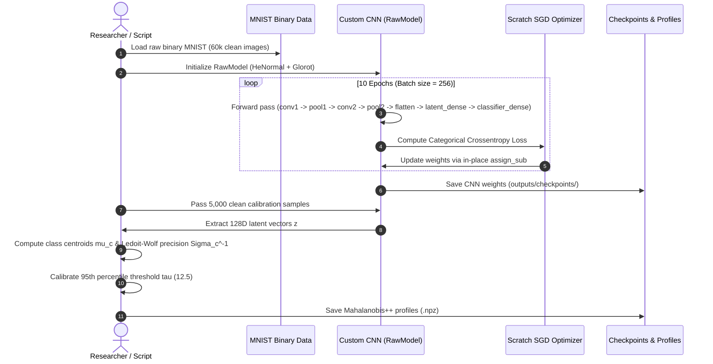
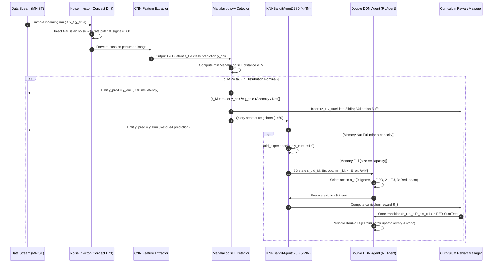
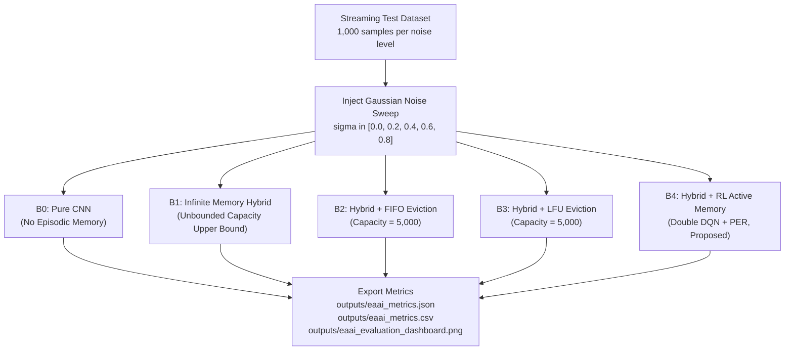

# End-to-End Data Flow

> Part of the [Active Episodic Memory Management via Reinforcement Learning for Robust CNN Inference on Out-of-Distribution Data](../../README.md) documentation.
> Parent: [System Architecture](README.md) | Up: [System Architecture](README.md)

---

## 1. Overview and Operational Modes

The semiparametric vision pipeline operates across three distinct operational regimes during its lifecycle:
1. **Training Mode (Offline Parametric Phase):** Offline learning of convolutional feature representations from clean data, followed by latent space distribution profiling with Mahalanobis++.
2. **Online Simulation Mode (Continual RL Training Phase):** Streaming prequential execution where the RL agent actively curates the episodic memory under non-stationary concept drift and Gaussian noise injection.
3. **Evaluation Mode (EAAI 5-Baseline Benchmark Phase):** Comparative stress testing of the complete system against four competitive baselines across progressive perturbation intensities.

---

## 2. Operational Mode 1: Training Pipeline (Offline Phase)

Before real-time edge streaming or RL curation can occur, the CNN is trained and the latent space is statistically profiled.

### Key Steps:
1. **Model Training:** `scripts/train_cnn.py` trains `RawModel` for 10 epochs using custom SGD, achieving $> 98.7\%$ accuracy.
2. **Latent Profiling:** `scripts/profile_latent.py` or `MahalanobisPlusPlus.fit()` extracts 128D embeddings for $N=5,000$ training samples.
3. **Covariance Shrinkage:** Ledoit-Wolf regularization computes positive-definite precision matrices for all 10 classes without singularity.
4. **Threshold Calibration:** The 95th percentile of clean in-distribution distances is recorded ($\tau = 12.5$).

---

## 3. Operational Mode 2: Online Simulation Mode (Streaming & Concept Drift)

Implemented in [`training/train_rl_online_simulation.py`](../../training/train_rl_online_simulation.py), this mode simulates a non-stationary streaming data feed over 50,000 prequential steps.

---

## 4. Operational Mode 3: Evaluation Mode (5-Baseline Benchmark)

Implemented in [`evaluate_hybrid_global.py`](../../evaluate_hybrid_global.py), this mode stress-tests the complete system against four baselines under progressive noise levels ($\sigma \in [0.0, 0.2, 0.4, 0.6, 0.8]$):

---

## 5. The Prequential Protocol (Test-Then-Train)

In non-stationary streaming machine learning (Haug et al., 2022; Wu et al., 2026), conventional static train/test splits are invalid because data distributions evolve over time.

This project implements the **prequential (test-then-train) protocol**:
1. **Evaluation Phase:** Each incoming streaming instance $x_t$ is first evaluated by the system to produce a prediction $\hat{y}_t$ and compute instantaneous accuracy, latency, and error metrics.
2. **Inspection Phase:** The latent representation $z_t$ and uncertainty metrics are evaluated by the Mahalanobis++ arbiter.
3. **Training / Adaptation Phase:** Only *after* prediction is logged can the instance be used to update the episodic memory buffer, sliding validation buffer, or RL experience replay.

This protocol guarantees zero data leakage and models realistic edge deployment where ground-truth feedback arrives after operational decisions are taken.

---

## 6. Concept Drift Simulation and Noise Perturbation Mechanics

To rigorously assess resilience on resource-constrained hardware, the system simulates real and virtual concept drift (Pittorino & Roveri, 2026):

### 6.1. Additive Gaussian Perturbation
Corrupted samples are generated using `inject_noise(batch, noise_level)`:
$$x_{\text{corrupt}} = \text{clip}\left(x + \mathcal{N}(0, \sigma^2 I), 0.0, 1.0\right)$$
where $\sigma \in [0.0, 0.8]$ controls noise intensity, and clipping enforces valid normalized grayscale pixel intensities.

### 6.2. Virtual vs. Real Concept Drift
- **Virtual Concept Drift (Covariate Shift):** Perturbations with low-to-moderate noise ($\sigma \le 0.4$) alter the input distribution $P(X)$ without changing class identity $P(Y \mid X)$. The CNN latent vector shifts away from class centroids, increasing Mahalanobis distance.
- **Real Concept Drift (Boundary Shift):** Severe perturbations ($\sigma \ge 0.6$) obscure strokes and digits, shifting class posterior probabilities $P(Y \mid X)$ and causing standard CNN accuracy to collapse from $98.7\%$ to $32.2\%$.
- **Simulation Stress Parameters:** In online simulation, noise is injected with a rate of $p_{\text{noise}} = 0.10$ and intensity $\sigma = 0.60$ across 50,000 streaming steps.

---

## 7. Comparative Performance Across Operational Modes

The following table summarizes execution characteristics across all three operational modes:

| Metric / Dimension | Training Mode (CNN) | Online Simulation (RL) | Evaluation Mode (EAAI) |
|:---|:---|:---|:---|
| **Data Scope** | 60,000 clean samples | 50,000 streaming steps | 5,000 test samples (5 noise levels) |
| **Execution Latency** | $\approx 45$ s (10 epochs on GPU) | $\approx 180$ s (50k steps) | $\approx 25$ s (across all 5 baselines) |
| **Memory Allocation** | Dynamic GPU VRAM ($\approx 1.2$ GB) | Bounded RAM ($\approx 2.7$ MB buffer) | Strictly bounded ($C = 5,000$) |
| **Output Artifacts** | `outputs/checkpoints/` | `rl_agent_phase3.pt`, `train_rl_simulation_log.csv` | `eaai_metrics.json`, `eaai_evaluation_dashboard.png` |

---

**Navigation:**
- Previous: [Reward System](reward-system.md)
- Up: [System Architecture](README.md)
- Next: [Documentation Index](../README.md)

---
Licensed under the GNU General Public License v3.0. See [LICENSE](../../LICENSE) for details.
