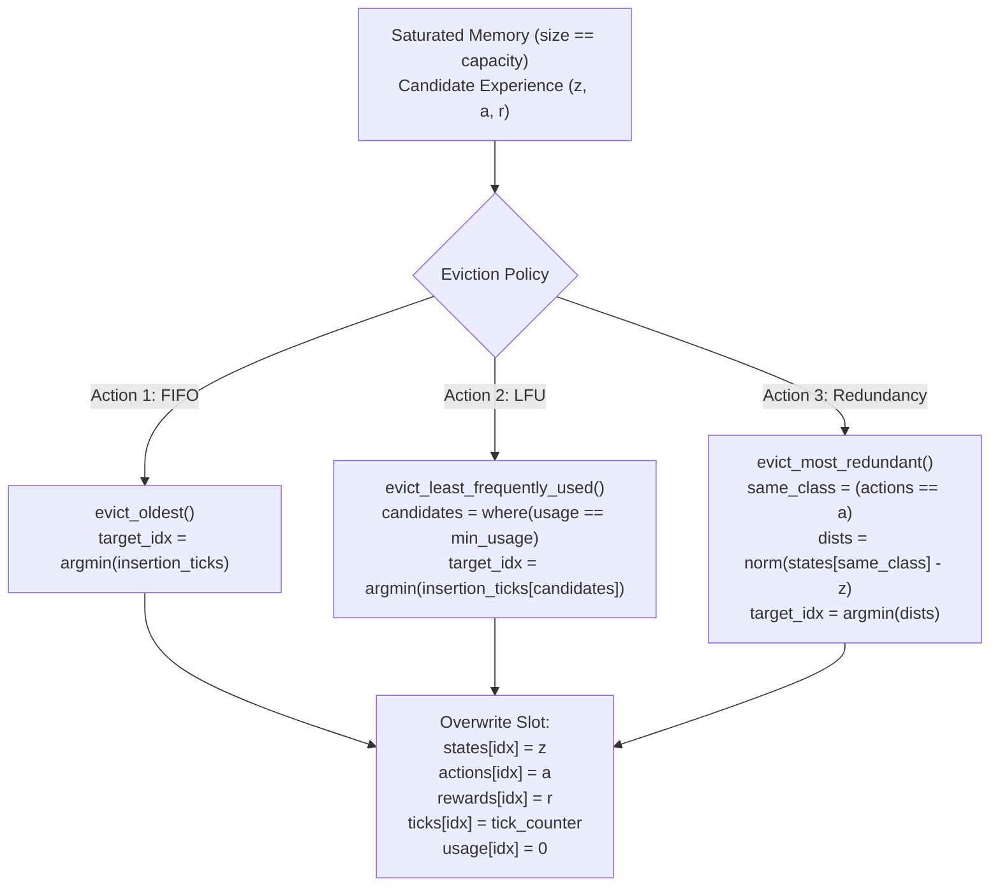

# Episodic Memory: Capacity-Bounded k-NN Buffer

> Part of the [Active Episodic Memory Management via Reinforcement Learning for Robust CNN Inference on Out-of-Distribution Data](../../README.md) documentation.
> Parent: [System Architecture](README.md) | Up: [System Architecture](README.md)

---

## 1. Overview and Design Rationale

The non-parametric memory subsystem is implemented by the `KNNBanditAgent128D` class in [`src/models/knn_bandit_agent.py`](../../src/models/knn_bandit_agent.py). It serves as an instance-based cache that stores past experiences—represented as tuples of latent state, action label, and reward $(z_i, a_i, r_i)$—to rescue predictions when the parametric CNN detects ambiguous, noisy, or Out-of-Distribution (OOD) inputs.

### Why Pre-Allocated NumPy Buffers Over Dynamic Python Lists?
Standard implementations of episodic buffers in deep RL rely on Python lists (`list.append()`) or dynamic deque structures. For Edge AI deployment, this approach introduces severe operational vulnerabilities:
1. **Out-of-Memory (OOM) Protection:** Unbounded dynamic lists expand uncontrollably as data streams arrive, crashing edge devices with limited physical RAM (e.g., 2 GB–4 GB). Pre-allocating a fixed capacity ($C = 5,000$) guarantees an immutable, strictly bounded memory footprint ($\approx 2.7$ MB).
2. **Zero Heap Reallocation:** Python lists store pointers to individual heap-allocated objects, causing pointer-chasing overhead and heap fragmentation. In contrast, pre-allocated NumPy arrays occupy contiguous C-order blocks of virtual memory, eliminating GC pauses and reallocations.
3. **$O(1)$ Insertion and Replacement:** Overwriting an existing slot in a pre-allocated array requires a simple index assignment with zero memory copying.
4. **Vectorized Hardware Acceleration:** Contiguous arrays allow BLAS/LAPACK vectorization, SIMD instructions, and GPU/CPU cache-line prefetching during Euclidean distance calculations.

---

## 2. Data Structure Specification

All experiences and metadata are maintained across five parallel NumPy arrays pre-allocated upon initialization:

```python
# src/models/knn_bandit_agent.py
self._states = np.zeros((self.capacity, self.latent_dim), dtype=np.float32)
self._actions = np.zeros(self.capacity, dtype=np.int32)
self._rewards = np.zeros(self.capacity, dtype=np.float32)
self._insertion_ticks = np.zeros(self.capacity, dtype=np.int64)
self._usage_counts = np.zeros(self.capacity, dtype=np.int32)
```

| Field / Attribute | Data Type | Array Shape | Purpose |
|:------------------|:----------|:------------|:--------|
| `_states` | `np.float32` | `(capacity, 128)` | 128D latent feature vectors extracted by the CNN |
| `_actions` | `np.int32` | `(capacity,)` | Target classification labels: $\{0, \dots, 9\}$ for MNIST/CIFAR-10 and $\{0, \dots, 99\}$ for CIFAR-100 |
| `_rewards` | `np.float32` | `(capacity,)` | Experienced rewards ($+1.0$ for correct, $-1.0$ for error) |
| `_insertion_ticks` | `np.int64` | `(capacity,)` | Monotonically increasing logical timestamps for FIFO ordering |
| `_usage_counts` | `np.int32` | `(capacity,)` | Frequency of times this prototype was retrieved as a top-$k$ neighbor |
| `capacity` | `int` | Scalar (`5000`) | Maximum buffer capacity across all datasets |
| `k` | `int` | Scalar (`30` or `10`) | Nearest neighbors queried during prediction: $k=30$ (MNIST), $k=10$ (CIFAR-10 and CIFAR-100) |
| `size` | `int` | Scalar ($0 \le \text{size} \le C$) | Current number of active slots filled in memory |
| `tick_counter` | `int` | Scalar | Global logical clock incremented on each insertion/eviction |

At full capacity ($C = 5,000$), each class maintains an average allocation of 500 prototypes in 10-class regimes (MNIST, CIFAR-10) and 50 prototypes in the fine-grained 100-class regime (CIFAR-100), occupying a strictly bounded raw feature footprint of $5,000 \times 128 \times 4\text{ bytes} \approx 2.56\text{ MB}$.

---

## 3. Experience Insertion Mechanics

The `add_experience` method manages insertion in $O(1)$ time:

```python
# src/models/knn_bandit_agent.py
def add_experience(self, state: np.ndarray, action: int, reward: float) -> None:
    state_flat = np.asarray(state, dtype=np.float32).reshape(-1)

    if self.size < self.capacity:
        idx = self.size
        self._states[idx] = state_flat
        self._actions[idx] = int(action)
        self._rewards[idx] = float(reward)
        self._insertion_ticks[idx] = self.tick_counter
        self._usage_counts[idx] = 0
        self.size += 1
        self.tick_counter += 1
    else:
        self.evict_oldest(state_flat, action, reward)
```

- **Filling Phase (`size < capacity`):** The new prototype occupies slot `idx = size`, resets `_usage_counts[idx] = 0`, sets `_insertion_ticks[idx] = tick_counter`, and increments both `size` and `tick_counter`.
- **Saturated Phase (`size == capacity`):** The buffer has reached capacity. By default, it invokes mechanical FIFO eviction (`evict_oldest`) to overwrite the oldest entry, unless overridden by the RL active eviction policy.

---

## 4. Vectorized $k$-NN Retrieval and Inverse Distance Weighting

When a query $z_q \in \mathbb{R}^{128}$ arrives, the buffer executes a vectorized search across the active memory slice `[:self.size]`:

```python
# src/models/knn_bandit_agent.py
diff = self._states[:self.size] - query_flat
dists = np.linalg.norm(diff, axis=1)

if actual_k < self.size:
    partition_idx = np.argpartition(dists, actual_k - 1)[:actual_k]
    sorted_order = np.argsort(dists[partition_idx])
    nearest_indices = partition_idx[sorted_order]
else:
    nearest_indices = np.argsort(dists)[:actual_k]
```

### Algorithmic Complexity:
1. **Distance Calculation:** $O(N \cdot D)$ vectorized matrix-vector subtraction and Euclidean norm.
2. **Partial Partition (`np.argpartition`):** Finds the top-$k$ smallest elements in $O(N)$ expected time, avoiding an expensive full $O(N \log N)$ sort over the entire buffer.
3. **Local Sorting (`np.argsort`):** Sorts only the $k$ partitioned elements in $O(k \log k)$ time ($k=30$ for MNIST, $k=10$ for CIFAR-10 and CIFAR-100).

### Decision Voting (Inverse Distance Weighting):
For each queried neighbor $i \in \{1, \dots, k\}$, an importance weight is computed inversely proportional to Euclidean distance:
$$w_i = \frac{1}{d_i + \epsilon}$$
where $\epsilon = 10^{-8}$ prevents division by zero. The expected reward for each candidate action $a \in \mathcal{Y}$ is aggregated across the neighborhood:
$$R_{\text{expected}}(a) = \sum_{i \in \text{Neighbors}, a_i = a} r_i \cdot w_i$$
where $\mathcal{Y} = \{0, \dots, 9\}$ for MNIST and CIFAR-10, and $\mathcal{Y} = \{0, \dots, 99\}$ for CIFAR-100. The predicted class is the action maximizing expected return:
$$\hat{y} = \arg\max_{a \in \mathcal{Y}} R_{\text{expected}}(a)$$

Negative rewards ($r_i = -1.0$) stored from historical CNN errors act as repulsive barriers, penalizing wrong classes and rescuing corrupted predictions.

---

## 5. Active Eviction Policies

When the memory buffer is saturated, the system can invoke one of three discrete mechanical eviction policies:



### 5.1. First-In-First-Out (`evict_oldest`)
- **Criterion:** Discards the entry with the smallest insertion timestamp:
  $$\text{target\_idx} = \arg\min_{i \in [0, \text{size}-1]} \text{\_insertion\_ticks}[i]$$
- **Complexity:** $O(N)$ scan.
- **Drawback:** Discards foundational anchor prototypes that remain critical for classification.

### 5.2. Least Frequently Used (`evict_least_frequently_used`)
- **Criterion:** Discards entries with the minimum usage count (`_usage_counts`). Ties are broken deterministically by selecting the oldest entry among candidates:
  $$\text{candidates} = \{i \mid \text{\_usage\_counts}[i] = \min(\text{\_usage\_counts})\}$$
  $$\text{target\_idx} = \arg\min_{i \in \text{candidates}} \text{\_insertion\_ticks}[i]$$
- **Complexity:** $O(N)$ scan.
- **Advantage:** Preserves frequently queried landmark prototypes.

### 5.3. Redundancy Eviction (`evict_most_redundant`)
- **Criterion:** Identifies prototypes sharing the **exact same class label** ($a_i = a_{\text{new}}$) and evicts the geometric nearest neighbor:
  $$\text{target\_idx} = \arg\min_{i \in \text{Class}(a_{\text{new}})} \|z_i - z_{\text{new}}\|_2$$
  If no stored prototype belongs to class $a_{\text{new}}$, it safely falls back to LFU eviction.
- **Advantage:** Eliminates clustering redundancy and preserves class manifold balance. In the high-entropy 100-class CIFAR-100 regime where capacity is tightly bounded ($C = 5,000 / 100 = 50\text{ prototypes/class}$), naive FIFO eviction causes severe class starvation ($D_{KL} = 2.6551\text{ nats}$). In contrast, Action 3 (intra-class redundancy pruning) selectively evicts prototypes closest to the new exemplar within the same class, completely eliminating class extinction and maintaining near-zero distribution skew ($D_{KL} = 2.25 \times 10^{-8}\text{ nats} \approx 0.0000\text{ nats}$, representing a $> 1.1 \times 10^8 \times$ reduction in class imbalance).

---

## 6. Memory Diagnostics

The `get_memory_stats()` method exports runtime health telemetry:

```python
# src/models/knn_bandit_agent.py
stats = memory.get_memory_stats()
```

### Output Specification:
```json
{
  "size": 5000,
  "capacity": 5000,
  "occupancy_pct": 100.0,
  "reward_mean": 0.842,
  "reward_positive_pct": 92.1,
  "actions_distribution": {
    "0": 512, "1": 534, "2": 498, "3": 505, "4": 491,
    "5": 487, "6": 510, "7": 522, "8": 479, "9": 462
  }
}
```

---

## 7. Persistence and Benchmark Performance

### File Format and Storage Targets
Serialized via `np.savez_compressed`:
- **MNIST Memory Bank:** [`outputs/mnist/knn_memory_bank_128d.npz`](file:///c:/Users/sanfr/Desktop/projetos-gecad/projeto-cnn/outputs/mnist/knn_memory_bank_128d.npz)
- **CIFAR-10 Memory Bank:** [`outputs/cifar10/knn_memory_bank_128d.npz`](file:///c:/Users/sanfr/Desktop/projetos-gecad/projeto-cnn/outputs/cifar10/knn_memory_bank_128d.npz)
- **CIFAR-100 Memory Bank:** [`outputs/cifar100/knn_memory_bank.npz`](file:///c:/Users/sanfr/Desktop/projetos-gecad/projeto-cnn/outputs/cifar100/knn_memory_bank.npz)

Each archive contains:
- `states`: Shape `(size, 128)`, `float32`
- `actions`: Shape `(size,)`, `int32`
- `rewards`: Shape `(size,)`, `float32`
- `insertion_ticks`: Shape `(size,)`, `int64`
- `usage_counts`: Shape `(size,)`, `int32`
- `size`, `capacity`, `tick_counter`, `latent_dim`: Scalar integers

### Performance Benchmarks:
- **Sequential Ingestion:** 10,000 continuous insertions execute in **35.54 ms** ($\approx 281,000$ experiences/second).
- **$k$-NN Query Latency:** Querying $k=10$ or $k=30$ neighbors over a saturated buffer ($N=5,000, D=128$) takes **0.38 ms** on modern x86 CPU cores.

---

## 8. Scientific References

1. **Pritzel et al. (2017):** *Neural Episodic Control.* Proceedings of the 34th International Conference on Machine Learning (ICML 2017).
2. **Blundell et al. (2016):** *Model-Free Episodic Control.* arXiv:1606.04460.
3. **Isele & Cosgun (2018):** *Selective Experience Replay for Lifelong Learning.* Proceedings of the AAAI Conference on Artificial Intelligence (AAAI 2018).

---

**Navigation:**
- Previous: [OOD Detection](ood-detection.md)
- Up: [System Architecture](README.md)
- Next: [RL Agent](rl-agent.md)

---
Licensed under the GNU General Public License v3.0. See [LICENSE](../../LICENSE) for details.
