# Out-of-Distribution Detection: Mahalanobis++ and Dual Uncertainty Arbiter

> Part of the [Active Episodic Memory Management via Reinforcement Learning for Robust CNN Inference on Out-of-Distribution Data](file:///c:/Users/sanfr/Desktop/projetos-gecad/projeto-cnn/README.md) documentation.  
> Parent: [System Architecture](file:///c:/Users/sanfr/Desktop/projetos-gecad/projeto-cnn/docs/architecture/README.md) | Up: [System Architecture](file:///c:/Users/sanfr/Desktop/projetos-gecad/projeto-cnn/docs/architecture/README.md)

---

## 1. Overview and Rationale

In safety-critical Edge AI deployments, deep vision networks encounter inputs corrupted by sensor degradation, low illumination, lens smearing, and non-stationary environment drift. Standard neural networks output uncalibrated, overconfident predictions on anomalous inputs because the softmax function maps arbitrary high logit activations to probabilities approaching 1.0.

To provide dependable inference, the architecture incorporates an **Uncertainty & Out-of-Distribution (OOD) Arbiter** that inspects the 128D latent bottleneck space before final classification. Depending on the complexity and chromatic statistics of the visual domain, the system deploys one of two mathematically grounded routing mechanisms:

1. **Mahalanobis++ (MNIST Regime):** Evaluates $L_2$-normalized representations on the unit hypersphere $\mathbb{S}^{127}$ against class-conditional Gaussian centroids and Ledoit-Wolf regularized covariance matrices.
2. **Dual Uncertainty Arbiter (CIFAR-10 Regime):** Fuses representational discrepancy (unnormalized Mahalanobis distance) with predictive uncertainty (Shannon entropy of Softmax posteriors), providing provable coverage against both aleatoric noise and epistemic shift on natural image manifolds (Kaur et al., ICML 2021; Nguyen, 2026).

---

## 2. Mathematical Formulations

### 2.1. Regime 1: Mahalanobis++ on Unit Hypersphere (MNIST)

#### Classical Mahalanobis Distance
Given a latent vector $z \in \mathbb{R}^{D}$ ($D=128$), class centroid $\mu_c \in \mathbb{R}^{D}$, and covariance $\Sigma_c \in \mathbb{R}^{D \times D}$, the classical Mahalanobis distance is:
$$D_M(z, c) = \sqrt{(z - \mu_c)^T \Sigma_c^{-1} (z - \mu_c)}$$

#### $L_2$ Normalization (Unit Hypersphere Projection)
On stylized grayscale digits, raw activation norms vary widely across classes, inflating distance variance. Following Guo et al. (2025), Mahalanobis++ projects latent representations onto the unit hypersphere $\mathbb{S}^{D-1}$:
$$z_{\text{norm}} = \frac{z}{\|z\|_2 + \epsilon}, \quad \epsilon = 10^{-8}$$
On the hypersphere, the metric evaluates directional deviation scaled by regularized precision:
$$D_{M}^{++}(z_{\text{norm}}, c) = \sqrt{(z_{\text{norm}} - \mu_c)^T \Sigma_c^{-1} (z_{\text{norm}} - \mu_c)}$$
The minimum distance across all $C=10$ classes is selected:
$$D_{M}^{++}(z_{\text{norm}}) = \min_{c \in \{0, \dots, C-1\}} D_{M}^{++}(z_{\text{norm}}, c)$$

#### Ledoit-Wolf Analytic Covariance Shrinkage
To prevent numerical singularity when inverting empirical covariance matrices $\Sigma_c$ with finite sample partitions, Mahalanobis++ applies **Ledoit-Wolf Analytic Shrinkage** (Chen et al., 2010):
$$\Sigma_{\text{LW}} = (1 - \rho) \Sigma_{\text{sample}} + \rho \nu I$$
where $\nu = \frac{1}{D} \text{Tr}(\Sigma_{\text{sample}})$ and $\rho \in [0, 1]$ is the analytically optimal shrinkage intensity minimizing quadratic risk. This guarantees that precision matrices $\Sigma_{\text{LW}}^{-1}$ are strictly positive definite and numerically stable on edge hardware.

---

### 2.2. Regime 2: Dual Uncertainty Arbiter (CIFAR-10)

#### Why Natural Manifolds Require Dual Uncertainty
On natural RGB images (CIFAR-10), $L_2$ normalization suppresses informative feature scale variance across complex backgrounds and textures. Furthermore, deep neural networks on natural images can exhibit two distinct failure modes:
1. **Representational Outliers (Epistemic Shift):** Samples whose latent representations lie far outside any nominal training cluster, detectable via unnormalized Mahalanobis distance.
2. **Predictive Ambiguity (Aleatoric Noise):** Samples that fall close to class decision boundaries where the network outputs high-entropy, diffused predictions across multiple classes.

#### Mathematical Formulation
The `DualUncertaintyArbiter` ([`src/cifar10/ood_arbiter.py`](file:///c:/Users/sanfr/Desktop/projetos-gecad/projeto-cnn/src/cifar10/ood_arbiter.py)) computes two complementary uncertainty signals:

1. **Unnormalized Mahalanobis Distance:**
   $$d_M(z) = \min_{c \in \{0, \dots, 9\}} \sqrt{(z - \mu_c)^T \Sigma_c^{-1} (z - \mu_c)}$$
   Fitted on raw unnormalized 128D latent vectors using Ledoit-Wolf regularized empirical precision.

2. **Predictive Shannon Entropy:**
   $$H(p) = -\sum_{c=0}^{9} p_c \ln(p_c + \epsilon)$$
   where $p \in \Delta^9$ is the Softmax posterior distribution emitted by `RawModelCIFAR10`.

#### Dual Decision Rule
A query is flagged as uncertain/OOD and routed to the episodic memory if **either** condition exceeds its calibrated in-distribution threshold:
$$\text{Is\_OOD}(z, p) = \left( d_M(z) > \tau_M \right) \quad \lor \quad \left( H(p) > \tau_H \right)$$

---

## 3. Threshold Calibration Protocols

Both arbiters are calibrated empirically on clean in-distribution training data using the 95th-percentile rule:

| Calibration Parameter | MNIST Mahalanobis++ | CIFAR-10 Dual Uncertainty |
|:---|:---:|:---:|
| **Source Script** | [`scripts/profile_latent.py`](file:///c:/Users/sanfr/Desktop/projetos-gecad/projeto-cnn/scripts/profile_latent.py) | [`scripts/cifar10/profile_latent.py`](file:///c:/Users/sanfr/Desktop/projetos-gecad/projeto-cnn/scripts/cifar10/profile_latent.py) |
| **Calibration Set** | 5,000 clean training features | 5,000 clean training features |
| **Percentile Target** | $95.0\text{th}$ percentile | $95.0\text{th}$ percentile |
| **Mahalanobis Threshold ($\tau_M$)** | $\tau = 12.5$ | $\tau_M = 16.0380$ |
| **Entropy Threshold ($\tau_H$)** | N/A | $\tau_H = 0.7382\text{ nats}$ |
| **Rejection Mechanism** | Single geometric threshold | Logical OR of geometric and predictive bounds |

Any sample within nominal bounds has $\ge 95\%$ probability of belonging to the in-distribution training manifold. Corrupted or out-of-distribution inputs trigger immediate rescue routing.

---

## 4. Routing Logic and Flowchart

```mermaid
flowchart TD
    subgraph InputQuery["1. Input Query"]
        Z["Latent Bottleneck Vector z in R^128"]
        P["Softmax Posterior Probabilities p in Delta^9"]
    end

    subgraph MNISTRouting["2. MNIST Routing Path (Mahalanobis++)"]
        NORM["L2 Hypersphere Normalization:<br>z_norm = z / ||z||_2"]
        MAHA_M["Evaluate Min Mahalanobis Distance:<br>d_M = min_c d_M(z_norm, c)"]
        CHECK_M{"d_M <= 12.5?"}
        
        Z -.-> NORM --> MAHA_M --> CHECK_M
    end

    subgraph CIFAR10Routing["3. CIFAR-10 Routing Path (Dual Uncertainty)"]
        MAHA_C["Compute Unnormalized Mahalanobis:<br>d_M(z) = min_c d_M(z, c)"]
        ENT_C["Compute Shannon Entropy:<br>H(p) = -sum p_c ln(p_c)"]
        CHECK_C{"d_M <= 16.04<br>AND<br>H(p) <= 0.74 nats?"}
        
        Z -.-> MAHA_C --> CHECK_C
        P -.-> ENT_C --> CHECK_C
    end

    subgraph ExecutionTargets["4. Execution Targets"]
        CNN_EXEC["Parametric CNN Inference<br>y = argmax(p)<br>Latency: < 2.5 ms | B0 Nominal"]
        KNN_EXEC["Route to Episodic Memory<br>Non-parametric k-NN Rescue<br>Latency: < 7.0 ms | B4 Active"]
        
        CHECK_M -->|Yes: Nominal| CNN_EXEC
        CHECK_M -->|No: Anomaly| KNN_EXEC
        CHECK_C -->|Yes: Nominal| CNN_EXEC
        CHECK_C -->|No: Uncertain| KNN_EXEC
    end

    style InputQuery fill:#1f242c,stroke:#388bfd,stroke-width:1px
    style MNISTRouting fill:#1f242c,stroke:#a371f7,stroke-width:1px
    style CIFAR10Routing fill:#1f242c,stroke:#d29922,stroke-width:1px
    style ExecutionTargets fill:#1f242c,stroke:#2ea043,stroke-width:1px
```



---

## 5. Profile Serialization and Persistence

To ensure instantaneous edge startup without recomputing covariance matrices:
- **MNIST Profiles:** Serialized to [`outputs/mnist/mahalanobis_pp_profiles.npz`](file:///c:/Users/sanfr/Desktop/projetos-gecad/projeto-cnn/outputs/mnist/mahalanobis_pp_profiles.npz).
- **CIFAR-10 Profiles:** Serialized to [`outputs/cifar10/mahalanobis_pp_profiles.npz`](file:///c:/Users/sanfr/Desktop/projetos-gecad/projeto-cnn/outputs/cifar10/mahalanobis_pp_profiles.npz).

Each archive stores:
1. `n_classes`: Scalar integer `10`.
2. `latent_dim`: Scalar integer `128`.
3. `threshold_mahalanobis`: Scalar float ($\tau_M$).
4. `threshold_entropy`: Scalar float ($\tau_H$).
5. `mu_{c}`: 1D array of shape `(128,)` storing centroid for class $c \in \{0, \dots, 9\}$.
6. `precision_{c}`: 2D regularized precision matrix of shape `(128, 128)` for class $c \in \{0, \dots, 9\}$.

---

## 6. Code Usage Example: Dual Uncertainty Arbiter

```python
import numpy as np
from src.cifar10.ood_arbiter import DualUncertaintyArbiter

# Instantiate Arbiter
arbiter = DualUncertaintyArbiter(n_classes=10, latent_dim=128)

# Load calibrated profiles
arbiter.load("outputs/cifar10/mahalanobis_pp_profiles.npz")
print(f"Loaded thresholds: tau_M = {arbiter.threshold_mahalanobis:.2f}, tau_H = {arbiter.threshold_entropy:.2f}")

# Evaluate streaming batch
z_batch = np.random.randn(8, 128).astype(np.float32)
p_batch = np.ones((8, 10), dtype=np.float32) / 10.0  # High entropy uniform

# Compute uncertainty routing
is_ood = arbiter.predict_batch(z_batch, p_batch)
dists = arbiter.compute_mahalanobis_batch(z_batch)
entropies = arbiter.compute_entropy_batch(p_batch)

for i in range(len(is_ood)):
    status = "OOD -> Route to Memory" if is_ood[i] else "In-Distribution -> CNN"
    print(f"Sample {i}: d_M={dists[i]:.2f}, H={entropies[i]:.2f} nats | Decision: {status}")
```

---

**Navigation:**
- Previous: [CNN Feature Extractor](file:///c:/Users/sanfr/Desktop/projetos-gecad/projeto-cnn/docs/architecture/cnn-feature-extractor.md)
- Up: [System Architecture](file:///c:/Users/sanfr/Desktop/projetos-gecad/projeto-cnn/docs/architecture/README.md)
- Next: [Episodic Memory Buffer](file:///c:/Users/sanfr/Desktop/projetos-gecad/projeto-cnn/docs/architecture/episodic-memory.md)

---

Licensed under the GNU General Public License v3.0. See [LICENSE](file:///c:/Users/sanfr/Desktop/projetos-gecad/projeto-cnn/LICENSE) for details.
