# Out-of-Distribution Detection: Mahalanobis++

> Part of the [Active Episodic Memory Management via Reinforcement Learning for Robust CNN Inference on Out-of-Distribution Data](../../README.md) documentation.
> Parent: [System Architecture](README.md) | Up: [System Architecture](README.md)

---

## 1. Overview and Purpose

In resource-constrained edge deployments, deep neural networks encounter inputs corrupted by physical sensor noise, lens smearing, lighting shifts, and environmental concept drift. Conventional classification networks output uncalibrated, overconfident predictions on anomalous inputs because the softmax function maps arbitrary high logit activations to probabilities approaching 1.0.

To provide trustworthy inference, the system integrates **Mahalanobis++**, an Out-of-Distribution (OOD) routing mechanism implemented in `MahalanobisPlusPlus` within [`training/train_rl_online_simulation.py`](../../training/train_rl_online_simulation.py). The detector monitors the 128D latent space of the CNN, computing geometric distances to nominal class manifolds to determine whether a query can be safely classified by the parametric CNN or must be routed to the $k$-NN episodic memory buffer for rescue.

---

## 2. Mathematical Formulation

### 2.1. Standard Mahalanobis Distance
Given a latent feature vector $z \in \mathbb{R}^{D}$ and nominal class statistics consisting of class centroid $\mu_c \in \mathbb{R}^{D}$ and class covariance matrix $\Sigma_c \in \mathbb{R}^{D \times D}$, the classical Mahalanobis distance is defined as:
$$D_M(z, c) = \sqrt{(z - \mu_c)^T \Sigma_c^{-1} (z - \mu_c)}$$

The distance measures how many standard deviations away $z$ lies from the center of class $c$, accounting for multi-dimensional feature correlations.

### 2.2. $L_2$ Normalization (Unit Hypersphere Projection)
Standard Mahalanobis distance suffers in deep feature spaces because feature magnitudes $\|z\|_2$ vary drastically across classes and activations, inflating distance variances and causing false alarms on high-norm nominal samples.

Following Guo et al. (2025), **Mahalanobis++** applies an $L_2$ normalization step prior to distance evaluation, projecting all latent vectors onto the unit hypersphere $\mathbb{S}^{D-1}$:
$$z_{\text{norm}} = \frac{z}{\|z\|_2 + \epsilon}$$
where $\epsilon = 10^{-8}$ prevents division by zero. On the unit hypersphere, the Mahalanobis distance simplifies to directional alignment scaled by regularized precision:
$$D_{M}^{++}(z_{\text{norm}}, c) = \sqrt{(z_{\text{norm}} - \mu_c)^T \Sigma_c^{-1} (z_{\text{norm}} - \mu_c)}$$

When evaluating an incoming query against all $C=10$ classes without prior label knowledge, the detector selects the distance to the closest class manifold:
$$D_{M}^{++}(z_{\text{norm}}) = \min_{c \in \{0, \dots, C-1\}} D_{M}^{++}(z_{\text{norm}}, c)$$

### 2.3. Ledoit-Wolf Shrinkage Covariance Regularization
In edge vision setups, computing empirical sample covariance matrices $\Sigma_c$ for $D = 128$ dimensions across finite memory partitions (e.g., $N_c \approx 500$ samples per class) is prone to ill-conditioning. The empirical covariance matrix:
$$\Sigma_{\text{sample}} = \frac{1}{N - 1} \sum_{i=1}^{N} (z_i - \mu)(z_i - \mu)^T$$
frequently has near-zero eigenvalues, causing its inverse (the precision matrix $\Sigma^{-1}$) to explode numerically.

To ensure well-conditioned precision matrices without manual cross-validation of ridge penalties, Mahalanobis++ applies **Ledoit-Wolf Analytic Shrinkage** (Chen et al., 2010):
$$\Sigma_{\text{LW}} = (1 - \rho) \Sigma_{\text{sample}} + \rho \nu I$$
where:
- $\nu = \frac{1}{D} \text{Tr}(\Sigma_{\text{sample}})$ is the mean variance across dimensions.
- $\rho \in [0, 1]$ is the analytically optimal shrinkage intensity computed from sample variance and asymptotic risk minimization.

This formulation guarantees that $\Sigma_{\text{LW}}$ is strictly positive definite, invertible, and numerically robust on edge hardware.

---

## 3. Threshold Calibration

The decision boundary separating In-Distribution (ID) from Out-of-Distribution (OOD) is calibrated empirically on nominal validation data:

```python
# training/train_rl_online_simulation.py
detector.calibrate_threshold(clean_features, percentile=95.0)
```

1. The detector processes $N=5,000$ clean in-distribution training features through the CNN.
2. It computes the minimum Mahalanobis++ distance for each sample: $\{d_1, d_2, \dots, d_N\}$.
3. The routing threshold $\tau$ is set to the **95th percentile** of these distances:
   $$\tau = \text{Percentile}_{95}(\{d_i\}_{i=1}^{N})$$
4. In the baseline system configuration ([`src/config.py`](../../src/config.py)), this empirical threshold is set to **$\tau = 12.5$**.

Any sample with $D_{M}^{++} \le \tau$ has a $95\%$ probability of belonging to the nominal training distribution. Samples exceeding $\tau$ are classified as anomalies, sensor corruption, or concept drift.

---

## 4. Routing Logic and Pipeline Decision Tree

The routing arbiter executes the following decision logic for each incoming visual query:

```mermaid
flowchart TD
    QUERY["Incoming Latent Vector z [128D]"] --> NORM["L2 Normalization:<br>z_norm = z / (||z||_2 + eps)"]
    NORM --> BATCH["Evaluate Mahalanobis++ Precision Matrix<br>Across All 10 Classes"]
    BATCH --> MIN_DIST["Extract Minimum Distance:<br>d_M = min_c d_M(z_norm, c)"]
    
    MIN_DIST --> DECISION{"Is d_M <= tau (12.5)?"}
    
    DECISION -->|Yes: In-Distribution| PATH_CNN["Route to Parametric CNN<br>Output: argmax(p_CNN)<br>Low Latency (0.48 ms)"]
    DECISION -->|No: Anomaly / Drift| PATH_KNN["Route to Episodic Memory<br>Output: k-NN Bandit Voting<br>Rescued Prediction"]
    
    style QUERY fill:#1f242c,stroke:#388bfd,stroke-width:1px
    style DECISION fill:#24292e,stroke:#d29922,stroke-width:2px
    style PATH_CNN fill:#1f242c,stroke:#2ea043,stroke-width:1px
    style PATH_KNN fill:#1f242c,stroke:#a371f7,stroke-width:1px
```



- **Nominal Path (Parametric CNN):** If $D_{M}^{++} \le \tau$, the sample is within nominal distribution boundaries. The system emits the CNN argmax prediction directly, avoiding memory queries.
- **Rescue Path (Episodic Memory):** If $D_{M}^{++} > \tau$, the sample has suffered semantic corruption or noise shift. The CNN probability distribution is considered untrustworthy, and the latent vector is dispatched to the episodic memory buffer for $k$-NN neighbor voting.

---

## 5. Profile Serialization and Persistence

To avoid recomputing class centroids and covariance inversions on each edge startup, the statistical profiles are saved to disk as a compressed `.npz` archive via `detector.save(path)`:

### File Format (`outputs/mahalanobis_pp_profiles.npz`)
- `n_classes`: Scalar integer `10`
- `latent_dim`: Scalar integer `128`
- `threshold`: Scalar float `12.5`
- `mu_0` $\dots$ `mu_9`: Arrays of shape `(128,)` storing class mean vectors
- `precision_0` $\dots$ `precision_9`: Arrays of shape `(128, 128)` storing inverted Ledoit-Wolf precision matrices $\Sigma_c^{-1}$

Loading takes $< 15$ ms from disk, establishing instant operational readiness on embedded hardware.

---

## 6. Code Usage Example

```python
# training/train_rl_online_simulation.py
import numpy as np
from training.train_rl_online_simulation import MahalanobisPlusPlus

# 1. Instantiate detector
detector = MahalanobisPlusPlus(n_classes=10, latent_dim=128, threshold=12.5)

# 2. Fit on clean reference embeddings (N=5000, D=128)
clean_features = np.random.randn(5000, 128).astype(np.float32)
clean_labels = np.random.randint(0, 10, size=5000).astype(np.int32)
detector.fit(clean_features, clean_labels)

# 3. Calibrate empirical threshold
threshold = detector.calibrate_threshold(clean_features, percentile=95.0)
print(f"Calibrated threshold: {threshold:.2f}")

# 4. Evaluate an unknown query vector
query = np.random.randn(128).astype(np.float32)
is_ood, distance = detector.is_out_of_distribution(query)

if is_ood:
    print(f"OOD Detected! Distance {distance:.2f} > {threshold:.2f}. Routing to k-NN.")
else:
    print(f"In-Distribution sample ({distance:.2f} <= {threshold:.2f}). Routing to CNN.")
```

---

## 7. Scientific References

1. **Guo et al. (2025):** *Mahalanobis++: Improved Out-of-Distribution Detection via Feature Normalization and Regularized Covariance.* IEEE Transactions on Pattern Analysis and Machine Intelligence.
2. **Chen et al. (2010):** *Shrinkage Algorithms for MMSE Covariance Estimation.* IEEE Transactions on Signal Processing, 58(10), 5016-5029.
3. **Lee et al. (2018):** *A Simple Unified Framework for Detecting Out-of-Distribution Samples and Adversarial Attacks.* Advances in Neural Information Processing Systems (NeurIPS 2018).
4. **Kamoi & Kobayashi (2020):** *Why is the Mahalanobis Distance Effective for Out-of-Distribution Detection?* arXiv:2003.00402.

---

**Navigation:**
- Previous: [CNN Feature Extractor](cnn-feature-extractor.md)
- Up: [System Architecture](README.md)
- Next: [Episodic Memory](episodic-memory.md)

---
Licensed under the GNU General Public License v3.0. See [LICENSE](../../LICENSE) for details.
