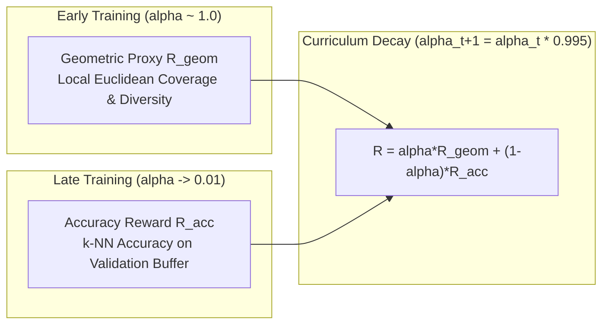

# Reward System: Curriculum Learning Reward Manager

> Part of the [Active Episodic Memory Management via Reinforcement Learning for Robust CNN Inference on Out-of-Distribution Data](../../README.md) documentation.
> Parent: [System Architecture](README.md) | Up: [System Architecture](README.md)

---

## 1. Overview and Curriculum Rationale

The reinforcement learning feedback signal is orchestrated by the `RewardManager` class in [`src/models/reward_manager.py`](../../src/models/reward_manager.py). Active memory curation presents a challenging credit assignment dilemma:
- **Cold-Start Problem:** In the early stages of training, the episodic memory contains sparse, incomplete prototype sets. Evaluating task classification accuracy at this stage provides noisy, uninformative reward signals with high variance.
- **Sparse Task Rewards:** Real-time classification accuracy on streaming data provides delayed feedback that does not directly indicate whether a specific memory slot eviction expanded or harmed manifold coverage.
- **Latency Constraints:** Computing full cross-validation accuracy over large datasets after every memory eviction would cause severe computational bottlenecks on edge devices.

To overcome these challenges, the system adopts a **Curriculum Learning Reward Architecture** that smoothly interpolates between an instantaneous, local **Geometric Density Proxy** ($R_{\text{geom}}$) and an empirical **Validation Accuracy Reward** ($R_{\text{acc}}$) evaluated over a sliding window of hard instances.

---

## 2. Mathematical Formulation of the Reward Signal

The composite reward $R_t \in [-1.0, 1.0]$ received by the RL agent after executing an eviction decision is defined as:
$$R_t = \alpha_t \cdot R_{\text{geom}} + (1 - \alpha_t) \cdot R_{\text{acc}}$$
where $\alpha_t \in [\alpha_{\min}, 1.0]$ is the dynamic curriculum interpolation weighting parameter.



---

## 3. Reward Components

### 3.1. Geometric Density Proxy ($R_{\text{geom}}$)
The geometric proxy rewards spatial diversity and penalizes redundant prototype clustering in the 128D latent space without requiring true labels.

Let $z_{\text{cand}} \in \mathbb{R}^{128}$ be the candidate feature vector, $M = \{z_1, \dots, z_N\}$ be the existing stored states in memory, and $\tau_{\text{geom}} = 1.0$ be the characteristic distance scale. The distance to the nearest existing prototype is:
$$d_{\min} = \min_{z_i \in M, i \ne \text{evicted}} \|z_i - z_{\text{cand}}\|_2$$

The reward formulation depends on whether the agent chose to insert or reject the candidate:

#### Case A: Candidate Inserted (Actions 1, 2, or 3 — `evicted_index >= 0`):
The agent is rewarded if the newly stored prototype expands coverage into empty latent space ($d_{\min} \gg \tau_{\text{geom}}$), and penalized if it duplicates an already occupied region ($d_{\min} \to 0$):
$$R_{\text{geom}} = 2 \cdot \left(\frac{d_{\min}}{d_{\min} + \tau_{\text{geom}}}\right) - 1.0$$
- If $d_{\min} = 0$ (exact duplicate stored): $R_{\text{geom}} = -1.0$ (maximum penalty).
- If $d_{\min} = \tau_{\text{geom}}$: $R_{\text{geom}} = 0.0$ (neutral).
- If $d_{\min} \gg \tau_{\text{geom}}$ (novel manifold coverage): $R_{\text{geom}} \to +1.0$ (maximum reward).

#### Case B: Candidate Rejected (Action 0: Ignore — `evicted_index == -1`):
The agent is rewarded for rejecting redundant points, and penalized for discarding novel prototypes:
$$R_{\text{geom}} = 1.0 - 2 \cdot \left(\frac{d_{\min}}{d_{\min} + \tau_{\text{geom}}}\right)$$
- If $d_{\min} \to 0$ (redundant candidate rejected): $R_{\text{geom}} = +1.0$ (rewarded for conserving cache space).
- If $d_{\min} \gg \tau_{\text{geom}}$ (novel prototype discarded): $R_{\text{geom}} \to -1.0$ (penalized for information loss).

---

### 3.2. Empirical Validation Accuracy Reward ($R_{\text{acc}}$)
As the memory fills, the policy must be grounded in actual classification performance. Evaluating accuracy on the entire training set would be computationally prohibitive; instead, the system maintains a circular **Sliding Validation Buffer** of hard/anomalous samples.

The accuracy reward computes the $k$-NN classification accuracy of the updated episodic memory over $K_{\text{eval}} = \min(|V|, 15)$ samples drawn from the validation buffer:
$$\text{Acc}_{\text{val}} = \frac{1}{K_{\text{eval}}} \sum_{j=1}^{K_{\text{eval}}} \mathbb{I}\left(\hat{y}_j^{(\text{k-NN})} = y_j^{(\text{val})}\right)$$

This accuracy is centered and scaled into the range $[-1.0, 1.0]$:
$$R_{\text{acc}} = 2 \cdot \text{Acc}_{\text{val}} - 1.0$$
- $100\%$ validation accuracy: $R_{\text{acc}} = +1.0$.
- $50\%$ validation accuracy: $R_{\text{acc}} = 0.0$.
- $0\%$ validation accuracy: $R_{\text{acc}} = -1.0$.

Bounding evaluation to a maximum of 15 samples ensures deterministic, sub-millisecond execution times suitable for edge streaming loops.

---

## 4. Circular Sliding Validation Buffer

The validation set is maintained as a pre-allocated circular buffer of capacity $B_{\text{val}} = 100$ instances:

```python
# src/models/reward_manager.py
self._val_states = np.zeros((self.buffer_size, self.latent_dim), dtype=np.float32)
self._val_labels = np.zeros(self.buffer_size, dtype=np.int32)
self._val_size = 0
self._val_ptr = 0
```

### Ingestion Condition:
A sample $(z_t, y_t)$ is inserted into the validation buffer whenever:
1. The CNN prediction is incorrect ($\hat{y}_{\text{CNN}} \ne y_t$).
2. The Mahalanobis++ distance indicates an Out-of-Distribution shift ($d_M > \tau$).

This guarantees that the validation set is composed exclusively of difficult edge cases and drift prototypes, providing a stringent benchmark for memory rescue capability.

---

## 5. Curriculum Alpha Decay Dynamics

The curriculum parameter $\alpha$ begins at $1.0$ (100% geometric guidance) and decays exponentially after each reward computation:
$$\alpha_{t+1} = \max\left(\alpha_{\min}, \alpha_t \cdot \gamma_{\alpha}\right)$$
where:
- $\gamma_{\alpha} = 0.995$ is the decay rate per step ([`src/config.py`](../../src/config.py)).
- $\alpha_{\min} = 0.01$ is the lower bound, preserving a residual 1% geometric regularization to prevent buffer collapse in stationary phases.

### Transition Timeline (50,000 Step Simulation):
- **Step 0:** $\alpha = 1.000$ (pure geometric exploration).
- **Step 500:** $\alpha \approx 0.082$ (rapid shift toward accuracy feedback).
- **Step 1,000:** $\alpha \approx 0.010$ (fully grounded in empirical accuracy).
- **Steps 1,000–50,000:** $\alpha = 0.010$ (stable asymptotic policy refinement).

---

## 6. Code Usage Example

```python
# src/models/reward_manager.py
import numpy as np
from src.models.reward_manager import RewardManager
from src.models.knn_bandit_agent import KNNBanditAgent128D

# 1. Initialize components
memory = KNNBanditAgent128D(capacity=5000, k=30, latent_dim=128)
reward_mgr = RewardManager(buffer_size=100, alpha_decay=0.995, min_alpha=0.01)

# Pre-fill memory to capacity
memory.add_experience_batch(
    states=np.random.randn(5000, 128).astype(np.float32),
    actions=np.random.randint(0, 10, size=5000),
    rewards=np.ones(5000, dtype=np.float32),
)

# 2. Simulate incoming hard sample
new_latent = np.random.randn(128).astype(np.float32)
true_label = 3
cnn_pred = 7

# Register in validation buffer
reward_mgr.update_validation_buffer(new_latent, true_label, cnn_pred)

# 3. Simulate FIFO eviction (Action 1)
evicted_slot = memory.evict_oldest(new_latent, true_label, reward=1.0)

# 4. Compute composite reward
reward = reward_mgr.compute_reward(
    evicted_index=evicted_slot,
    memory=memory,
    new_state=new_latent,
)

print(f"Computed composite reward: {reward:+.4f} (current alpha: {reward_mgr.get_current_alpha():.4f})")
```

---

## 7. Scientific References

1. **Blundell et al. (2016):** *Model-Free Episodic Control.* arXiv:1606.04460.
2. **Pritzel et al. (2017):** *Neural Episodic Control.* Proceedings of the 34th International Conference on Machine Learning (ICML 2017).
3. **Freitag et al. (2024):** *Multi-Stage Reward Curricula for Complex Reinforcement Learning Problems.* Reinforcement Learning Journal.
4. **Isele & Cosgun (2018):** *Selective Experience Replay for Lifelong Learning.* Proceedings of the AAAI Conference on Artificial Intelligence (AAAI 2018).

---

**Navigation:**
- Previous: [RL Agent](rl-agent.md)
- Up: [System Architecture](README.md)
- Next: [Data Flow](data-flow.md)

---
Licensed under the GNU General Public License v3.0. See [LICENSE](../../LICENSE) for details.
