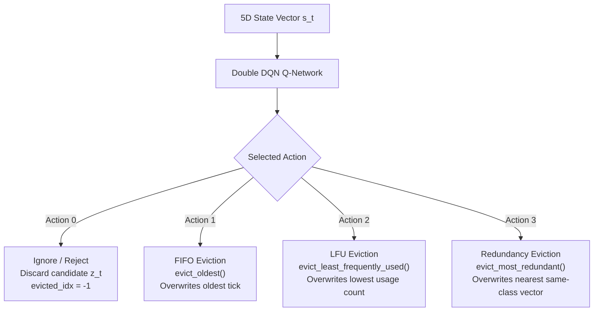
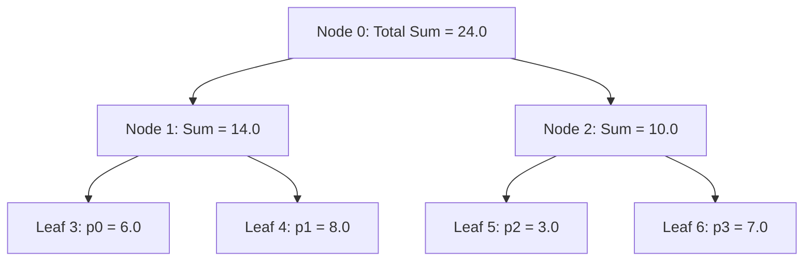

# RL Agent: Double DQN with Prioritized Experience Replay

> Part of the [Active Episodic Memory Management via Reinforcement Learning for Robust CNN Inference on Out-of-Distribution Data](../../README.md) documentation.
> Parent: [System Architecture](README.md) | Up: [System Architecture](README.md)

---

## 1. Overview and Role in the Architecture

The active memory manager is implemented by the `RLAgent` class in [`src/models/rl_agent.py`](../../src/models/rl_agent.py). In an edge streaming deployment subject to non-stationary concept drift and sensor corruption, a static or heuristic eviction policy inevitably degrades buffer utility:
- Blind FIFO constantly drops early representative anchors.
- Blind LFU penalizes newly introduced drift patterns before they can be retrieved.
- Blind clustering discards semantic class boundaries.

To dynamically resolve this problem, the RL agent acts as an **active cognitive governor**: it inspects a 5D state vector summarizing uncertainty, local geometric density, and buffer occupancy, selecting between four distinct memory management actions to maintain a balanced, highly discriminative episodic prototype buffer.

---

## 2. Agent Architecture

The agent is designed for ultra-low inference latency on edge hardware using PyTorch (`QNetwork`):
- **Architecture:** Lightweight Multi-Layer Perceptron (MLP) consisting of 2 hidden layers with 64 units each.
- **Activation Functions:** Rectified Linear Units (ReLU) in hidden layers; linear projection at the output.
- **Input Dimension:** 5 continuous normalized features ($s \in [0.0, 1.0]^5$).
- **Output Dimension:** 4 discrete action Q-values ($Q(s, a) \in \mathbb{R}^4$).
- **Total Parameters:** $(5 \times 64 + 64) + (64 \times 64 + 64) + (64 \times 4 + 4) = 384 + 4,160 + 260 =$ **4,804 parameters** ($\approx 19.2$ KB).

---

## 3. State Space Formulation

The agent observes a compact 5-dimensional state representation $s_t \in \mathbb{R}^5$ generated by `get_state_vector()`:

```python
# src/models/rl_agent.py
s_mahal = float(np.clip(mahalanobis_dist / 50.0, 0.0, 1.0))
# Normalized by theoretical maximum ln(K): ln(10) ~= 2.3026 (MNIST/CIFAR-10), ln(100) ~= 4.6052 (CIFAR-100)
s_entropy = float(np.clip(local_entropy / max_entropy, 0.0, 1.0))
s_dist = float(np.clip(min_knn_dist / 10.0, 0.0, 1.0))
s_err = float(np.clip(prediction_error, 0.0, 1.0))
s_ram = float(np.clip(ram_occupancy, 0.0, 1.0))
```

| Dimension | Feature Name | Range | Normalization Factor | Description and Sensory Origin |
|:---|:---|:---|:---|:---|
| **0** | **Mahalanobis Distance** ($d_M$) | $[0.0, 1.0]$ | $\min(d_M / 50.0, 1.0)$ | Out-of-Distribution distance from Mahalanobis detector. Captures global domain shift. |
| **1** | **Local Entropy** ($H$) | $[0.0, 1.0]$ | $\min(H / \ln(K), 1.0)$ | Shannon entropy of CNN output distribution: $-\sum_i p_i \ln(p_i)$. Captures parametric uncertainty, normalized by $\ln(10) \approx 2.3026$ on 10-class benchmarks (MNIST, CIFAR-10) and by $\ln(100) \approx 4.6052$ on CIFAR-100. |
| **2** | **Minimum $k$-NN Distance** ($d_{\min}$) | $[0.0, 1.0]$ | $\min(d_{\min} / 10.0, 1.0)$ | Euclidean distance to closest existing prototype in episodic memory. Measures local novelty. |
| **3** | **Prediction Error** ($e_t$) | $\{0.0, 1.0\}$ | Binary or probability delta | Discrepancy between CNN prediction and ground truth ($1.0$ if incorrect, $0.0$ if correct). |
| **4** | **RAM Occupancy** ($\Omega$) | $[0.0, 1.0]$ | $\text{size} / \text{capacity}$ | Buffer filling ratio. Reaches $1.0$ when memory saturation triggers eviction. |

---

## 4. Action Space Formulation

When the memory buffer is saturated ($\text{size} = \text{capacity}$) and an anomaly is detected, the agent selects one of four discrete actions ($a \in \{0, 1, 2, 3\}$):



| Action | Action ID | Operation Name | Memory Method Executed | Behavioral Rationale |
|:---|:---:|:---|:---|:---|
| **Ignore** | `0` | Reject Candidate | *None* (`evicted_idx = -1`) | Rejects redundant or noisy candidates that provide no information gain, protecting memory purity. On CIFAR-100, Action 0 filters corrupted vectors under noise onset ($\sigma=0.2$), achieving $3.40\%$ accuracy vs. $1.50\%$ for FIFO. |
| **FIFO** | `1` | First-In-First-Out | `evict_oldest()` | Discards the oldest prototype based on logical tick counter, handling transient drift phases. |
| **LFU** | `2` | Least-Frequently-Used | `evict_least_frequently_used()` | Discards prototypes rarely queried by $k$-NN, preserving heavily accessed decision boundaries. |
| **Redundant** | `3` | Minimum Distance Pruning | `evict_most_redundant()` | Discards the closest prototype belonging to the *same class*, expanding spatial diversity without losing class coverage. On CIFAR-100, Action 3 eliminates catastrophic class starvation ($D_{KL} = 2.25 \times 10^{-8}\text{ nats}$ vs. $2.6551\text{ nats}$ for FIFO). |

---

## 5. Double Deep Q-Network (Double DQN) Mechanics

Standard Q-Learning overestimates action values due to the $\max$ operator in the Bellman equation:
$$y = r + \gamma \max_{a'} Q(s', a'; \theta)$$

Following van Hasselt et al. (2016), **Double DQN** decouples action selection from action evaluation using two separate networks:
1. **Policy Network ($\theta$):** Selects the greedy action maximizing Q-value:
   $$a^* = \arg\max_{a'} Q(s', a'; \theta)$$
2. **Target Network ($\theta^-$):** Evaluates the value of that selected action:
   $$y_i = r_i + (1 - d_i) \cdot \gamma \cdot Q\left(s'_i, a^*; \theta^-\right)$$

### Optimization Loss:
The network is optimized using the Importance-Sampling weighted **Smooth L1 (Huber) Loss**:
$$\mathcal{L}(\theta) = \frac{1}{B} \sum_{i=1}^{B} w_i \cdot \text{Huber}\left(Q(s_i, a_i; \theta) - y_i\right)$$
where $\text{Huber}(u) = 0.5 u^2$ for $|u| \le 1$, and $|u| - 0.5$ otherwise.

### Target Network Synchronization:
The target network weights are frozen and synchronized every $100$ gradient updates:
$$\theta^- \leftarrow \theta \quad \text{every 100 training steps}$$

---

## 6. Prioritized Experience Replay (PER) with SumTree

Rather than sampling transitions uniformly at random, transitions are sampled proportionally to the magnitude of their temporal-difference error (TD-error):
$$p_i = \left(|\delta_i| + \epsilon\right)^\alpha$$
where $\epsilon = 10^{-5}$ prevents zero sampling probability, and $\alpha = 0.6$ controls prioritization intensity.

### 6.1. Array-Based Binary SumTree Data Structure
Implemented in the `SumTree` class, the buffer organizes priority sums in a flat 1D NumPy array of size $2C - 1$ ($C = 10,000$ capacity):
- **Root (index 0):** Stores total priority sum $\sum_{i=1}^{C} p_i$.
- **Leaves (indices $C-1$ to $2C-2$):** Store individual transition priorities $p_i$.
- **Sampling:** Divides total priority into $B$ equal ranges and queries the tree in $O(\log C)$ time.
- **Priority Updates:** Propagates priority deltas upward to the root in $O(\log C)$ time.



### 6.2. Importance Sampling (IS) Weights and Beta Annealing
Non-uniform sampling introduces estimation bias. To correct for this, transitions are scaled by importance sampling weights:
$$w_i = \left(N \cdot P(i)\right)^{-\beta} = \left(N \cdot \frac{p_i}{\sum_j p_j}\right)^{-\beta}$$
normalized by $\max_j w_j$.

The exponent $\beta$ is annealed linearly from $\beta_0 = 0.4$ to $1.0$ over training steps via `beta_increment = 1e-4`, ensuring full debiasing as Q-values converge.

---

## 7. Persistence and Runtime Benchmarks

### Checkpoint Format and Storage Targets
Saved via `torch.save`:
- **MNIST Policy Checkpoint:** [`outputs/mnist/checkpoints/rl_agent_phase3.pt`](file:///c:/Users/sanfr/Desktop/projetos-gecad/projeto-cnn/outputs/mnist/checkpoints/rl_agent_phase3.pt)
- **CIFAR-10 Policy Checkpoint:** [`outputs/cifar10/checkpoints/rl_agent_phase3.pt`](file:///c:/Users/sanfr/Desktop/projetos-gecad/projeto-cnn/outputs/cifar10/checkpoints/rl_agent_phase3.pt)
- **CIFAR-100 Policy Checkpoint:** [`outputs/cifar100/checkpoints/rl_agent_phase3.pt`](file:///c:/Users/sanfr/Desktop/projetos-gecad/projeto-cnn/outputs/cifar100/checkpoints/rl_agent_phase3.pt)

Serialized state attributes:
- `policy_net_state_dict`: Weights and biases of the policy network
- `target_net_state_dict`: Weights and biases of the target network
- `optimizer_state_dict`: Internal state of the Adam optimizer ($\eta = 10^{-3}$)
- `train_step`, `state_dim`, `n_actions`, `gamma`: Metadata scalars

### Inference Latency Benchmark:
- **Batch Evaluation:** 1,000 forward passes on CPU require **62.46 ms** ($0.062$ ms per decision).
- **Edge Suitability:** Low latency allows the agent to run inline within edge control loops without dropping frames.

---

## 8. Scientific References

1. **Schaul et al. (2015):** *Prioritized Experience Replay.* Proceedings of the International Conference on Learning Representations (ICLR 2016).
2. **van Hasselt et al. (2016):** *Deep Reinforcement Learning with Double Q-learning.* Proceedings of the AAAI Conference on Artificial Intelligence (AAAI 2016).
3. **Staffolani et al. (2023):** *RLQ: Double DQN for Queue and Memory Allocation in Distributed Edge Environments.* IEEE Internet of Things Journal.
4. **Zhou et al. (2024):** *Catcher+: DRL-based Cache Replacement with Prioritized Experience Replay in Cloud/Edge Storage.* IEEE Transactions on Computers.

---

**Navigation:**
- Previous: [Episodic Memory](episodic-memory.md)
- Up: [System Architecture](README.md)
- Next: [Reward System](reward-system.md)

---
Licensed under the GNU General Public License v3.0. See [LICENSE](../../LICENSE) for details.
