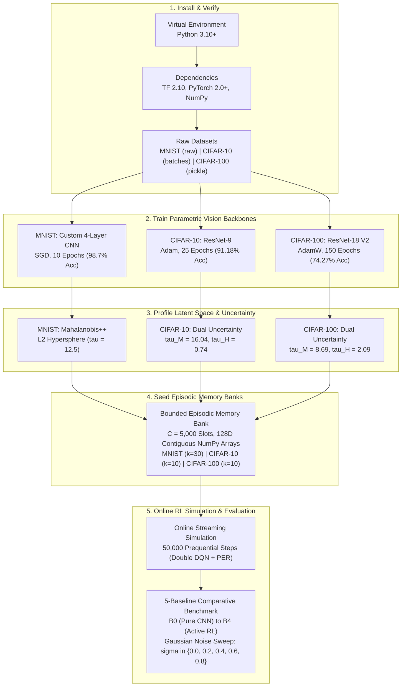

# Getting Started

> Part of the [Active Episodic Memory Management via Reinforcement Learning for Robust CNN Inference on Out-of-Distribution Data](../../README.md) documentation.
> Parent: [Documentation Index](../README.md) | Up: [Root README](../../README.md)

---

## 1. Overview

This directory provides the onboarding, installation, verification, and configuration resources necessary to reproduce the experimental findings reported in our paper, *"Active Episodic Memory Management via Reinforcement Learning for Robust CNN Inference on Out-of-Distribution Data"* (prepared for *IEEE Transactions on Neural Networks and Learning Systems* - IEEE TNNLS).

The codebase couples a custom, from-scratch TensorFlow Convolutional Neural Network (CNN) with a non-parametric NumPy episodic memory bank ($k$-NN) and a PyTorch Double Deep Q-Network (Double DQN) with Prioritized Experience Replay (PER). Together, these components implement an active memory curation architecture engineered specifically for resource-constrained Edge AI environments experiencing sensor degradation, adversarial anomalies, and non-stationary concept drift.

---

## 2. Document Index and Recommended Reading Order

To set up, configure, and execute the full experimental pipeline, follow the guides in the sequence below:

| Document | Title | Focus Area | Target Audience |
|:---------|:------|:-----------|:----------------|
| [quickstart.md](quickstart.md) | [Installation and Quick Start](quickstart.md) | Hardware prerequisites, dependency installation, raw dataset extraction (MNIST, CIFAR-10, CIFAR-100), environment sanity verification, and isolated reproduction pipelines. | Practitioners, evaluators, researchers reproducing benchmarks. |
| [configuration.md](configuration.md) | [Configuration Reference](configuration.md) | Exhaustive parameter catalog for `src/config.py` spanning paths, CNN training backbones, OOD uncertainty routing, episodic memory, Double DQN, and online streaming simulation across MNIST, CIFAR-10, and CIFAR-100. | Engineers customizing hyperparameters, modifying memory bounds, or tuning OOD thresholds. |

---

## 3. High-Level Workflow Overview

Reproducing the results presented in the publication manuscript involves a five-stage sequential pipeline operating across three distinct complexity regimes (**MNIST**, **CIFAR-10**, and **CIFAR-100**):

1. **Environment Setup & Verification:** Install pinned dependencies (`requirements.txt`), place or download raw dataset files (`data/MNIST/raw/`, `data/CIFAR10/raw/`, `data/CIFAR100/raw/`), and execute sanity checks.
2. **Parametric Training:** Train the baseline 128D latent CNN backbone on nominal data (MNIST 4-layer CNN at $98.7\%$, CIFAR-10 ResNet-9 at $91.18\%$, or CIFAR-100 ResNet-18 V2 at $74.27\%$ Top-1 accuracy).
3. **Latent Space Profiling:** Compute class-conditional centroids and regularized precision matrices via Ledoit-Wolf shrinkage to calibrate the uncertainty detector ($\tau = 12.5$ for MNIST; $\tau_M = 16.04, \tau_H = 0.74\text{ nats}$ for CIFAR-10; $\tau_M = 8.69, \tau_H = 2.09\text{ nats}$ for CIFAR-100).
4. **Episodic Memory Seeding:** Populate the bounded NumPy memory bank ($C = 5,000$ slots in 128D) with initial clean reference prototypes.
5. **Streaming RL Simulation & Evaluation:** Execute 50,000 steps of online prequential simulation under non-stationary Gaussian noise to train the Double DQN policy agent, followed by the rigorous 5-baseline comparative evaluation (B0 through B4).

---

## 4. Next Steps

- Proceed to [Installation and Quick Start](quickstart.md) for direct copy-pasteable terminal instructions.
- Consult the [Configuration Reference](configuration.md) to inspect or modify operational parameters before launching training runs.
- Refer to [System Architecture Overview](../architecture/README.md) for deep-dive technical explanations of the underlying mathematical mechanisms.

---

**Navigation:**
- Previous: [System Architecture Overview](../architecture/README.md)
- Up: [Documentation Index](../README.md)
- Next: [Installation and Quick Start](quickstart.md)

---
Licensed under the GNU General Public License v3.0. See [LICENSE](../../LICENSE) for details.
