# Getting Started

> Part of the [Active Episodic Memory Management via Reinforcement Learning for Robust CNN Inference on Out-of-Distribution Data](../../README.md) documentation.
> Parent: [Documentation Index](../README.md) | Up: [Root README](../../README.md)

---

## 1. Overview

This directory provides the onboarding, installation, verification, and configuration resources necessary to reproduce the experimental findings reported in our paper, *"Active Episodic Memory Management via Reinforcement Learning for Robust CNN Inference on Out-of-Distribution Data"* (submitted to Elsevier *Engineering Applications of Artificial Intelligence* - EAAI).

The codebase couples a custom, from-scratch TensorFlow Convolutional Neural Network (CNN) with a non-parametric NumPy episodic memory bank ($k$-NN) and a PyTorch Double Deep Q-Network (Double DQN) with Prioritized Experience Replay (PER). Together, these components implement an active memory curation architecture engineered specifically for resource-constrained Edge AI environments experiencing sensor degradation, adversarial anomalies, and non-stationary concept drift.

---

## 2. Document Index and Recommended Reading Order

To set up, configure, and execute the full experimental pipeline, follow the guides in the sequence below:

| Document | Title | Focus Area | Target Audience |
|:---------|:------|:-----------|:----------------|
| [quickstart.md](quickstart.md) | [Installation and Quick Start](quickstart.md) | Hardware prerequisites, dependency installation, raw MNIST binary extraction, environment sanity verification, and the 5-step reproduction pipeline. | Practitioners, evaluators, researchers reproducing benchmarks. |
| [configuration.md](configuration.md) | [Configuration Reference](configuration.md) | Exhaustive parameter catalog for `src/config.py` spanning 35 parameters across paths, CNN training, Mahalanobis++ routing, episodic memory, Double DQN, and online streaming simulation. | Engineers customizing hyperparameters, modifying memory bounds, or tuning OOD thresholds. |

---

## 3. High-Level Workflow Overview

Reproducing the results presented in the EAAI manuscript involves a five-stage sequential pipeline:

```mermaid
flowchart LR
    subgraph S1["1. Install & Verify"]
        ENV["Virtual Environment<br>Python 3.10+"]
        DEPS["Dependencies<br>TF 2.10, PyTorch 2.0+"]
        DATA["Raw MNIST<br>data/MNIST/raw/"]
        ENV --> DEPS --> DATA
    end

    subgraph S2["2. Train Parametric CNN"]
        TRAIN_CNN["scripts/train_cnn.py<br>SGD, 10 Epochs"]
        CKPT["Checkpoint Saved<br>outputs/checkpoints/"]
        TRAIN_CNN --> CKPT
    end

    subgraph S3["3. Profile Latent Space"]
        PROF["scripts/profile_latent.py<br>L2 Norm + Ledoit-Wolf"]
        STATS["OOD Profiles Saved<br>outputs/mahalanobis_pp_profiles.npz"]
        PROF --> STATS
    end

    subgraph S4["4. Seed Episodic Memory"]
        SEED["scripts/train_rl.py --latent-dim 128<br>Clean & Error Prototypes"]
        BANK["Memory Bank Saved<br>outputs/knn_memory_bank_128d.npz"]
        SEED --> BANK
    end

    subgraph S5["5. Online RL Simulation & Eval"]
        SIM["training/train_rl_online_simulation.py<br>50,000 Streaming Steps"]
        EVAL["evaluate_hybrid_global.py<br>5-Baseline Benchmark"]
        SIM --> EVAL
    end

    DATA --> TRAIN_CNN
    CKPT --> PROF
    STATS --> SEED
    BANK --> SIM
```

1. **Environment Setup & Verification:** Install pinned dependencies (`requirements.txt`), place raw binary MNIST files in `data/MNIST/raw/`, and execute sanity checks.
2. **Parametric Training:** Train the baseline 128D latent CNN on nominal data ($98.7\%$ validation accuracy).
3. **Latent Space Profiling:** Compute class-conditional centroids and regularized precision matrices via Ledoit-Wolf shrinkage to calibrate the Mahalanobis++ OOD detector.
4. **Episodic Memory Seeding:** Populate the bounded NumPy memory bank ($N = 5,000$) with initial clean and noisy support prototypes.
5. **Streaming RL Simulation & Evaluation:** Execute 50,000 steps of online prequential simulation under non-stationary Gaussian noise ($\sigma = 0.6, p_{\text{noise}} = 0.1$) to train the Double DQN agent, followed by the rigorous 5-baseline EAAI comparative evaluation.

---

## 4. Next Steps

- Proceed to [Installation and Quick Start](quickstart.md) for direct copy-pasteable terminal instructions.
- Consult the [Configuration Reference](configuration.md) to inspect or modify operational parameters before launching training runs.
- Refer to [System Architecture Overview](../architecture/README.md) for deep-dive technical explanations of the underlying mathematical mechanisms.

---

**Navigation:**
- Previous: [System Architecture Overview](../architecture/README.md)
- Up: [Documentation Index](../README.md)
- Next: [Installation and Quick Start](quickstart.md)

---
Licensed under the GNU General Public License v3.0. See [LICENSE](../../LICENSE) for details.
