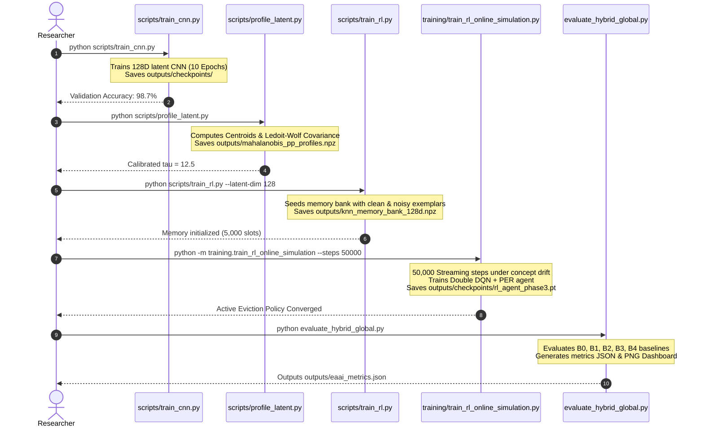

# Installation and Quick Start

> Part of the [Active Episodic Memory Management via Reinforcement Learning for Robust CNN Inference on Out-of-Distribution Data](../../README.md) documentation.
> Parent: [Getting Started Index](README.md) | Up: [Documentation Index](../README.md)

---

## 1. Prerequisites

Before installing the project dependencies, ensure your host environment satisfies the following hardware and software requirements:

### Hardware Requirements
- **CPU:** x86_64 or ARM64 processor with at least 4 physical cores (Intel Core i5/i7/Xeon, AMD Ryzen, or Apple Silicon).
- **RAM:** Minimum 8 GB (16 GB strongly recommended to execute the 50,000-step streaming simulation without swapping).
- **Disk Space:** Minimum 2.5 GB free space (accommodates repository code, MNIST binary datasets, model checkpoints, `.npz` memory arrays, and visualization figures).
- **GPU (Optional):** NVIDIA GPU with CUDA Compute Capability >= 7.0 and CUDA 12.x / 11.8 drivers (tested on NVIDIA RTX 4090 and NVIDIA L40S). GPU acceleration speeds up CNN training and PyTorch Double DQN tensor operations, though the entire pipeline executes deterministically on CPU.

### Operating System Support
- **Linux:** Ubuntu 20.04 LTS / 22.04 LTS or equivalent Debian/RHEL distributions.
- **Windows:** Windows 10 / Windows 11 (64-bit) with PowerShell 5.1+ or PowerShell 7+.
- **macOS:** macOS Monterey (12.0) or later.

### Python Environment
- **Python Version:** Python >= 3.10 and < 3.12 (Python 3.10.x is recommended).
- **Package Manager:** `pip` version 22.0 or later.

---

## 2. Installation Steps

### Step 2.1: Clone the Repository

Clone the project repository to your local workspace and navigate into the project directory:

```bash
git clone https://github.com/[your-organization]/projeto-cnn.git
cd projeto-cnn
```

### Step 2.2: Create and Activate an Isolated Virtual Environment

Always use an isolated virtual environment to avoid dependency conflicts across system packages:

**On Linux / macOS:**
```bash
python3 -m venv venv
source venv/bin/activate
```

**On Windows (PowerShell):**
```powershell
python -m venv venv
.\venv\Scripts\Activate.ps1
```

> [!NOTE]
> If PowerShell blocks script execution due to execution policy restrictions, run:
> `Set-ExecutionPolicy -ExecutionPolicy RemoteSigned -Scope CurrentUser`

### Step 2.3: Install Pinned Dependencies

Install all core dependencies specified in `requirements.txt`:

```bash
pip install --upgrade pip
pip install -r requirements.txt
```

### Dependency Stack Overview

The project relies on a carefully selected, minimal set of foundational libraries:

| Package | Version Pinned | Purpose in Architecture |
|:--------|:---------------|:------------------------|
| `tensorflow` | `==2.10.1` | Base computational runtime for custom CNN layer primitives (`src/scratch/`), SGD optimizer, and weight checkpointing. |
| `torch` | `>=2.0` | Tensor backend for the Double DQN Q-network, target network, MSE loss optimization, and device-agnostic execution. |
| `numpy` | `>=1.24` | Foundation for pre-allocated contiguous memory arrays, vectorized Euclidean distance computations, and SumTree binary trees. |
| `scikit-learn` | `>=1.3` | Analytic covariance shrinkage (`LedoitWolf`) for Mahalanobis++ OOD detection and evaluation metrics. |
| `flask` | `>=2.2,<3.0` | Lightweight WSGI web application server hosting the live interactive inspection dashboard. |
| `matplotlib` | `>=3.5,<4.0` | Scientific visualization engine rendering decision boundaries, calibration curves, and multi-baseline dashboards. |
| `seaborn` | `>=0.12,<1.0` | Statistical visualization enhancements for confusion matrices and error distributions. |
| `Pillow` | `>=9.0,<10.0` | Image parsing, raster transformation, and figure export formatting. |

---

## 3. Dataset Setup (Raw Binary MNIST)

The architecture operates directly on the original binary format of the MNIST dataset to ensure maximum data loading speed and zero framework overhead. The data loader (`src/data/loader.py`) parses raw bytes using the big-endian `struct` format without intermediary conversions.

### Required Directory Structure

Place the four uncompressed binary files into `data/MNIST/raw/`:

```text
projeto-cnn/
└── data/
    └── MNIST/
        └── raw/
            ├── train-images-idx3-ubyte    # 47,040,016 bytes (60,000 images, 28x28)
            ├── train-labels-idx1-ubyte    # 60,008 bytes (60,000 labels)
            ├── t10k-images-idx3-ubyte     # 7,840,016 bytes (10,000 test images)
            └── t10k-labels-idx1-ubyte     # 10,008 bytes (10,000 test labels)
```

### Automated Dataset Download Script

If the dataset is not yet present, run this automated Python snippet to fetch, decompress, and verify the binary files directly into `data/MNIST/raw/`:

```python
# scripts/download_mnist.py
import os
import gzip
import urllib.request

DATA_DIR = os.path.join(os.getcwd(), "data", "MNIST", "raw")
os.makedirs(DATA_DIR, exist_ok=True)

BASE_URL = "https://storage.googleapis.com/cvdf-datasets/mnist/"
FILES = [
    "train-images-idx3-ubyte.gz",
    "train-labels-idx1-ubyte.gz",
    "t10k-images-idx3-ubyte.gz",
    "t10k-labels-idx1-ubyte.gz"
]

print(f"Downloading MNIST raw binary files to: {DATA_DIR}")
for filename in FILES:
    raw_name = filename.replace(".gz", "")
    target_path = os.path.join(DATA_DIR, raw_name)
    
    if os.path.exists(target_path):
        print(f"  [OK] Found existing: {raw_name}")
        continue
        
    gz_path = os.path.join(DATA_DIR, filename)
    url = BASE_URL + filename
    print(f"  Fetching {url}...")
    urllib.request.urlretrieve(url, gz_path)
    
    # Decompress gunzip
    with gzip.open(gz_path, 'rb') as f_in:
        with open(target_path, 'wb') as f_out:
            f_out.write(f_in.read())
    os.remove(gz_path)
    print(f"  Extracted: {raw_name} ({os.path.getsize(target_path):,} bytes)")

print("Dataset setup completed successfully.")
```

You can execute this directly via:
```bash
python -c "
import os, gzip, urllib.request
d = os.path.join('data', 'MNIST', 'raw')
os.makedirs(d, exist_ok=True)
u = 'https://storage.googleapis.com/cvdf-datasets/mnist/'
for f in ['train-images-idx3-ubyte', 'train-labels-idx1-ubyte', 't10k-images-idx3-ubyte', 't10k-labels-idx1-ubyte']:
    p = os.path.join(d, f)
    if not os.path.exists(p):
        print(f'Fetching {f}...')
        gz = p + '.gz'
        urllib.request.urlretrieve(u + f + '.gz', gz)
        with gzip.open(gz, 'rb') as fi, open(p, 'wb') as fo: fo.write(fi.read())
        os.remove(gz)
print('MNIST raw verification complete.')
"
```

---

## 4. Environment and Hardware Verification

Verify that your installed environment can import all submodules, locate hardware accelerators, and parse the raw dataset:

```bash
python -c "
import sys, os
import tensorflow as tf
import torch
import numpy as np
import sklearn
from src.config import DATA_DIR, PROJECT_ROOT
from src.data.loader import load_mnist_raw

print(f'Python Version      : {sys.version.split()[0]}')
print(f'TensorFlow Version  : {tf.__version__} (GPUs: {len(tf.config.list_physical_devices(\"GPU\"))})')
print(f'PyTorch Version     : {torch.__version__} (CUDA Available: {torch.cuda.is_available()})')
print(f'NumPy Version       : {np.__version__}')
print(f'scikit-learn Version: {sklearn.__version__}')

try:
    imgs, lbls = load_mnist_raw(DATA_DIR, kind='train')
    print(f'MNIST Train Images  : {imgs.shape}, dtype={imgs.dtype}')
    print(f'MNIST Train Labels  : {lbls.shape}, dtype={lbls.dtype}')
    print('SUCCESS: Environment and dataset verified.')
except Exception as e:
    print(f'FAILURE: Could not load MNIST: {e}')
"
```

**Expected Output:**
```text
Python Version      : 3.10.x
TensorFlow Version  : 2.10.1 (GPUs: 1 or 0)
PyTorch Version     : 2.x.x (CUDA Available: True or False)
NumPy Version       : 1.24.x
scikit-learn Version: 1.3.x
MNIST Train Images  : (60000, 28, 28, 1), dtype=uint8
MNIST Train Labels  : (60000,), dtype=uint8
SUCCESS: Environment and dataset verified.
```

---

## 5. Minimal Reproduction Pipeline (5 Commands)

To reproduce the experimental results presented in the EAAI paper from a clean repository state, execute the following 5 commands sequentially:



### Step 1: Train the Parametric Feature Extractor (CNN)
Trains the custom from-scratch Convolutional Neural Network with He Normal initialization and SGD optimizer on clean nominal training data:

```bash
python scripts/train_cnn.py
```
- **Execution Time:** ~2-3 minutes on modern GPU (RTX 4090 / L40S) or ~8-12 minutes on 8-core CPU.
- **Artifact Produced:** `outputs/checkpoints/ckpt-*.index` and `ckpt-*.data-*` (TensorFlow checkpoint).
- **Target Metric:** Validation accuracy $\ge 98.5\%$ on clean MNIST test set.

### Step 2: Profile Latent Space for Mahalanobis++ OOD Arbiter
Feeds clean training samples through the trained CNN, extracts 128D bottleneck features, and calculates class-conditional centroids $\mu_c$ and Ledoit-Wolf regularized covariance matrices $\Sigma_c$:

```bash
python scripts/profile_latent.py
```
- **Execution Time:** ~45 seconds on GPU, ~1.5 minutes on CPU.
- **Artifact Produced:** `outputs/mahalanobis_pp_profiles.npz` and `outputs/mahalanobis_profiles.npz`.
- **Target Metric:** Calibrated distance threshold $\tau = 12.5$ corresponding to the 95th percentile of nominal in-distribution features.

### Step 3: Seed Initial Episodic Memory Bank
Instantiates the capacity-bounded episodic memory buffer ($N = 5,000$) and seeds it with balanced nominal representations and hard misclassification exemplars:

```bash
python scripts/train_rl.py --latent-dim 128
```
- **Execution Time:** ~1-2 minutes.
- **Artifact Produced:** `outputs/knn_memory_bank_128d.npz`.
- **Target Metric:** Pre-allocated 5,000 exemplar slots populated with initial support vectors.

### Step 4: Train Active Memory RL Agent via Online Streaming Simulation
Launches 50,000 steps of online prequential simulation under non-stationary concept drift ($p_{\text{noise}} = 0.1, \sigma = 0.6$). The Double DQN agent learns optimal eviction actions (FIFO, LFU, or Redundancy) guided by the Curriculum Learning Reward Manager:

```bash
python -m training.train_rl_online_simulation --steps 50000
```
- **Execution Time:** ~10-15 minutes (streaming step processing, vectorized $k$-NN search, Double DQN training).
- **Artifact Produced:** `outputs/checkpoints/rl_agent_phase3.pt` (PyTorch model weights) and `outputs/train_rl_simulation_log.csv` (step-by-step telemetry).
- **Target Metric:** Curriculum transition from density exploration to empirical accuracy reward ($\alpha \le 0.01$).

### Step 5: Execute 5-Baseline Comparative Evaluation
Executes the comprehensive EAAI benchmark comparing the proposed RL Active Memory architecture against four baselines across 10,000 test queries under clean and noise stress testing:

```bash
python evaluate_hybrid_global.py
```
- **Execution Time:** ~2-4 minutes.
- **Artifact Produced:** `outputs/eaai_metrics.json` and `outputs/figures/eaai_benchmark_dashboard.png`.
- **Target Metric:** B4 (Proposed RL Agent) achieving $\sim 68.85\%$ noisy accuracy and $80.25\%$ rescue rate, outperforming blind FIFO (B2) and LFU (B3) by $+4.5\%$ absolute accuracy with $170\times$ lower distribution divergence ($D_{KL}$).

---

## 6. Expected Output Artifacts

Following completion of the 5-step reproduction pipeline, the `outputs/` directory will contain the following artifacts:

| Path | Format | Approximate Size | Description |
|:-----|:-------|:-----------------|:------------|
| `outputs/checkpoints/ckpt-*` | Binary / Index | $\sim 2.8$ MB | Trained TensorFlow custom CNN weights. |
| `outputs/mahalanobis_pp_profiles.npz` | NumPy Archive | $\sim 660$ KB | 10 class centroids (128D) and regularized precision matrices $(10 \times 128 \times 128)$. |
| `outputs/knn_memory_bank_128d.npz` | NumPy Archive | $\sim 2.7$ MB | Pre-allocated episodic memory array storing states, actions, rewards, ticks, and usage counts. |
| `outputs/checkpoints/rl_agent_phase3.pt` | PyTorch State Dict | $\sim 45$ KB | Double DQN MLP policy network weights (5D input $\to$ 64 $\to$ 64 $\to$ 4D output). |
| `outputs/train_rl_simulation_log.csv` | Text CSV | $\sim 150$ KB | Telemetry logged every 500 steps (step, reward, loss, epsilon, buffer size, class counts). |
| `outputs/eaai_metrics.json` | JSON | $\sim 15$ KB | Complete quantitative results across all 5 baselines for clean and noisy distributions. |
| `outputs/figures/eaai_benchmark_dashboard.png` | PNG Image | $\sim 350$ KB | 6-panel publication-grade evaluation dashboard. |

---

## 7. Troubleshooting and Common Issues

### Issue 1: TensorFlow GPU DLL Not Found on Windows
- **Symptom:** `Could not load dynamic library 'cudart64_110.dll'` or TensorFlow falls back to CPU.
- **Cause:** TensorFlow 2.10.1 was the final official release supporting native Windows GPU execution, requiring CUDA 11.2 and cuDNN 8.1.
- **Resolution:** No action is strictly necessary; the entire pipeline functions completely on CPU. If native GPU execution on Windows is required, ensure CUDA 11.2 runtime libraries are present in system `PATH`. Alternatively, execute inside WSL2 (Ubuntu 22.04).

### Issue 2: FileNotFoundError: `[Errno 2] No such file or directory: '...train-images-idx3-ubyte'`
- **Symptom:** `src/data/loader.py` fails on binary file open.
- **Cause:** Raw MNIST binary files have not been extracted into `data/MNIST/raw/` or have trailing `.gz` extensions.
- **Resolution:** Run the automated dataset setup script provided in [Section 3](#automated-dataset-download-script). Ensure files are named exactly `train-images-idx3-ubyte` without `.gz` or `.txt`.

### Issue 3: Memory Thrashing / Out of Memory (OOM)
- **Symptom:** Operating system terminates Python process with SIGKILL or MemoryError during the 50,000-step simulation.
- **Cause:** Host system has less than 8 GB RAM or swap space is disabled.
- **Resolution:** The episodic memory buffer is strictly pre-allocated ($5,000 \times 128 \times 4\text{ bytes} \approx 2.56\text{ MB}$). However, if your system has restricted memory, reduce `SIMULATION_STEPS` from `50000` to `25000` in `src/config.py` or via command-line `--steps 25000`.

### Issue 4: Determinism and Random Seeds
- **Symptom:** Slight variance in accuracy decimals across different architectures.
- **Cause:** GPU floating-point non-determinism during atomic additions in CUDA convolution kernels.
- **Resolution:** `src/config.py` fixes `RANDOM_SEED = 42` across NumPy, TensorFlow, and PyTorch. For bitwise reproducible CPU execution, export `PYTHONHASHSEED=42`.

---

**Navigation:**
- Previous: [Getting Started Index](README.md)
- Up: [Getting Started Index](README.md)
- Next: [Configuration Reference](configuration.md)

---
Licensed under the GNU General Public License v3.0. See [LICENSE](../../LICENSE) for details.
