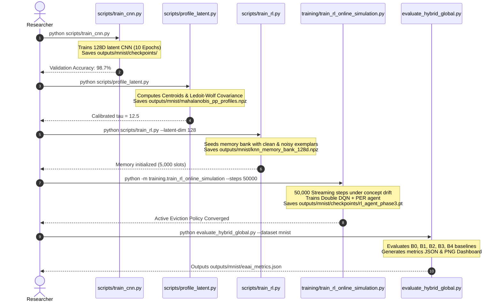
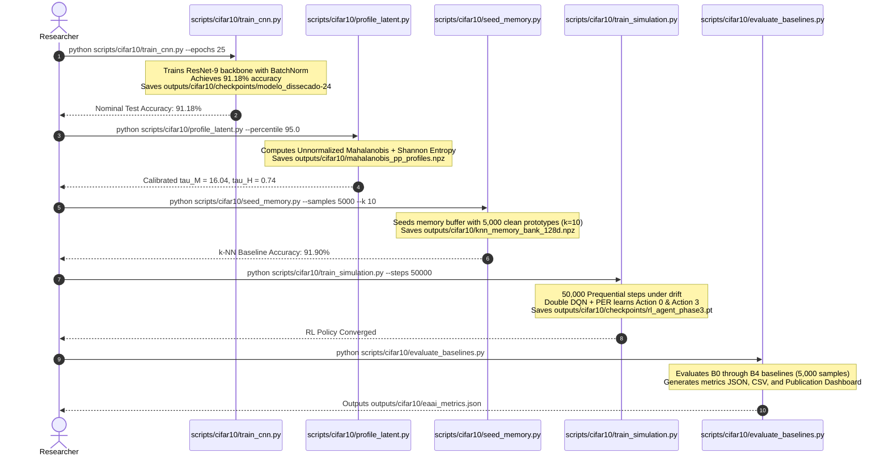
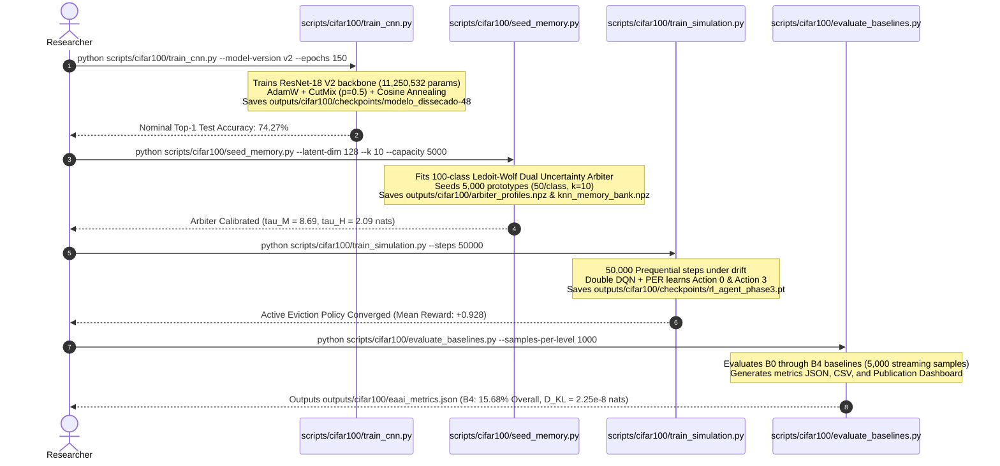

# Installation and Quick Start

> Part of the [Active Episodic Memory Management via Reinforcement Learning for Robust CNN Inference on Out-of-Distribution Data](file:///c:/Users/sanfr/Desktop/projetos-gecad/projeto-cnn/README.md) documentation.  
> Parent: [Getting Started Index](file:///c:/Users/sanfr/Desktop/projetos-gecad/projeto-cnn/docs/getting-started/README.md) | Up: [Documentation Index](file:///c:/Users/sanfr/Desktop/projetos-gecad/projeto-cnn/docs/README.md)

---

## 1. Prerequisites

Before installing project dependencies, verify that your host environment meets the following requirements:

### Hardware Requirements
- **CPU:** x86_64 or ARM64 processor with at least 4 physical cores (Intel Core i5/i7/Xeon, AMD Ryzen, or Apple Silicon).
- **RAM:** Minimum 8 GB (16 GB recommended for running the 50,000-step prequential simulation without swapping).
- **Disk Space:** Minimum 5.0 GB free space (accommodates repository code, MNIST, CIFAR-10, and CIFAR-100 raw datasets, model checkpoints, `.npz` memory arrays, and visualization figures).
- **GPU (Optional):** NVIDIA GPU with CUDA Compute Capability >= 7.0 and CUDA 11.8 / 12.x drivers (tested on NVIDIA RTX 4090 and NVIDIA L40S). GPU acceleration speeds up CNN training and PyTorch Double DQN tensor operations, though the entire pipeline executes deterministically on CPU.

### Operating System Support
- **Linux:** Ubuntu 20.04 LTS / 22.04 LTS or equivalent Debian/RHEL distributions.
- **Windows:** Windows 10 / Windows 11 (64-bit) with PowerShell 5.1+ or PowerShell 7+.
- **macOS:** macOS Monterey (12.0) or later.

### Python Environment
- **Python Version:** Python >= 3.10 and < 3.12 (Python 3.10.x recommended).
- **Package Manager:** `pip` version 22.0 or later.

---

## 2. Installation Steps

### Step 2.1: Clone the Repository
```bash
git clone https://github.com/[your-organization]/projeto-cnn.git
cd projeto-cnn
```

### Step 2.2: Create and Activate an Isolated Virtual Environment
**On Linux / macOS:**
```bash
python3 -m venv venv
source venv/bin/activate
```

**On Windows (PowerShell):**
```powershell
python -m venv venv
.\venv\Scripts\Activate.ps1
```

### Step 2.3: Install Pinned Dependencies
```bash
pip install --upgrade pip
pip install -r requirements.txt
```

### Dependency Stack Overview

| Package | Pinned Version | Purpose in Architecture |
|:---|:---|:---|
| `tensorflow` | `==2.10.1` | Base computational runtime for custom CNN layer primitives, SGD optimizer, and weight checkpointing. |
| `torch` | `>=2.0` | Tensor backend for the Double DQN Q-network, target network, MSE loss optimization, and device-agnostic execution. |
| `numpy` | `>=1.24` | Foundation for pre-allocated contiguous memory arrays, vectorized Euclidean distance computations, and SumTree binary trees. |
| `scikit-learn` | `>=1.3` | Analytic covariance shrinkage (`LedoitWolf`) for Mahalanobis++ OOD detection and evaluation metrics. |
| `flask` | `>=2.2,<3.0` | Lightweight WSGI web application server hosting the live interactive inspection dashboard. |
| `matplotlib` | `>=3.5,<4.0` | Scientific visualization engine rendering decision boundaries, calibration curves, and multi-baseline dashboards. |
| `seaborn` | `>=0.12,<1.0` | Statistical visualization enhancements for confusion matrices and error distributions. |
| `Pillow` | `>=9.0,<10.0` | Image parsing, raster transformation, and figure export formatting. |

---

## 3. Dataset Setup

The architecture operates directly on raw datasets to guarantee deterministic preprocessing, reproducible splits, and zero high-level framework overhead.

### 3.1. MNIST Dataset Setup (Raw Binary)
The data loader ([`src/data/loader.py`](file:///c:/Users/sanfr/Desktop/projetos-gecad/projeto-cnn/src/data/loader.py)) parses raw bytes using the big-endian `struct` format without intermediate conversions.

Directory target: `data/MNIST/raw/`
- `train-images-idx3-ubyte` (47,040,016 bytes, 60,000 images, 28x28)
- `train-labels-idx1-ubyte` (60,008 bytes, 60,000 labels)
- `t10k-images-idx3-ubyte` (7,840,016 bytes, 10,000 test images)
- `t10k-labels-idx1-ubyte` (10,008 bytes, 10,000 test labels)

Automated download command:
```bash
python -c "
import os, gzip, urllib.request
d = os.path.join('data', 'MNIST', 'raw')
os.makedirs(d, exist_ok=True)
u = 'https://storage.googleapis.com/cvdf-datasets/mnist/'
for f in ['train-images-idx3-ubyte', 'train-labels-idx1-ubyte', 't10k-images-idx3-ubyte', 't10k-labels-idx1-ubyte']:
    p = os.path.join(d, f)
    if not os.path.exists(p):
        print(f'Fetching {f}...')
        gz = p + '.gz'
        urllib.request.urlretrieve(u + f + '.gz', gz)
        with gzip.open(gz, 'rb') as fi, open(p, 'wb') as fo: fo.write(fi.read())
        os.remove(gz)
print('MNIST raw verification complete.')
"
```

### 3.2. CIFAR-10 Dataset Setup (Python Pickle Distribution)
To download and extract the official CIFAR-10 dataset into `data/CIFAR10/raw/cifar-10-batches-py/`, execute the dedicated utility script:
```bash
python scripts/download_cifar10.py
```
This fetches the archive (`cifar-10-python.tar.gz`), extracts all batch files (`data_batch_1` through `data_batch_5`, `test_batch`, and `batches.meta`), and verifies integrity.

### 3.3. CIFAR-100 Dataset Setup (Python Pickle Distribution)
To download and extract the official CIFAR-100 dataset into `data/CIFAR100/raw/` (or `data/cifar-100-python/`), execute the dedicated download script:
```bash
python scripts/cifar100/download_cifar100.py
```
This script fetches the official distribution archive (`cifar-100-python.tar.gz`), extracts the binary pickle batch files (`train`, `test`, `meta`), and verifies archive file integrity against corrupted transfers.

---

## 4. Environment and Dataset Verification

Run the following unified check to verify runtime dependencies, hardware acceleration, and dataset accessibility across MNIST, CIFAR-10, and CIFAR-100:

```bash
python -c "
import sys, os
import tensorflow as tf
import torch
import numpy as np
import sklearn
from src.config import DATA_DIR, PROJECT_ROOT
from src.data.loader import load_mnist_raw

print(f'Python Version      : {sys.version.split()[0]}')
print(f'TensorFlow Version  : {tf.__version__} (GPUs: {len(tf.config.list_physical_devices(\"GPU\"))})')
print(f'PyTorch Version     : {torch.__version__} (CUDA Available: {torch.cuda.is_available()})')
print(f'NumPy Version       : {np.__version__}')
print(f'scikit-learn Version: {sklearn.__version__}')

# Verify MNIST
try:
    imgs, lbls = load_mnist_raw(DATA_DIR, kind='train')
    print(f'MNIST Train Images  : {imgs.shape}, dtype={imgs.dtype}')
    print('  [OK] MNIST raw verified.')
except Exception as e:
    print(f'  [INFO] MNIST raw not ready: {e}')

# Verify CIFAR-10
cifar_path = os.path.join(PROJECT_ROOT, 'data', 'CIFAR10', 'raw', 'cifar-10-batches-py')
if os.path.exists(cifar_path):
    print(f'  [OK] CIFAR-10 batches verified at {cifar_path}')
else:
    print(f'  [INFO] CIFAR-10 not found. Run: python scripts/download_cifar10.py')

# Verify CIFAR-100
cifar100_paths = [
    os.path.join(PROJECT_ROOT, 'data', 'CIFAR100', 'raw', 'cifar-100-python'),
    os.path.join(PROJECT_ROOT, 'data', 'cifar-100-python'),
    os.path.join(PROJECT_ROOT, 'data', 'CIFAR100', 'raw'),
]
cifar100_found = any(
    os.path.exists(p) and (os.path.exists(os.path.join(p, 'train')) or os.path.exists(os.path.join(p, 'cifar-100-python', 'train')))
    for p in cifar100_paths
)
if cifar100_found:
    print('  [OK] CIFAR-100 dataset verified.')
else:
    print('  [INFO] CIFAR-100 not found. Run: python scripts/cifar100/download_cifar100.py')
"
```

---

## 5. Minimal Reproduction Pipelines

The repository provides modular, segregated execution pipelines across all three complexity regimes (MNIST, CIFAR-10, and CIFAR-100):

### 5.1. MNIST Reproduction Pipeline (5 Steps)



1. **Train Parametric CNN:** `python scripts/train_cnn.py`
2. **Profile Latent Space:** `python scripts/profile_latent.py`
3. **Seed Episodic Memory:** `python scripts/train_rl.py --latent-dim 128`
4. **Train RL Agent (Simulation):** `python -m training.train_rl_online_simulation --steps 50000`
5. **Evaluate 5 Baselines:** `python evaluate_hybrid_global.py --dataset mnist`

---

### 5.2. CIFAR-10 Reproduction Pipeline (5 Steps)



1. **Train ResNet-9 Backbone:**
   ```bash
   python scripts/cifar10/train_cnn.py --epochs 25 --batch-size 128 --lr 0.001
   ```
2. **Profile Dual Uncertainty Arbiter:**
   ```bash
   python scripts/cifar10/profile_latent.py --percentile 95.0
   ```
3. **Seed Episodic Memory Buffer:**
   ```bash
   python scripts/cifar10/seed_memory.py --samples 5000 --k 10
   ```
4. **Train Double DQN Active Memory Agent:**
   ```bash
   python scripts/cifar10/train_simulation.py --steps 50000 --noise-rate 0.1 --noise-level 0.6
   ```
5. **Run Standardized 5-Baseline Evaluation:**
   ```bash
   python scripts/cifar10/evaluate_baselines.py --samples-per-level 1000 --noise-levels 0.0 0.2 0.4 0.6 0.8
   ```

---

### 5.3. CIFAR-100 Reproduction Pipeline (5 Steps)



1. **Train ResNet-18 V2 Backbone (150 Epochs):**
   ```bash
   python scripts/cifar100/train_cnn.py --model-version v2 --epochs 150 --batch-size 128 --latent-dim 128 --optimizer adamw --lr 0.001 --weight-decay 0.0001 --cutmix-prob 0.5
   ```
2. **Seed Episodic Memory & Calibrate 100-Class Dual Uncertainty Arbiter:**
   ```bash
   python scripts/cifar100/seed_memory.py --checkpoint-dir outputs/cifar100/checkpoints --latent-dim 128 --k 10 --capacity 5000
   ```
3. **Train Double DQN Active Memory Agent (Online Drift Simulation):**
   ```bash
   python scripts/cifar100/train_simulation.py --steps 50000 --log-interval 1000 --noise-rate 0.15 --redundancy-rate 0.15
   ```
4. **Run Standardized 5-Baseline Evaluation:**
   ```bash
   python scripts/cifar100/evaluate_baselines.py --samples-per-level 1000 --capacity 5000 --k 10 --latent-dim 128
   ```
5. **Verify Empirical Artifacts and Metrics:**
   ```bash
   python -c "import json; m = json.load(open('outputs/cifar100/eaai_metrics.json')); print('B4 Overall Acc:', m['B4']['overall_accuracy'], '%, Eviction D_KL:', m['B4']['eviction_kl_divergence'])"
   ```

---

## 6. Expected Output Artifacts

Following completion of the reproduction pipelines, output artifacts are organized in dedicated dataset directories:

| Directory | Key Artifact | Format | Description |
|:---|:---|:---|:---|
| `outputs/mnist/checkpoints/` | `modelo_dissecado-*` | TF Checkpoint | Trained 4-layer custom CNN weights (98.7% acc). |
| `outputs/mnist/` | `mahalanobis_pp_profiles.npz` | NumPy Archive | 10 centroids (128D) and Ledoit-Wolf precision matrices ($\tau=12.5$). |
| `outputs/mnist/` | `knn_memory_bank_128d.npz` | NumPy Archive | Pre-allocated 5,000-slot episodic memory array. |
| `outputs/mnist/checkpoints/` | `rl_agent_phase3.pt` | PyTorch State | Trained Double DQN agent weights (5D state $\to$ 4 actions). |
| `outputs/mnist/` | `eaai_metrics.json` | JSON | Formal 5-baseline evaluation metrics on MNIST. |
| `outputs/mnist/` | `eaai_evaluation_dashboard.png` | PNG Image | 4-panel publication-grade evaluation dashboard. |
| `outputs/cifar10/checkpoints/` | `modelo_dissecado-24` | TF Checkpoint | Trained ResNet-9 weights (91.18% test acc). |
| `outputs/cifar10/` | `mahalanobis_pp_profiles.npz` | NumPy Archive | Dual Uncertainty profiles ($\tau_M=16.0380, \tau_H=0.7382$). |
| `outputs/cifar10/` | `knn_memory_bank_128d.npz` | NumPy Archive | Pre-allocated 5,000-slot episodic memory array ($k=10$). |
| `outputs/cifar10/checkpoints/` | `rl_agent_phase3.pt` | PyTorch State | Trained Double DQN agent weights for CIFAR-10. |
| `outputs/cifar10/` | `eaai_metrics.json` | JSON | Formal 5-baseline evaluation metrics on CIFAR-10. |
| `outputs/cifar10/` | `eaai_evaluation_dashboard.png` | PNG Image | 4-panel publication-grade evaluation dashboard for CIFAR-10. |
| `outputs/cifar100/checkpoints/` | `modelo_dissecado-48` | TF Checkpoint | Promoted ResNet-18 V2 backbone weights (74.27% test acc). |
| `outputs/cifar100/checkpoints/` | `model_meta.json` | JSON | Architecture metadata (V2, 11,250,532 params, standardize=True). |
| `outputs/cifar100/` | `arbiter_profiles.npz` | NumPy Archive | Dual Uncertainty 100-class profiles ($\tau_M=8.69, \tau_H=2.09\text{ nats}$). |
| `outputs/cifar100/` | `knn_memory_bank.npz` | NumPy Archive | Pre-allocated 5,000-slot episodic memory array (100 actions, $k=10$). |
| `outputs/cifar100/checkpoints/` | `rl_agent_phase3.pt` | PyTorch State | Trained Double DQN agent weights for CIFAR-100. |
| `outputs/cifar100/` | `eaai_metrics.json` | JSON | Formal 5-baseline evaluation metrics on CIFAR-100. |
| `outputs/cifar100/` | `eaai_evaluation_dashboard.png` | PNG Image | 4-panel publication-grade evaluation dashboard for CIFAR-100. |

---

## 7. Troubleshooting and Common Issues

### Issue 1: TensorFlow GPU DLL Not Found on Windows
- **Symptom:** `Could not load dynamic library 'cudart64_110.dll'` or TensorFlow falls back to CPU.
- **Cause:** TensorFlow 2.10.1 was the final official release supporting native Windows GPU execution.
- **Resolution:** No action is strictly necessary; the entire pipeline functions completely on CPU. If native GPU execution on Windows is required, ensure CUDA 11.2 runtime libraries are present in system `PATH`. Alternatively, execute inside WSL2 (Ubuntu 22.04).

### Issue 2: CIFAR-10 Download Connection Reset
- **Symptom:** `urllib.error.URLError` when downloading CIFAR-10 archive.
- **Resolution:** Re-run `python scripts/download_cifar10.py` or manually place `cifar-10-python.tar.gz` into `data/CIFAR10/raw/` and run the script again to complete extraction.

### Issue 3: Memory Thrashing / Out of Memory (OOM)
- **Symptom:** Operating system terminates Python process during the 50,000-step simulation.
- **Cause:** Host system has less than 8 GB RAM or swap space is disabled.
- **Resolution:** The episodic memory buffer is strictly pre-allocated ($5,000 \times 128 \times 4\text{ bytes} \approx 2.56\text{ MB}$). However, if your system has restricted memory, reduce `--steps 50000` to `--steps 25000` via command-line flags.

---

**Navigation:**
- Previous: [Getting Started Index](file:///c:/Users/sanfr/Desktop/projetos-gecad/projeto-cnn/docs/getting-started/README.md)
- Up: [Getting Started Index](file:///c:/Users/sanfr/Desktop/projetos-gecad/projeto-cnn/docs/getting-started/README.md)
- Next: [Configuration Reference](file:///c:/Users/sanfr/Desktop/projetos-gecad/projeto-cnn/docs/getting-started/configuration.md)

---

Licensed under the GNU General Public License v3.0. See [LICENSE](file:///c:/Users/sanfr/Desktop/projetos-gecad/projeto-cnn/LICENSE) for details.
