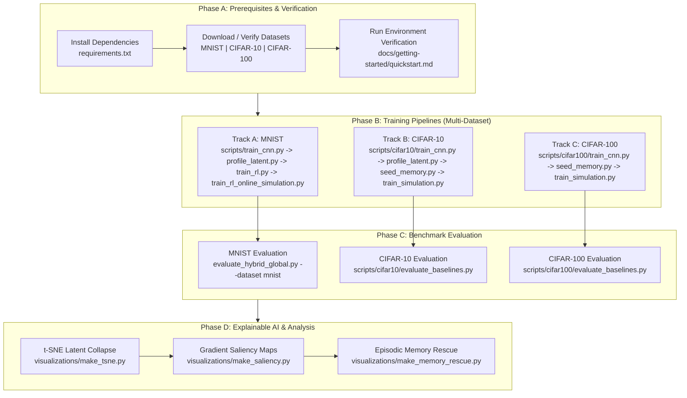

# Usage Guides

> Part of the [Active Episodic Memory Management via Reinforcement Learning for Robust CNN Inference on Out-of-Distribution Data](../../README.md) documentation.
> Parent: [Documentation Index](../README.md) | Up: [Root README](../../README.md)

---

## 1. Overview

This directory provides operational, step-by-step guides for executing the end-to-end workflows of the RL-driven active episodic memory system. The guides cover the full lifecycle of the semiparametric vision pipeline, from model training and latent space calibration to multi-baseline benchmarking and explainable AI (XAI) diagnostics.

The software architecture couples a custom Convolutional Neural Network (CNN) feature extractor with a capacity-bounded $k$-NN episodic memory buffer and a Double Deep Q-Network (Double DQN) with Prioritized Experience Replay (PER). Operating these components together requires adherence to specific sequential workflows to guarantee reproducibility, prevent data leakage, and ensure numerical stability under non-stationary Edge AI operational conditions.

---

## 2. Available Guides

The guides are organized into three primary operational domains:

| Document | Title | Purpose | Key Artifacts Produced |
|:---------|:------|:--------|:-----------------------|
| [training-pipeline.md](training-pipeline.md) | [Training Pipeline](training-pipeline.md) | Complete sequential workflow for training the parametric CNN, computing Mahalanobis++ OOD profiles, seeding the episodic memory bank, and training the Double DQN active memory agent via streaming online simulation. | `modelo_dissecado-*`, `mahalanobis_pp_profiles.npz`, `knn_memory_bank_128d.npz`, `rl_agent_weights-*`, `train_rl_simulation_log.csv` |
| [evaluation.md](evaluation.md) | [Running the Baseline Evaluation Benchmark](evaluation.md) | Execution protocol for the 5-baseline comparative benchmark (B0 to B4) across progressive Gaussian noise levels, tracking 7 engineering and scientific metrics under prequential test-then-train evaluation. | `eaai_metrics.csv`, `eaai_metrics.json`, `eaai_evaluation_dashboard.png` |
| [visualization.md](visualization.md) | [Explainable AI and Visualization Tools](visualization.md) | Suite of diagnostic visualization tools including t-SNE latent collapse mapping, gradient-based saliency heatmaps, decision confidence profiling, and 128D episodic memory rescue dashboards. | `colapso_latente_tsne.png`, `mapa_saliencia.png`, `perfil_confianca_cnn_vs_knn.png`, `fluxo_correcoes_cnn_knn.png`, `episodic_memory_rescue_full.png` |

---

## 3. Recommended Workflow Sequence

For researchers and engineers seeking to reproduce the experimental results presented in the publication manuscript, the recommended execution sequence is as follows:

1. **Prerequisites & Setup:** Complete the onboarding steps in [Installation and Quick Start](../getting-started/quickstart.md) to ensure hardware acceleration, directory structures, and dataset files are properly configured across MNIST, CIFAR-10, and CIFAR-100.
2. **Execute Training Pipeline:** Follow [training-pipeline.md](training-pipeline.md) sequentially for your target dataset track (Track A for MNIST, Track B for CIFAR-10, or Track C for CIFAR-100). Do not omit uncertainty profiling or memory seeding, as downstream prequential routing depends on regularized covariance matrices and reference prototypes.
3. **Execute Comparative Evaluation:** Follow [evaluation.md](evaluation.md) to evaluate the trained active memory agent against blind eviction baselines (FIFO, LFU, pure CNN, and infinite memory).
4. **Generate Visualizations:** Follow [visualization.md](visualization.md) to inspect model attention, latent cluster preservation, and memory rescue mechanics for presentation and manuscript figures.

---

## 4. Hardware and Runtime Considerations

The computational requirements vary across the different pipeline stages and complexity regimes:

| Stage | Script | Typical Hardware | Memory Requirement | Estimated Duration |
|:------|:-------|:-----------------|:-------------------|:-------------------|
| CNN Training (MNIST) | `scripts/train_cnn.py` | CUDA GPU / Apple Silicon / CPU | ~1.5 GB VRAM / ~2 GB RAM | ~2-3 min (GPU), ~12 min (CPU) |
| Latent Profiling (MNIST) | `scripts/profile_latent.py` | CPU or CUDA GPU | ~1.0 GB RAM | ~20-30 seconds |
| Memory Seeding (MNIST) | `scripts/train_rl.py` | CPU or CUDA GPU | ~2.0 GB RAM | ~1-2 minutes |
| Online RL Simulation (MNIST) | `training/train_rl_online_simulation.py` | CUDA GPU / Multi-core CPU | ~2.5 GB RAM | ~15-25 min (50,000 steps) |
| Global Evaluation (MNIST) | `evaluate_hybrid_global.py` | CPU or CUDA GPU | ~1.5 GB RAM | ~2-4 minutes |
| CNN Training (CIFAR-10) | `scripts/cifar10/train_cnn.py` | CUDA GPU (RTX 4090/L40S) / CPU | ~2.0 GB VRAM / ~4 GB RAM | ~5-7 min (GPU), ~30 min (CPU) |
| Latent Profiling (CIFAR-10) | `scripts/cifar10/profile_latent.py` | CPU or CUDA GPU | ~1.5 GB RAM | ~40-60 seconds |
| Memory Seeding (CIFAR-10) | `scripts/cifar10/seed_memory.py` | CPU or CUDA GPU | ~2.5 GB RAM | ~2-3 minutes |
| Online RL Simulation (CIFAR-10) | `scripts/cifar10/train_simulation.py` | CUDA GPU / Multi-core CPU | ~3.0 GB RAM | ~20-35 min (50,000 steps) |
| 5-Baseline Evaluation (CIFAR-10) | `scripts/cifar10/evaluate_baselines.py` | CPU or CUDA GPU | ~2.0 GB RAM | ~3-5 minutes |
| CNN Training (CIFAR-100) | `scripts/cifar100/train_cnn.py` | NVIDIA L40S / RTX 4090 / GPU | ~4.0 GB VRAM / ~6 GB RAM | ~35-45 min (150 epochs GPU) |
| Memory Seeding & Profiling (CIFAR-100) | `scripts/cifar100/seed_memory.py` | CPU or CUDA GPU | ~3.5 GB RAM | ~2-4 minutes |
| Online RL Simulation (CIFAR-100) | `scripts/cifar100/train_simulation.py` | CUDA GPU / Multi-core CPU | ~3.5 GB RAM | ~25-40 min (50,000 steps) |
| 5-Baseline Evaluation (CIFAR-100) | `scripts/cifar100/evaluate_baselines.py` | CPU or CUDA GPU | ~2.5 GB RAM | ~4-6 minutes |
| t-SNE Visualization | `visualizations/make_tsne.py` | Multi-core CPU | ~2.0 GB RAM | ~1-2 minutes |
| Memory Rescue Dashboard | `visualizations/make_memory_rescue.py` | CPU or CUDA GPU | ~1.5 GB RAM | ~30-45 seconds |

---

**Navigation:**
- Previous: [Configuration Reference](../getting-started/configuration.md)
- Up: [Documentation Index](../README.md)
- Next: [Training Pipeline](training-pipeline.md)

---
Licensed under the GNU General Public License v3.0. See [LICENSE](../../LICENSE) for details.
