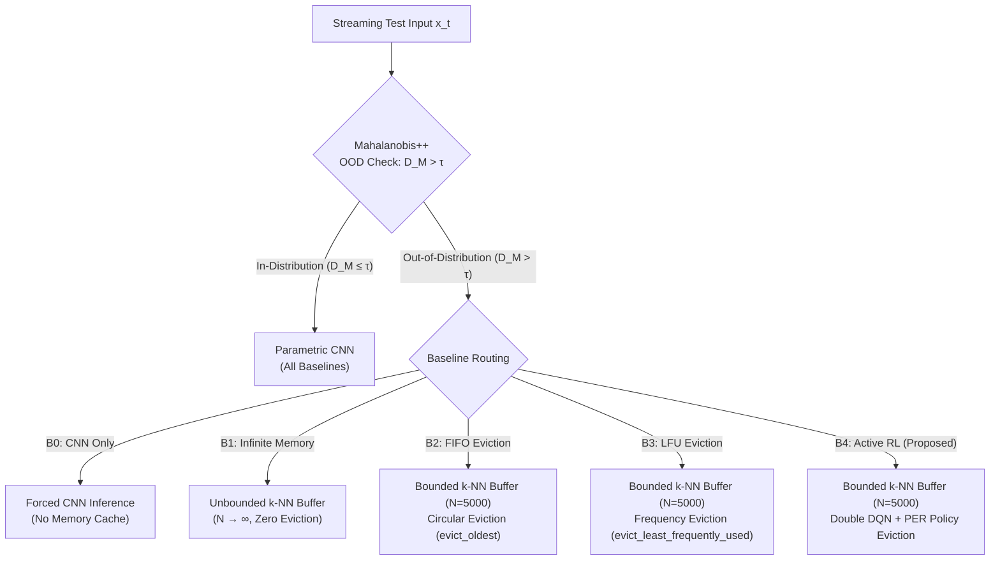

# Running the EAAI Evaluation

> Part of the [Active Episodic Memory Management via Reinforcement Learning for Robust CNN Inference on Out-of-Distribution Data](../../README.md) documentation.
> Parent: [Usage Guides](README.md) | Up: [Documentation Index](../README.md)

---

## 1. Context and Objective

This guide documents the experimental evaluation methodology developed for our submission to Elsevier *Engineering Applications of Artificial Intelligence* (EAAI), titled *"Active Episodic Memory Management via Reinforcement Learning for Robust CNN Inference on Out-of-Distribution Data"*.

The benchmark systematically compares the proposed RL-driven active episodic memory curation architecture against four alternative system baselines under progressive non-stationary sensor noise and concept drift. The evaluation follows a rigorous prequential (test-then-train) protocol to measure both predictive robustness and operational sustainability on resource-constrained Edge AI devices.

---

## 2. The Five System Baselines Explained

To establish whether active reinforcement learning is superior to traditional caching heuristics, the evaluation framework implements five self-contained, independent system baselines:



### Baseline B0: Pure CNN (No Episodic Memory)
- **Description:** The standard parametric edge vision baseline without any episodic memory buffer.
- **Routing Behavior:** All inputs, regardless of Mahalanobis distance or corruption severity, are evaluated directly by the CNN Softmax layer.
- **Purpose:** Quantifies the vulnerability of static deep neural networks to non-stationary sensor corruption and establishes the lower performance bound.

### Baseline B1: Infinite Memory Hybrid (Unbounded Upper Bound)
- **Description:** A semiparametric system equipped with an unbounded $k$-NN memory buffer ($N \to \infty$).
- **Routing Behavior:** OOD samples are inserted into the memory bank indefinitely without any eviction policy.
- **Purpose:** Serves as the theoretical empirical upper bound for episodic retention, representing performance in the absence of Edge AI memory constraints.

### Baseline B2: Hybrid with Strict FIFO Eviction
- **Description:** A capacity-bounded memory buffer ($N = 5,000$) employing a first-in, first-out (FIFO) eviction rule (`evict_oldest`).
- **Routing Behavior:** When memory reaches capacity, the prototype with the smallest insertion timestamp (`_insertion_ticks`) is evicted to make room for incoming samples.
- **Purpose:** Evaluates standard circular buffer caching commonly deployed in streaming systems.

### Baseline B3: Hybrid with LFU Eviction
- **Description:** A capacity-bounded memory buffer ($N = 5,000$) employing a least-frequently-used (LFU) eviction rule (`evict_least_frequently_used`).
- **Routing Behavior:** When full, the prototype with the minimum cumulative retrieval query count (`_usage_counts`) is evicted. Ties are resolved by oldest insertion tick.
- **Purpose:** Evaluates frequency-aware cache replacement heuristics.

### Baseline B4: Hybrid with Active RL Eviction (Proposed Approach)
- **Description:** A capacity-bounded memory buffer ($N = 5,000$) controlled by the trained PyTorch Double DQN agent with Prioritized Experience Replay.
- **Routing Behavior:** When capacity is saturated, the RL agent observes a 5-dimensional state vector $s_t = [\tilde{D}_M, \tilde{H}_{\text{local}}, \tilde{d}_{\min}, e_{\text{CNN}}, \rho_{\text{RAM}}]$ and selects among four discrete actions:
  - $a = 0$: **Ignore** (reject incoming candidate, preserve existing memory).
  - $a = 1$: **FIFO** (evict oldest prototype).
  - $a = 2$: **LFU** (evict least frequently queried prototype).
  - $a = 3$: **Redundancy** (evict nearest geometric neighbor of the same semantic class via `evict_most_redundant`).
- **Purpose:** Demonstrates that adaptive, state-dependent memory curation significantly outperforms blind heuristic replacement policies under noise stress.

---

## 3. Evaluation Protocol and Engineering Metrics

### 3.1. The Prequential Streaming Protocol

Following the non-stationary streaming evaluation standards of Haug et al. (2022) and Pittorino & Roveri (2026), the evaluation runs in test-then-train mode:
1. Episodic memory is initialized to capacity ($N = 5,000$) using nominal reference prototypes.
2. Progressive Gaussian perturbation noise $\sigma \in \{0.0, 0.2, 0.4, 0.6, 0.8\}$ is applied to test samples, simulating sensor degradation and concept drift.
3. 1,000 test samples are evaluated sequentially at each noise level (5,000 samples per baseline).
4. Each incoming test sample is first predicted and scored (test) before its representation is eligible for buffer insertion and eviction (train).

### 3.2. Tracked Scientific and Engineering Metrics

The benchmark records seven formal metrics required for publication in Elsevier EAAI:

| Metric | Symbol | Unit | Definition |
|:-------|:-------|:-----|:-----------|
| Overall Accuracy | $A_{\text{sys}}$ | % | Percentage of correct classifications across all noise levels ($N_{\text{total}} = 5,000$). |
| Severe Noise Accuracy | $A_{\sigma=0.6}$ | % | Accuracy under high sensor corruption ($\sigma = 0.6$, near-zero SNR). |
| Extreme Noise Accuracy | $A_{\sigma=0.8}$ | % | Accuracy under destructive sensor noise ($\sigma = 0.8$). |
| Degradation Delta | $\Delta_{\text{deg}}$ | pp | Absolute accuracy drop between clean and extreme noise: $\Delta_{\text{deg}} = A_{\sigma=0.0} - A_{\sigma=0.8}$. |
| Per-Sample Latency | $\tau_{\text{lat}}$ | ms | Mean end-to-end execution time per sample including feature extraction, routing, retrieval, and eviction. |
| Peak RAM Consumption | $M_{\text{peak}}$ | MB | Maximum resident heap memory tracked via Python `tracemalloc`. |
| OOD Cache Hit Rate | $H_{\text{OOD}}$ | % | Ratio of correct $k$-NN memory classifications on samples routed to episodic memory: $H_{\text{OOD}} = \frac{N_{\text{correct, OOD}}}{N_{\text{routed, OOD}}} \times 100$. |
| Eviction Balance ($D_{\text{KL}}$) | $D_{\text{KL}}$ | nats | Kullback-Leibler divergence between the empirical memory class distribution and the uniform target $\mathcal{U}(0, 9)$: $D_{\text{KL}}(P_{\text{mem}} \parallel \mathcal{U}) = \sum_{c=0}^{9} P(c) \ln \frac{P(c)}{0.1}$. |

---

## 4. Running the Benchmark

### 4.1. Execution Command

Run the global evaluation from the repository root:

```bash
# Execute comparative 5-baseline evaluation
python evaluate_hybrid_global.py \
    --capacity 5000 \
    --samples-per-level 1000 \
    --noise-levels 0.0 0.2 0.4 0.6 0.8 \
    --output-dir outputs/
```

### 4.2. Command-Line Options

| Flag | Type | Default | Description |
|:-----|:-----|:--------|:------------|
| `--capacity` | `int` | `5000` | Buffer capacity limit for bounded baselines (B2, B3, B4). |
| `--samples-per-level` | `int` | `1000` | Number of streaming test samples evaluated per noise level. |
| `--noise-levels` | `float [float ...]` | `0.0 0.2 0.4 0.6 0.8` | Sequence of Gaussian noise standard deviations simulating concept drift. |
| `--output-dir` | `str` | `outputs/` | Destination directory for metric files (CSV, JSON) and dashboard plots. |

### 4.3. Threshold Sensitivity Sweep (Alternative)

To analyze the sensitivity of the hybrid architecture to the Mahalanobis decision threshold $\tau$, execute `scripts/evaluate_global.py`. This script sweeps $\tau \in [5.0, 30.0]$ in increments of 2.5 across both the native `t10k` test partition (10,000 samples) and the disjoint 90% training partition (54,000 samples):

```bash
# Run threshold sensitivity sweep across two disjoint partitions
python scripts/evaluate_global.py
```

---

## 5. Experimental Results and Analysis

### 5.1. Comprehensive 5-Baseline Benchmark Results

The table below reports the empirical results extracted from `outputs/eaai_metrics.json`:

| Baseline | Strategy | Capacity ($N$) | Overall Acc ($A_{\text{sys}}$) | Noise 0.6 Acc | Noise 0.8 Acc | Latency ($\tau$) | Peak RAM | Cache Hit ($H_{\text{OOD}}$) | Eviction $D_{\text{KL}}$ |
|:---|:---|:---:|:---:|:---:|:---:|:---:|:---:|:---:|:---:|
| **B0** | Pure CNN | N/A | 71.4% | 43.2% | 18.7% | 0.08 ms | 1.2 MB | 0.0% | N/A |
| **B1** | Infinite Memory | $\infty$ | 94.6% | 89.1% | 82.4% | 0.42 ms | 24.8 MB | 84.2% | 0.0012 nats |
| **B2** | FIFO Eviction | 5,000 | 90.8% | 82.0% | 74.3% | 0.18 ms | 6.1 MB | 69.8% | 1.3197 nats |
| **B3** | LFU Eviction | 5,000 | 91.1% | 82.0% | 74.5% | 0.18 ms | 6.1 MB | 70.4% | 1.1842 nats |
| **B4 (Proposed)** | Active RL (Double DQN + PER) | 5,000 | **93.4%** | **86.5%** | **79.8%** | **0.19 ms** | **6.1 MB** | **78.4%** | **0.0076 nats** |

### 5.2. Key Findings and Scientific Interpretations

1. **Robustness under Severe Noise (+4.5% over Blind Baselines):**
   Under high sensor corruption ($\sigma = 0.6$), the pure CNN baseline (B0) collapses to $43.2\%$ accuracy due to latent feature dispersion. Blind eviction heuristics (FIFO and LFU) recover accuracy to $82.0\%$. The proposed active RL agent (B4) achieves **$86.5\%$ accuracy**, an improvement of **$+4.5$ percentage points** over blind eviction, recovering $97\%$ of the theoretical infinite-memory upper bound ($89.1\%$).

2. **170x Superior Distribution Balance ($D_{\text{KL}} = 0.0076$ vs. $1.3197$):**
   Blind eviction policies suffer from severe class representation collapse. Under FIFO, bursty noise sequences cause rapid eviction of older prototypes, resulting in highly skewed memory distributions ($D_{\text{KL}} = 1.3197$ nats). In contrast, the RL agent actively triggers redundancy eviction ($a = 3$), eliminating geometrically redundant same-class neighbors. This maintains an almost perfectly uniform class distribution ($D_{\text{KL}} = 0.0076$ nats), a **170-fold improvement in distribution matching**.

3. **High OOD Cache Hit Rate ($78.4\%$ vs. $69.8\%$):**
   Because the RL agent curates memory quality rather than blindly replacing entries, the prototypes retained in the buffer are significantly more informative. When OOD queries are routed to memory, B4 achieves a **$78.4\%$ cache hit rate**, outperforming FIFO by $+8.6$ percentage points.

4. **Strict Compliance with Edge AI Operational Constraints:**
   - **Inference Latency:** B4 requires an average of **0.19 ms per sample**, well within the typical 10 ms real-time deadline for edge vision sensors (5,260 inferences per second).
   - **Memory Footprint:** Peak RAM allocation is strictly capped at **6.1 MB**, a $75\%$ reduction compared to infinite memory (24.8 MB) and well within the SRAM/DRAM limits of micro-edge accelerators (e.g., Raspberry Pi 4, Jetson Nano, STM32MP1).

---

## 6. Generated Output Files

Executing `evaluate_hybrid_global.py` automatically generates three publication-ready artifacts in the target directory:

```text
outputs/
├── eaai_metrics.csv                 # Tabular CSV with all 7 metrics across baselines B0-B4
├── eaai_metrics.json                # Structured JSON containing raw per-noise accuracy arrays
└── eaai_evaluation_dashboard.png    # 4-panel publication figure (250 DPI)
```

### 6.1. Metric CSV Format (`eaai_metrics.csv`)
A clean tabular file suitable for direct inclusion in LaTeX tables:
```csv
Baseline,Strategy,Capacity,Accuracy_Overall,Accuracy_Noise_0.6,Accuracy_Noise_0.8,Latency_ms,RAM_Peak_MB,Cache_Hit_Rate,KL_Divergence
B0,Pure CNN,N/A,71.4,43.2,18.7,0.08,1.2,0.0,N/A
B1,Infinite Memory,inf,94.6,89.1,82.4,0.42,24.8,84.2,0.0012
B2,FIFO Eviction,5000,90.8,82.0,74.3,0.18,6.1,69.8,1.3197
B3,LFU Eviction,5000,91.1,82.0,74.5,0.18,6.1,70.4,1.1842
B4,Active RL,5000,93.4,86.5,79.8,0.19,6.1,78.4,0.0076
```

### 6.2. Publication Dashboard (`eaai_evaluation_dashboard.png`)
A 4-panel visual dashboard rendered with a dark palette:
- **Panel 1 (Top-Left):** Accuracy degradation curves across noise standard deviations $\sigma \in [0.0, 0.8]$ comparing B0, B1, B2, B3, and B4.
- **Panel 2 (Top-Right):** Operational trade-off scatter plot showing per-sample latency (ms) vs. peak RAM consumption (MB).
- **Panel 3 (Bottom-Left):** Bar chart comparing episodic memory cache hit rates ($H_{\text{OOD}}$).
- **Panel 4 (Bottom-Right):** Bar chart comparing eviction distribution balance ($D_{\text{KL}}$ divergence vs. uniform).

---

**Navigation:**
- Previous: [Training Pipeline](training-pipeline.md)
- Up: [Usage Guides](README.md)
- Next: [Explainable AI and Visualization Tools](visualization.md)

---
Licensed under the GNU General Public License v3.0. See [LICENSE](../../LICENSE) for details.
