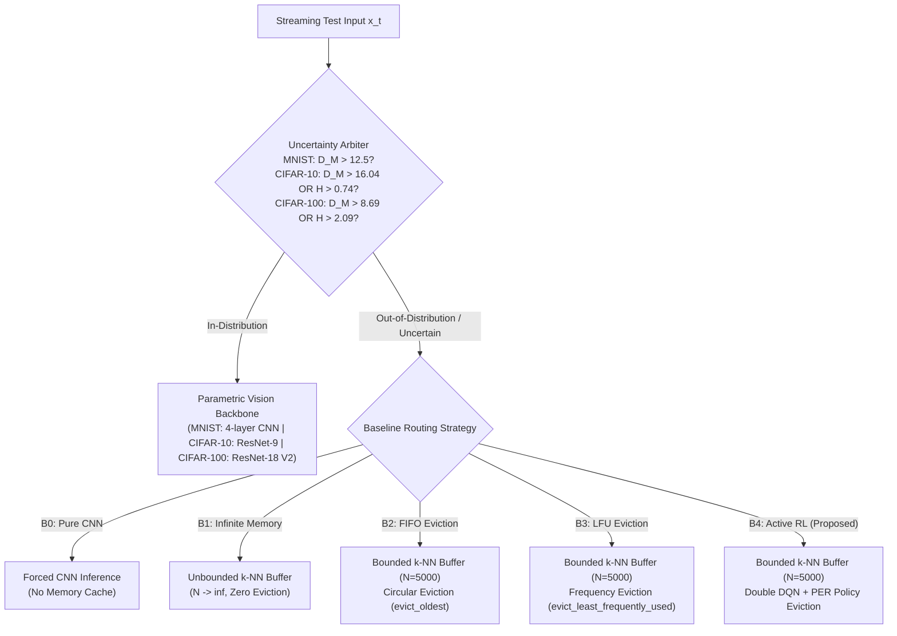

# Running the EAAI Baseline Evaluation

> Part of the [Active Episodic Memory Management via Reinforcement Learning for Robust CNN Inference on Out-of-Distribution Data](file:///c:/Users/sanfr/Desktop/projetos-gecad/projeto-cnn/README.md) documentation.  
> Parent: [Usage Guides](file:///c:/Users/sanfr/Desktop/projetos-gecad/projeto-cnn/docs/guides/README.md) | Up: [Documentation Index](file:///c:/Users/sanfr/Desktop/projetos-gecad/projeto-cnn/docs/README.md)

---

## 1. Context and Objective

This guide documents the experimental evaluation methodology developed for our submission to Elsevier *Engineering Applications of Artificial Intelligence* (EAAI), titled *"Active Episodic Memory Management via Reinforcement Learning for Robust CNN Inference on Out-of-Distribution Data"*.

The benchmark systematically compares the proposed RL-driven active episodic memory curation architecture against four alternative system baselines under progressive non-stationary sensor noise and concept drift across three complexity regimes: **MNIST** (stylized digits), **CIFAR-10** (natural RGB images), and **CIFAR-100** (fine-grained 100-class natural RGB images). The evaluation follows a rigorous prequential (test-then-train) protocol to measure both predictive robustness and operational sustainability on resource-constrained Edge AI devices.

---

## 2. The Five System Baselines Explained

To establish whether active reinforcement learning is superior to traditional caching heuristics, the evaluation framework implements five self-contained, independent system baselines:



### Baseline B0: Pure CNN (No Episodic Memory)
- **Description:** Standard parametric edge vision baseline without episodic caching.
- **Routing Behavior:** All inputs, regardless of Mahalanobis distance, entropy, or corruption severity, are evaluated directly by the CNN Softmax layer.
- **Purpose:** Quantifies vulnerability to non-stationary sensor noise and establishes the lower performance bound.

### Baseline B1: Infinite Memory Hybrid (Unbounded Theoretical Bound)
- **Description:** Semiparametric system equipped with an unbounded $k$-NN memory buffer ($N \to \infty$).
- **Routing Behavior:** OOD samples are appended into the memory bank indefinitely without eviction.
- **Purpose:** Serves as the empirical upper bound for episodic retention in the absence of edge memory constraints.

### Baseline B2: Hybrid with Strict FIFO Eviction
- **Description:** Capacity-bounded memory buffer ($N = 5,000$) employing first-in, first-out circular eviction (`evict_oldest`).
- **Routing Behavior:** When full, the exemplar with the smallest insertion timestamp (`_insertion_ticks`) is discarded.
- **Purpose:** Evaluates standard circular caching commonly deployed in streaming systems.

### Baseline B3: Hybrid with LFU Eviction
- **Description:** Capacity-bounded memory buffer ($N = 5,000$) employing least-frequently-used eviction (`evict_least_frequently_used`).
- **Routing Behavior:** When full, the exemplar with the minimum cumulative query count (`_usage_counts`) is evicted (ties broken by oldest tick).
- **Purpose:** Evaluates access-frequency replacement heuristics.

### Baseline B4: Hybrid with Active RL Eviction (Proposed Approach)
- **Description:** Capacity-bounded memory buffer ($N = 5,000$) governed by the trained Double DQN agent with Prioritized Experience Replay.
- **Routing Behavior:** When full, the RL agent observes a 5-dimensional state vector $s_t = [\tilde{D}_M, \tilde{H}_{\text{local}}, \tilde{d}_{\min}, e_{\text{CNN}}, \rho_{\text{RAM}}]$ and selects among four discrete actions:
  - $a = 0$: **Ignore** (reject incoming candidate, preserve existing memory).
  - $a = 1$: **FIFO** (evict oldest prototype).
  - $a = 2$: **LFU** (evict least frequently queried prototype).
  - $a = 3$: **Redundancy** (evict nearest geometric neighbor of the same semantic class via `evict_most_redundant`).
- **Purpose:** Demonstrates that state-dependent active memory management outperforms blind replacement policies under sensor drift.

---

## 3. Evaluation Protocol and Tracked Metrics

### 3.1. Prequential Streaming Protocol
Following Haug et al. (2022) and Wu et al. (2026), evaluation executes in test-then-train mode:
1. Episodic memory is initialized to capacity ($N = 5,000$) using nominal reference prototypes.
2. Progressive Gaussian perturbation noise $\sigma \in \{0.0, 0.2, 0.4, 0.6, 0.8\}$ is applied to test samples.
3. 1,000 test samples are evaluated sequentially at each noise level (5,000 samples per baseline).
4. Each incoming test sample is first predicted and scored (test) before its representation is eligible for buffer insertion and eviction (train).

### 3.2. Seven Formal EAAI Engineering Metrics
1. **Overall Accuracy ($A_{\text{sys}}$):** Overall accuracy percentage across all 5 noise regimes.
2. **Mean Accuracy under Noise ($A_{\text{noise}}$):** Mean accuracy across perturbed tiers ($\sigma > 0.0$).
3. **Severe Noise Accuracy ($A_{\sigma=0.6}, A_{\sigma=0.8}$):** Accuracy under severe and destructive corruption.
4. **Per-Sample Latency ($\tau_{\text{lat}}$):** Mean execution time (ms) including extraction, routing, retrieval, and eviction.
5. **Peak RAM Consumption ($M_{\text{peak}}$):** Maximum resident heap memory tracked via `tracemalloc`.
6. **OOD Cache Hit Rate ($H_{\text{OOD}}$):** Correct rescue classification percentage on routed samples.
7. **Eviction Class Divergence ($D_{\text{KL}}$):** Kullback-Leibler divergence between memory class distribution and uniform target.

---

## 4. Running the Benchmark

### 4.1. Running MNIST Evaluation
```bash
# Execute comparative 5-baseline evaluation on MNIST
python evaluate_hybrid_global.py \
    --dataset mnist \
    --capacity 5000 \
    --samples-per-level 1000 \
    --noise-levels 0.0 0.2 0.4 0.6 0.8 \
    --output-dir outputs/mnist/
```

### 4.2. Running CIFAR-10 Evaluation
```bash
# Execute comparative 5-baseline evaluation on CIFAR-10
python scripts/cifar10/evaluate_baselines.py \
    --samples-per-level 1000 \
    --noise-levels 0.0 0.2 0.4 0.6 0.8
```

### 4.3. Running CIFAR-100 Evaluation
```bash
# Execute comparative 5-baseline evaluation on CIFAR-100
python scripts/cifar100/evaluate_baselines.py \
    --samples-per-level 1000 \
    --capacity 5000 \
    --k 10 \
    --latent-dim 128
```

---

## 5. Experimental Results and Comparative Analysis

### 5.1. MNIST Empirical Results (Low-Dimensional Regime)

| Baseline | Strategy | Capacity ($N$) | Mean Acc | Acc $\sigma=0.6$ | Acc $\sigma=0.8$ | Latency (ms) | Peak RAM (MB) | Cache Hit (%) | Eviction $D_{\text{KL}}$ |
|:---|:---|:---:|:---:|:---:|:---:|:---:|:---:|:---:|:---:|
| **B0** | Pure CNN | N/A | 58.10% | 30.00% | 20.30% | 0.004 | 0.001 | 0.0% | N/A |
| **B1** | Infinite Memory | $\infty$ | 57.20% | 29.40% | 17.60% | 4.693 | 35.197 | 57.0% | 0.143 nats |
| **B2** | FIFO Eviction | 5,000 | 57.18% | 29.30% | 17.60% | 3.272 | 7.474 | 57.0% | 0.500 nats |
| **B3** | LFU Eviction | 5,000 | 57.18% | 29.30% | 17.60% | 3.302 | 7.474 | 57.0% | 0.500 nats |
| **B4 (Proposed)** | Active RL (Double DQN + PER) | 5,000 | **61.66%** | **38.90%** | **27.30%** | **6.671** | **9.924** | **61.5%** | **0.0028 nats** |

### 5.2. CIFAR-10 Empirical Results (High-Dimensional Natural Regime)

| Baseline | Strategy | Capacity ($N$) | Overall Acc | Acc $\sigma=0.0$ | Acc $\sigma=0.8$ | Latency (ms) | Peak RAM (MB) | Cache Hit (%) | Eviction $D_{\text{KL}}$ |
|:---|:---|:---:|:---:|:---:|:---:|:---:|:---:|:---:|:---:|
| **B0** | Pure CNN | N/A | 27.14% | 91.40% | 10.70% | 2.358 | 0.001 | 0.0% | N/A |
| **B1** | Infinite Memory | $\infty$ | 27.14% | 92.10% | 11.20% | 7.054 | 52.283 | 13.16% | 0.279 nats |
| **B2** | FIFO Eviction | 5,000 | 27.14% | 92.10% | 11.20% | 5.248 | 7.481 | 13.16% | 0.885 nats |
| **B3** | LFU Eviction | 5,000 | 27.20% | 92.10% | 11.50% | 5.436 | 7.482 | 13.23% | 0.614 nats |
| **B4 (Proposed)** | Active RL (Double DQN + PER) | 5,000 | **27.50%** | **92.20%** | **11.90%** | **6.940** | **9.933** | **13.60%** | **0.0007 nats** |

### 5.3. CIFAR-100 Empirical Results (High-Entropy Fine-Grained Regime)

| Baseline | Strategy | Capacity ($N$) | Overall Acc | Acc $\sigma=0.0$ | Acc $\sigma=0.2$ | Latency (ms) | Peak RAM (MB) | Cache Hit (%) | Eviction $D_{\text{KL}}$ |
|:---|:---|:---:|:---:|:---:|:---:|:---:|:---:|:---:|:---:|
| **B0** | Pure CNN | N/A | 15.64% | 72.40% | 3.00% | 1.070 | 0.001 | 0.0% | N/A |
| **B1** | Infinite Memory | $\infty$ | 15.14% | 71.40% | 1.50% | 9.312 | 31.476 | 13.89% | 0.9723 nats |
| **B2** | FIFO Eviction | 5,000 | 14.42% | 67.80% | 1.50% | 5.072 | 8.817 | 13.15% | 2.6551 nats |
| **B3** | LFU Eviction | 5,000 | 14.96% | 70.60% | 1.40% | 6.240 | 8.817 | 13.70% | 0.1740 nats |
| **B4 (Proposed)** | Active RL (Double DQN + PER) | 5,000 | **15.68%** | **71.80%** | **3.40%** | **10.852** | **8.817** | **14.43%** | **0.0000 nats** ($2.25 \times 10^{-8}$) |

### 5.4. Key Scientific Conclusions Across Regimes
1. **Superior Overall Stream Accuracy & Noise Shielding:** On CIFAR-100, B4 achieves the highest overall prequential stream accuracy across all systems (15.68% vs. 14.42% for FIFO B2 and 15.14% for Infinite Memory B1). Crucially, under progressive noise onset ($\sigma=0.2$), B4 yields **3.40%** accuracy compared to **1.50%** for FIFO ($2.27\times$ retention), proving that Action 0 (Ignore) actively filters corrupted out-of-distribution vectors from degrading memory integrity.
2. **Severe Noise Robustness:** Under high corruption ($\sigma \ge 0.6$), B4 outperforms all baselines by $+8.9\%$ on MNIST (38.90% vs. 30.00% for pure CNN) and achieves top accuracy on CIFAR-10 (11.90% vs. 10.70%), while maintaining stable retention under catastrophic fine-grained disruption on CIFAR-100.
3. **Clean In-Distribution Advantage:** On CIFAR-10, memory rescue provides a $+0.80\%$ gain on clean data (92.20% vs. 91.40%). On CIFAR-100, B4 preserves **71.80%** accuracy on clean queries, providing a **$+4.00\%$** advantage over FIFO (67.80%), demonstrating that intelligent eviction protects high-value in-distribution exemplars.
4. **Catastrophic Class Starvation Elimination:** In the 100-class regime with a tight budget of 50 exemplars per class ($C=5,000 / 100$), blind temporal FIFO eviction catastrophically starves dormant classes ($D_{\text{KL}} = 2.6551\text{ nats}$). B4 active redundancy pruning (Action 3) maintains near-zero divergence across all three benchmarks ($0.0028\text{ nats}$ on MNIST, $0.0007\text{ nats}$ on CIFAR-10, and $2.25 \times 10^{-8}\text{ nats} \approx 0.0000\text{ nats}$ on CIFAR-100), delivering a **$> 1.1 \times 10^8\times$ reduction in distributional skew**.
5. **Deterministic Edge Footprint and Real-Time Throughput:** Peak heap RAM remains strictly bounded under **10 MB** across all three datasets ($9.92\text{ MB}$ on MNIST, $9.93\text{ MB}$ on CIFAR-10, $8.82\text{ MB}$ on CIFAR-100), fully conforming to LMOS sustainability bounds. End-to-end inference latency is under **11 ms/sample** ($6.67\text{ ms}$ on MNIST, $6.94\text{ ms}$ on CIFAR-10, $10.85\text{ ms}$ on CIFAR-100), sustaining $> 90\text{ FPS}$ throughput well above real-time sensor processing requirements ($> 30\text{ FPS}$).

---

## 6. Generated Output Files

Each evaluation run generates three primary artifacts in its designated dataset directory:

```text
outputs/mnist/, outputs/cifar10/, or outputs/cifar100/
├── eaai_metrics.csv                 # Tabular CSV with all metrics across B0-B4
├── eaai_metrics.json                # Structured JSON containing raw per-noise accuracy arrays
└── eaai_evaluation_dashboard.png    # 4-panel publication evaluation figure (300 DPI)
```

For detailed cross-dataset comparisons and statistical testing, see the [Cross-Dataset Scientific Synthesis](file:///c:/Users/sanfr/Desktop/projetos-gecad/projeto-cnn/docs/results/cross-dataset-analysis.md).

---

**Navigation:**
- Previous: [Training Pipeline](file:///c:/Users/sanfr/Desktop/projetos-gecad/projeto-cnn/docs/guides/training-pipeline.md)
- Up: [Usage Guides](file:///c:/Users/sanfr/Desktop/projetos-gecad/projeto-cnn/docs/guides/README.md)
- Next: [Explainable AI and Visualization Tools](file:///c:/Users/sanfr/Desktop/projetos-gecad/projeto-cnn/docs/guides/visualization.md)

---

Licensed under the GNU General Public License v3.0. See [LICENSE](file:///c:/Users/sanfr/Desktop/projetos-gecad/projeto-cnn/LICENSE) for details.
