# Training Pipeline Guide

> Part of the [Active Episodic Memory Management via Reinforcement Learning for Robust CNN Inference on Out-of-Distribution Data](file:///c:/Users/sanfr/Desktop/projetos-gecad/projeto-cnn/README.md) documentation.  
> Parent: [Usage Guides](file:///c:/Users/sanfr/Desktop/projetos-gecad/projeto-cnn/docs/guides/README.md) | Up: [Documentation Index](file:///c:/Users/sanfr/Desktop/projetos-gecad/projeto-cnn/docs/README.md)

---

## 1. Pipeline Overview

The active semiparametric system provides dedicated, isolated reproduction pipelines for both **MNIST** (low-complexity stylized digits) and **CIFAR-10** (high-complexity natural images). Each pipeline follows a strictly sequential 5-stage progression where upstream stages generate serialized artifacts required by downstream modules:

```mermaid
flowchart TD
    subgraph MNISTPipeline["Track A: MNIST Execution Pipeline"]
        M_DATA["MNIST Raw Bytes<br>data/MNIST/raw/"] --> M_CNN["scripts/train_cnn.py<br>SGD, lr=0.05, 10 epochs"]
        M_CNN --> M_CKPT["outputs/mnist/checkpoints/<br>modelo_dissecado-*"]
        M_CKPT --> M_PROF["scripts/profile_latent.py<br>Mahalanobis++ (L2 Hypersphere)"]
        M_PROF --> M_MAHA["outputs/mnist/<br>mahalanobis_pp_profiles.npz"]
        M_CKPT & M_MAHA --> M_SEED["scripts/train_rl.py<br>Seed 5,000 Slots (k=30)"]
        M_SEED --> M_MEM["outputs/mnist/<br>knn_memory_bank_128d.npz"]
        M_CKPT & M_MEM --> M_SIM["training/train_rl_online_simulation.py<br>50,000 Streaming Steps"]
        M_SIM --> M_RL["outputs/mnist/checkpoints/<br>rl_agent_phase3.pt"]
        M_CKPT & M_MEM & M_RL --> M_EVAL["evaluate_hybrid_global.py<br>5 Baselines: B0 to B4"]
        M_EVAL --> M_OUT["outputs/mnist/<br>eaai_metrics.json & dashboard"]
    end

    subgraph CIFAR10Pipeline["Track B: CIFAR-10 Dedicated Pipeline"]
        C_DATA["CIFAR-10 Batches<br>data/CIFAR10/raw/"] --> C_CNN["scripts/cifar10/train_cnn.py<br>ResNet-9, Adam, 25 epochs"]
        C_CNN --> C_CKPT["outputs/cifar10/checkpoints/<br>modelo_dissecado-24 (91.18%)"]
        C_CKPT --> C_PROF["scripts/cifar10/profile_latent.py<br>Dual Uncertainty Calibration"]
        C_PROF --> C_MAHA["outputs/cifar10/<br>mahalanobis_pp_profiles.npz"]
        C_CKPT & C_MAHA --> C_SEED["scripts/cifar10/seed_memory.py<br>Seed 5,000 Slots (k=10, 91.9%)"]
        C_SEED --> C_MEM["outputs/cifar10/<br>knn_memory_bank_128d.npz"]
        C_CKPT & C_MEM --> C_SIM["scripts/cifar10/train_simulation.py<br>50,000 Streaming Steps under Drift"]
        C_SIM --> C_RL["outputs/cifar10/checkpoints/<br>rl_agent_phase3.pt"]
        C_CKPT & C_MEM & C_RL --> C_EVAL["scripts/cifar10/evaluate_baselines.py<br>5 Baselines: B0 to B4"]
        C_EVAL --> C_OUT["outputs/cifar10/<br>eaai_metrics.json & dashboard"]
    end
```



---

## 2. Track A: MNIST Training Pipeline

### Step 2.1: Parametric CNN Training
Trains the custom from-scratch 4-layer CNN ([`RawModel`](file:///c:/Users/sanfr/Desktop/projetos-gecad/projeto-cnn/src/models/custom_cnn.py)) with SGD optimizer on 60,000 training images:
```bash
python scripts/train_cnn.py
```
- **Configuration:** Batch size 128, Learning rate 0.05, 10 epochs.
- **Output:** `outputs/mnist/checkpoints/modelo_dissecado-*`.
- **Target Metric:** Validation accuracy $> 98.5\%$.

### Step 2.2: Mahalanobis++ Latent Profiling
Calculates class centroids $\mu_c$ and Ledoit-Wolf precision matrices $\Sigma_c^{-1}$ on $L_2$-normalized 128D features:
```bash
python scripts/profile_latent.py
```
- **Output:** `outputs/mnist/mahalanobis_pp_profiles.npz`.
- **Target Metric:** Calibrated distance threshold $\tau = 12.5$.

### Step 2.3: Episodic Memory Seeding
Seeds 5,000 exemplar slots in pre-allocated NumPy storage with balanced nominal prototypes:
```bash
python scripts/train_rl.py --latent-dim 128
```
- **Output:** `outputs/mnist/knn_memory_bank_128d.npz`.
- **Target Metric:** 5,000 pre-allocated slots populated.

### Step 2.4: Online Streaming RL Simulation
Runs 50,000 prequential steps under concept drift ($p=0.1, \sigma=0.6$), training Double DQN + PER:
```bash
python -m training.train_rl_online_simulation --steps 50000
```
- **Output:** `outputs/mnist/checkpoints/rl_agent_phase3.pt` and `outputs/mnist/train_rl_simulation_log.csv`.
- **Target Metric:** Curriculum alpha decay to $\alpha \le 0.01$.

### Step 2.5: 5-Baseline Evaluation
Executes standardized prequential evaluation across B0--B4:
```bash
python evaluate_hybrid_global.py --dataset mnist --output-dir outputs/mnist/
```
- **Output:** `outputs/mnist/eaai_metrics.json`, `eaai_metrics.csv`, and `eaai_evaluation_dashboard.png`.

---

## 3. Track B: CIFAR-10 Dedicated Pipeline

### Step 3.1: ResNet-9 Backbone Training
Trains the upgraded ResNet-9 backbone ([`RawModelCIFAR10`](file:///c:/Users/sanfr/Desktop/projetos-gecad/projeto-cnn/src/cifar10/model.py)) with residual blocks, Batch Normalization, and pure TensorFlow Adam optimizer:
```bash
python scripts/cifar10/train_cnn.py --epochs 25 --batch-size 128 --lr 0.001 --weight-decay 1e-4
```
- **Execution Script:** [`scripts/cifar10/train_cnn.py`](file:///c:/Users/sanfr/Desktop/projetos-gecad/projeto-cnn/scripts/cifar10/train_cnn.py)
- **Data Augmentation:** Random horizontal flip + random crop ($32 \times 32$, pad 4).
- **Learning Rate Schedule:** Cosine annealing decay with linear warmup.
- **Output Checkpoint:** `outputs/cifar10/checkpoints/modelo_dissecado-24`
- **Milestone Achieved:** **91.18%** nominal test accuracy (exceeds $\ge 90.0\%$ target).

### Step 3.2: Dual Uncertainty Arbiter Calibration
Extracts 128D latent bottleneck representations and Softmax probability distributions, calibrating unnormalized Mahalanobis distance and predictive Shannon entropy:
```bash
python scripts/cifar10/profile_latent.py --percentile 95.0
```
- **Execution Script:** [`scripts/cifar10/profile_latent.py`](file:///c:/Users/sanfr/Desktop/projetos-gecad/projeto-cnn/scripts/cifar10/profile_latent.py)
- **Calibration Set:** 5,000 clean training features mapped through ResNet-9.
- **Output Profile:** `outputs/cifar10/mahalanobis_pp_profiles.npz`
- **Calibrated Parameters:** $\tau_M = 16.0380$, $\tau_H = 0.7382\text{ nats}$.

### Step 3.3: Episodic Memory Buffer Seeding
Initializes a capacity-bounded memory bank ($N = 5,000$) with clean training exemplars using $k=10$ nearest neighbors:
```bash
python scripts/cifar10/seed_memory.py --samples 5000 --k 10
```
- **Execution Script:** [`scripts/cifar10/seed_memory.py`](file:///c:/Users/sanfr/Desktop/projetos-gecad/projeto-cnn/scripts/cifar10/seed_memory.py)
- **Output Bank:** `outputs/cifar10/knn_memory_bank_128d.npz`
- **Validation Milestone:** $k$-NN baseline achieves **91.90%** top-1 accuracy with $2.93\text{ ms}$ query latency.

### Step 3.4: Online Streaming RL Simulation under Concept Drift
Executes 50,000 steps of online prequential simulation under intermittent Gaussian noise perturbation:
```bash
python scripts/cifar10/train_simulation.py --steps 50000 --noise-rate 0.1 --noise-level 0.6
```
- **Execution Script:** [`scripts/cifar10/train_simulation.py`](file:///c:/Users/sanfr/Desktop/projetos-gecad/projeto-cnn/scripts/cifar10/train_simulation.py)
- **Agent Policy:** Double DQN with Prioritized Experience Replay (SumTree).
- **Curriculum Learning:** Blends geometric density reward ($R_{\text{geom}}$) with sliding empirical accuracy ($R_{\text{acc}}$).
- **Output Artifacts:** `outputs/cifar10/checkpoints/rl_agent_phase3.pt` and `outputs/cifar10/train_rl_simulation_log.csv`.
- **Policy Behavior:** Learns to filter noise via Action 0 (Ignore) and prune class redundancy via Action 3.

### Step 3.5: 5-Baseline Comparative Benchmark
Runs the comprehensive publication benchmark across all five baselines (B0 to B4) over 5 progressive noise levels ($\sigma \in \{0.0, 0.2, 0.4, 0.6, 0.8\}$):
```bash
python scripts/cifar10/evaluate_baselines.py --samples-per-level 1000 --noise-levels 0.0 0.2 0.4 0.6 0.8
```
- **Execution Script:** [`scripts/cifar10/evaluate_baselines.py`](file:///c:/Users/sanfr/Desktop/projetos-gecad/projeto-cnn/scripts/cifar10/evaluate_baselines.py)
- **Output Artifacts:** `outputs/cifar10/eaai_metrics.json`, `eaai_metrics.csv`, and `eaai_evaluation_dashboard.png`.
- **Key Result:** B4 achieves **27.50%** overall accuracy, outperforming FIFO B2 (27.14%) and pure CNN B0 (27.14%), while bounding peak RAM to **9.93 MB** and maintaining an eviction KL divergence of **0.0007 nats**.

---

## 4. Track C: CIFAR-100 Dedicated Pipeline

### Step 4.1: ResNet-14 Backbone Training
Trains the deep ResNet-14 backbone (`RawModelCIFAR100`, 6 residual blocks) with AdamW, Cutout ($8\times8$), Cosine Annealing, and 100-class Label Smoothing:
```bash
python scripts/cifar100/train_cnn.py --model-version v2 --epochs 150 --batch-size 128 --latent-dim 128 --optimizer adamw --lr 0.001 --weight-decay 0.0001 --cutmix-prob 0.5 --standardize
```
- **Execution Script:** [`scripts/cifar100/train_cnn.py`](file:///c:/Users/sanfr/Desktop/projetos-gecad/projeto-cnn/scripts/cifar100/train_cnn.py)
- **Output:** `outputs/cifar100/checkpoints/modelo_dissecado-*` and `outputs/cifar100/checkpoints/model_meta.json`.
- **Key Result:** Achieved **74.27%** nominal top-1 test accuracy on 100 classes using the promoted ResNet-18 V2 architecture ($+6.97\%$ gain over initial V1 baseline).

### Step 4.2: Episodic Memory Seeding & Dual Uncertainty Calibration
Fits the 100-class Dual Uncertainty Arbiter using Ledoit-Wolf shrinkage and seeds the 5,000-slot memory bank with balanced prototypes:
```bash
python scripts/cifar100/seed_memory.py --checkpoint-dir outputs/cifar100/checkpoints --latent-dim 128 --k 10 --capacity 5000
```
- **Execution Script:** [`scripts/cifar100/seed_memory.py`](file:///c:/Users/sanfr/Desktop/projetos-gecad/projeto-cnn/scripts/cifar100/seed_memory.py)
- **Outputs:** `outputs/cifar100/arbiter_profiles.npz` and `outputs/cifar100/knn_memory_bank.npz`.
- **Calibrated Thresholds:** $\tau_M = 8.69$, $\tau_H = 2.09$.

### Step 4.3: Online Streaming RL Simulation under Drift
Executes online prequential streaming simulation with the Double DQN + PER agent under concept drift and noise injection:
```bash
python scripts/cifar100/train_simulation.py --steps 50000 --log-interval 1000
```
- **Execution Script:** [`scripts/cifar100/train_simulation.py`](file:///c:/Users/sanfr/Desktop/projetos-gecad/projeto-cnn/scripts/cifar100/train_simulation.py)
- **Outputs:** `outputs/cifar100/checkpoints/rl_agent_phase3.pt` and `outputs/cifar100/train_rl_simulation_log.csv`.
- **Learned Actions:** Action 0 (Filter noise outliers) and Action 3 (Prune intra-class redundancy); Mean reward $+0.928$.

### Step 4.4: 5-Baseline Comparative Benchmark
Runs the comprehensive comparative benchmark on 5,000 streaming test samples across 5 noise levels:
```bash
python scripts/cifar100/evaluate_baselines.py --samples-per-level 1000 --capacity 5000 --k 10 --latent-dim 128
```
- **Execution Script:** [`scripts/cifar100/evaluate_baselines.py`](file:///c:/Users/sanfr/Desktop/projetos-gecad/projeto-cnn/scripts/cifar100/evaluate_baselines.py)
- **Outputs:** `outputs/cifar100/eaai_metrics.json`, `outputs/cifar100/eaai_metrics.csv`, and `outputs/cifar100/eaai_evaluation_dashboard.png`.
- **Key Result:** B4 achieves **71.80%** clean accuracy (+4.00% vs FIFO), **3.40%** accuracy at $\sigma=0.2$ ($2.27\times$ higher than FIFO at $1.50\%$), **15.68%** overall stream accuracy (#1 across all baselines), completely eliminates class starvation ($D_{KL} = 2.25 \times 10^{-8}\text{ nats}$ vs. $2.6551\text{ nats}$ for FIFO), bounds RAM to **8.82 MB**, and executes at **10.85 ms/sample** (92.1 fps).

---

## 5. Expected Outputs Summary Table

| Dataset | Step | Artifact Path | Format | Description |
|:---|:---|:---|:---|:---|
| **MNIST** | Step 1 | `outputs/mnist/checkpoints/modelo_dissecado-*` | TF Checkpoint | Custom 4-layer CNN weights (98.7% acc). |
| **MNIST** | Step 2 | `outputs/mnist/mahalanobis_pp_profiles.npz` | NumPy NPZ | Hypersphere centroids and precision matrices ($\tau=12.5$). |
| **MNIST** | Step 3 | `outputs/mnist/knn_memory_bank_128d.npz` | NumPy NPZ | Pre-allocated 5,000-slot memory bank ($k=30$). |
| **MNIST** | Step 4 | `outputs/mnist/checkpoints/rl_agent_phase3.pt` | PyTorch State | Double DQN policy network weights. |
| **MNIST** | Step 5 | `outputs/mnist/eaai_metrics.json` | JSON | 5-baseline evaluation metrics on MNIST. |
| **MNIST** | Step 5 | `outputs/mnist/eaai_evaluation_dashboard.png` | PNG (300 DPI) | 4-panel publication evaluation dashboard. |
| **CIFAR-10** | Step 1 | `outputs/cifar10/checkpoints/modelo_dissecado-24` | TF Checkpoint | ResNet-9 backbone weights (91.18% acc). |
| **CIFAR-10** | Step 2 | `outputs/cifar10/mahalanobis_pp_profiles.npz` | NumPy NPZ | Dual Uncertainty profiles ($\tau_M=16.04, \tau_H=0.74$). |
| **CIFAR-10** | Step 3 | `outputs/cifar10/knn_memory_bank_128d.npz` | NumPy NPZ | Pre-allocated 5,000-slot memory bank ($k=10$). |
| **CIFAR-10** | Step 4 | `outputs/cifar10/checkpoints/rl_agent_phase3.pt` | PyTorch State | Double DQN policy network weights for CIFAR-10. |
| **CIFAR-10** | Step 5 | `outputs/cifar10/eaai_metrics.json` | JSON | 5-baseline evaluation metrics on CIFAR-10. |
| **CIFAR-10** | Step 5 | `outputs/cifar10/eaai_evaluation_dashboard.png` | PNG (300 DPI) | 4-panel publication evaluation dashboard for CIFAR-10. |
| **CIFAR-100** | Step 1 | `outputs/cifar100/checkpoints/modelo_dissecado-*` | TF Checkpoint | ResNet-18 V2 backbone weights (74.27% acc). |
| **CIFAR-100** | Step 2 | `outputs/cifar100/arbiter_profiles.npz` | NumPy NPZ | Dual Uncertainty 100-class profiles ($\tau_M=8.69, \tau_H=2.09$). |
| **CIFAR-100** | Step 2 | `outputs/cifar100/knn_memory_bank.npz` | NumPy NPZ | Pre-allocated 5,000-slot memory bank (100 actions, $k=10$). |
| **CIFAR-100** | Step 3 | `outputs/cifar100/checkpoints/rl_agent_phase3.pt` | PyTorch State | Double DQN policy network weights for CIFAR-100. |
| **CIFAR-100** | Step 4 | `outputs/cifar100/eaai_metrics.json` | JSON | 5-baseline evaluation metrics on CIFAR-100. |
| **CIFAR-100** | Step 4 | `outputs/cifar100/eaai_evaluation_dashboard.png` | PNG (300 DPI) | 4-panel publication evaluation dashboard for CIFAR-100. |

---

**Navigation:**
- Previous: [Configuration Reference](file:///c:/Users/sanfr/Desktop/projetos-gecad/projeto-cnn/docs/getting-started/configuration.md)
- Up: [Usage Guides](file:///c:/Users/sanfr/Desktop/projetos-gecad/projeto-cnn/docs/guides/README.md)
- Next: [Running the Baseline Evaluation Benchmark](file:///c:/Users/sanfr/Desktop/projetos-gecad/projeto-cnn/docs/guides/evaluation.md)

---

Licensed under the GNU General Public License v3.0. See [LICENSE](file:///c:/Users/sanfr/Desktop/projetos-gecad/projeto-cnn/LICENSE) for details.
