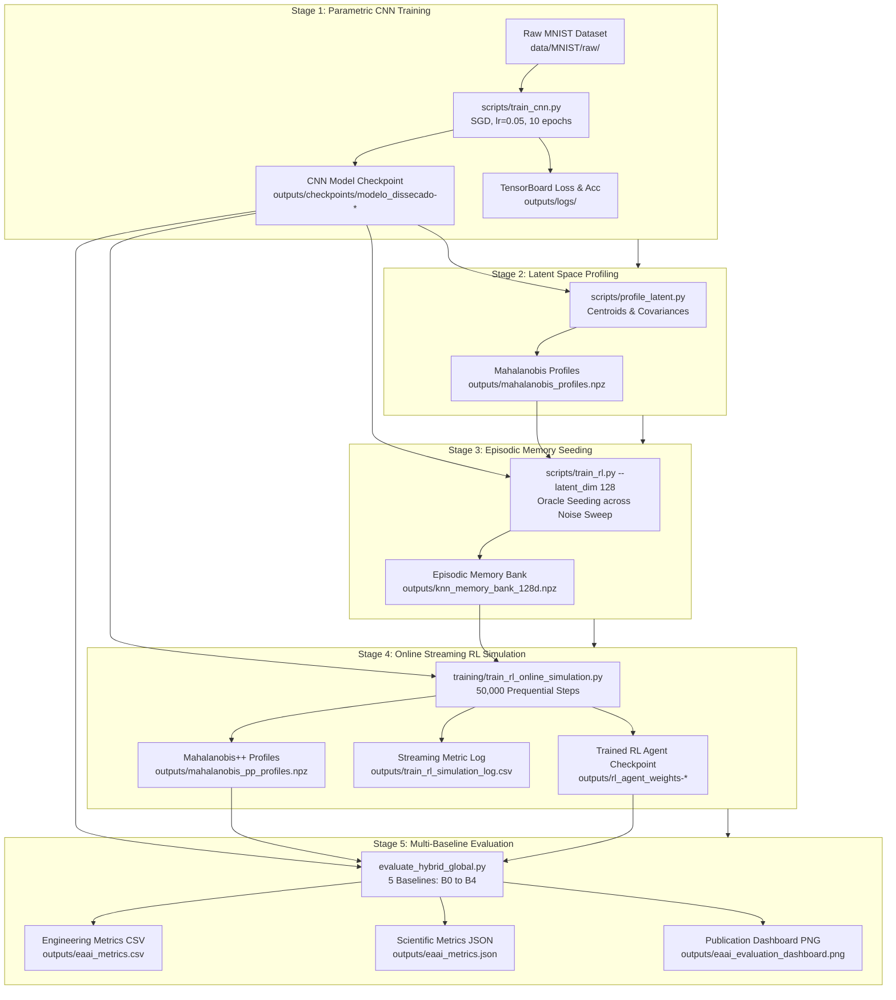

# Training Pipeline

> Part of the [Trustworthy Edge AI: RL-Driven Active Memory Management](../../README.md) documentation.
> Parent: [Usage Guides](README.md) | Up: [Documentation Index](../README.md)

---

## 1. Pipeline Overview

The complete training and reproduction pipeline consists of five strictly sequential stages. Each stage produces serialized artifacts that are loaded by downstream components:



---

## 2. Step 1: Parametric CNN Training

### 2.1. Purpose and Execution

The first stage trains the custom Convolutional Neural Network (`RawModel` in `src/models/custom_cnn.py`), built exclusively with low-level TensorFlow primitives (`tf.Module`, `tf.Variable`). The CNN serves a dual function:
1. High-accuracy nominal classification on in-distribution samples.
2. Nonlinear dimensionality reduction projecting raw $28 \times 28$ grayscale images into a compact 128-dimensional bottleneck embedding space.

Execute the training script from the project root:

```bash
# Execute parametric CNN training
python scripts/train_cnn.py
```

### 2.2. Training Hyperparameters

The training script reads parameters directly from `src/config.py`:

| Parameter | Configuration Value | Description |
|:----------|:--------------------|:------------|
| Script Path | `scripts/train_cnn.py` | Standalone single-GPU / CPU training script |
| Model Architecture | `RawModel` | 2 Conv2D layers (16, 32 filters), MaxPool2D, 128D Dense, 10D Softmax |
| Optimization Algorithm | Custom `SGD` | Mini-batch Stochastic Gradient Descent with `assign_sub` |
| Learning Rate ($\eta$) | `CNN_LEARNING_RATE = 0.05` | Constant learning rate without momentum |
| Batch Size ($B$) | `CNN_BATCH_SIZE = 128` | Number of samples per training gradient step |
| Epochs ($E$) | `CNN_EPOCHS = 10` | Full passes through the 60,000 training images |
| Hardware Allocation | GPU 0 (memory growth enabled) | Falls back gracefully to `/CPU:0` if no CUDA device is present |

### 2.3. Expected Terminal Output

```text
=========================================
Starting CNN training on GPU 0
=========================================

Starting training loop...
  [Epoch 1 | Batch 50] Loss: 2.1942 | Acc: 0.2812
  [Epoch 1 | Batch 100] Loss: 1.8315 | Acc: 0.4688
  [Epoch 1 | Batch 150] Loss: 1.2504 | Acc: 0.6562
  ...
-> END OF EPOCH 1: Time: 14.20s | Avg Loss: 0.8124 | Avg Acc: 0.7492

-> END OF EPOCH 10: Time: 13.85s | Avg Loss: 0.0412 | Avg Acc: 0.9874

Saving model checkpoint...
Training and checkpoint saving completed successfully!
```

### 2.4. Generated Artifacts and Runtime

- **Duration Estimate:** $\approx 2.5$ minutes on an NVIDIA GPU (RTX 3080/4090/L40S); $\approx 12$ minutes on an 8-core CPU.
- **Output Artifacts:**
  - `outputs/checkpoints/modelo_dissecado-1.data-00000-of-00001` (TensorFlow variable weights)
  - `outputs/checkpoints/modelo_dissecado-1.index` (TensorFlow checkpoint index)
  - `outputs/checkpoints/checkpoint` (Metadata pointing to the latest checkpoint)
  - `outputs/logs/<timestamp>/events.out.tfevents.*` (TensorBoard loss and accuracy curves)

---

## 3. Step 2: Latent Space Profiling

### 3.1. Purpose and Execution

Once the CNN weights are frozen, the 128D latent space must be statistically characterized to enable Out-of-Distribution (OOD) routing. The script `scripts/profile_latent.py` passes 20,000 clean training samples through the CNN to extract representations $z \in \mathbb{R}^{128}$ and computes the class-conditional mean centroid $\mu_c$ and covariance matrix $\Sigma_c$ for each digit class $c \in \{0, 1, \dots, 9\}$:

$$\mu_c = \frac{1}{N_c} \sum_{i=1}^{N_c} z_i^{(c)}$$

$$\Sigma_c = \frac{1}{N_c - 1} \sum_{i=1}^{N_c} (z_i^{(c)} - \mu_c)(z_i^{(c)} - \mu_c)^T + \epsilon I$$

A numerical stability term $\epsilon = 10^{-6}$ is added along the diagonal to ensure matrix invertibility before computing the precision matrix $\Sigma_c^{-1}$.

Execute the profiling script:

```bash
# Compute class-conditional centroids and covariance matrices
python scripts/profile_latent.py
```

### 3.2. Expected Terminal Output

```text
Loading CNN model...
Weights restored successfully.
Loading training dataset for extraction...
Extracting 128D latent features...
Calculating centroid and covariance for each digit class...
  -> Profile for digit 0 mapped successfully.
  -> Profile for digit 1 mapped successfully.
  ...
  -> Profile for digit 9 mapped successfully.
==================================================
SUCCESS! Mahalanobis profiles saved to: outputs/mahalanobis_profiles.npz
==================================================
```

### 3.3. Generated Artifacts and Runtime

- **Duration Estimate:** $\approx 20$ to 30 seconds.
- **Output Artifact:** `outputs/mahalanobis_profiles.npz` (contains 10 class dictionaries storing $\mu_c$ and $\Sigma_c^{-1}$).

---

## 4. Step 3: Episodic Memory Population

### 4.1. Purpose and Execution

The non-parametric episodic memory buffer (`KNNBanditAgent` or `KNNBanditAgent128D`) requires initial grounding with high-confidence prototypes before active online deployment. Seeding is performed via an Oracle protocol that injects progressive Gaussian noise levels $\sigma \in \{0.0, 0.2, 0.4, 0.6, 0.8\}$ into the training set:
- **Positive Prototypes:** Extracted latent states paired with ground-truth labels receive a positive reinforcement reward $r = +1.0$.
- **Negative Prototypes:** Samples where the CNN prediction deviates from ground truth ($\hat{y}_{\text{CNN}} \neq y^*$) are explicitly stored with reward $r = -1.0$ to mark low-trust regions in the embedding manifold.

Execute the seeding script:

```bash
# Seed 128D episodic memory bank with k=30 nearest neighbors
python scripts/train_rl.py --latent_dim 128 --k 30
```

### 4.2. Command-Line Options

| Argument | Type | Default | Options | Description |
|:---------|:-----|:--------|:--------|:------------|
| `--latent_dim` | `int` | `128` | `10`, `128` | State space dimensionality. `128` extracts dense latent embeddings; `10` uses output Softmax probabilities. |
| `--k` | `int` | `30` | Positive integer | Number of nearest neighbors queried during episodic retrieval. |

### 4.3. Progressive Simulation Alternative

As an alternative to batch seeding, `scripts/simulate_online.py` provides an incremental validation workflow. It reserves a strict 10% stratified partition for progressive seeding across 10 incremental batches, evaluating the expanding memory bank against the remaining 90% unseen partition (54,000 samples) at each step:

```bash
# Run progressive online simulation with learning curve generation
python scripts/simulate_online.py
```

### 4.4. Expected Terminal Output

```text
Loading CNN (Feature Extractor)...
CNN weights loaded.
Instantiating 128D Specialist k-NN Agent (k=30, use_pca=True, components=48)...
Loading MNIST training dataset...

==================================================
ORACLE SEEDING (Noise levels: [0.0, 0.2, 0.4, 0.6, 0.8])
==================================================

Processing noise level 0.0...
  Added 60,000 positive and 752 negative samples | CNN Accuracy: 98.7%
Processing noise level 0.2...
  Added 60,000 positive and 2,140 negative samples | CNN Accuracy: 96.4%
...
Building k-NN search index...

==================================================
QUICK TEST EVALUATION
==================================================
  [Clean] CNN: 98.7% | k-NN Agent: 98.2%
  [Noise 0.3] CNN: 89.4% | k-NN Agent: 94.1%
  [Noise 0.6] CNN: 51.2% | k-NN Agent: 87.6%

Memory size: 120,000
Positive rewards ratio: 94.2%
Success! Agent memory saved to: outputs/knn_memory_bank_128d.npz
```

### 4.5. Generated Artifacts and Runtime

- **Duration Estimate:** $\approx 1.5$ to 2 minutes.
- **Output Artifact:** `outputs/knn_memory_bank_128d.npz` (contains pre-allocated state matrix, labels, rewards, usage counters, and insertion timestamps).

---

## 5. Step 4: Online Streaming RL Simulation

### 5.1. Purpose and Execution

This is the core training phase of the active memory management system (Phase 3). Over a streaming horizon of 50,000 prequential (test-then-train) steps, incoming samples are subjected to random Gaussian corruption ($p_{\text{noise}} = 0.1, \sigma = 0.6$).

For each sample $x_t$:
1. $x_t$ is transformed into normalized latent vector $z_{\text{norm}} \in \mathbb{R}^{128}$ via the CNN.
2. The Mahalanobis++ OOD detector computes distance $D_M(z_{\text{norm}})$.
3. If $D_M \le \tau_{\text{OOD}}$, the sample is routed to the CNN.
4. If $D_M > \tau_{\text{OOD}}$, the sample is routed to the $k$-NN episodic memory buffer.
5. When the bounded buffer ($N = 5,000$) is full, the Double DQN agent observes a 5D state $s_t$ and executes an eviction policy $a_t \in \{0: \text{Ignore}, 1: \text{FIFO}, 2: \text{LFU}, 3: \text{Redundancy}\}$.
6. The `RewardManager` computes a Curriculum Learning reward $R_t = \alpha R_{\text{geom}} + (1 - \alpha) R_{\text{acc}}$, decaying $\alpha \to 0.01$.
7. Transitions $(s_t, a_t, r_t, s_{t+1})$ are stored in the Prioritized Experience Replay (PER) buffer and sampled to optimize the Q-network.

Execute the simulation:

```bash
# Execute 50,000 streaming steps of active RL memory curation
python -m training.train_rl_online_simulation \
    --steps 50000 \
    --noise-rate 0.1 \
    --noise-level 0.6 \
    --capacity 5000 \
    --log-interval 500 \
    --output-csv outputs/train_rl_simulation_log.csv \
    --save-agent outputs/checkpoints/rl_agent_dqn.pt
```

### 5.2. Command-Line Options

| Flag | Type | Default | Description |
|:-----|:-----|:--------|:------------|
| `--steps` | `int` | `50000` | Total number of streaming samples presented to the system. |
| `--noise-rate` | `float` | `0.1` | Probability of injecting sensor noise into an incoming sample ($p_{\text{noise}}$). |
| `--noise-level` | `float` | `0.6` | Standard deviation ($\sigma$) of the Gaussian perturbation noise. |
| `--capacity` | `int` | `5000` | Hard capacity limit of the episodic memory buffer ($N$). |
| `--log-interval` | `int` | `500` | Interval (in steps) for console metric logging and CSV flushing. |
| `--output-csv` | `str` | `outputs/train_rl_simulation_log.csv` | File path for structured streaming metric logs. |
| `--save-agent` | `str` | `outputs/checkpoints/rl_agent_dqn.pt` | File path for the serialized PyTorch Double DQN state dict. |

### 5.3. Expected Terminal Output

```text
[17:15:00] [INFO] INITIALIZING ONLINE RL SIMULATION (PHASE 3)
[17:15:00] [INFO] Target Steps: 50,000 | Noise Rate: 0.10 | Noise Sigma: 0.60 | Capacity: 5,000
[17:15:02] [INFO] Loaded CNN checkpoint successfully.
[17:15:03] [INFO] Calibrated Mahalanobis++ OOD threshold: 14.821
[17:15:10] [INFO] Step 500/50,000 | Loss: 0.0412 | Reward: 0.381 | Alpha: 0.9950 | Eps: 0.9512 | Mem: 500/5000
[17:15:45] [INFO] Step 5,000/50,000 | Loss: 0.0287 | Reward: 0.542 | Alpha: 0.7781 | Eps: 0.6065 | Mem: 5000/5000 (FULL)
...
[17:28:30] [INFO] Step 50,000/50,000 | Loss: 0.0084 | Reward: 0.812 | Alpha: 0.0100 | Eps: 0.0500 | Mem: 5000/5000
======================================================================
SIMULATION COMPLETE: 50,000 steps processed in 812.45s.
Final Memory Size: 5000/5000
Final Epsilon: 0.0500 (started at 1.0000)
Final Alpha: 0.0100 (curriculum fully transitioned to accuracy)
Total Transitions Stored in PER: 50000
======================================================================
```

### 5.4. Generated Artifacts and Runtime

- **Duration Estimate:** $\approx 15$ to 20 minutes on an NVIDIA GPU; $\approx 35$ minutes on CPU.
- **Output Artifacts:**
  - `outputs/checkpoints/rl_agent_dqn.pt` (or `outputs/rl_agent_weights-*` checkpoints)
  - `outputs/train_rl_simulation_log.csv` (step-by-step logs of loss, reward, $\alpha$, $\epsilon$, and eviction actions)
  - `outputs/mahalanobis_pp_profiles.npz` (Ledoit-Wolf regularized covariance profiles)

---

## 6. Step 5: Comparative Baseline Evaluation

### 6.1. Purpose and Execution

The final stage runs the EAAI benchmark across all five system baselines:
- **B0:** Pure CNN without episodic memory.
- **B1:** Infinite Memory Hybrid ($N = \infty$).
- **B2:** Hybrid + Strict FIFO Eviction ($N = 5,000$).
- **B3:** Hybrid + LFU Eviction ($N = 5,000$).
- **B4:** Hybrid + RL Active Memory Curation (Proposed approach, $N = 5,000$).

Execute the evaluation:

```bash
# Run comparative baseline evaluation with 1,000 test samples per noise level
python evaluate_hybrid_global.py --samples-per-level 1000
```

### 6.2. Expected Terminal Output

```text
===========================================================================
INITIALIZING EAAI PHASE 4 HYBRID GLOBAL EVALUATION
Noise Levels: [0.0, 0.2, 0.4, 0.6, 0.8] | Capacity: 5,000 | Samples/Level: 1,000
===========================================================================
Evaluating Baseline B0 (Pure CNN)...
  -> Overall Acc: 71.4% | Noise 0.6 Acc: 43.2% | Latency: 0.08ms | RAM: 1.2MB
Evaluating Baseline B1 (Infinite Memory Hybrid)...
  -> Overall Acc: 94.6% | Noise 0.6 Acc: 89.1% | Latency: 0.42ms | RAM: 24.8MB
Evaluating Baseline B2 (Hybrid + FIFO Eviction)...
  -> Overall Acc: 90.8% | Noise 0.6 Acc: 82.0% | Latency: 0.18ms | RAM: 6.1MB
Evaluating Baseline B3 (Hybrid + LFU Eviction)...
  -> Overall Acc: 91.1% | Noise 0.6 Acc: 82.0% | Latency: 0.18ms | RAM: 6.1MB
Evaluating Baseline B4 (Hybrid + RL Active Memory)...
  -> Overall Acc: 93.4% | Noise 0.6 Acc: 86.5% | Latency: 0.19ms | RAM: 6.1MB
===========================================================================
Phase 4 Global Evaluation completed successfully.
Saved publication evaluation dashboard to: outputs/eaai_evaluation_dashboard.png
Saved metrics JSON to: outputs/eaai_metrics.json
Saved metrics CSV to: outputs/eaai_metrics.csv
```

### 6.3. Generated Artifacts and Runtime

- **Duration Estimate:** $\approx 2$ to 3 minutes.
- **Output Artifacts:**
  - `outputs/eaai_metrics.csv`
  - `outputs/eaai_metrics.json`
  - `outputs/eaai_evaluation_dashboard.png`

---

## 7. Expected Outputs Summary Table

The table below catalogs every artifact generated by the training and evaluation pipeline:

| Pipeline Step | Generated Artifact | Format | Producer Script | Description |
|:--------------|:-------------------|:-------|:----------------|:------------|
| Step 1 | `outputs/checkpoints/modelo_dissecado-*` | Binary TF Checkpoint | `scripts/train_cnn.py` | Trained weights for custom 128D bottleneck CNN. |
| Step 1 | `outputs/logs/<timestamp>/events.*` | TensorBoard Protobuf | `scripts/train_cnn.py` | Training loss and accuracy progression curves. |
| Step 2 | `outputs/mahalanobis_profiles.npz` | NumPy NPZ | `scripts/profile_latent.py` | Class centroids $\mu_c$ and covariance inverses $\Sigma_c^{-1}$. |
| Step 3 | `outputs/knn_memory_bank_128d.npz` | NumPy NPZ | `scripts/train_rl.py` | Pre-allocated episodic memory arrays (states, labels, rewards). |
| Step 3 (Alt) | `outputs/rl_online_learning_curve.png` | PNG Image (200 DPI) | `scripts/simulate_online.py` | Accuracy vs. memory size curve over 10 incremental batches. |
| Step 4 | `outputs/checkpoints/rl_agent_dqn.pt` | PyTorch State Dict | `training/train_rl_online_simulation.py` | Trained Double DQN policy and target network weights. |
| Step 4 | `outputs/train_rl_simulation_log.csv` | CSV Text | `training/train_rl_online_simulation.py` | Step-by-step logs of reward, loss, $\alpha$, and $\epsilon$ decay. |
| Step 4 | `outputs/mahalanobis_pp_profiles.npz` | NumPy NPZ | `training/train_rl_online_simulation.py` | Ledoit-Wolf regularized precision matrices and calibrated threshold. |
| Step 5 | `outputs/eaai_metrics.csv` | CSV Text | `evaluate_hybrid_global.py` | Tabular comparison of 7 metrics across baselines B0 through B4. |
| Step 5 | `outputs/eaai_metrics.json` | JSON Text | `evaluate_hybrid_global.py` | Structured, machine-readable benchmark results with per-noise accuracies. |
| Step 5 | `outputs/eaai_evaluation_dashboard.png` | PNG Image (250 DPI) | `evaluate_hybrid_global.py` | 4-panel publication figure (Accuracy, Edge Efficiency, Cache Hit, KL Balance). |

---

**Navigation:**
- Previous: [Usage Guides](README.md)
- Up: [Usage Guides](README.md)
- Next: [Running the EAAI Evaluation](evaluation.md)

---
Licensed under the GNU General Public License v3.0. See [LICENSE](../../LICENSE) for details.
