# Explainable AI and Visualization Tools

> Part of the [Active Episodic Memory Management via Reinforcement Learning for Robust CNN Inference on Out-of-Distribution Data](file:///c:/Users/sanfr/Desktop/projetos-gecad/projeto-cnn/README.md) documentation.  
> Parent: [Usage Guides](file:///c:/Users/sanfr/Desktop/projetos-gecad/projeto-cnn/docs/guides/README.md) | Up: [Documentation Index](file:///c:/Users/sanfr/Desktop/projetos-gecad/projeto-cnn/docs/README.md)

---

## 1. Overview and Explainability in Edge AI

Explainability and diagnostic transparency are foundational requirements for deploying autonomous vision systems in safety-critical edge environments. Black-box deep neural networks frequently fail silently when subjected to sensor degradation, producing confident misclassifications without operational warnings.

To provide comprehensive interpretability across all architectural layers, the repository includes four specialized Explainable AI (XAI) and visual diagnostic tools, alongside publication-grade multi-panel evaluation dashboards for both MNIST and CIFAR-10:

```mermaid
flowchart TD
    subgraph V1["Latent Representation Space"]
        T1["make_tsne.py<br>Cluster Separation vs. Collapse"]
        P1["outputs/colapso_latente_tsne.png"]
        T1 --> P1
    end

    subgraph V2["Feature-Level Pixel Attribution"]
        T2["make_saliency.py<br>Gradient Attention Heatmaps"]
        P2["outputs/mapa_saliencia.png"]
        T2 --> P2
    end

    subgraph V3["Decision Confidence & Flow"]
        T3["make_decision_profiles.py<br>Softmax vs. k-NN Expected Reward"]
        P3["outputs/fluxo_correcoes_cnn_knn.png"]
        T3 --> P3
    end

    subgraph V4["Instance Retrieval Mechanics"]
        T4["make_memory_rescue.py<br>15 Nearest Latent Prototypes"]
        P4["outputs/episodic_memory_rescue_full.png"]
        T4 --> P4
    end

    subgraph V5["Publication Evaluation Dashboards"]
        T5["evaluate_hybrid_global.py & scripts/cifar10/evaluate_baselines.py"]
        P5_M["outputs/mnist/eaai_evaluation_dashboard.png"]
        P5_C["outputs/cifar10/eaai_evaluation_dashboard.png"]
        T5 --> P5_M
        T5 --> P5_C
    end
```



---

## 2. Tool 1: Latent Space Collapse Mapping (t-SNE)

The script [`visualizations/make_tsne.py`](file:///c:/Users/sanfr/Desktop/projetos-gecad/projeto-cnn/visualizations/make_tsne.py) visualizes the geometry of the 128-dimensional bottleneck latent manifold under nominal and perturbed conditions using t-Distributed Stochastic Neighbor Embedding (t-SNE):
- **Nominal Scenario (Clean Images):** The CNN maps clean digit classes into compact, linearly separable clusters in the latent manifold.
- **Corrupted Scenario (Noisy Images):** When sensor noise ($\sigma = 0.6$) corrupts the inputs, the representations scatter and overlap across class boundaries. This diagnostic provides visual justification for why parametric Softmax layers fail under noise, and why distance-based OOD detection (Mahalanobis++) is essential to trigger non-parametric memory retrieval.

Execution:
```bash
python visualizations/make_tsne.py
```
Output: `outputs/colapso_latente_tsne.png` (300 DPI high-resolution figure).

---

## 3. Tool 2: Gradient-Based Saliency Maps (Pixel Attention)

The script [`visualizations/make_saliency.py`](file:///c:/Users/sanfr/Desktop/projetos-gecad/projeto-cnn/visualizations/make_saliency.py) calculates the gradient of the predicted class score with respect to input image pixels, revealing exactly which spatial regions of the image dominate the CNN decision:
$$S(x) = \left| \frac{\partial \hat{y}_c}{\partial x} \right|$$
This diagnostic demonstrates whether the CNN is focusing on legitimate morphological stroke patterns or attending to spurious background artifacts induced by sensor noise.

Execution:
```bash
python visualizations/make_saliency.py
```
Output: `outputs/mapa_saliencia.png` (300 DPI high-resolution figure).

---

## 4. Tool 3: Decision Confidence Profiles and Correction Flow

The script [`visualizations/make_decision_profiles.py`](file:///c:/Users/sanfr/Desktop/projetos-gecad/projeto-cnn/visualizations/make_decision_profiles.py) analyzes the confidence profiles of the parametric CNN against the expected rewards of the $k$-NN episodic memory across noise tiers.

Execution:
```bash
python visualizations/make_decision_profiles.py
```
Output: `outputs/fluxo_correcoes_cnn_knn.png` (300 DPI high-resolution figure).

---

## 5. Tool 4: Episodic Memory Prototype Rescue Inspection

The script [`visualizations/make_memory_rescue.py`](file:///c:/Users/sanfr/Desktop/projetos-gecad/projeto-cnn/visualizations/make_memory_rescue.py) renders a 3-zone visual trace illustrating how an incoming corrupted sample is rescued by $k$-NN voting among the 15 nearest latent prototypes:
1. **Zone 1 (Ingestion & OOD):** Displays corrupted input and computed Mahalanobis distance exceeding threshold.
2. **Zone 2 (Retrieval):** Displays the image patches and distances of the 15 nearest prototypes retrieved from the 128D memory buffer.
3. **Zone 3 (Arbitration):** Plots the voting consensus overriding the erroneous CNN prediction.

Execution:
```bash
python visualizations/make_memory_rescue.py
```
Output: `outputs/episodic_memory_rescue_full.png`.

---

## 6. Publication Evaluation Dashboards (IEEE TNNLS / Publication Standard)

Both baseline evaluation pipelines (`evaluate_hybrid_global.py` for MNIST and `scripts/cifar10/evaluate_baselines.py` for CIFAR-10) automatically render 4-panel publication-grade dashboards displaying comprehensive comparative telemetry:

### 6.1. Dashboard Structure and Panels
Each dashboard adheres to a consistent 4-panel layout:
- **Panel 1 (Top-Left): Prequential Accuracy vs. Noise ($\sigma \in \{0.0, 0.2, 0.4, 0.6, 0.8\}$):**  
  Plots accuracy trajectories for all 5 baselines (B0 to B4). Demonstrates the severe degradation of pure CNN (B0) under noise and the superiority of the proposed active agent (B4).
- **Panel 2 (Top-Right): Operational Trade-Off Scatter (Latency vs. Peak RAM):**  
  Contrasts per-inference latency (ms) against maximum resident RAM consumption (MB). Highlights the Pareto optimality of B4 (< 10 MB RAM, < 7 ms latency) and the prohibitive memory explosion of unbounded memory B1 (> 52 MB).
- **Panel 3 (Bottom-Left): OOD Cache Hit Rate ($H_{\text{OOD}}$):**  
  Bar chart comparing the percentage of correct classifications on samples routed to episodic memory. Confirms that RL active filtering (Action 0) prevents cache pollution, delivering higher hit rates than blind FIFO/LFU eviction.
- **Panel 4 (Bottom-Right): Eviction Class Divergence ($D_{\text{KL}}$):**  
  Log-scale bar chart illustrating Kullback-Leibler divergence between the empirical memory class distribution and the uniform target $\mathcal{U}(0, 9)$. Proves that active redundancy eviction (Action 3) maintains balanced class representation ($D_{\text{KL}} \le 0.003$ nats), outperforming FIFO by $> 1,200\times$.

### 6.2. Generated Dashboard Locations
- **MNIST Dashboard:** [`outputs/mnist/eaai_evaluation_dashboard.png`](file:///c:/Users/sanfr/Desktop/projetos-gecad/projeto-cnn/outputs/mnist/eaai_evaluation_dashboard.png)
- **CIFAR-10 Dashboard:** [`outputs/cifar10/eaai_evaluation_dashboard.png`](file:///c:/Users/sanfr/Desktop/projetos-gecad/projeto-cnn/outputs/cifar10/eaai_evaluation_dashboard.png)

---

## 7. Diagnostic Tools Summary Table

| Tool Script | Execution Command | Primary Output File | Core Focus | Typical Runtime |
|:---|:---|:---|:---|:---|
| `visualizations/make_tsne.py` | `python visualizations/make_tsne.py` | `outputs/colapso_latente_tsne.png` | 2D t-SNE latent manifold clustering vs. noise dispersion | $\approx 60-90$ s |
| `visualizations/make_saliency.py` | `python visualizations/make_saliency.py` | `outputs/mapa_saliencia.png` | Pixel-level backpropagated gradient saliency maps | $\approx 10-15$ s |
| `visualizations/make_decision_profiles.py` | `python visualizations/make_decision_profiles.py` | `outputs/fluxo_correcoes_cnn_knn.png` | CNN confidence vs. $k$-NN expected return flow | $\approx 20-30$ s |
| `visualizations/make_memory_rescue.py` | `python visualizations/make_memory_rescue.py` | `outputs/episodic_memory_rescue_full.png` | 3-zone visual trace of 15 nearest prototype rescue | $\approx 30-45$ s |
| `evaluate_hybrid_global.py` | `python evaluate_hybrid_global.py --dataset mnist` | [`outputs/mnist/eaai_evaluation_dashboard.png`](file:///c:/Users/sanfr/Desktop/projetos-gecad/projeto-cnn/outputs/mnist/eaai_evaluation_dashboard.png) | 4-panel publication benchmark dashboard on MNIST | $\approx 2-3$ min |
| `scripts/cifar10/evaluate_baselines.py` | `python scripts/cifar10/evaluate_baselines.py` | [`outputs/cifar10/eaai_evaluation_dashboard.png`](file:///c:/Users/sanfr/Desktop/projetos-gecad/projeto-cnn/outputs/cifar10/eaai_evaluation_dashboard.png) | 4-panel publication benchmark dashboard on CIFAR-10 | $\approx 2-3$ min |

---

**Navigation:**
- Previous: [Running the Baseline Evaluation Benchmark](file:///c:/Users/sanfr/Desktop/projetos-gecad/projeto-cnn/docs/guides/evaluation.md)
- Up: [Usage Guides](file:///c:/Users/sanfr/Desktop/projetos-gecad/projeto-cnn/docs/guides/README.md)
- Next: [API Reference Index](file:///c:/Users/sanfr/Desktop/projetos-gecad/projeto-cnn/docs/api/README.md)

---

Licensed under the GNU General Public License v3.0. See [LICENSE](file:///c:/Users/sanfr/Desktop/projetos-gecad/projeto-cnn/LICENSE) for details.
