# Explainable AI and Visualization Tools

> Part of the [Active Episodic Memory Management via Reinforcement Learning for Robust CNN Inference on Out-of-Distribution Data](../../README.md) documentation.
> Parent: [Usage Guides](README.md) | Up: [Documentation Index](../README.md)

---

## 1. Overview and Explainability in Edge AI

Explainability and diagnostic transparency are foundational requirements for deploying autonomous vision systems in safety-critical edge environments. Black-box deep neural networks frequently fail silently when subjected to sensor degradation, producing confident misclassifications without operational warnings.

To provide comprehensive interpretability across all architectural layers, the repository includes four specialized Explainable AI (XAI) and visual diagnostic tools located in the `visualizations/` directory:

```mermaid
flowchart TD
    subgraph V1["Latent Representation Space"]
        T1["make_tsne.py<br>Cluster Separation vs. Collapse"]
        P1["outputs/colapso_latente_tsne.png"]
        T1 --> P1
    end

    subgraph V2["Feature-Level Pixel Attribution"]
        T2["make_saliency.py<br>Gradient Attention Heatmaps"]
        P2["outputs/mapa_saliencia.png"]
        T2 --> P2
    end

    subgraph V3["Decision Confidence & Flow"]
        T3["make_decision_profiles.py<br>Softmax vs. k-NN Expected Reward"]
        P3["outputs/fluxo_correcoes_cnn_knn.png"]
        T3 --> P3
    end

    subgraph V4["Instance Retrieval Mechanics"]
        T4["make_memory_rescue.py<br>15 Nearest Latent Prototypes"]
        P4["outputs/episodic_memory_rescue_full.png"]
        T4 --> P4
    end
```



---

## 2. Tool 1: Latent Space Collapse Mapping (t-SNE)

### 2.1. Concept and Purpose

The script `visualizations/make_tsne.py` visualizes the geometry of the 128-dimensional bottleneck latent manifold under nominal and perturbed conditions using t-Distributed Stochastic Neighbor Embedding (t-SNE).

- **Nominal Scenario (Clean Images):** The custom CNN maps clean digit classes into compact, linearly separable clusters in the latent manifold.
- **Corrupted Scenario (Noisy Images):** When sensor noise ($\sigma = 0.6$) corrupts the inputs, the representations scatter and overlap across class boundaries. This diagnostic provides visual justification for why parametric Softmax layers fail under noise, and why distance-based OOD detection (Mahalanobis++) is essential to trigger non-parametric memory retrieval.

### 2.2. Execution Command

```bash
# Generate comparative 2-panel t-SNE latent space projection
python visualizations/make_tsne.py
```

### 2.3. Output Artifacts

- **Primary Output:** `outputs/colapso_latente_tsne.png` (300 DPI high-resolution figure).
- **Visualization Structure:**
  - **Left Panel (Scenario A):** Clean input projection (2,000 samples). Clear, well-separated clusters colored by true digit class (0 through 9).
  - **Right Panel (Scenario B):** Noise-corrupted input projection ($\sigma = 0.6$). Demonstrates latent dispersion, boundary collapse, and inter-class entanglement.

---

## 3. Tool 2: Gradient-Based Saliency Maps (Pixel Attention)

### 3.1. Concept and Purpose

The script `visualizations/make_saliency.py` calculates the gradient of the predicted class score with respect to input image pixels, revealing exactly which spatial regions of the image dominate the CNN decision:

$$S(x) = \left| \frac{\partial \hat{y}_c}{\partial x} \right|$$

Where:
- $x \in \mathbb{R}^{28 \times 28}$ is the input image tensor.
- $\hat{y}_c = \text{Softmax}(z)_c$ is the unnormalized logit or winning probability for class $c$.
- $S(x)$ is the normalized gradient magnitude map, scaled to $[0.0, 1.0]$.

This diagnostic demonstrates whether the CNN is focusing on legitimate morphological stroke patterns or attending to spurious background artifacts induced by sensor noise.

### 3.2. Execution Command

```bash
# Generate gradient-based saliency heatmaps and overlays
python visualizations/make_saliency.py
```

### 3.3. Output Artifacts

- **Primary Output:** `outputs/mapa_saliencia.png` (300 DPI high-resolution figure).
- **Visualization Structure:** A 5-row, 3-column comparative grid displaying the first five test digits:
  - **Column 1 (Original):** Raw grayscale input image with true ground-truth label.
  - **Column 2 (Raw Heatmap):** Color-mapped (`hot`) gradient intensity highlighting primary activation foci.
  - **Column 3 (XAI Overlay):** Semi-transparent saliency heatmap superimposed directly over the grayscale digit strokes.

---

## 4. Tool 3: Decision Confidence Profiles and Correction Flow

### 4.1. Concept and Purpose

The script `visualizations/make_decision_profiles.py` performs a comparative confidence analysis between the parametric CNN and the non-parametric $k$-NN episodic memory on ambiguous and noise-corrupted test samples.

The tool identifies challenging inputs where the CNN is either incorrect ($\hat{y}_{\text{CNN}} \neq y^*$) or exhibits low confidence ($\max_c P(c) < 0.7$). It then generates two complementary analytical plots:
1. **Confidence Profile:** Side-by-side bar plots comparing the CNN Softmax probability distribution against the $k$-NN expected reward vector across all 10 digit classes.
2. **Correction Flow Matrix:** A reclassification transition heatmap showing how often $k$-NN retrieval rescues CNN mistakes versus introducing errors, accompanied by a net correction gain summary.

### 4.2. Execution Command

```bash
# Generate confidence comparisons and correction flow diagrams
python visualizations/make_decision_profiles.py
```

### 4.3. Output Artifacts

- **Output 1:** `outputs/perfil_confianca_cnn_vs_knn.png` (or `outputs/perfil_confianca_cnn_knn.png`). Displays the 8 most ambiguous digit cases, contrasting CNN probability spikes with $k$-NN neighbor voting weights.
- **Output 2:** `outputs/fluxo_correcoes_cnn_knn.png` (200 DPI). Contains:
  - Reclassification transition matrix (CNN prediction vs. $k$-NN corrected prediction).
  - Accuracy comparison bar chart under noisy test conditions ($\sigma = 0.6$).
  - Summary metric box reporting total corrections, true positive rescues, and net accuracy gain.

---

## 5. Tool 4: 128D Episodic Memory Rescue Visualizer

### 5.1. Concept and Purpose

The script `visualizations/make_memory_rescue.py` provides an instance-level demonstration of the hybrid routing mechanism in action. It identifies a representative "Hero Case" from the test stream: a sample where severe sensor noise corrupts the digit, causing the CNN to misclassify, but where the Mahalanobis++ detector flags the anomaly and routes the representation to episodic memory, which retrieves correct nearest neighbors to produce the correct class vote.

### 5.2. Execution Command

```bash
# Generate full multi-zone episodic memory rescue dashboard and individual panels
python visualizations/make_memory_rescue.py
```

### 5.3. Dashboard Architecture (Three Operational Zones)

The visualization decomposes the rescue event into three contiguous functional zones rendered with a dark aesthetic (`#121212` background):

```text
+-------------------------------------------------------------------------------+
|                        EPISODIC MEMORY RESCUE DASHBOARD                       |
+-----------------------+-------------------------------+-----------------------+
|  ZONE 1: INGESTION    |  ZONE 2: EPISODIC RETRIEVAL   |  ZONE 3: ARBITRATION  |
|  - Clean image        |  - Grid of 15 nearest         |  - Class vote summary |
|  - Noisy image        |    prototypes from memory     |  - Rescue confirmation|
|  - CNN prediction     |  - Euclidean distance (d)     |  - Trustworthy badge  |
|  - Mahalanobis dist   |  - Class label indicators     |                       |
+-----------------------+-------------------------------+-----------------------+
```

1. **Zone 1: Ingestion and OOD Detection**
   - Displays the original clean digit and the noise-corrupted input ($\sigma = 0.6$).
   - Shows the incorrect CNN prediction (e.g., misclassifying digit 7 as digit 2).
   - Displays the computed Mahalanobis++ distance ($D_M = 18.42$) and flags that it exceeds the calibrated threshold ($\tau = 14.82$), triggering the OOD route.

2. **Zone 2: 128D Episodic Memory Retrieval**
   - Queries the memory bank using vectorized Euclidean distances in the 128D latent space.
   - Renders the actual image patches of the **15 nearest neighbor prototypes** stored in episodic memory.
   - Annotates each prototype with its stored semantic label and Euclidean distance ($d_i$). Neighbor borders are colored green for correct prototypes and red for incorrect ones.

3. **Zone 3: Arbitration and Hybrid Decision**
   - Aggregates the 15 retrieved prototype votes.
   - Plots the voting distribution (e.g., 13 votes for digit 7, 2 votes for digit 2).
   - Confirms the successful rescue: the hybrid system overrides the faulty CNN prediction and outputs the correct ground-truth label.

### 5.4. Output Artifacts

The script exports the unified dashboard and modular sub-panels suitable for research presentations and papers:

| File Path | Description | Dimensions |
|:----------|:------------|:-----------|
| `outputs/episodic_memory_rescue_full.png` | Complete 3-zone unified rescue dashboard. | $2200 \times 900$ px (150 DPI) |
| `outputs/episodic_memory_rescue_zone1.png` | Isolated Zone 1: Input corruption & OOD routing. | $750 \times 900$ px |
| `outputs/episodic_memory_rescue_zone2.png` | Isolated Zone 2: 15 nearest retrieved memory prototypes. | $1500 \times 900$ px |
| `outputs/episodic_memory_rescue_zone3.png` | Isolated Zone 3: Vote aggregation & rescue confirmation. | $750 \times 900$ px |

> [!NOTE]
> Identical copies of these four rescue figures are mirrored in the root `assets/` directory for direct rendering in README documents.

---

## 6. Diagnostic Tools Summary Table

The table below catalogs all visualization and diagnostic tools available in the codebase:

| Tool Script | Execution Command | Primary Output File | Core Technical Focus | Typical Runtime |
|:------------|:------------------|:--------------------|:---------------------|:----------------|
| `visualizations/make_tsne.py` | `python visualizations/make_tsne.py` | `outputs/colapso_latente_tsne.png` | 2D t-SNE latent space cluster separation vs. noise collapse. | $\approx 60-90$ s |
| `visualizations/make_saliency.py` | `python visualizations/make_saliency.py` | `outputs/mapa_saliencia.png` | Pixel-level backpropagated gradient saliency and stroke attention. | $\approx 10-15$ s |
| `visualizations/make_decision_profiles.py` | `python visualizations/make_decision_profiles.py` | `outputs/fluxo_correcoes_cnn_knn.png` | CNN Softmax confidence vs. $k$-NN expected reward profiles. | $\approx 20-30$ s |
| `visualizations/make_memory_rescue.py` | `python visualizations/make_memory_rescue.py` | `outputs/episodic_memory_rescue_full.png` | 3-zone visualization of 15 nearest 128D memory prototypes. | $\approx 30-45$ s |
| `evaluate_hybrid_global.py` | `python evaluate_hybrid_global.py` | `outputs/eaai_evaluation_dashboard.png` | 4-panel publication benchmark dashboard (accuracy, efficiency, hit rate, KL). | $\approx 2-3$ min |
| `scripts/evaluate_global.py` | `python scripts/evaluate_global.py` | `outputs/hybrid_global_evaluation.png` | Double-panel Mahalanobis threshold sweep on test and disjoint splits. | $\approx 1-2$ min |

---

**Navigation:**
- Previous: [Running the EAAI Evaluation](evaluation.md)
- Up: [Usage Guides](README.md)
- Next: [API Reference](../api/README.md)

---
Licensed under the GNU General Public License v3.0. See [LICENSE](../../LICENSE) for details.
